# Agent Dashboard - System Design and Technical Reference

Architectural overview and technical reference for the Agent Dashboard system, covering design goals, high-level architecture, data flow, server and client components, database design, WebSocket protocol, hook integration, MCP extension layer, Claude Code plugins & skills, state management, security considerations, performance characteristics, deployment modes, and technology choices.


---

## Table of Contents

- [System Overview](#system-overview)
- [High-Level Architecture](#high-level-architecture)
- [Data Flow](#data-flow)
- [Server Architecture](#server-architecture)
- [Client Architecture](#client-architecture)
- [Internationalization Architecture](#internationalization-architecture)
- [Database Design](#database-design)
- [WebSocket Protocol](#websocket-protocol)
- [Hook Integration](#hook-integration)
- [Import Pipeline](#import-pipeline)
- [Agent Extension Layer](#agent-extension-layer)
- [Plugin Marketplace](#plugin-marketplace)
- [MCP Integration](#mcp-integration)
- [State Management](#state-management)
- [Browser Notification System](#browser-notification-system)
- [Update Notifier Subsystem](#update-notifier-subsystem)
- [Tabby Companion Subsystem](#tabby-companion-subsystem)
- [VS Code Extension Architecture](#vs-code-extension-architecture)
- [Desktop App Architecture (macOS & Windows / Electron)](#desktop-app-architecture-macos--windows--electron)
- [Security Considerations](#security-considerations)
- [Performance Characteristics](#performance-characteristics)
- [Deployment Modes](#deployment-modes)
- [Statusline Utility](#statusline-utility)
- [Technology Choices](#technology-choices)
- [Build & Run Targets](#build--run-targets)

---

## System Overview

Agent Dashboard is a local-first monitoring platform for Claude Code sessions. It captures agent lifecycle events via Claude Code's native hook system, persists them in SQLite, and presents them through a React dashboard with real-time WebSocket updates.

> **Cursor sessions (informational):** The same `~/.claude` transcript paths also pick up **Cursor** agent sessions — Cursor happens to use that layout locally alongside Claude Code. CCAM does not distinguish which editor created a session.

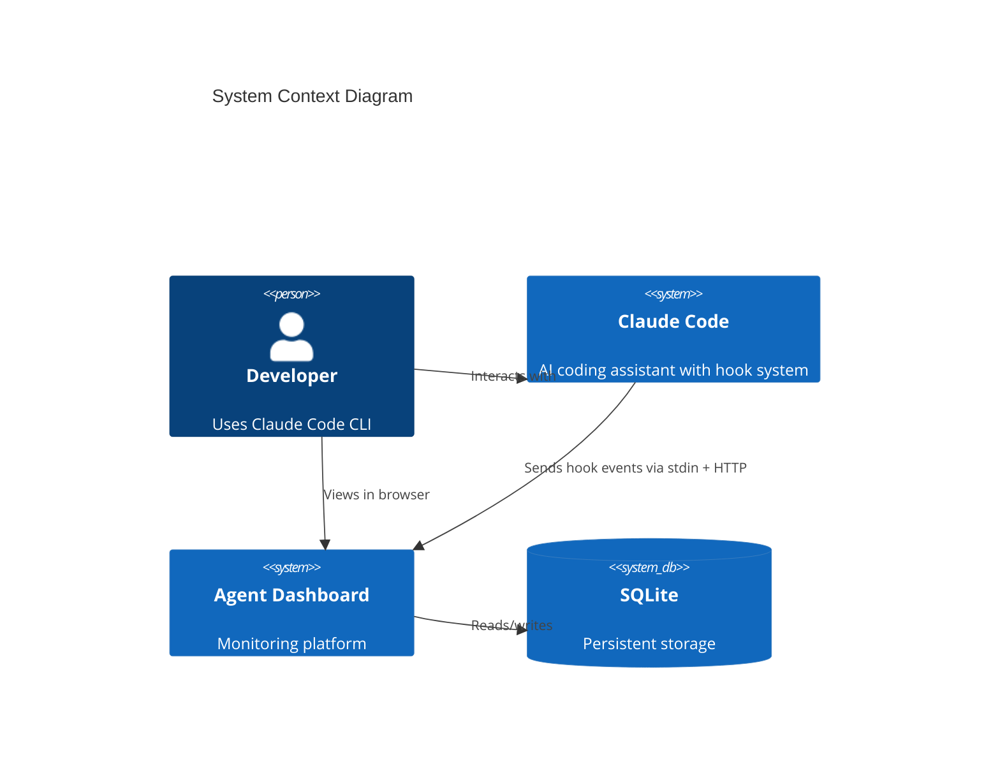

**Design goals:**

- Zero-config operation -- auto-discovers sessions from hook events
- Never block Claude Code -- hooks fail silently with timeouts
- Instant feedback -- WebSocket push, no polling
- Portable -- SQLite, no external services, runs on any OS with Node.js 22.22+
- Extensible -- 14 dual-format Claude/Codex plugins with 66 bundled skills, plus 76 skills discoverable through the skills CLI

---

## High-Level Architecture

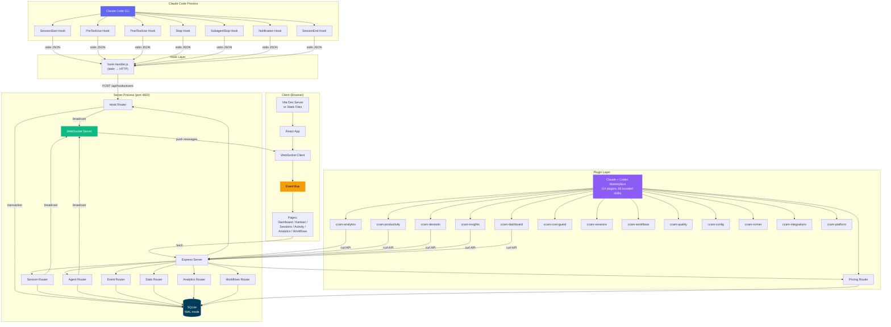

---

## Data Flow

### Event Ingestion Pipeline

```mermaid
sequenceDiagram
    participant CC as Claude Code
    participant HH as hook-handler.js
    participant API as POST /api/hooks/event
    participant TX as SQLite Transaction
    participant WS as WebSocket.broadcast()
    participant UI as React Client

    CC->>HH: stdin: {"session_id":"abc","tool_name":"Bash",...}
    Note over HH: Reads stdin, parses JSON,<br/>wraps with hook_type

    HH->>API: POST {"hook_type":"PreToolUse","data":{...}}
    Note over API: Validates hook_type + data

    API->>TX: BEGIN TRANSACTION
    TX->>TX: ensureSession(session_id)
    Note over TX: Creates session + main agent<br/>if first contact. Also persists<br/>data.transcript_path onto the session row<br/>(SQL-guarded, so subsequent events no-op).<br/>Syncs sessions.name from the transcript title<br/>(custom-title &gt; ai-title &gt; first user prompt).

    TX->>TX: Process by hook_type
    Note over TX: Dispatches by hook_type. Maintains the agent and<br/>session state machines plus the awaiting_input_since flag.<br/>SubagentStop also triggers a JSONL scan that emits per_tool<br/>events under each subagent. See the hook table below for<br/>the full per_event behaviour.

    TX->>TX: insertEvent(...)
    TX->>TX: COMMIT

    API->>WS: broadcast("agent_updated", agent)
    API->>WS: broadcast("new_event", event)

    WS->>UI: {"type":"agent_updated","data":{...}}
    UI->>UI: eventBus.publish(msg)
    UI->>UI: Page re-renders with new data
```

### Client Data Loading Pattern

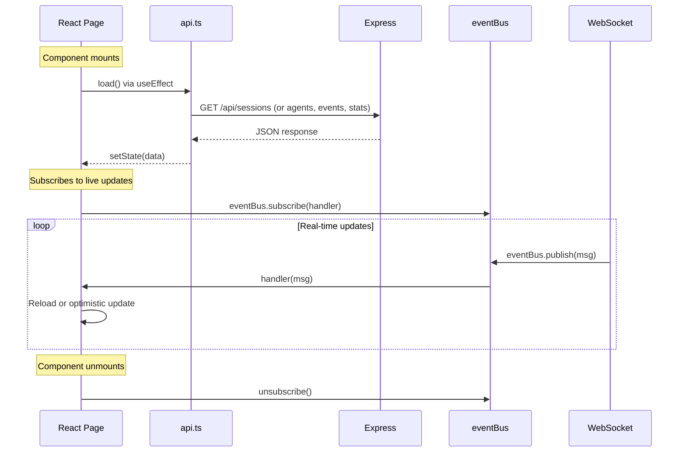

---

## Server Architecture

### Module Dependency Graph

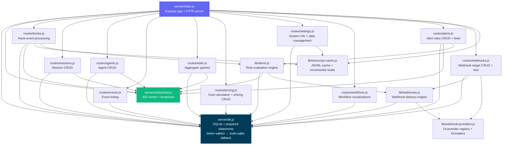

### Server Components

| Module                    | Responsibility                                                                                                                                                                                                                                                                                                                                                                                                                                                                                                                       |
|---------------------------|--------------------------------------------------------------------------------------------------------------------------------------------------------------------------------------------------------------------------------------------------------------------------------------------------------------------------------------------------------------------------------------------------------------------------------------------------------------------------------------------------------------------------------------|
| `server/index.js`         | Express app setup, middleware, route mounting, static file serving in production, HTTP server creation. Static middleware sets explicit `Cache-Control` headers — `immutable` for `/assets/*`, `no-cache, must-revalidate` for `index.html` / `sw.js` / `manifest.json`, a short revalidation window otherwise — so a rebuild always replaces the in-browser bundle without a hard refresh. Runs a periodic maintenance sweep — cadence derived from `DASHBOARD_STALE_MINUTES` (¼ of the threshold, clamped to 60 s – 5 min, default ~45 min) — that abandons stale sessions with transcript cache eviction and scans active sessions for new compaction entries by reading `sessions.transcript_path` directly (an O(active sessions) lookup; the previous `SELECT DISTINCT json_extract(events.data,'$.transcript_path')` scan grew with the events table and is gone). **Error detection watchdog** runs every 15 seconds: finds active sessions with no recent hook events (>10 s stale), re-reads their transcript files looking for API errors (401 auth, rate limits, quota exhaustion), derives transcript paths from session `cwd` for imported sessions, and marks sessions/agents as `error` when API errors are found — catches cases where the CLI doesn't fire a hook after API errors. The same watchdog also performs **user-interrupt (Esc) recovery**: `Esc` fires no hook, so a cancelled turn would otherwise leave the main agent stuck `working`. It detects this two ways — (a) the transcript's `[Request interrupted by user]` marker, surfaced as `result.pendingInterrupt` from `TranscriptCache` (computed from transcript ordering alone, immune to server/transcript clock skew), and (b) an idle-working fallback for an Esc pressed *before any output* (which writes no marker): when the main agent has been `working` with `current_tool` null and neither a hook event nor the transcript mtime has advanced for `DASHBOARD_WORKING_IDLE_SECONDS` (default 120) — and moves the session to **Waiting** (agent → `waiting`, `awaiting_input_since` stamped) with an `Interrupted` event. Triggers legacy session import (with active-session detection for recently-modified JSONL files) and compaction backfill on startup, plus a boot **liveness reap** — immediately for rows from a previous run and again ~5 s later for rows the startup sync just imported (see the `routes/hooks.js` row) — so sessions that died while the dashboard was down never render as Waiting. Also starts the **Remote Data Sources** sync poller (`startRemoteSourceSync`) that pulls each enabled remote source on an interval — `DASHBOARD_REMOTE_SYNC_MS` (default 60000; 0 disables) — reusing `server/lib/remote-sync.js`. **Graceful shutdown** (SIGTERM/SIGINT) tears down in order: drop realtime clients first (`closeWebSocket` terminates WS clients so their sockets release), then `httpServer.close()` to stop new connections, then `httpServer.closeAllConnections()` to drop lingering keep-alive sockets so `close()` fires promptly, and only **then** close SQLite — inside the `close()` callback, after the HTTP server has drained. Closing the DB before drain made in-flight requests throw `The database connection is not open`; leaving WS/keep-alive sockets open stalled the shutdown until the 5 s force-exit backstop (the "waiting for graceful termination" hang under `node --watch`). A second signal forces an immediate exit                                                                                                                                                                                                                    |
| `server/openapi.js`       | OpenAPI 3.0.3 document generator for the backend API (metadata, schemas, endpoint paths), merging supplementary fragments from `server/openapi-extra/` in `createOpenApiSpec()`. Feeds the raw spec endpoint (`/api/openapi.json`), Swagger UI (`/api/docs`), **ReDoc** (`/api/redoc`, served via `server/lib/redoc.js` with a self-hosted bundle — never a CDN), and the committed `openapi.yaml` regenerated by `npm run openapi:yaml`                                                                                                                                                                                                                                                          |
| `server/lib/redoc.js`     | Serves the **ReDoc** API reference (`/api/redoc`) as a self-hosted three-panel rendering of the OpenAPI spec, with the ReDoc bundle served locally from `/api/redoc/redoc.standalone.js` (bundled via the `redoc` dependency, never a CDN) so the reference works fully offline / air-gapped                                                                                                                                                                                                                                                                                                                                                                            |
| `server/openapi-extra/`   | Supplementary OpenAPI path/schema fragments merged into the spec by `createOpenApiSpec()` — covers `cc-config.js`, `push.js`, `run.js`, and `misc.js` route groups                                                                                                                                                                                                                                                                                                                                                                                                                                                                                                                    |
| `server/db.js`            | SQLite connection with WAL mode, schema migration (CREATE TABLE IF NOT EXISTS + ALTER TABLE for column additions), all prepared statements as a reusable `stmts` object, and the tiny persisted `sessions.card_prompt_preview` cache used by compact cards. Tries `better-sqlite3` first, falls back to `node:sqlite` via `compat-sqlite.js`. Migrations use literal defaults for ALTER TABLE since SQLite does not support expressions like `strftime()` in column defaults added via ALTER TABLE                                                                                                                      |
| `server/lib/claude-home.js` | Resolves `CLAUDE_HOME`, project paths, and the writable dotenv file used by Settings. Native runs default to the repository `.env`; immutable containers set `DASHBOARD_ENV_PATH=/app/config/.env` so persisted home overrides land on the dedicated configuration volume instead of the read-only image filesystem. |
| `server/lib/codex-home.js` | Resolves the optional `DASHBOARD_CODEX_HOME` (or `CODEX_HOME` / `~/.codex`) and the local `sessions/`, `hooks.json`, versioned native `state_*.sqlite`, and `session_index.jsonl` paths. Settings can validate and persist a dashboard-specific home here; live synchronizers subscribe to its change notifications rather than owning a second scanner. |
| `server/lib/codex-process-overlay.js` | Fail-safe, in-memory discovery for interactive Codex TUI processes before Codex exposes a stable session identity. It probes `ps` plus `/proc` or `lsof`, excludes non-interactive commands such as `exec`, `review`, `app-server`, MCP servers, plugins, and diagnostics, and reconciles process counts against active durable Codex sessions per working directory. Open rollout files and thread-writer locks associate a stable thread with the exact PID, so selecting an existing thread in Codex's Resume picker immediately reactivates that durable Waiting session and removes the transient card before the first new message. Dashboard and Kanban opt in through `include_transient=true`; ordinary API pagination, SQLite rows, history, analytics, pricing, workflows, alerts, and completion notifications remain durable-only. The temporary card disappears on process exit or when a hook, native live-thread row, rollout, or resume lock identifies the durable session. The probe changes nothing on Windows, inside containers, when process tools fail, or when `DASHBOARD_LIVENESS_PROBE=0`. |
| `server/lib/codex-ingest.js` | Incremental Codex rollout ingestor. Persists a byte cursor plus cumulative token snapshot in `codex_ingest_state`, and an independent transactional `codex_tool_ingest_state` cursor for exact-once `response_item` tool calls. It creates a prompt-Waiting session from a Codex `SessionStart` stable session ID when the rollout is not readable yet, and falls back to the very recent rows in Codex's native live-thread state when hooks are delayed for trust approval; JSONL later enriches that same row. The thread id — not the rollout — is the identity for **every** lifecycle notification, so a run that never persists one (`codex exec --ephemeral`) still moves through the full working → Waiting → completed lifecycle; while such a session has no rollout its hook payloads are persisted as ordinary events tagged `data.source = "hook"` (prompt, tool call, tool result, final message, close) and the row is marked `hook_only` in `sessions.metadata`. A rollout linked later is authoritative: the whole hook reconstruction and the marker are deleted before the byte cursor replays those turns, so nothing is double-counted. Because a `hook_only` session has neither a transcript mtime nor an open rollout for the liveness probes (both unavailable on Windows anyway), a lost fire-and-forget `SessionEnd` is recovered from Codex's own evidence rather than from silence: a session still sitting at `awaiting_reason = stop` after `DASHBOARD_CODEX_HOOK_IDLE_SECONDS` (default 60) had a real `Stop` whose `SessionEnd` — measured to follow within a few hundred ms — never arrived. Quiet is never sufficient, since a rollout-less run emits no hooks at all for the whole of a tool call (a captured 12 s sleep produced a 12,119 ms `PreToolUse`→`PostToolUse` gap), and `interrupted` is excluded because it is the idle-working heuristic's own guess; a session still running self-heals on its next hook. It converts only new JSONL records into `provider='codex'` sessions/events/token buckets, applies the 272K short/long boundary, syncs native `/rename` titles from Codex's session index, promotes each real `user_message` into the main agent's live card context, and safely handles hook lifecycle notifications that arrive before a final record flushes. It prioritizes newest rollouts, yields through cold history, isolates a failed file for retry, derives Working/Waiting from `user_message` / `task_started` / `task_complete` / `turn_aborted`, and reconciles a missed terminal state after restart. `findCodexTranscripts` stats each rollout **once during discovery** rather than inside the sort comparator — the comparator form made newest-first ordering cost O(N log N) stat syscalls (~25.5k per sweep on a 4k-file corpus, issue #295); unstattable entries sort last instead of aborting the walk. Both `ingestCodexTranscript` and `ingestCodexToolEvents` return `{ changed, events, failed }`: it swallows its own I/O errors and reports `{ changed: false }` for legitimate no-ops too, so `failed` is the only way the sweep can tell a completed no-op from a transient read error — without it, the sweep would record the file's size+mtime fingerprint (and clear the tool-ingest retry marker) after a silent failure, skipping that rollout entirely until some later write moved the fingerprint. The sweep therefore retains a fingerprint only when the primary ingest did not fail. Both read paths go through a `readRangeUtf8` helper that closes its descriptor in a `finally`, since failed files are retried every sweep and a leak there would compound once per sweep. |
| `server/lib/task-progress.js` | Bounded, stat-cached reducer for nullable task progress on session APIs. It normalizes Claude Task*/TodoWrite/lifecycle observations, Codex `update_plan` (including executable unified-`exec` wrappers), and subagent transcripts into owner-attributed snapshots. Real top-level Claude human turns and Codex `task_started` records reset every prior owner; new subagent turns reset that owner only; harness task notifications do not reset state. Claude turn-end records plus Codex `task_complete` / `turn_aborted` discard owner snapshots with unfinished work but retain fully completed/cancelled history. Persisted Claude prompt/terminal events duplicate these boundaries so websocket refetches stay correct when a hook arrives before its transcript marker. A latest work item with no fresh tracker therefore returns `null`, preventing historical in-progress lists from surviving into unrelated or finished work. **Serve-stale floor:** the per-transcript cache is keyed on `size+mtime`, which an actively-appended transcript can essentially never hit, so a burst of `include_task_progress` list requests would re-parse each multi-MB live transcript once per request (issue #295). `DASHBOARD_TASK_SUMMARY_TTL_MS` (default `2000`, `0` restores the exact previous behavior) reuses a just-parsed result inside that window; the values are display-only — `todo_summary` / `todo_snapshot` are attached to responses in `routes/sessions.js` and feed no server-side logic. First-line timestamps used for subagent owner mapping are cached per path (append-only files can never change line one), with a cheap `statSync` so a truncated or replaced file drops its entry. |
| `server/lib/provider-filter.js` | Parses the dashboard-wide `?providers=claude,codex` data scope and composes its SQL predicates with source filtering. |
| `server/compat-sqlite.js` | Compatibility wrapper that gives Node.js built-in `node:sqlite` (`DatabaseSync`) the same API as `better-sqlite3` — pragma, transaction, prepare. Used as automatic fallback when the native module is unavailable (Node 22+)                                                                                                                                                                                                                                                                                                        |
| `server/websocket.js`     | WebSocket server on `/ws` path, 30s heartbeat with ping/pong dead connection detection, typed broadcast function. Upgrades run through the same Host-header allowlist and optional `DASHBOARD_TOKEN` check as the HTTP surface (`isWebSocketAuthorized`)                                                                                                                                                                                                                                                                                                                                                  |
| `server/lib/security.js`  | Network-hardening module (fix for GHSA-gr74-4xfh-6jw9). `resolveHost()` picks the bind address. `hostGuard` rejects requests whose `Host` is not loopback, operator-allowlisted, or the Kubernetes `POD_IP`. `DASHBOARD_TOKEN` / `DASHBOARD_TOKEN_FILE` protects REST and WebSocket access. Independent `DASHBOARD_HOOK_TOKEN` / `DASHBOARD_HOOK_TOKEN_FILE` protects `/api/hooks/*` when remote ingestion is enabled. Token matching is constant-time. |
| `scripts/hook-transport.js` | Shared fail-safe hook delivery for Claude Code and Codex. Defaults to local dashboard discovery, accepts an explicit `CCAM_DASHBOARD_URL`, rejects non-HTTP(S) schemes, requires HTTPS plus `CCAM_HOOK_TOKEN` / `_FILE` for non-loopback destinations, and sends the token as `x-ccam-hook-token` without blocking the agent CLI on the response. |
| `routes/hooks.js`         | Core event processing inside a SQLite transaction. Auto-creates sessions/agents. Handles 8 hook types: SessionStart, UserPromptSubmit, PreToolUse, PostToolUse, Stop, SubagentStop, Notification, SessionEnd, plus synthetic `Compaction` events. Manages the agent state machine plus the `awaiting_input_since` overlay (stamped on SessionStart for fresh CLIs — `startup`/`resume`/`clear` only, since a `compact`-source SessionStart fires mid-turn while Claude is working and is deliberately skipped so a working session stays Active — on non-error Stop, and on permission Notifications (which now also set agent status to `waiting`); cleared on UserPromptSubmit / PreToolUse / PostToolUse / SessionStart-resume / SessionEnd; SubagentStop intentionally does NOT clear it; and stamped by the 15 s watchdog on user-interrupt (Esc) recovery — see the `index.js` row — since `Esc` fires no hook). After `res.json()` returns on `SubagentStop`, fires a fire-and-forget `scanAndImportSubagents` (from `scripts/import-history.js`) that parses every `subagents/agent-*.jsonl`, pairs `tool_use` ↔ `tool_result` blocks by `tool_use_id`, and emits per-tool `PreToolUse` + `PostToolUse` events under each subagent's own `agent_id` — closes the gap where subagent-internal tool calls would otherwise never reach the events table. The same scan also reparents nested subagents under their true spawner (see the `import-history.js` row); it returns `{ created, reparented }`, and the follow-up `new_event` refetch nudge fires when **either** is non-zero so a pure re-parent (tree shape changed, no new rows) still refreshes the UI. The same scan attributes each subagent's tokens to **its own model** (resolved from the subagent transcript) and stamps `metadata.model` on the subagent row (issue #185), so a tiered pipeline (Opus orchestrator + Sonnet/Haiku subagents) is priced per real model rather than entirely at the orchestrator's rate; the parent-model bucket is skipped to avoid colliding with the main-transcript token writer's compaction baseline logic. Session reactivation on resume (including Stop/SubagentStop reactivation for imported completed/abandoned sessions), orphaned-session cleanup uses `DASHBOARD_STALE_MINUTES` (default 180). Uses a shared `TranscriptCache` instance (`server/lib/transcript-cache.js`) for extraction of tokens, API errors, turn durations, thinking blocks, usage extras, and the two newest distinct real human prompts — stat-based caching with incremental byte-offset reads avoids re-reading entire JSONL files on every event. That bounded prompt summary is stored in `sessions.card_prompt_preview` and emits `session_updated`, so Claude's compact cards use the same live two-row context as Codex. Detects compaction via `isCompactSummary` in JSONL transcripts and creates compaction agents + events (deduplicated by uuid). Token baselines (`baseline_*` columns) preserve pre-compaction totals so no usage is lost. Cache entries are evicted on SessionEnd. **SessionEnd preserves error state** — but only when the error is still unrecovered at the transcript tail (`isErrorAtTail`: latest API error with no successful turn after it); a transient error the CLI retried past finalizes as `completed` instead of freezing in a stale `error`. **Error recovery**: `UserPromptSubmit` and `PreToolUse` recover a session from `error`; additionally the 15 s watchdog now scans `error` sessions and self-heals one back to `active` when its transcript has progressed past the last API error (`isErrorAtTail` false) — closing the gap where a transient API error left an imported or sweep-monitored session (no live recovery hook) pinned in `error` forever. **Session naming**: on every event, syncs `sessions.name` from the transcript title surfaced by `TranscriptCache` and broadcasts `session_updated` — an explicit `custom-title` (`/rename`, `claude -n`, picker Ctrl+R) always wins, an `ai-title` (auto / plan-accept) only fills a placeholder/auto name (`Session <id8>` or a cwd-folder import name) so a user-chosen name is never clobbered. When neither title exists, the session's **first user prompt** (surfaced by `TranscriptCache` as `firstUserMessage`; tool-result / meta / slash-command plumbing entries skipped) fills the placeholder session name plus the main agent's placeholder name and empty task (issue #201) — a later `ai-title` can still replace a descriptor-filled name, and the agent fill passes the in-flight `current_tool` through (the shared `updateAgent` statement writes that column verbatim) so it is never wiped mid-turn. The guarded `updateSessionName` no-ops on the unchanged case, so the broadcast path stays quiet; the 15 s error-watchdog runs the same sync for idle sessions that fire no hook after a rename. **Dead-session liveness reap**: the same watchdog completes any `active` session whose `cwd` has no running `claude` CLI process (probe via `lib/session-liveness.js`) — recovering a `SessionEnd` lost while the dashboard was down (e.g. Ctrl+C) that previously left the session in Waiting until the 3 h stale sweep; watchdog ticks are gated on the transcript mtime (fallback `updated_at` when no transcript exists) being older than `DASHBOARD_LIVENESS_IDLE_SECONDS` (default 60 s); the boot passes — immediately at startup and again ~5 s later (post-import) — skip the gate so a session quit moments before launch clears at once, disabled via `DASHBOARD_LIVENESS_PROBE=0` / on Windows / in containers, and a false completion self-heals through hook reactivation. Sessions whose `cwd` is not POSIX-absolute (household-hook-forwarded from another machine, e.g. a Windows `D:\…` path a local `/proc`/`lsof` scan can never match) are skipped by the reap — so a mixed local + forwarded deployment stays correct without disabling the whole probe. **Remote Data Source sessions** (`sessions.source` ≠ `local`) are excluded from the reap, the error/interrupt watchdog scan, and both stale sweeps (all gated on `source = 'local'`): their POSIX-absolute `cwd` lives on another machine, so local process/clock heuristics would wrongly terminate a running remote session — their status is reconciled from the SSH mirror by `remote-sync.js` instead |
| `routes/sessions.js`      | Standard CRUD with pagination. GET includes agent count via LEFT JOIN. POST is idempotent on session ID. GET `/:id/transcript` also surfaces `custom-title` lines as synthetic `session_event` (rename) messages — deduped, with `ai-title` excluded — so TUI-only `/rename` (which writes no user/assistant turn) is still visible in the conversation viewer. It also surfaces `system`/`local_command` lines: newer Claude Code builds write a local slash command's invocation and captured output (`<command-name>`, `<local-command-stdout>`/`stderr`) as `system`/`local_command` entries with the TUI markup in a top-level `content` string (older builds used `user` messages), so the route re-emits those as user-side text and the client's `tuiSegments` parser renders the command pill + its output (e.g. `/color` → a `/color` pill plus "Session color set to: cyan"). Content-less `local_command` lines (e.g. `/clear`) and every other `system` subtype (`turn_duration`, `stop_hook_summary`, …) are dropped as noise |
| `routes/agents.js`        | CRUD with status/session_id filtering. PATCH broadcasts `agent_updated`. Agent-list responses (`GET /api/agents`, `GET /api/sessions/:id/agents`) attach a per-agent `cost` via `pricing.attachAgentCosts` — each subagent's OWN cost, computed from its `metadata.tokens` at current rates (main agents get 0; their cost is the session total), so a subagent card shows only what that subagent spent rather than the session total |
| `routes/events.js`        | Read-only event listing with session_id filter and pagination                                                                                                                                                                                                                                                                                                                                                                                                                                                                        |
| `routes/stats.js`         | Single aggregate query returning total/active counts + status distributions                                                                                                                                                                                                                                                                                                                                                                                                                                                          |
| `routes/metrics.js`       | Prometheus / OpenMetrics text-exposition endpoint (`GET /api/metrics`) — re-exposes the dashboard's live counters (sessions/agents by status, event + token totals, connected WebSocket clients, configured remote sources, process uptime/RSS, build version) in the v0.0.4 text format for scraping into Prometheus / Grafana. Read-only; reads the same `db.js` prepared statements the REST API uses, so numbers match the UI. Status series are enumerated so a gauge never drops out at zero. Mounted under `/api`, so it sits behind the Host-header (DNS-rebinding) guard and the optional `DASHBOARD_TOKEN` guard — a non-loopback scraper needs `DASHBOARD_ALLOWED_HOSTS` (+ token if set). A turnkey Prometheus + Grafana stack with four auto-provisioned dashboards lives in `monitoring/` (`npm run monitoring:up` or `npm run docker:full:up`) |
| `monitoring/`             | Optional npm-managed or pinned-container Prometheus + Grafana stack that scrapes `GET /api/metrics`. Container paths use file-backed dashboard auth and Grafana admin credentials. The full Compose stack runs Prometheus 3.13.2 and Grafana 13.1.2 with four auto-provisioned dashboards. |
| `routes/analytics.js`     | Extended analytics — token totals, tool usage counts, daily event/session trends, agent type distribution. The client-side analytics heatmap grid is aligned to a Sunday start for correct day-of-week positioning                                                                                                                                                                                                                                                                                                                   |
| `routes/pricing.js`       | Model pricing CRUD (list/upsert/delete) and per-session / global cost calculation with pattern-based model matching. `PUT /api/pricing` upserts a rule and accepts optional time-limited **introductory** rates (`intro_*_per_mtok` + `intro_until`): usage on/before the cutoff date prices at the intro rate, after it at the standard rate — the calculator picks the effective rate per usage day (`ratesForBucket`), so a promo like Sonnet 5's launch discount is correct before AND after the cutoff, retroactively. Intro columns are written only when the caller sends them (a standard-rate edit never disturbs a promo). Cost is computed per token bucket — keyed by (model, speed, inference_geo, service_tier) — applying fast-mode premium, US data-residency (1.1x), and Batch (0.5x) modifiers, the 5m/1h cache-write split, plus server-tool surcharges (web search $10/1k; code execution estimated by container-time with the monthly free-hours allowance; web fetch free). `attachAgentCosts`/`agentOwnCost` reuse the same calculator to price each agent's `metadata.tokens` for the per-agent `cost` on agent-list responses. Feature rates + modifier math live in `lib/pricing-constants.js`; usage normalization in `lib/token-usage.js` |
| `routes/settings.js`      | System info (DB size, per-provider hook status, server uptime, transcript cache stats), data export as one versioned JSON bundle and matching import/restore (`POST /api/settings/import` via `server/lib/data-transfer.js` — idempotent, session-atomic, non-destructive; consolidates machines), session cleanup (abandon stale, purge old), clear all data (including the fired-alert feed and webhook delivery log; alert *rules* and webhook *targets* are preserved as user configuration), provider-scoped pricing reset (`provider: claude` or `codex`, omitted means both for CLI/MCP compatibility), a provider-selectable hook installer for Claude Code and Codex, and live-safe Claude/Codex home update routes. |
| `routes/alerts.js`        | HTTP surface for the rules-based alerting engine: alert-rule CRUD (`GET/POST /api/alerts/rules`, `PATCH/DELETE /api/alerts/rules/:id` — rule_type is immutable after creation, config re-validated against the stored type on PATCH), the fired-alert feed (`GET /api/alerts` with `?unacked=true` + pagination, response carries `total` and `unacked` counts), and acknowledgement (`POST /api/alerts/:id/ack`, `POST /api/alerts/ack-all`, broadcasting `alert_updated`). Every rule mutation calls `invalidateRuleCache()` so the evaluation engine picks up changes immediately |
| `lib/alerts.js`           | Rule evaluation engine for the alerting feature. Four rule types: `event_pattern` (match `event_type` / `tool_name` / `summary_contains`, optionally requiring ≥ `count` matching events within `window_minutes` — counted via a dynamically built, statement-cached SQL query), `token_threshold` (session total tokens ≥ `total_tokens`, only evaluated on token-bearing events: PostToolUse / Stop / SubagentStop / SessionEnd), `inactivity` (active session whose `updated_at` — bumped on every ingested event — is older than `minutes`), and `status_duration` (agent stuck in `working`/`waiting` with no activity for `minutes`, joined against active sessions). Event-driven types run via `evaluateEvent()` called from `routes/hooks.js` **after** the ingest transaction commits and the HTTP response is sent — alerting can never slow down or fail hook ingestion, and `evaluateEvent` is itself fully try/catch-guarded per rule. Time-based types run via `sweepTimeRules()` on a 60 s unref'd interval (same pattern as the hooks watchdog). `fireAlert()` applies per-(rule, session, agent) cooldown dedup (`cooldown_seconds`, default 300) by checking the most recent `alert_events` row for the scope, then persists and broadcasts `alert_triggered`. Enabled rules are cached in memory (hook ingest is hot) and invalidated on every CRUD mutation. `validateRuleConfig()` normalizes + validates type-specific config and is shared with the routes. After persisting and broadcasting a fired alert, `fireAlert()` hands it to `lib/webhooks.js` `dispatchAlert()` fire-and-forget (lazy-required to keep the module graph acyclic) — webhook delivery never blocks or fails alert firing |
| `routes/webhooks.js`      | HTTP surface for universal webhook targets: target CRUD (`GET/POST /api/webhooks`, `PATCH/DELETE /api/webhooks/:id` — `type` is immutable after creation), a redacted provider catalog (`GET /api/webhooks/providers`, drives the UI form), a synchronous test probe (`POST /api/webhooks/:id/test` — always 200, the `ok` flag carries the downstream delivery result), and a per-target delivery log (`GET /api/webhooks/:id/deliveries`). Validation is registry-driven: required URL (per provider), per-provider config fields, HTTPS enforcement for hosted providers, and generic-family secret/headers. Generic and n8n targets intentionally allow HTTP for local/self-hosted endpoints. Delivery rejects redirects instead of forwarding credentials or signed headers to a second URL. **Security**: target URLs are masked (host + last 4 chars) and secret config fields + custom-header values are redacted in every response — full URLs, signing secrets, and credentials (routing keys, api keys, bot tokens) are stored server-side and never leave the server. PATCH uses "set-flag" semantics (omit `url`/`secret`/`headers`/`config` to leave unchanged); `config` is merged over the existing config so one field can change without re-sending secrets. Every mutation calls `invalidateWebhookCache()` |
| `lib/webhook-providers.js`| Declarative registry of the 14 first-class providers (+ generic). Each entry declares a `family` (`chat` / `api` / `generic`), a payload `format`ter, URL resolution (`urlFrom(config)` for Telegram/Opsgenie that derive the endpoint, `defaultUrl` for PagerDuty, or a user-supplied URL), optional `authFrom(config)` headers (Opsgenie GenieKey), and the credential `fields` the UI renders + the route validates. Formatters emit each platform's native body: Slack Block Kit, Discord embed, Teams Adaptive Card wrapped in the Power Automate Workflows `{ type: "message", attachments: [...] }` envelope (the legacy O365-connector MessageCard transport was retired May 2026), Google Chat text, Mattermost/Rocket.Chat Slack-style attachments, Telegram sendMessage (HTML), PagerDuty Events API v2 (with `dedup_key`), Opsgenie Alert API, Splunk On-Call/VictorOps, and the generic `{ event, alert }` envelope. A provider may also declare `verifyResponse(body)` to veto a 2xx that actually signals failure (Splunk On-Call returns 200 with `result:"failure"`). `publicProviders()` returns the redacted catalog. Adding a provider = one registry entry + a formatter — no route or delivery changes |
| `lib/webhooks.js`         | Universal webhook delivery engine driven by the provider registry. `buildRequest()` resolves the URL, formats the provider-native payload, and assembles headers (provider auth headers + generic-family custom headers + optional HMAC-SHA256 signature via `X-Webhook-Signature` / `X-Webhook-Timestamp`). `dispatchAlert()` fans a fired alert out to every enabled, in-scope target (optional per-rule scoping via `rule_ids`); each `deliver()` POSTs with an `AbortController` timeout and bounded retry/backoff (retries transport errors / 429 / 5xx, never other 4xx) and records the attempt-chain outcome in `webhook_deliveries` (pruned to the newest 2000 rows). Delivery is detached and fully fail-safe — it never throws into the alert path. Enabled targets are cached like alert rules; tunables (`WEBHOOK_TIMEOUT_MS`, `WEBHOOK_MAX_ATTEMPTS`, `WEBHOOK_RETRY_BASE_MS`) are env-overridable. `sendTest()` awaits a synthetic delivery for the test endpoint |
| `routes/workflows.js`     | Provider/source-scoped aggregate workflow visualization data (agent orchestration graphs, tool transition flows, collaboration networks, workflow pattern detection, model delegation, error propagation, concurrency timelines, session complexity metrics, compaction impact). It reads Codex `response_item` tool calls and `context_compacted` events without fabricating Claude subagents or Workflow-tool runs; `?status=active\|completed`, `?sources=...`, and `?providers=claude\|codex` filter every aggregate and drill-in. |
| `lib/transcript-cache.js` | Stat-based JSONL transcript cache with incremental byte-offset reads. Shared between `hooks.js` (token extraction on every event) and the periodic compaction scanner (`index.js`). Extracts tokens, compaction entries, API errors (`isApiErrorMessage` + raw error responses), turn durations (`system` subtype `turn_duration`), thinking block counts, usage extras (service_tier, speed, inference_geo), user-interrupt markers (the transcript `[Request interrupted by user]` entry / `interruptedMessageId` field — surfaced as `pendingInterrupt`, computed from transcript ordering: latest interrupt vs latest real turn activity, both on Claude Code's clock), and the latest session title — `custom-title` (`/rename`, `claude -n`, picker Ctrl+R) and `ai-title` (auto / plan-accept), append-only so the last value wins, carried through both full and incremental reads — plus the session's **first user prompt** (`firstUserMessage`: tool-result, meta/caveat, slash-command plumbing, compact-summary, and interrupt entries skipped; whitespace-collapsed, capped at 500 chars; first value wins across incremental reads), used as a fallback descriptor for placeholder-named sessions/agents. **Token usage is reconciled per `message.id`, not per record** — Claude Code writes one JSONL record per content block and each copies the message's `usage`, so summing every record inflated totals 2–4× (issue #293); a later record for the same id retracts the earlier contribution (`subtractBucket`) and counts its own, because streaming writes partial usage first and the LAST record is authoritative. The `message.id → contribution` map is seeded from the cached result across incremental read boundaries (so a message whose records straddle a read still reconciles, with the transient negative netted out by `_merge`) and bounded to a `TRANSCRIPT_CACHE_MAX_ARRAY_LEN` tail window; id-less records and per-record block counting are unchanged. Uses `(path, mtime, size)` cache key — unchanged files return cached results instantly, grown files only parse new bytes, shrunk files (compaction) trigger full re-read. Each cache entry stores **only** `{mtimeMs, size, bytesRead, result}` — the previous shape that duplicated every growable array at both the top level and inside `result` is gone, halving steady-state memory per entry. Per-entry growable arrays (`turnDurations`, `errors`, `compaction.entries`, `usageExtras.*`) are bounded to `TRANSCRIPT_CACHE_MAX_ARRAY_LEN` (default `1000`, tail-kept) — older items remain in the `events` table thanks to hook dedup, so the cap only affects the in-memory view. Trimming runs both during parse (when an array reaches `2 * MAX_ARRAY_LEN`, amortized O(N)) and at finalize, so even a fresh full-file parse on a multi-day session cannot accumulate an unbounded transient before returning. **Chunked sync byte-stream reader** (`_streamRange`, 4 MiB chunks split on `0x0A` bytes — safe across UTF-8 multibyte sequences — with a growable per-line byte buffer capped at 64 MiB) replaces the previous `readFileSync("utf8")` so transcripts larger than V8's max JS string length (~512 MiB on 64-bit Node 20) parse without aborting Node with `FATAL ERROR: v8::ToLocalChecked Empty MaybeLocal`. Both full and incremental reads share the same line-level state machine (`_initParseState` / `_consumeLine` / `_finalizeState`). LRU eviction caps at 200 entries. Entries evicted on SessionEnd and abandoned session cleanup |
| `lib/session-liveness.js` | Provider-aware process-liveness probe for the watchdog's dead-session reap. `probeLiveCwds(binary)` enumerates matching `claude` or `codex` CLI processes (`ps -Ao pid=,args=`, then `lsof -a -p <pids> -d cwd -Fn` on macOS or `/proc/<pid>/cwd` on Linux) and returns the set of their working directories; `isAgentCommand()` matches the requested bare binary and `node`/`bun`-launched shims while rejecting lookalikes (`claude-mem`, `Claude.app`). Fail-safe by contract: returns `available: false` (callers must change nothing) on Windows, inside containers (reuses `isInsideContainer` from `scripts/install-hooks.js` — host processes are invisible there, so an empty list would lie), on `ps`/`lsof` failure, or when `DASHBOARD_LIVENESS_PROBE=0` |
| `bin/ccam.js` | Dependency-free umbrella CLI (`ccam <command>`) exposing the full dashboard surface in the terminal: monitoring (health / stats / kanban / tail via short-interval event polling), data browsing (sessions, per-session detail with an indented agent tree + cost + recent events, agents, events), insights (analytics, workflow intelligence, dynamic Workflow-tool runs, per-model cost), alerts + rules + webhook test probes, pricing CRUD, imports (rescan / scan-path), and administration (doctor, info, export, cleanup, reinstall-hooks, clear-data). Linked globally by `npm run setup` via a fail-soft `npm link` (`link-cli` script). Discovers the live server through `server/lib/server-info.js` (`~/.claude/.agent-dashboard.json`, PID-liveness-checked) with `CLAUDE_DASHBOARD_PORT` / `DASHBOARD_PORT` env overrides and a 4820 fallback; renders a full terminal UI — box-drawn width-fitted tables with right-aligned numeric columns, status icons, inline bar charts (stats / analytics / cost), `├─`/`└─` agent trees, and a TTY spinner for `start` — whose ANSI styling degrades to plain text when piped (`--no-color` / `NO_COLOR` / `FORCE_COLOR` / `CCAM_COLOR` respected); the one destructive command (`clear-data`) refuses to run without `--yes`. Server lifecycle: `ccam status` shows a ●/○ up/down indicator and `ccam start` boots a detached production server (waits for /api/health, logs to `data/ccam-server.log`). `ccam stop` reads the PID from the discovery file and stops it — `SIGTERM` first, escalating to `SIGKILL` after 5 s. `ccam repl` (aliases `shell` / `i`) opens an interactive shell — a readline prompt with tab-completion (commands / subcommands / flags), persisted arrow-key history (`data/.ccam_repl_history`), and a live server-status prompt; each entered line runs as a short-lived child `ccam` process (via `runCommand` dispatch), so an offline refusal or a blocking `tail` cannot take the shell down, and piped input runs each line in order then exits at EOF. When the server is down, read-only commands (sessions / session / agents / events / kanban / stats / pricing list / alerts list / rules / export / doctor) fall back to direct SQLite reads of `data/dashboard.db` under a ⚠ Offline-mode banner — the connection is opened without SQLite readonly mode so a live WAL stays visible, and is SELECT-only by construction — while server-only commands (tail, analytics, workflows, runs, cost, mutations) refuse with the specific reason |
| `scripts/import-history.js` | Batch history importer used by (a) server startup auto-import, (b) the `/api/import/*` routes, (c) the `import-history` CLI, and (d) live `SubagentStop` ingestion via the exported `scanAndImportSubagents(dbModule, sessionId, transcriptPath)`. Exposes `importAllSessions(dbModule)` for the default `~/.claude/projects` tree, `syncDefaultProjects(dbModule, {mtimeCache})` (the incremental, mtime-fingerprinted re-sweep that backs the continuous background sync — parses only new/changed files and reports `[{sessionId, isNew}]`), and the generalized `importFromDirectory(dbModule, rootDir, {onProgress})` which walks any directory recursively, classifies each `.jsonl` as session vs subagent (with `findSessionSubagents` probing both `<proj>/<sid>/subagents/*` and `<proj>/subagents/<sid>/*` layouts), and funnels everything through the shared `parseSessionFile` + `importSession` pipeline. The durable transcript snapshot (`snapshotTranscript`) additionally preserves **nested** Workflow-tool inner-agent transcripts (`subagents/workflows/<runId>/agent-*.jsonl`) via the separate `findSessionWorkflowSubagents` probe — mirroring the run subpath so the read route resolves the snapshot identically to the live file, without pulling those nested agents into the flat sub-agent import (no double-count). After each batch imports, `importAllSessions` / `importFromDirectory` also call `ingestWorkflowsForSession` (from `server/lib/workflow-ingest.js`) per session — outside the SQLite transaction, since the ingest is async — so a **Workflow-tool** run whose journal never reached a live server (a headless `claude -p` run, a CI job, or an HPC/cluster node emits no hooks) still links its inner agents to their `run_id` on a plain `ccam import rescan` / `ccam import path`, instead of leaving them orphaned (`workflow_run_id = NULL`) with the run stuck at 1 agent — see "Workflow-Tool Run Ingestion". `parseSubagentFile` extracts ordered `toolEvents` (tool_use + tool_result paired by `tool_use_id`) so `importSubagentFromJsonl` can emit per-tool `PreToolUse` + `PostToolUse` rows under each subagent's own `agent_id`. The importer dedups against live hook-created subagent rows via `findLiveSubagentForJsonl` (session + subagent_type + start-time within 30 s) so backfill never produces parallel `<sid>-jsonl-*` rows. It also **skips `importSubagents` entirely when subagent transcripts exist** — the main-transcript `Agent`-block rows (`<sid>-subagent-N`) and the transcript rows (`<sid>-jsonl-*`) would otherwise both be created and only deduped by a fragile type+timing match, doubling every subagent; when transcripts are present the richer `-jsonl-` rows are authoritative and the `-subagent-N` fallback runs only when there are none. `importSession` now also **persists `transcript_path`** on the session row (via `setSessionTranscriptPath`) so the abandon sweep, compaction scanner, and per-agent cost backfill can locate the transcript later, and **stamps each subagent's own token buckets into `metadata.tokens`** (used for per-agent cost). `backfillSubagentTokenMetadata` (a deferred, self-limiting startup pass) fills `metadata.tokens` on subagents that predate per-agent cost, deriving the transcript path from `<projectsDir>/<slug>/<sid>.jsonl` when `transcript_path` is null and covering both subagent-dir layouts — metadata-only, so it never touches session `token_usage`. `classifyJsonl` treats any file under a `subagents/` ancestor at any depth (including the `subagents/workflows/<runId>/` tree) as a subagent, so workflow inner-agent transcripts are never misimported as top-level sessions. **Nested-subagent hierarchy** is rebuilt by `reconcileSubagentParents`: every subagent is inserted flat under the main agent (no single hook/JSONL carries the spawner id), then `parseSubagentFile` also returns `spawnedChildren` — the child agent ids named on each Task tool result (`toolUseResult.agentId`) — which are inverted to a child→parent map and used to repoint `parent_agent_id` (via the `setAgentParent` statement) so a subagent that spawns its own subagents nests under its true spawner instead of collapsing flat under main; any subagent no other subagent claims stays under main. It resolves both the child and parent to their live-or-jsonl DB id (mirroring `importSubagentFromJsonl`), so it also corrects the live hook heuristic's guesses once the transcripts land. Idempotent and additive (only rewrites `parent_agent_id`), it runs in all three group-import paths (`importSession` ×2, live `scanAndImportSubagents`); `scanAndImportSubagents` returns a `reparented` count alongside `created`. **Re-import is fully incremental**: for each existing session a per-event-type high-water mark (`MAX(created_at) GROUP BY event_type`) is read up-front and only JSONL entries with `ts > cutoff[type]` are inserted for Stop / PostToolUse / TurnDuration / ToolError — so long-running sessions whose transcripts grow across multiple days continue to receive new events on every re-run instead of being blocked by the old "if zero of type X then dump all" check. `sessions.ended_at` is rolled forward to the JSONL's last activity when it surpasses the stored value, and `metadata.user_messages` / `assistant_messages` / `turn_count` are refreshed on every pass. `parseSessionFile` also captures the transcript title (`custom-title` / `ai-title`) and `importSession` prefers it for `sessions.name` over the cwd-folder fallback, backfilling existing auto/placeholder names on re-import (same precedence as the live hook sync). Other idempotency keys are unchanged: `data LIKE '%"tool_use_id":"X"%'` skips any tool event already inserted, compaction agents/events dedup by uuid, API errors dedup by summary, and `baseline_*` columns preserve pre-compaction token totals. `parseSessionFile` and `parseSubagentFile` **reconcile usage per `message.id`** (last record wins, via the shared `rememberUsageContribution` / `subtractBucket` helpers in `server/lib/token-usage.js`) exactly as the live `TranscriptCache` does — see "Per-message usage reconciliation". `reconcileTokens(dbModule, {all, resetBaselines})` is the historical repair sweep behind `npm run repair-tokens`: `--all` covers every session with a transcript on disk rather than only `imported`-marked ones, and `--reset-baselines` clears each session's non-workflow `token_usage` rows and writes fresh totals with zeroed baselines (`resetTokenUsage`), since the ordinary high-water fold would otherwise migrate a historical over-count into `baseline_*` instead of removing it. It refuses to run while a dashboard answers on a known port (transcripts are parsed outside the write transaction, so live ingestion would race it) and rejects `--dry-run` rather than ignoring it. Token totals, per-model cost, compactions, subagents, tool events, API errors, and turn durations are identical to live ingestion. Creates `APIError`, `TurnDuration`, and `ToolError` event types during import; subagent tool events carry `imported: true, source: "subagent_jsonl"` in their data payload so analytics can distinguish backfilled rows when needed |
| `server/routes/import.js`   | Provider-aware Import History router. `provider: "claude"\|"codex"` selects the Claude JSONL importer or Codex rollout importer for `GET /api/import/guide`, default rescans, arbitrary paths, and multipart uploads. External Codex rollouts are snapshotted before temp extraction is reclaimed, while default scans retain their live path; all progress frames include the provider. Limits remain configurable via `CCAM_IMPORT_MAX_BYTES` / `CCAM_IMPORT_MAX_FILES`. |
| `server/lib/codex-import.js` | Historical Codex rollout facade over `codex-ingest.js`: recursively discovers rollouts, preserves native titles from `session_index.jsonl`, keeps byte cursors idempotent, and stores external/imported transcripts under the dashboard data directory for durable conversation access. |
| `server/lib/data-transfer.js` | Full-dataset export/import ("backup / restore"). `buildExportBundle(db, stmts)` serializes every user-owned table (sessions, agents, events, token_usage, workflows, dashboard_runs, alert_rules, model_pricing, gpt_model_pricing) into one versioned JSON bundle (`format: "ccam-export"`); machine-bound/secret tables (push_subscriptions, webhook_targets/deliveries, alert_events, local Codex ingest cursors) are excluded. `importExportBundle(db, bundle)` restores it session-atomically inside one transaction with `defer_foreign_keys` ON: a session already present (by UUID) is skipped WHOLE (with its agents/events/token_usage/workflows) so re-import and cross-machine merges never duplicate or clobber; events are re-inserted without their non-portable autoincrement id; config rows use `INSERT OR IGNORE` on their natural key. Backs `GET/POST /api/settings/{export,import}` and `ccam import-data` |
| `server/lib/archive.js`     | Safe archive extraction: `.zip` via `adm-zip`, `.tar`/`.tar.gz`/`.tgz` via `tar`, plain `.gz` via `zlib` in streaming mode. Every entry is validated through `safeJoin` which rejects absolute paths and `..` traversal before any bytes are written. Enforces a hard extraction cap (`MAX_EXTRACT_BYTES`, default 4 GB, tunable via `CCAM_IMPORT_MAX_EXTRACT_BYTES`) with `ExtractionLimitError` surfaced as HTTP 413 from the upload route — defense against zip/tar/gzip bombs. Also provides `detectKind` for filename-based dispatch and `mkTempDir`/`rmTempDir` helpers |
| `server/lib/remote-sync.js` | **Remote Data Sources** — live remote/multi-machine Claude Code and Codex collection over SSH. It independently mirrors `~/.claude/projects` and `~/.codex/sessions` into isolated provider stages (plus Codex's safe `session_index.jsonl` title index), then routes them through `importFromDirectory` / `importCodexFromDirectory` and tags each imported row with `sessions.source`. A source may be Claude-only, Codex-only, or mixed: each provider owns its own `ok` / `unavailable` / `error` state, and a source remains healthy when either importer succeeds. The connectivity probe reports both paths. SSH auth still defers entirely to the host stack and all shell-outs use argument arrays. The remote poller broadcasts provider-aware `remote_source.status`, `remote_data.updated`, and session/agent updates. `reconcileRemoteSessionStatus` uses the matching provider's transcript for lifecycle; only a failed, unavailable, or stuck provider falls back to stale sweeping, so a healthy sibling never loses mirror ownership. |
| `server/routes/remote-sources.js` | HTTP surface for **Remote Data Sources**: `GET /api/remote-sources` (list), `POST /api/remote-sources` (create), `PATCH /api/remote-sources/:id`, `DELETE /api/remote-sources/:id` (`?purge=true` also deletes that source's imported sessions), `POST /api/remote-sources/:id/test` (SSH connectivity probe), and `POST /api/remote-sources/:id/sync` (on-demand pull). Delegates the pull/validation to `remote-sync.js`; broadcasts `remote_source.status` on every transition |
| `server/lib/source-filter.js` | Parses the optional `?sources=` query param (comma-separated source ids) into SQL predicates + bind params, shared by the data endpoints (`GET /api/sessions`, `/api/events`, `/api/agents`, `/api/stats`, `/api/analytics`) so a client **data-scope** selection narrows every query consistently. No filter → the existing unscoped queries run unchanged |
| `server/lib/scoped-stats.js` | Source- and provider-scoped variants of the stats/analytics aggregates, used only when `?sources=` or `?providers=` is active; unscoped fast paths in `routes/stats.js` / `routes/analytics.js` are untouched when no scope is set |
| `lib/cc-discovery.js`     | Read-only discovery of every Claude Code config surface for the Config Explorer page. Pure file reads; never writes. Surfaces: skills (`<root>/skills/<name>/SKILL.md`), subagents (`<root>/agents/*.md`), slash commands (`<root>/commands/*.md`), output styles (`<root>/output-styles/*.md`), plugins (`<CLAUDE_HOME>/plugins/installed_plugins.json` joined with `enabledPlugins` in settings + per-plugin `contributes` count by scanning the install dir + `plugin.json` metadata), marketplaces (`known_marketplaces.json` enriched with each `marketplace.json`), MCP servers (top-level + per-project from `~/.claude.json`), hooks (across user / project / project-local settings.json), keybindings (`<CLAUDE_HOME>/keybindings.json`), statusline config + `statusline.py` / `statusline-command.sh` content, hook scripts dir (`<CLAUDE_HOME>/hooks/`), settings (with secret-key redaction matching `/token\|secret\|password\|api[_-]?key\|auth/i`), memory (`CLAUDE.md` at user + project **plus** the per-project file-based auto-memory store — every `*.md` under `~/.claude/projects/<slug>/memory/`, returned as `scope:"auto-memory"` items carrying `project`, `name`, `isIndex`, and parsed `frontmatter`, so a `MEMORY.md` index and one file per remembered fact, often 100+, all surface). Requested files and allowed roots are canonicalized with `realpath`; every read must remain under CLAUDE_HOME or project `.claude/`, or match the project `CLAUDE.md`, even through symlinks. 256 KB read cap. Minimal YAML frontmatter parser handles `key: value` + quoted strings + indented continuation lines |
| `lib/cc-mutate.js`        | Create / overwrite / delete for the **low-risk text-file surfaces only** (skills, subagents, slash commands, output styles, memory — including the per-project file-based auto-memory store, mutated via `scope: "auto-memory"`, `type: "auto-memory"`, `project`, `name`, with its backups landing in `<memory-dir>/.cc-config-backups/auto-memory/`), plus `writeKeybindings()` for the structured `keybindings.json` editor (read-modify-write that preserves top-level metadata, rejects duplicate contexts/keys, and backs up to `<CLAUDE_HOME>/cc-config-backups/keybindings/`). Plugins, MCP, hooks-in-settings, and `settings.json` files are NEVER written from here — they have concurrent-write races with the live Claude Code CLI. Every mutation creates a timestamped backup at `<root>/cc-config-backups/<type>/<base>.<ISO>.bak[.dir]` BEFORE the change — backups land outside the directories Claude Code scans, so a deleted skill cannot resurface as a backup-named one. Writes are atomic: temp file in same dir → fsync → `renameSync`. Tmp removed on every failure path. Skill dirs are backed up whole (preserving bundled assets) before recursive removal. Strict `name` regex (`^[A-Za-z0-9][A-Za-z0-9._-]{0,63}$`), 256 KB content cap, double-checked path containment via `isUnder()` |
| `routes/cc-config.js`     | HTTP surface for the Claude Config Explorer. Read endpoints for every surface (skills, agents, commands, output-styles, plugins, marketplaces, mcp, hooks, hook-scripts, keybindings, statusline, settings, memory, file, overview), plus mutation endpoints (`PUT /file`, `DELETE /file`, and a structured `PUT /keybindings`) that delegate to `cc-mutate.js`, plus a `GET /backups` listing for the recovery modal. After every successful PUT/DELETE the route broadcasts `cc_config_changed` over the WebSocket so any open `/cc-config` tab refetches without polling. All errors return structured `{error: {code, message}}` shapes mapped to 400/404/413/500 statuses |
| `lib/cc-watcher.js`       | Best-effort `fs.watch` over `~/.claude/` (recursive where the platform / Node version honors it — macOS / Windows always; Linux from Node 20) plus `~/.claude.json`. Coalesces bursts at 500 ms and broadcasts `cc_config_changed` with `{ source: "fs", paths: [...] }` so the Config Explorer picks up changes from external tools (CLI installs a plugin, manual `settings.json` edits, dropping a new skill) without a manual refresh. Started from `server/index.js` after the HTTP server boots; failures are caught and logged so a flaky watcher can't take the server down |
| `lib/stream-json-parser.js` | Newline-delimited JSON line buffer for parsing `claude --output-format stream-json` output. Reassembles arbitrarily chunked stdout into discrete envelopes. Robust: malformed lines are reported via an `onError` callback but never throw |
| `lib/run-spawner.js`      | Spawns and supervises `claude` subprocesses for the Run page. Two modes: **headless** (`-p "<prompt>"` in argv, stdin closed, exits after one turn) and **conversation** (`--input-format stream-json`, prompt + follow-ups piped over stdin, multi-turn). Conversation mode also supports `resumeSessionId` → `--resume <id>`; an empty `prompt` is permitted in this case (the spawner skips the initial stdin write so `claude` idles on the resumed transcript until the user POSTs a follow-up via `/run/:id/message`). The argv builder also passes through an optional `effort` (`low`/`medium`/`high`) → `--effort`. Output is always `--output-format stream-json --verbose --include-partial-messages` so the parser yields character-level deltas (`stream_event` envelopes) the UI can render token-by-token; each envelope is broadcast as `run_stream` over the existing WebSocket. Status transitions broadcast as `run_status`. Concurrency is effectively uncapped (default ceiling 10000 — matches the terminal TUI which has no cap; the cap is sanity-only to prevent fork-bomb footguns from a buggy client; override with `RUN_MAX_CONCURRENT`, NaN-safe). Per-handle bounded envelope log (cap 500) lets late-attaching clients replay history via `?envelopes=1`. The Run page additionally reconciles this in-memory log against the session's on-disk JSONL transcript on every attach (incl. clicking Resume / View on a row) — when the transcript has more user/assistant messages than the spawner saw (e.g., a resumed run whose prior history never traversed stdout), it supersedes; otherwise the spawner's log wins (it has stream_event deltas the transcript doesn't carry until each turn finalizes). This is what makes leaving a resumed run and coming back show the same chat the user saw initially. Completed handles reaped after 5 min; full transcripts persist via the normal hook ingestion pipeline because every spawned `claude` fires hooks like any other CLI session |
| `routes/run.js`           | HTTP surface for the Run feature. **Same-origin guard** on every route — browser requests must come from a localhost-ish Origin (`localhost`, `127.0.0.1`, `::1`, `0.0.0.0`); missing-Origin (curl/CLI) requests pass. When `DASHBOARD_TOKEN` is configured it is **also** required on these routes (same as the rest of `/api/*`). cwd sanitization: must be absolute, exist as a directory, and resolve through `realpath` before use. It intentionally is not repository-contained because Run Agent supports the user's home and recent projects. `GET /` lists handles + concurrency state. `GET /binary` probes whether `claude` is on `PATH`. `GET /cwds` suggests cwds (dashboard + home + recent from sessions table). `GET /files?cwd=&q=` powers the Run page's `@`-file autocomplete: scoped fuzzy search inside `cwd` skipping `node_modules`, `.git`, `dist`, `build`, `.next`, `.cache`, `coverage`, `vendor`, etc., capped result count, ranked by basename match. `POST /` spawns (accepts `effort` in body). `POST /:id/message` sends a follow-up turn. `GET /:id` returns the handle; `?envelopes=1` includes the in-memory envelope log for re-attach. `DELETE /:id` SIGTERMs (escalates to SIGKILL after 5 s) |

The codex-home watcher deliberately does **not** treat the SQLite `-shm` sidecar as a sweep trigger. SQLite touches the wal-index on every WAL-mode reader open — including the sweep's own read-only open of that same state database — so matching `-shm` made each sweep schedule the next one: a self-sustaining full-scan loop (directory walk + state-DB read + a synchronous `ps` probe) that ran forever with no Codex process and no user activity, measuring ~40% of all CPU profile samples (issue #295). Durable changes always land in the main database or its `-wal`, both of which still match; the predicate is exported as `codexHomeChangeTriggersSweep` so the exclusion is directly testable. A null filename still triggers, so the watcher never goes blind on platforms that omit it — there the 1 s debounce, not the filename filter, is the frequency cap.

The Codex synchronizer combines `server/lib/codex-ingest.js` with `lib/session-liveness.js` exact rollout probing: supported hosts enumerate the `rollout-*.jsonl` file descriptors owned by each live Codex PID. Historical rollouts are created or reconciled as completed even when they share a `cwd` with a live session, while an unavailable probe fails safe to the prior conservative behavior. `lib/codex-process-overlay.js` collapses each Node launcher/direct native-child pair before transient-card reconciliation, making the process model one-card-per-TUI. Claude `TurnDuration` extraction in `lib/transcript-cache.js` uses UUID-or-byte-offset identity; `routes/hooks.js` atomically reconciles complete parses and exact metadata totals to repair legacy duplication, while bounded tail parses remain append-only.

### API Documentation

#### Provider-aware Agent surfaces

`/run` is a provider-aware launcher: the established `run-spawner.js` owns Claude Code subprocesses, while `codex-app-server.js` and `codex-run-spawner.js` own a local native Codex app-server thread. `routes/run.js` unifies their lifecycle, history, re-attach, concurrency guard, model discovery, and WebSocket frames. Run directories are canonicalized existing absolute paths and intentionally may be outside this repository, which is required for home-directory and recent-project launches. Codex models are queried dynamically from the signed-in app server; Claude exposes only its aliases plus locally observed models because its CLI has no model-list endpoint. `codex-config-discovery.js`, `codex-config-mutate.js`, `routes/codex-config.js`, and `codex-config-watcher.js` comprise the Codex half of `/cc-config`: a dedicated bounded reader normalizes the large local account model catalog while retaining configured/profile defaults, profiles are strict `<name>.config.toml` overlays for `codex --profile` whose cards copy that launch command in one click, and every managed artifact action stack includes a **Copy path** control while previews remain redacted. Reads canonicalize targets before containment checks. The raw editor is narrowly allowlisted and rejects symlinked path components below the trusted root. Confirmed delete requests are narrower again—only user-maintained profiles, hooks, rules, skill directories, and instruction files are backed up then removed; `config.toml` remains edit-only. Every write verifies canonical parent containment, rejects `[redacted]` preview content, and remains bounded, backed up, and atomic; `codex_config_changed` keeps the view current after CLI or dashboard writes.

Both JSDoc and Swagger/OpenAPI 3.0.3 are used for API documentation. JSDoc comments in route handlers provide inline documentation and type hints, while the OpenAPI spec is generated centrally and rendered three ways for interactive and read-optimized API exploration.

| Layer | Source | Purpose |
|-------|--------|---------|
| Inline code docs | JSDoc blocks in `server/index.js`, `server/db.js`, `server/routes/*.js`, and `server/lib/*.js` | Explain route behavior, lifecycle logic, and internal contracts close to implementation |
| Machine-readable API contract | `server/openapi.js` (`createOpenApiSpec()`) + fragments under `server/openapi-extra/` | Defines OpenAPI 3.0.3 `info`, schemas, parameters, and all documented `/api/*` paths (75 path entries, comprehensive route coverage) |
| Interactive docs | `GET /api/openapi.json` and `GET /api/docs` | Exposes raw OpenAPI JSON and Swagger UI (try-it-out) for exploration and integration testing |
| Read-optimized reference | `GET /api/redoc` (served by `server/lib/redoc.js`) | ReDoc three-panel rendering of the same spec; the ReDoc bundle is self-hosted at `/api/redoc/redoc.standalone.js` (never a CDN) so it works offline / air-gapped |
| Committed spec snapshot | `openapi.yaml` (repo root) | Generated from `server/openapi.js` via `npm run openapi:yaml` — mirrors the live spec, never hand-edited |

The OpenAPI metadata is grounded in real project data (`package.json` version/license/repository/bugs), and route coverage is enforced in `server/__tests__/api.test.js` by asserting expected paths exist in the spec.

<p align="center">
  
</p>

<p align="center">
  
</p>

### Request Processing

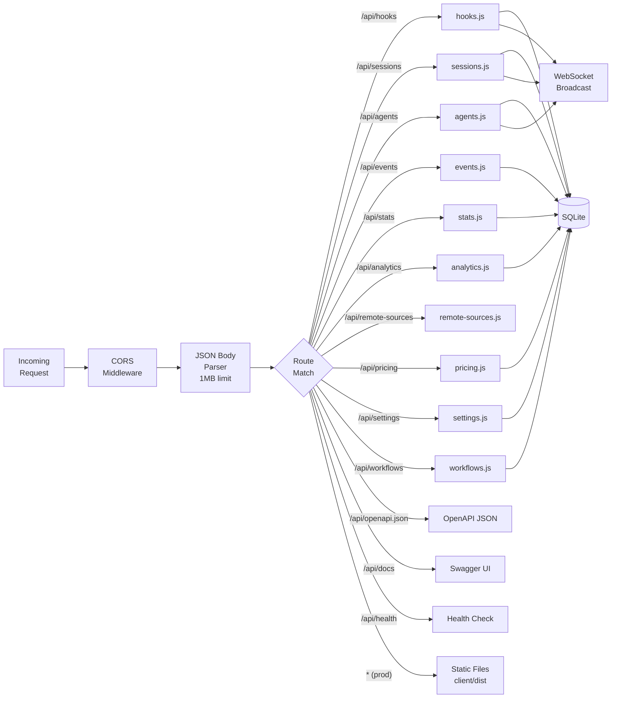

---

## Client Architecture

### Component Tree

```mermaid
graph TD
    APP["App.tsx<br/>Router + WebSocket"]
    LAYOUT["Layout.tsx<br/>Sidebar + Outlet"]
    SIDEBAR["Sidebar.tsx<br/>Nav (scroll-bounded with overflow<br/>chevrons) + Connection Status"]
    PALETTE["CommandPalette.tsx<br/>Cmd/Ctrl+K launcher: recent, pages,<br/>sessions, views, settings, config, actions"]
    SHORTCUTS["PaletteActionProvider.tsx<br/>Registry of the actions the<br/>mounted page offers the palette"]
    TOAST["ActionToast.tsx<br/>Confirms actions that<br/>change state without navigating"]
    DASH["Dashboard.tsx"]
    KANBAN["KanbanBoard.tsx"]
    SESS["Sessions.tsx"]
    DETAIL["SessionDetail.tsx"]
    ACTIVITY["ActivityFeed.tsx"]
    SETTINGS_P["Settings.tsx"]

    ANALYTICS_P["Analytics.tsx"]
    WORKFLOWS_P["Workflows.tsx"]
    NOTFOUND["NotFound.tsx"]

    APP --> LAYOUT
    LAYOUT --> SHORTCUTS
    SHORTCUTS --> SIDEBAR
    SHORTCUTS --> PALETTE
    SHORTCUTS --> TOAST
    PAGES_ANY["Any routed page"] -.->|usePaletteAction| SHORTCUTS
    LAYOUT --> DASH & KANBAN & SESS & DETAIL & ACTIVITY & ANALYTICS_P & WORKFLOWS_P & SETTINGS_P & NOTFOUND

    DASH --> SC1["StatCard x6<br/>(sessions/agents/subagents/<br/>events today/total events/cost)<br/>3-column grid"]
    DASH --> AC1["AgentCard[]<br/>with collapsible subagent hierarchy"]
    DASH --> EV1["Event rows"]
    DASH --> HEALTH["SystemHealthTab<br/>(health score ring, storage donut,<br/>cache/error/success gauges,<br/>tool bars, subagent effectiveness,<br/>model tokens, compaction stats)"]

    KANBAN --> COL["Agents view: 4 columns<br/>(working/waiting/<br/>completed/error)<br/>Sessions view: 5 columns<br/>(active/waiting/completed/<br/>error/abandoned)"]
    COL --> AC2["AgentCard[]"]

    SESS --> TABLE["Session Table<br/>with filters"]
    DETAIL --> OVERVIEW["SessionOverview<br/>(stat tiles, top tools,<br/>subagent breakdown,<br/>token flow, event mix)"]
    DETAIL --> AC3["AgentCard hierarchy<br/>parent → children tree"]
    DETAIL --> CONV["ConversationView<br/>(MarkdownContent + CodeBlock<br/>+ ToolCallBlock per-tool styling)"]
    DETAIL --> TL["Event Timeline"]
    ACTIVITY --> FEED["Streaming Event List<br/>(click row → expand payload;<br/>Session btn → session detail)"]
    WORKFLOWS_P --> WFC["12 D3.js components<br/>(workflows/ directory)"]

    style APP fill:#6366f1,stroke:#818cf8,color:#fff
    style LAYOUT fill:#1a1a28,stroke:#2a2a3d,color:#e4e4ed
```

### Splash & loading UX

- **`SplashScreen.tsx`** — rendered by `App.tsx` as a fixed full-screen overlay alongside the router. Shows once per browser session (`sessionStorage` gate, read synchronously so a repeat mount never flashes). Time-aware greeting + localized tagline/subtexts (`splash` i18n namespace, en/zh/vi/ko/es) + an animated node-graph brand mark on a dark backdrop (radial glow, drifting constellation, grain). It collects the global provider scope and checks readiness only for the providers that scope requires: Claude-only needs Claude hooks, Codex-only needs Codex hooks, and Both needs both. Fully ready selections persist the scope and reveal the dashboard immediately. Otherwise the live-monitoring gate lists and installs only missing selected providers through `POST /api/settings/install-hooks`; status-check failures fail soft into manual setup for the complete selected scope. The backdrop is **opaque from the first paint** (no entrance fade on the root) so the app rendered behind it never flashes through; only the inner content cascades in. Honors `prefers-reduced-motion`. CSS-only keyframes, no added dependencies.
- **Loading skeletons** — the shared `Skeleton` primitive (`components/Skeleton.tsx`) uses Tailwind `animate-pulse`. `Analytics.tsx` now renders a pulsing `AnalyticsChartsSkeleton` for the whole chart region while `data` is null (previously it fell back to empty/zero charts).
- **`PaginatedLegend.tsx`** — shared bounded legend primitive used by Analytics donuts and data-driven Workflows legends. It leaves lists at or below the configured page size untouched, and exposes longer lists through localized Previous / Next controls plus an accessible visible-range announcement. Every label remains reachable without allowing a legend to dominate the chart card.
- **`workflows/CompactionImpact.tsx`** — redesigned from a one-bar-per-session chart into a "sessions by compaction count" histogram (D3) with axis titles, stat tiles (total / sessions affected / avg / peak), an explanatory help line, a plain-English summary, and rich React-managed hover tooltips (full-height per-bucket hit-area + bar highlight) matching the other charts.
- **`Workflows.tsx` `Section`** — the right-aligned section subtitle is clamped to a single line (`truncate` + `max-w` + hover `title`) so a long translation never wraps and unbalances the header; the full text stays in the section's `i` popover.

### Self-hosted assets (no external CDN)

Nothing the dashboard or docs render is fetched from a third-party CDN at runtime — all fonts and scripts are served locally, so every surface works fully offline and leaks nothing to external hosts.

- **React app fonts** — Inter + JetBrains Mono are imported from `@fontsource` (latin subset) in `client/src/main.tsx`. Vite bundles the per-weight WOFF2 into `client/dist/assets/` with content hashes at build time; there is no Google Fonts `<link>`. Importing the `latin-*` subset entry points keeps the emitted set to one WOFF2 per weight.
- **Static pages (landing + wiki)** — load a self-hosted `@font-face` sheet at the repo-root `fonts/` directory (`fonts/fonts.css` + the `*.woff2` files). The root `index.html` references `fonts/fonts.css`; the wiki references `../fonts/fonts.css` (relative paths resolve under GitHub Pages).
- **Wiki Mermaid** — vendored as `wiki/mermaid.min.js` (the genuine minified `mermaid@10.9.6` from npm, with a provenance banner; `.prettierignore`d) and loaded via a local `<script>` instead of `cdn.jsdelivr.net`.
- **VS Code extension** — the inline `getErrorHtml()` error page dropped its Google Fonts loader for a system font stack (no bundler / local font path available in that webview).

Net effect: no `fonts.googleapis.com`, `fonts.gstatic.com`, or `cdn.jsdelivr.net` requests anywhere (verified by `git grep`).

### PWA Architecture

The project ships three independent Progressive Web Apps. Each has its own Web App Manifest and Service Worker, so the browser treats them as separate installable applications with isolated caches.

```
┌─────────────────────────────────────────────────────────────────┐
│                        PWA Surface Map                          │
├──────────────────┬──────────────────┬───────────────────────────┤
│   Dashboard      │   Landing Page   │         Wiki              │
│   (client/)      │   (root)         │         (wiki/)           │
├──────────────────┼──────────────────┼───────────────────────────┤
│ manifest.json    │ manifest.json    │ manifest.json             │
│ sw.js            │ sw.js            │ sw.js                     │
│ id: dashboard    │ id: landing      │ id: wiki                  │
├──────────────────┼──────────────────┼───────────────────────────┤
│ Precache:        │ Precache:        │ Precache:                 │
│ /, manifest,     │ index.html,      │ index.html, style.css,    │
│ favicon.svg      │ favicon, og-img, │ script.js, manifest,      │
│                  │ manifest         │ favicon                   │
│ Runtime cache:   │ Runtime cache:   │ Runtime cache:            │
│ JS/CSS bundles   │ screenshot PNGs  │ (all precached)           │
│ (cache-first)    │ (cache-first)    │                           │
│                  │                  │                           │
│ Skip: /api/*,    │ N/A              │ N/A                       │
│ /ws, __vite      │                  │                           │
│                  │                  │                           │
│ + Push notifs    │                  │                           │
│ (VAPID pipeline) │                  │                           │
└──────────────────┴──────────────────┴───────────────────────────┘
```

**Service Worker lifecycle (all three):**

1. **Install** → `skipWaiting()` — new SW activates immediately, no waiting for tabs to close.
2. **Activate** → old caches deleted (keyed by `CACHE_NAME`: `dashboard-v1`, `landing-v1`, `wiki-v1`). Bump the version string to force a cache bust.
3. **Fetch** → Navigation requests are network-first with offline fallback to cached HTML. Static assets are cache-first with runtime caching on miss.

**Dashboard SW specifics:** The fetch handler skips `/api/*`, `/ws`, and Vite HMR (`__vite`) URLs so live data and development tooling are never cached. Only responses with `response.type === "basic"` (same-origin) are stored. The existing push notification handlers (`push`, `notificationclick`) are preserved alongside the caching logic.

**Manifest icons:** All three manifests reference `favicon.svg` with `sizes="any"` and `type="image/svg+xml"` — supported in Chrome 107+, Firefox 110+, Edge 107+. Two icon entries per manifest: one with `purpose: "any"` and one with `purpose: "maskable"`.

**iOS meta tags:** All HTML files include `<meta name="apple-mobile-web-app-capable" content="yes">` and `<meta name="apple-mobile-web-app-status-bar-style" content="black-translucent">` for standalone home-screen mode on Safari.

### Client Module Graph

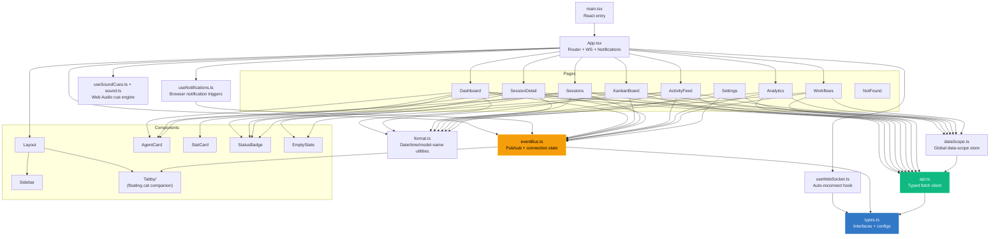

### Command Palette

`client/src/components/CommandPalette.tsx` is a global launcher mounted once by `Layout`, opened with `Cmd/Ctrl+K` from anywhere. It is deliberately keyboard-only: a sidebar button that opens a list so you can pick a page the sidebar is already showing costs a click and teaches nothing, so the chord is the trigger. Its catalog is built by `client/src/lib/paletteCommands.ts` — a pure function of one context object, which is what lets `paletteCommands.test.ts` assert coverage against the app's own route table, `SETTINGS_SECTIONS`, and `TABS` instead of trusting a hand-kept list.

| Group | Source | Notes |
| --- | --- | --- |
| Recent | `client/src/lib/recentCommands.ts` | The last 5 command **ids** in `localStorage`; re-resolved against the live catalog on every open, so a stale id simply disappears |
| Pages | The nine sidebar routes | Matched on the **translated** label, so it works in every locale |
| Sessions | `GET /api/sessions?q=` | Debounced 180 ms, capped at 6 results, minimum 2 characters |
| This page | `PAGE_ACTION_COMMANDS` ∩ `boundIds` | Actions the mounted page registered — pause the stream, sort, clear filters, copy this session's id. Listed **only** where they are bound |
| Projects | `GET /api/sessions/facets` | Every known project directory, jumping to `/sessions?cwd=…` |
| Views | Page sub-tabs and list filters | `/?tab=`, `/kanban?view=`, `/analytics?tab=`, `/sessions?status=` — every tab and filter is addressable by URL |
| Settings | The 13 `SETTINGS_SECTIONS` anchors | `/settings#<id>`; the Settings page resolves the hash on load |
| Agent Config | The 12 `TABS` keys | `/cc-config?tab=<key>` |
| Actions | Preferences, scope, language, links, page operations | Sound (on/off and volume), Tabby (enable/mute), provider scope, per-machine data scope, the five languages, notifications, sidebar toggle, reload, history back/forward, scroll, copy link, update check, API reference, issues, releases |

Ranking is subsequence matching with positional scoring (`client/src/lib/fuzzy.ts`), and the matched characters are highlighted in the row. With a catalog this size a substring filter would make most commands unreachable without typing their exact wording; subsequence matching lets `mcp` reach "MCP servers" and `kbrd` reach "Kanban Board". A leading sigil narrows the search — `>` actions and views, `@` pages, `#` sessions — but is never required.

**A command that appears is a command that works.** The three original quick actions were listed on every page and wired on none — "Show active sessions" navigated to `/sessions` and applied no filter. Page commands now come from the shortcut registry's `boundIds`, so an action whose handler is not mounted is not offered, and `paletteCommands.test.ts` asserts that a page action never appears unbound. Actions that change something without moving the user (a preference, the data scope, the clipboard) confirm themselves through `ActionToast` — navigation is its own feedback, nothing else is.

Session search is deliberately **server-side**. The dashboard routinely holds thousands of sessions, so the palette keeps no client-side index; issuing the same `?q=` filter the Sessions page uses means results automatically respect the active data scope (machine + provider) without duplicating any filter logic. A failed or slow session query never blocks the palette — every other group is computed locally and renders immediately, and the session group simply stays empty, in line with the app-wide rule that network delays must not make the UI unusable.

The palette **navigates rather than mutates** for anything destructive: purging the database or deleting a session stays behind its confirmation modal, and the palette only offers the jump. `paletteCommands.test.ts` asserts no command id matches `/delete|purge|wipe/`.

The sidebar trigger opens the palette by dispatching a `ccam:command-palette` window event (defined in `client/src/lib/appEvents.ts`) rather than through lifted state or a context provider, which keeps the trigger decoupled from the component and usable from anywhere in the tree. The same module carries `ccam:check-updates`, which the palette uses to ask the sidebar to run an update check — the check owns the spinner, the failure state, and the modal, so it stays in one place.

Accessibility: the panel is a modal `dialog` whose input is a `combobox` driving an `aria-activedescendant` listbox. Arrow keys move the active option (with feature-detected `scrollIntoView`), `Home`/`End` and `PageUp`/`PageDown` jump, `Tab` moves between groups without leaking focus out of the dialog, `Enter` runs the highlighted row, `Escape` closes, and focus returns to the previously focused element on close. Pointer hover only takes the selection after a real `mousemove`, so arrowing through a scrolled list under a stationary cursor is not fought by `mouseenter`.

### Keyboard

The dashboard claims exactly **one** chord: `Cmd/Ctrl+K` opens the command palette. Everything else is reached by opening the palette and typing.

That is a deliberate reversal. An earlier iteration shipped a full shortcut layer — a registry, `g`-prefixed navigation sequences, page keys, a `?` cheat sheet, and a hold-modifier hint overlay — and it was removed because it failed the only test that matters: a first-time user could not tell what was bound. A `g` sequence is a hidden mode with a timer; pressing `g` looked like nothing happening. Two navigation mechanisms also split muscle memory for no gain, because the palette already reaches every page with fuzzy search and does it discoverably.

What remains:

| Chord | Action | Owner |
| --- | --- | --- |
| `Cmd/Ctrl+K` | Toggle the command palette | `CommandPalette.tsx` |
| `Cmd/Ctrl+B` | Toggle Tabby | `Tabby.tsx` (predates the palette) |
| `↑` `↓` `Home` `End` `PgUp` `PgDn` `Tab` `Enter` `Esc` | Move within the open palette | `CommandPalette.tsx` |

`Cmd/Ctrl+K` is claimed even while a field has focus — that is the point of a global launcher — but never when `Alt` is also held, so browser-native combos keep working. Firefox binds `Ctrl+K` to its search bar; the chord is taken anyway because it is what every developer tool already uses, and a launcher on a key nobody guesses is a launcher nobody opens.

### Palette action registry

`client/src/components/PaletteActionProvider.tsx` is not a keyboard layer — it is how a mounted page tells the palette which commands exist right now.

The problem it solves is concrete. The palette originally listed a fixed set of quick actions on every page and wired them on none: *Show active sessions* navigated to `/sessions` and applied no filter; *Configure alerts* pointed at a hash the Settings page never read. A launcher that offers commands it cannot run teaches you to stop trusting it.

Registration inverts that. A page calls `usePaletteAction(id, handler)`; the palette reads `boundIds` and offers the command **only** while that handler is mounted. An action whose page is not on screen is not listed, so it is structurally impossible to ship a row that does nothing — and `paletteCommands.test.ts` asserts a page action never appears unbound.

`register` pushes onto a per-id stack, so the most recently mounted handler wins and unmounting restores the one beneath it. That is how every page registers `page.refresh` under its own reload without any of them knowing about the others, and how a handler can decline (`return false`) so the stack falls through — `session.copyId` declines until the session has loaded, rather than copying an empty string.

Actions that change something **without moving the user** — a preference, the data scope, the clipboard — confirm themselves through `ActionToast`. Navigation is its own feedback; everything else closed the palette and then visibly did nothing, which reads as broken even when it worked.

### URL-addressable sub-views

For the palette to reach "every page and every view", the views had to become addressable. `useUrlTab` (in `client/src/hooks/usePageShortcuts.ts`) moves each page's tab or filter selection into the URL:

| Route | Parameter |
| --- | --- |
| `/` | `?tab=monitor\|health` |
| `/kanban` | `?view=agents\|sessions` |
| `/analytics` | `?tab=cost\|tokens\|productivity\|workflow` |
| `/cc-config` | `?tab=<one of the 12 tabs>` |
| `/sessions` | `?status=<lifecycle>` and `?cwd=<project>` |
| `/sessions/:id` | `?tab=agents\|conversation\|timeline` |
| `/settings` | `#<section id>` (resolved on load; React Router does not scroll to a hash) |

The URL is the source of truth when it carries a valid value; otherwise the page's existing `localStorage` preference applies, then its default — so a remembered tab is never lost. Selections use `replace: true`, because flipping between two tabs should not make Back mean "the tab I was just on", and an empty value (the "all" pseudo-filter) is dropped from the query string rather than written as `?status=`.

The benefit is not only the palette: every one of these is now a link a user can bookmark or paste to a colleague.

### Routing

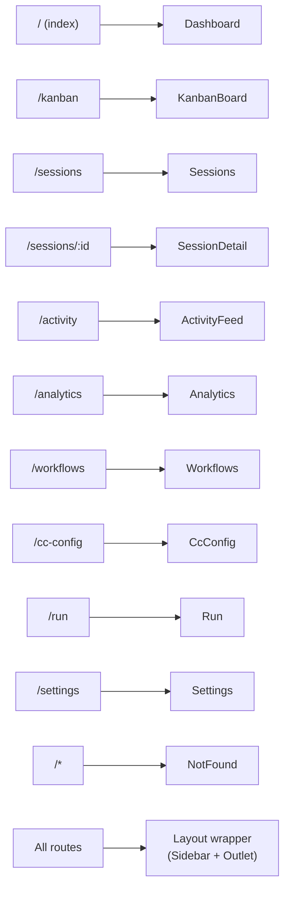

| Route           | Page          | Data Sources                                           |
| --------------- | ------------- | ------------------------------------------------------ |
| `/`             | Dashboard     | Two tabs (Monitor / Health). Monitor: `GET /api/stats`, `GET /api/agents`, `GET /api/events`, `GET /api/agents?session_id={sid}` (subagent hierarchy), and `GET /api/sessions?status=active&include_transient=true&include_task_progress=true&limit=100` for card context plus task summaries. Every AgentCard renders its session's accessible micro-donut immediately before status when task state exists. Dynamic item counts use `ResizeObserver`. Health: `GET /api/settings/info` + `GET /api/workflows` (5 s auto-refresh) — composite health score, storage donut, cache/error/success gauges, tool invocation bars, subagent effectiveness, model token distribution, compaction stats |
| `/kanban`       | KanbanBoard   | View toggle persisted in `localStorage`. Agents view: `GET /api/agents?status={each}` per-status (default 10000 cap). Sessions view: `GET /api/sessions?status={each}&limit=10000` per-status. Each column then paginates client-side at `COLUMN_PAGE_SIZE=10`; the WS subscription scopes to the active view. |
| `/sessions`     | Sessions      | `GET /api/sessions?status=&q=&cwd={one-or-more repeated values}&sort_by=&sort_desc=&include_transient=true&include_task_progress=true&limit=PAGE_SIZE&offset=page*PAGE_SIZE` — true server-side pagination. `include_transient` is sent only for page zero and prepends the local in-memory Codex startup row without changing durable `total`; that row is non-navigable until the durable ID replaces it. Search, project picker, sort, and `status=waiting` remain server-side. The opt-in task flag attaches a bounded `todo_summary` only to visible rows; sessions with observable task state for their latest top-level work render an accessible micro-donut beside status, with a portal tooltip showing current work, owner labels, source, and up to five tasks. A newer work item without tracker state, or a finished/aborted turn with unfinished tracker state, returns `null` and removes the older donut; fully completed history remains visible. Kanban omits the task flag, so its high-volume list calls do not parse transcripts. |
| `/sessions/:id` | SessionDetail | `GET /api/sessions/:id` returns agents, events, workflows, prompt context, and a nullable owner-attributed `todo_snapshot` reduced from Claude Task*/TodoWrite or direct/unified-exec Codex `update_plan`. Top-level Claude/Codex work boundaries expire every older owner snapshot; a subagent's next turn expires only its own snapshot. Turn completion/abort also expires owner state that was never finalized, while fully completed history remains. Thus the latest work item can correctly return `null` when it uses no tracker or abandoned an unfinished one. The Agents tab places the full task-progress panel immediately after `SessionOverview`, before workflow runs, the agent tree, and cost breakdown; task rows paginate client-side at 10 per page. `GET /api/sessions/:id/stats` supplies overview metrics; transcript endpoints supply the cursor-paginated Conversation tab. Waiting and Run-page banners remain above the tabs. |
| `/activity`     | ActivityFeed  | `GET /api/events?limit=100` — click row to expand inline payload; "Session →" button navigates to `/sessions/:id` |
| `/analytics`    | Analytics     | `GET /api/analytics`                                   |
| `/workflows`    | Workflows     | `GET /api/workflows?status=active\|completed`, `GET /api/workflows/session/:id` + WebSocket auto-refresh (3s debounce) |
| `/cc-config`    | CcConfig      | 12-tab Claude Code configuration explorer. Reads via `GET /api/cc-config/{overview,skills,agents,commands,output-styles,plugins,marketplaces,mcp,hooks,hook-scripts,keybindings,statusline,settings,memory}`. Mutations for skills/agents/commands/output-styles/memory — including the per-project file-based auto-memory store (`*.md` under `~/.claude/projects/<slug>/memory/`, grouped by project and searchable in the Memory tab, with clickable `MEMORY.md` index links that scroll to + highlight the matching fact file) — via `PUT /api/cc-config/file` + `DELETE /api/cc-config/file` (timestamped backups, atomic writes). The Keybindings tab additionally offers a structured inline editor that persists via `PUT /api/cc-config/keybindings` (same backup-first, atomic-write guarantees). `GET /api/cc-config/file?path=…` for single-file viewer. `GET /api/cc-config/backups` for the recovery modal. Subscribes to `cc_config_changed` WS messages for live refresh on both dashboard mutations and external file edits picked up by `cc-watcher`. The Settings tab leads with a client-side **Current configuration** summary that resolves the `/config` options (model, verbose, theme, output style, effort, auto-compact, notifications, …) across user / project / project-local scopes, showing defaults when unset. Live / Offline indicator next to the title |
| `/run`          | Run           | Spawns `claude` subprocesses with chat-style streaming UI. `GET /api/run/{binary,cwds,files}` for pre-flight + `@`-file autocomplete; `POST /api/run` to spawn (accepts `effort: low\|medium\|high`); `POST /api/run/:id/message` for follow-up turns; `DELETE /api/run/:id` to stop; `GET /api/run/:id?envelopes=1` for attach-with-history. WS messages: `run_stream` (includes `stream_event` deltas from `--include-partial-messages`), `run_status`, `run_input_ack`. Streaming pipeline: each WS envelope is dispatched through `flushSync` so React auto-batching does not collapse bursts into a single render; a `useTypewriterEnvelopes` hook drips text/thinking deltas via `requestAnimationFrame` so even short replies type in; the merge code preserves `_streaming` and the delta-accumulated content array when claude's canonical `assistant` envelope arrives mid-stream so thinking blocks aren't dropped. Tier 1 TUI parity: collapsible-to-pill limitations banner, slash + `@`-file autocomplete (dropdowns open upward, slash matching uses tiered scoring), live token / context-window meter, status header. Live / Offline indicator next to the title |
| `/settings`     | Settings      | `GET /api/settings/info`, Claude and GPT pricing/cost endpoints, `GET`/`PUT /api/settings/{claude,codex}-home`, and `localStorage` for notification prefs. Hosts the global provider selector (`claude` / `codex` / both), the hook-install modal (`POST /api/settings/install-hooks`) with selected-provider overwrite warnings, and independent Claude Code/Codex session-home inputs; a Codex home save re-arms the watcher and immediately schedules a sweep. Also hosts the **Remote Data Sources** panel (`components/RemoteSources.tsx`) — CRUD + test + sync over `/api/remote-sources`, live status from `remote_source.status` WS messages |
| `/*`            | NotFound      | None (static 404 page)                                 |

### Activity Feed Interaction Model

The Activity Feed (`/activity`) separates two previously conflated interactions into distinct affordances:

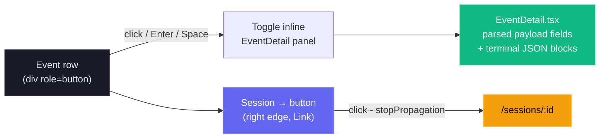

- **Row click** (anywhere except the Session button) toggles the `EventDetail` dropdown for the selected event. Chevron rotates 90° as a visual indicator.
- **Session → button** uses `e.stopPropagation()` to navigate to session details without triggering the expand toggle.
- Expanded state is tracked in a `Set<number>` (`expandedEvents`) allowing multiple rows to be open simultaneously.
- Keyboard accessible: `Enter` and `Space` on the row trigger expand; the Session button is a standard `<a>` element navigable by Tab.

### Event Status Badges

Every event row — on the Dashboard's Recent Activity panel, the Activity Feed, and Session Detail's timeline — is badged by a single mapping, `statusFromEventType` in `client/src/lib/event-grouping.ts`. The Dashboard previously hand-rolled its own, which knew only `Stop` / `APIError` / `PreToolUse` and defaulted everything else to a yellow **Waiting**: the same event could show Completed on one screen and Waiting on another, and every Codex-native `codex_*` type fell through to a badge that implied the session was idle (issue #310).

| Badge | Event types |
| --- | --- |
| **Working** | `PreToolUse`, `UserPromptSubmit`, `codex_user_message`, `codex_task_started`, `codex_tool_call` |
| **Waiting** | `PostToolUse`, `codex_exec_command_end`, `codex_mcp_tool_call_end`, `codex_web_search_end`, plus lifecycle/metadata with no reliable progress meaning (`SessionStart`, `Notification`, `TurnDuration`, `codex_turn_aborted`) and any unrecognized type |
| **Completed** | `Stop`, `SessionEnd`, `SubagentStop`, `Compaction`, `codex_task_complete`, `codex_context_compacted` |
| **Error** | `error`, `APIError`, `codex_error` |

`Stop` is **Completed** on every surface — it is a turn boundary, and the shipped filter help has always described it that way. The Dashboard adds one rule on top through `activityStatusFromEvent`: a summary that reports a failure is an Error whatever the event type says. `STATUS_TO_EVENT_TYPES` in `EventFilters.tsx` inverts the *filterable* rows of this table — every type it lists badges as the status it is filed under, and a test asserts the two never drift. It deliberately omits the lifecycle/metadata types that reach **Waiting** only through the default (`SessionStart`, `Notification`, `TurnDuration`, `codex_turn_aborted`), since filtering on those would return rows the user did not ask for; that is also why the "Idle" preset expands to nothing.

### Workflows Page Architecture

The Workflows page (`/workflows`) is the most visualization-heavy page, composed of 12 child components in `client/src/components/workflows/`. Most D3.js rendering is done client-side using data from two API endpoints. The aggregate endpoint accepts an optional `?status=active|completed` query parameter to filter all workflow data by session status.

```mermaid
graph TD
    WF["Workflows.tsx<br/>Page orchestrator"]:::root
    API_AGG["GET /api/workflows?status=...<br/>Aggregate data (filterable)"]
    API_DI["GET /api/workflows/session/:id<br/>Session drill-in"]
    WS_D["WebSocket auto-refresh<br/>(3s debounce)"]

    WF --> API_AGG
    WF --> API_DI
    WS_D --> WF

    WF --> S1["WorkflowStats<br/>Summary cards"]
    WF --> S2["OrchestrationDAG<br/>Horizontal DAG —<br/>Sessions → Main → Subagents → Outcomes"]
    WF --> S3["ToolExecutionFlow<br/>d3-sankey tool transitions"]
    WF --> S4["AgentCollaborationNetwork<br/>Force-directed pipeline graph"]
    WF --> S5["SubagentEffectiveness<br/>SVG success rings +<br/>day-of-week sparklines"]
    WF --> S6["WorkflowPatterns<br/>Auto-detected sequences"]
    WF --> S7["ModelDelegationFlow<br/>Model → agent routing"]
    WF --> S8["ErrorPropagationMap<br/>React horizontal bars +<br/>API/session error support"]
    WF --> S9["ConcurrencyTimeline<br/>Swim-lane parallel execution"]
    WF --> S10["SessionComplexityScatter<br/>D3 bubble chart"]
    WF --> S11["CompactionImpact<br/>Token compression analysis"]
    WF --> S12["SessionDrillIn<br/>Searchable session explorer<br/>(3 tabs: tree / timeline / events)"]

    classDef root fill:#6366f1,stroke:#818cf8,color:#fff
```

| Component | Visualization | D3 Feature |
| --- | --- | --- |
| `OrchestrationDAG` | Horizontal DAG of aggregate spawning patterns | Custom DAG layout, capped at top 7 subagent types with overflow node |
| `ToolExecutionFlow` | Tool-to-tool transition Sankey diagram | `d3-sankey` |
| `AgentCollaborationNetwork` | Agent pipeline graph with directed edges | `d3-force` with arrowheads and frequency labels |
| `SubagentEffectiveness` | Scorecard grid with success rate rings | SVG arc rendering, day-of-week sparklines (Mon-Sun). Per-bar tooltip is rendered through `createPortal` to `document.body` and positioned with viewport-clamped fixed coordinates so it escapes the card's `overflow:hidden` (and any `hover:translate` containing block) and is never clipped by the card edge — fixes Sun/Sat/Mon/Fri visibility |
| `WorkflowPatterns` | Common orchestration sequences | Pattern detection from event data; clicking a row expands an inline detail panel with the full step chain, a stats grid, a deterministic narrative (shape buckets: solo / two-step / short / long; loop detection; frequency bucket: dominant > 50% / common > 25% / regular > 10% / niche), and a practical suggestion bucket. All copy is i18n-driven (`workflows.patterns.detail.*`) |
| `ModelDelegationFlow` | Model routing through agent hierarchies | Hierarchical layout |
| `ErrorPropagationMap` | Error clustering by hierarchy depth with API/session event errors | Pure React horizontal bars (replaced D3 bar chart), `eventErrors` support for API and session-level errors |
| `ConcurrencyTimeline` | Swim-lane parallel agent execution | Time-scaled horizontal bars |
| `SessionComplexityScatter` | Duration vs agents vs tokens | D3 bubble/scatter chart |
| `CompactionImpact` | Token compression events and recovery | Before/after comparison |
| `SessionDrillIn` | Per-session agent tree, tool timeline, events | Searchable dropdown with pagination, 3 tabs |

**Cross-filtering:** Clicking nodes in the OrchestrationDAG filters data in other sections. **JSON export:** All workflow data can be exported as JSON from the page header.

### Tooltip rendering strategy

Every chart in the Workflows page follows a single, deterministic tooltip pattern designed to avoid the failure modes of naive React tooltips (laggy mousemove re-renders, sticky tooltips after D3 re-renders, clipping by parent `overflow:hidden`):

- **One DOM-ref tooltip element per chart.** Each chart owns a single `<div ref={tipRef}>` that lives at the bottom of its render tree. D3 mouse handlers mutate that element's content imperatively (`textContent`, `appendChild`, inline `style`), so hovering never triggers a React re-render of the SVG.
- **No `mousemove` follow.** The tooltip is positioned once on `mouseenter` from the hovered element's `getBoundingClientRect()`, with viewport clamping (8 px margin) and an automatic flip below → above when there's no room. Position never updates as the cursor moves, which removes per-pixel state churn.
- **Container-level `mouseleave` fallback.** The chart's outer wrapper also calls `hideTip()` on leave. If a node-level handler is missed because D3 destroyed the element under the cursor on data refresh, the wrapper guarantees dismissal.
- **Re-render safety.** Each chart's render effect ends with `hideTip()` so any stale tooltip from before a websocket-driven refresh is cleared the moment new data arrives.
- **Fade transitions.** Tooltips stay in the DOM with `opacity: 0` and `pointer-events: none`, transitioning over 120 ms — show/hide feels smooth instead of flickering, and the element never intercepts pointer events that would prevent `mouseleave` from firing on the chart.
- **Portal escape for clipped containers.** `SubagentEffectiveness` cards use `overflow:hidden` plus a hover `translate` (which becomes the fixed-position containing block), so its sparkline tooltip is rendered with `react-dom.createPortal(…, document.body)` rather than as a child of the card. Coordinates are computed from the bar's bounding rect and clamped to the viewport, so the tooltip is visible on every day of the week regardless of the card's screen position.

### Structured info popovers

Two classes of explanatory popover sit on top of the chart layer, both i18n-driven:

- **Stat-card popovers** (`WorkflowStats.tsx`). Each of the six headline cards (Avg Agent Depth, Avg Subagents/Session, Agent Success Rate, Most Common Flow, Avg Compactions, Avg Duration) carries an info `i` icon at the bottom-right of the card. Hovering it opens a fixed-positioned, viewport-clamped popover with three sections: a value+label header, a "How it's calculated" paragraph (`workflows.stats.tooltip.calc.*`), and a "What this number means" paragraph that renders `"{value} {phrase} means {interpretation}"`. The interpretation comes from a deterministic, value-bucket function (`interp*`) — pure rule-based mapping with no AI generation, so the same input always yields the same explanation across all three locales.
- **Chart-section popovers** (`Workflows.tsx → ChartInfoPopover`). The `i` icon next to each section title (1–11) opens a structured "What this shows / How to read it / Why it matters" popover sourced from `workflows.chartInfo.<sectionKey>.*`. Each of the 11 charts has its own three-paragraph entry, fully translated to en/vi/zh.

Both popover classes use the same fixed-position + viewport-clamp algorithm: anchor right of the icon (or center for chart-section popovers), clamp to a viewport margin, and flip above when there isn't enough room below. They are never clipped by the sidebar, the right edge of the screen, or any ancestor's `overflow:hidden`.

---

## Internationalization Architecture

The client localization stack is powered by `i18next` + `react-i18next` (`client/src/i18n/index.ts`) and currently supports five languages: English (`en`), Chinese (`zh`), Vietnamese (`vi`), Korean (`ko`), and Spanish (`es`). The sidebar uses the shared custom `Select` dropdown, so locale choices remain compact as languages grow. Language detection prefers `localStorage` (`i18nextLng`) and falls back to the browser locale (`navigator`) with `en` as final fallback.

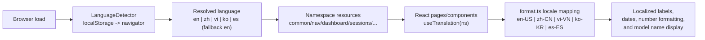

See [docs/I18N.md](docs/I18N.md) for resource strategy, key naming conventions, localization tests, troubleshooting, and rollout checklists.

**Coverage scope.** The translation layer extends end-to-end through the Workflows tooltip surfaces — `workflows.stats.tooltip.*` (calculation copy, deterministic value-bucket interpretations, metric phrases), `workflows.chartInfo.*` (per-chart "What / How to read / Why" entries for all 11 sections), `workflows.{orchestration,toolFlow,pipeline,modelDelegation,concurrency}.tooltip.*` (per-graph hover content), and `workflows.patterns.detail.*` (Workflow Patterns expansion narrative + suggestion buckets) — plus the Settings additions: `settings.pricing.tooltip.*` (pricing rule lookup, `%` wildcard syntax, manual-update reminder), `settings.claudeHome.*` (CLAUDE_HOME panel labels), and the full `settings.import.*` block (now translated to vi/zh, where the panel previously fell back to English).

---

## Database Design

### Entity Relationship Diagram

```mermaid
erDiagram
    sessions ||--o{ agents : has
    sessions ||--o{ events : has
    sessions ||--o{ token_usage : tracks
    agents ||--o{ events : generates
    agents ||--o{ agents : spawns

    sessions {
        TEXT id PK "UUID"
        TEXT name "Human-readable label"
        TEXT status "active|completed|error|abandoned"
        TEXT cwd "Working directory"
        TEXT model "Claude model ID"
        TEXT started_at "ISO 8601"
        TEXT ended_at "ISO 8601 or NULL"
        TEXT metadata "JSON blob"
        TEXT awaiting_input_since "ISO 8601 or NULL — set by waiting Notifications"
        TEXT awaiting_reason "notification|stop|session_start|interrupted or NULL"
        TEXT source "Data source — 'local' or a remote source id; NOT NULL DEFAULT 'local'"
    }

    agents {
        TEXT id PK "UUID or session_id-main"
        TEXT session_id FK "References sessions.id"
        TEXT name "Main Agent — {session name} or subagent description"
        TEXT type "main|subagent"
        TEXT subagent_type "Explore|general-purpose|etc"
        TEXT status "working|waiting|completed|error"
        TEXT task "Current task description"
        TEXT current_tool "Active tool name or NULL"
        TEXT started_at "ISO 8601"
        TEXT ended_at "ISO 8601 or NULL"
        TEXT parent_agent_id FK "References agents.id"
        TEXT metadata "JSON blob"
        TEXT awaiting_input_since "ISO 8601 or NULL — main-agent waiting flag"
        TEXT awaiting_reason "notification|stop|session_start|interrupted or NULL"
    }

    events {
        INTEGER id PK "Auto-increment"
        TEXT session_id FK "References sessions.id"
        TEXT agent_id FK "References agents.id"
        TEXT event_type "PreToolUse|PostToolUse|Stop|etc"
        TEXT tool_name "Tool that triggered the event"
        TEXT summary "Human-readable summary"
        TEXT data "Full event JSON"
        TEXT created_at "ISO 8601"
    }

    token_usage {
        TEXT session_id PK "FK to sessions + part of composite PK"
        TEXT model PK "Model identifier + part of composite PK"
        TEXT speed PK "standard or fast (fast mode) — pricing dimension"
        TEXT inference_geo PK "global or us (data residency) — pricing dimension"
        TEXT service_tier PK "standard or batch (Batch API) — pricing dimension"
        INTEGER input_tokens "Current JSONL total"
        INTEGER output_tokens "Current JSONL total"
        INTEGER cache_read_tokens "Current JSONL total"
        INTEGER cache_write_tokens "Total ephemeral cache writes (5m + 1h)"
        INTEGER cache_write_1h_tokens "Subset stored at the 1h tier; 5m = total - 1h"
        INTEGER web_search_requests "server_tool_use web search count"
        INTEGER web_fetch_requests "server_tool_use web fetch count"
        INTEGER code_execution_requests "server_tool_use code execution count"
        INTEGER baseline_input "High-water baseline; effective = live + baseline = max ever seen (one per metric)"
    }

    model_pricing {
        TEXT model_pattern PK "SQL LIKE pattern e.g. claude-opus-4-6%"
        TEXT display_name "Human-readable name"
        REAL input_per_mtok "Cost per million input tokens"
        REAL output_per_mtok "Cost per million output tokens"
        REAL cache_read_per_mtok "Cost per million cache read tokens (cache hits)"
        REAL cache_write_per_mtok "Cost per million 5m cache-write tokens"
        REAL cache_write_1h_per_mtok "Cost per million 1h cache-write tokens"
        REAL fast_input_per_mtok "Fast-mode input rate (0 = none)"
        REAL fast_output_per_mtok "Fast-mode output rate (0 = none)"
        REAL intro_input_per_mtok "Intro input rate, used when usage date <= intro_until (0 = none)"
        REAL intro_output_per_mtok "Intro output rate"
        REAL intro_cache_read_per_mtok "Intro cache-read rate"
        REAL intro_cache_write_per_mtok "Intro 5m cache-write rate"
        REAL intro_cache_write_1h_per_mtok "Intro 1h cache-write rate"
        TEXT intro_until "Promo cutoff YYYY-MM-DD; usage on/before uses intro rates, after uses standard (NULL = no intro)"
        TEXT updated_at "ISO 8601"
    }

    push_subscriptions {
        TEXT endpoint PK "Subscription URL"
        TEXT p256dh "Public key"
        TEXT auth "Auth secret"
        TEXT created_at "ISO 8601"
    }

    remote_sources {
        TEXT id PK "Source id — also stamped onto sessions.source"
        TEXT label "Human-readable name"
        TEXT host "SSH host"
        INTEGER ssh_port "SSH port"
        TEXT identity_file "Optional SSH identity file path or NULL (no secrets stored)"
        TEXT remote_home "Optional Remote Claude home holding ~/.claude/projects, or NULL"
        TEXT remote_codex_home "Optional Remote Codex home holding ~/.codex/sessions, or NULL"
        INTEGER enabled "1|0 — polled by the background sync when 1"
        TEXT status "idle|syncing|ok|error"
        TEXT claude_status "Provider state: idle|syncing|ok|unavailable|error"
        TEXT codex_status "Provider state: idle|syncing|ok|unavailable|error"
        TEXT last_error "Last sync error or NULL"
        TEXT last_sync_at "ISO 8601 or NULL"
        TEXT last_sync_counts "JSON import counters from the last sync or NULL"
        TEXT created_at "ISO 8601"
        TEXT updated_at "ISO 8601"
    }

    alert_rules ||--o{ alert_events : fires

    alert_rules {
        TEXT id PK "UUID"
        TEXT name "User-facing rule name"
        TEXT rule_type "event_pattern|inactivity|status_duration|token_threshold"
        TEXT config "Type-specific JSON config"
        INTEGER enabled "1|0"
        INTEGER cooldown_seconds "Per-scope dedup window, default 300"
        TEXT created_at "ISO 8601"
        TEXT updated_at "ISO 8601"
    }

    alert_events {
        INTEGER id PK "Auto-increment"
        TEXT rule_id FK "References alert_rules.id, ON DELETE CASCADE"
        TEXT rule_name "Snapshot — survives rule edits"
        TEXT rule_type "Snapshot"
        TEXT session_id "No FK — alert history survives session cleanup"
        TEXT agent_id "Affected agent or NULL"
        TEXT message "Human-readable alert text"
        TEXT details "JSON context blob"
        TEXT triggered_at "ISO 8601"
        TEXT acknowledged_at "ISO 8601 or NULL"
    }

    webhook_targets ||--o{ webhook_deliveries : delivers

    webhook_targets {
        TEXT id PK "UUID"
        TEXT name "User-facing target name"
        TEXT type "provider key — slack|discord|teams|telegram|pagerduty|… (15)"
        TEXT url "Endpoint URL (may be '' when derived) — server-only, masked in responses"
        INTEGER enabled "1|0"
        TEXT secret "Generic-family HMAC-SHA256 signing secret or NULL"
        TEXT headers "Generic-family extra request headers (JSON) or NULL"
        TEXT rule_ids "JSON array scoping to rules, or NULL = all"
        TEXT config "Provider params JSON (routing_key, chat_id, …); secrets redacted in responses"
        TEXT created_at "ISO 8601"
        TEXT updated_at "ISO 8601"
    }

    webhook_deliveries {
        INTEGER id PK "Auto-increment"
        TEXT target_id FK "References webhook_targets.id, ON DELETE CASCADE"
        TEXT target_name "Snapshot"
        TEXT target_type "Snapshot"
        INTEGER alert_id "alert_events.id, NULL for test pings (no FK)"
        TEXT status "success|failed"
        INTEGER status_code "Last HTTP status or NULL"
        INTEGER attempts "Attempt-chain length"
        TEXT error "Failure reason or NULL"
        TEXT created_at "ISO 8601"
    }
```

### Indexes

| Index                  | Table    | Column(s)         | Purpose                        |
| ---------------------- | -------- | ----------------- | ------------------------------ |
| `idx_agents_session`   | agents   | `session_id`      | Fast agent lookup by session   |
| `idx_agents_status`    | agents   | `status`          | Kanban board column queries    |
| `idx_events_session`   | events   | `session_id`      | Session detail event list      |
| `idx_events_type`      | events   | `event_type`      | Filter events by type          |
| `idx_events_created`   | events   | `created_at DESC` | Activity feed ordering         |
| `idx_events_session_type` | events | `session_id, event_type` | Per-session event-type filters |
| `idx_events_agent_type` | events  | `agent_id, event_type` | Keeps `importSubagentFromJsonl`'s per-tool-event `data LIKE` dedup an index seek instead of a full events scan — a large re-import (startup sweep touching a subagent-heavy session) drops from tens of seconds to sub-second |
| `idx_sessions_status`  | sessions | `status`          | Status filter on Sessions page and Kanban Sessions view |
| `idx_sessions_started` | sessions | `started_at DESC` | Default sort order             |
| `idx_sessions_source`  | sessions | `source`          | Data-scope (`?sources=`) filtering by source            |
| `idx_alert_events_triggered` | alert_events | `triggered_at DESC` | Alert feed ordering      |
| `idx_alert_events_rule` | alert_events | `rule_id`        | Cooldown lookup per rule       |
| `idx_alert_events_session` | alert_events | `session_id`  | Per-session alert history      |
| `idx_webhook_deliveries_target` | webhook_deliveries | `target_id, created_at DESC` | Per-target delivery log + last-delivery lookup |
| `idx_webhook_deliveries_created` | webhook_deliveries | `created_at DESC` | Delivery-log pruning (newest 2000)  |

### SQLite Configuration

| Pragma         | Value  | Rationale                                                                  |
| -------------- | ------ | -------------------------------------------------------------------------- |
| `journal_mode` | `WAL`  | Concurrent reads during writes, better performance for read-heavy workload |
| `foreign_keys` | `ON`   | Referential integrity enforcement                                          |
| `busy_timeout` | `5000` | Wait up to 5s for write lock instead of failing immediately                |

### Prepared Statements

All queries use prepared statements (`db.prepare()`) for:

- **Security** -- parameterized queries prevent SQL injection
- **Performance** -- compiled once, executed many times
- **Reliability** -- syntax errors caught at startup, not runtime

Notable prepared statements include `findStaleSessions` (used by `SessionStart` and the periodic maintenance sweep to identify active sessions with no activity for a configurable number of minutes; each remote provider stays mirror-owned only while its own Claude Code or Codex sync health is current, while errored, unavailable, or stale-`syncing` provider mirrors fall back to this sweep), `touchSession` (bumps `updated_at` on every event), and `reactivateSession` / `reactivateAgent` (used when a previously completed/abandoned session receives new work or stop events — Stop/SubagentStop reactivate completed/abandoned sessions to handle sessions imported before the server started).

---

## WebSocket Protocol

### Connection

- **Path:** `/ws`
- **Protocol:** Standard WebSocket (RFC 6455)
- **Heartbeat:** Server sends `ping` every 30 seconds; clients that don't `pong` are terminated

### Message Format

All messages are JSON with this envelope:

```typescript
{
  type: "session_created" | "session_updated" | "agent_created" | "agent_updated" | "new_event"
      | "alert_triggered" | "alert_updated" | "workflow_upserted" | "remote_source.status";
  data: Session | Agent | DashboardEvent | AlertEvent | WorkflowRun | RemoteSourceStatus;
  timestamp: string; // ISO 8601
}
```

The `remote_source.status` message (emitted by the **Remote Data Sources**
sync poller and the `/api/remote-sources` routes) carries
`{ id, status, error?, providers?, last_sync_at? }`, where `status` is one of
`idle | syncing | ok | error | deleted`; `providers` preserves independent
Claude/Codex states, including `unavailable` when a remote has only one CLI.

### Message Flow

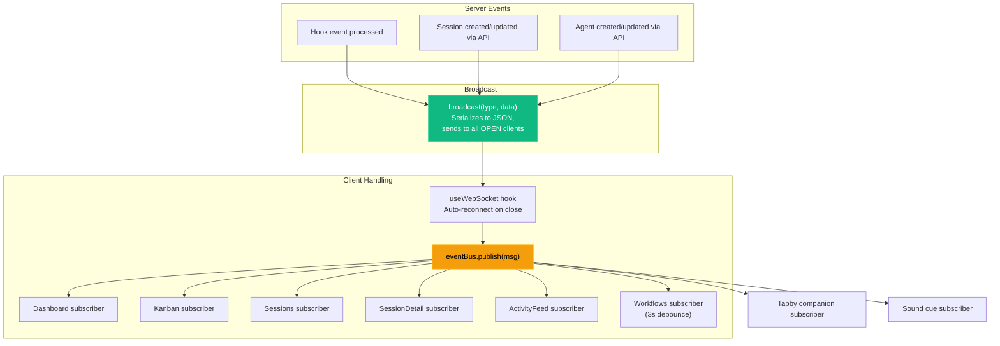

The **Tabby companion** (see [Tabby Companion Subsystem](#tabby-companion-subsystem)) is an additional read-only `eventBus` subscriber. It consumes the existing message envelope above and introduces **no new WebSocket message types** and no protocol changes.

The **sound cue engine** (`useSoundCues` + `lib/sound.ts`) is a second read-only subscriber with the same properties: it maps existing message types to synthesized Web Audio cues and adds no server code, routes, message types, or schema.

### Client Reconnection

The `useWebSocket` hook implements automatic reconnection:

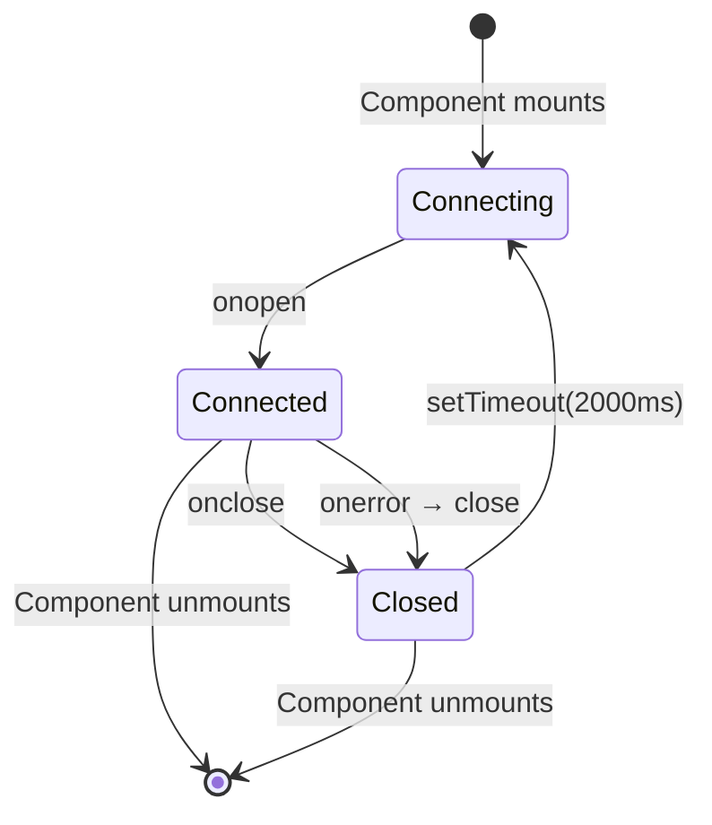

---

## Hook Integration

### Hook Handler Design

`scripts/hook-handler.js` is designed to be a minimal, fail-safe forwarder
that POSTs each hook to **one ingest target per unique SQLite data directory**
(different databases still each get hooks; same database never double-ingests):

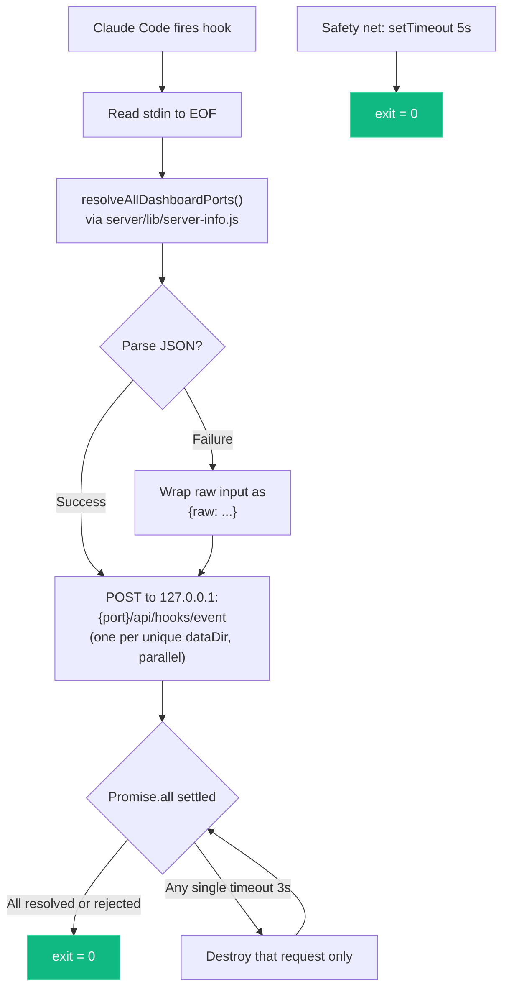

**Key design decisions:**

- Always exits 0 — never blocks Claude Code regardless of any server's state.
- 3-second HTTP timeout per target + 5-second process-wide safety net.
- Uses Node.js `http` module directly — no dependencies.
- Resolution order is **env override → discovery file → default**:
  - `CLAUDE_DASHBOARD_PORT` forces a single target (no fan-out, no discovery).
  - Otherwise `server/lib/server-info.js` reads `~/.claude/.agent-dashboard.json`, prunes dead-PID entries, and returns one live `port` per unique `dataDir` (lowest port wins when Docker and `npm run dev` share `~/.claude/agent-dashboard`). The handler POSTs to each returned port in parallel.
  - If neither yields anything, the handler falls back to `4820`.
- Per-target promises never reject — a dead listener can't starve the others, and the handler can wait on `Promise.all` for clean exit timing.

### Hook Installation

`scripts/install-hooks.js` modifies `~/.claude/settings.json`:

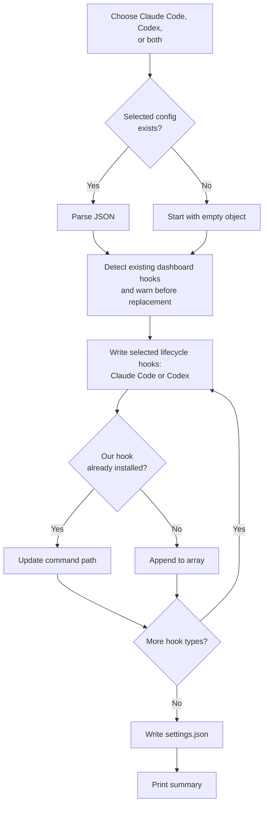

The terminal installer is an arrow-key multi-select (Space toggles, Enter confirms) with Claude Code selected initially; the Settings modal presents the same choices. It warns before replacing dashboard-owned entries in `~/.claude/settings.json` or `~/.codex/hooks.json`, and preserves every unrelated hook. Codex hook handlers acknowledge quickly and let the incremental rollout ingestor do the durable token/session work in the background.

---

## Import Pipeline

The dashboard ships with a first-class **history importer** that backfills
sessions, agents, events, tokens, and costs from Claude Code JSONL
transcripts. Live hook ingestion and manual import share the exact same
parser (`parseSessionFile` + `importSession` in `scripts/import-history.js`),
which is the architectural contract that guarantees imported token and cost
values are identical to those captured in real time.

<p align="center">
  
</p>

### Design goals

- **Accuracy by construction** — any code path that creates a session goes
  through a single `importSession` entry point. There is no "import math"
  distinct from "live math."
- **Idempotence** — re-importing the same source must never double-count.
  Session IDs are the dedup key; compaction `baseline_*` columns preserve
  pre-compaction token totals so re-ingesting a compacted transcript never
  shrinks historical cost.
- **Source flexibility** — users bring history from the default location,
  any folder, or a drag-dropped archive. A single generalized walker feeds
  the parser regardless of the source.
- **Safety** — archive extraction enforces path containment and an extraction
  size cap (zip/tar/gzip-bomb defense), and every request has its own
  staging directory reclaimed on both success and error paths.

### Component overview

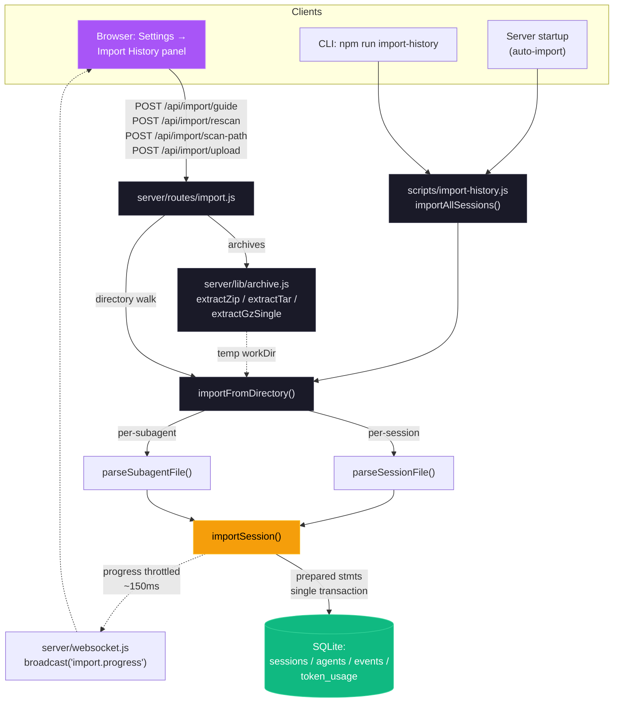

**Continuous background sync.** The startup auto-import
(`autoImportLegacySessions`) is a **one-time** backfill, marker-gated by
`.legacy-import.done` — so a project folder that appears *after* first launch,
and whose sessions never flow through hooks (e.g. a checkout run with host-only
hooks disabled), would otherwise stay invisible until a manual rescan. To close
that gap, `startSessionSync` (`server/index.js`) keeps `~/.claude/projects` in
sync through three triggers that share one `mtimeCache` and a single coalesced
sweep, the exported `syncDefaultProjects(dbModule, { mtimeCache })`:

1. **Immediate** — one sweep at startup, so a project the marker-gated backfill
   missed surfaces right away rather than after the first interval.
2. **Watcher** — a debounced `fs.watch` on the projects tree fires a sweep the
   instant a *new* session file or project folder appears (near-real-time, no
   poll wait). Events for files already in `mtimeCache` — active transcripts
   being appended to — are ignored, so a busy session never thrashes the
   importer. Recursive watching is used only on macOS/Windows (native, stable);
   on Linux, where Node's userland recursive watcher trips on the high-churn
   projects tree (same hazard `lib/cc-watcher.js` avoids), the root plus each
   immediate child folder are watched non-recursively instead.
3. **Poll** — a periodic safety-net sweep (watchers can miss events / not fire
   on network filesystems), tunable via `DASHBOARD_SESSION_SYNC_MS` (default
   30 s); `0` disables the poll but leaves the watcher running.

Each sweep re-parses **only** files whose mtime is new or has advanced (the
common "nothing changed" tick is just a handful of `stat` calls), funnels them
through the same `parseSessionFile` + `importSession` pipeline as every other
path, and broadcasts `session_created` for newly imported sessions /
`session_updated` for grown ones — the same events hooks emit, so the UI
refreshes live. All timers and watchers are `unref`'d and best-effort; nothing
here blocks shutdown or can take down the server.

### Upload request sequence

The upload path is the most complex of the three — it must accept multipart
data, extract archives safely, stage them on disk, then invoke the shared
importer. The sequence below captures the complete request/response path
including the failure modes explicitly guarded against.

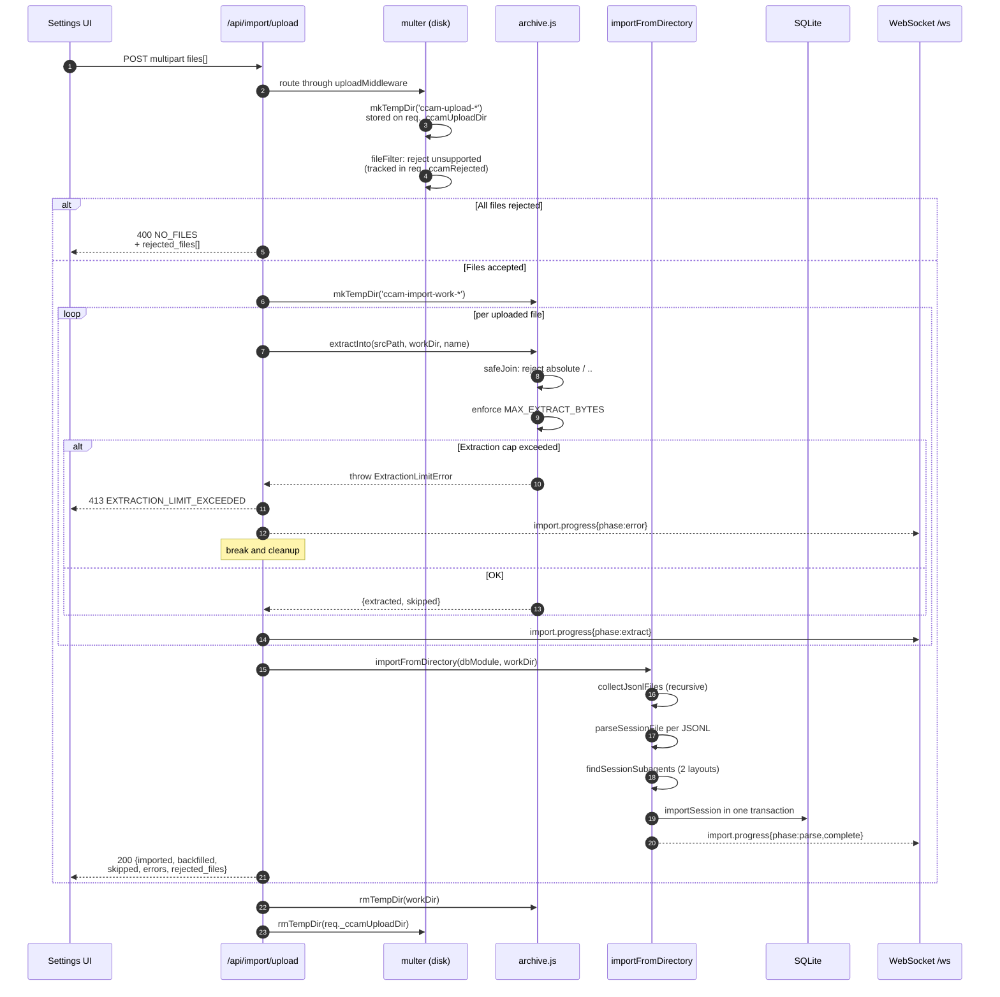

### Idempotence and cost accuracy

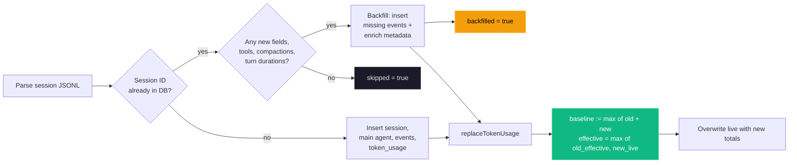

The `baseline_*` columns keep the effective total (`live + baseline`) a
**monotonic high-water mark**: the cost endpoint sums `input_tokens +
baseline_input` (and the matching `output`, `cache_read`, `cache_write`
pairs), and `replaceTokenUsage` sets `baseline := max(old_live +
old_baseline − new_live, 0)` so `effective = max(old_effective, new_live)`.
This never decreases (a compaction that shrinks the transcript keeps its
pre-compaction usage) and — crucially — never inflates past the largest
value ever seen. The earlier formula added the current value into baseline
on _any_ decrease, which two writers of different scope (the live hook
writer stores main-only tokens; `importSession` stores main+subagents)
could ratchet upward on every downward fluctuation — one 26-day session
accumulated a baseline ~11× its real usage before this was fixed.

### Per-message usage reconciliation

Claude Code writes **one JSONL record per content block**, so a single API
response (one `message.id`) appears as several records that each carry a copy
of that message's `usage`. Both ingestion paths originally accumulated every
record, which inflated token totals and costs **2–4×** (issue #293).

The copies are also not identical: streaming writes **partial usage first**
(e.g. `output_tokens: 5`) and the complete figure on the final record
(`output_tokens: 742`), so a first-record-wins dedup would *undercount*
instead. **The last record for a `message.id` is authoritative.**

Both parsers therefore reconcile rather than dedup. Each keeps a
`message.id → counted contribution` map; when a later record for the same id
arrives, the earlier contribution is retracted with `subtractBucket` and the
new one counted in its place:

- `server/lib/transcript-cache.js` (live path) seeds the map from the cached
  result across incremental read boundaries, so a message whose records
  straddle a read still reconciles. The retraction can leave a bucket
  transiently negative in the incremental chunk; `_merge` nets it out against
  the cached totals.
- `scripts/import-history.js` (`parseSessionFile`, `parseSubagentFile`) runs
  the same reconciliation over a single full pass.

The map is a **bounded tail window** in every path
(`rememberUsageContribution` in `server/lib/token-usage.js`, default 1000
entries; the cache path uses `TRANSCRIPT_CACHE_MAX_ARRAY_LEN`), since a
message's records are written adjacently — so a multi-hundred-MiB transcript
cannot grow it without limit. Records with no `message.id` are counted
unconditionally, and per-record content-block processing (thinking counts,
`tool_use` extraction) is deliberately unchanged, because each record carries
a *distinct* block even when the usage copy is repeated.

#### Repairing an already-inflated database

The parser fix alone cannot heal historical rows: `replaceTokenUsage` is a
high-water mark, so a corrected (lower) re-read just migrates the over-count
into `baseline_*`. Every session that predates the upgrade would keep its
inflated cost forever while new sessions price correctly — so the dashboard
runs the repair **for the user**, once per database, rather than leaving it to
a CLI flag nobody will find.

`repairInflatedTokenTotals()` (in `server/index.js`, started from
`startBackgroundServices`) is gated by a `.token-repair-v1.done` marker written
next to the database only after a completed pass, so a crash mid-repair retries
instead of being skipped. It is deferred off the boot path so a large corpus
never delays the UI, skipped (without consuming the marker) while
`peersSharingDataDir()` reports another dashboard on the same database, and
disabled entirely by `DASHBOARD_TOKEN_REPAIR=0`. Because the sweep clears and
rewrites rows, it first copies the table to `token_usage_pre_repair` — one
snapshot kept so the pre-repair numbers stay recoverable with plain SQL; it is
safe to drop.

A hook landing mid-repair can lose a single write, since the sweep parses
outside its transaction. That self-heals: with baselines zeroed, the next event
for that session re-parses the whole transcript and `replaceTokenUsage` writes
the true total.

The same sweep is available manually — for a re-run, or after restoring a
backup:

```bash
npm run repair-tokens
# = node scripts/import-history.js --reconcile-tokens --all --reset-baselines
```

- `--all` widens the sweep from `imported`-marked sessions to every **Claude**
  session with a transcript on disk (live-ingested rows carry no marker).
- A session's transcript is located by scanning `~/.claude/projects/` for the
  default `<proj>/<sid>.jsonl` layout, falling back to the `transcript_path`
  persisted on the session row. The fallback matters: without it, every Claude
  session whose transcript lives outside the default tree — imported from a
  custom directory via `ccam import path`, or under a non-default
  `CLAUDE_HOME` — would be silently skipped despite having a transcript.
- **Codex sessions are excluded outright.** Their `token_usage` is derived from
  rollout journals via `upsertCodexTokenDelta`, never from a Claude JSONL
  transcript, so feeding one to `parseSessionFile` would yield a bogus
  derivation — and because the reset mode clears a session's rows before
  writing, including them would *delete* real Codex usage. They were previously
  excluded only by accident (their transcripts sit outside `~/.claude/projects/`,
  so the directory scan never matched them); resolving `transcript_path` removes
  that accident, hence the explicit `provider = 'claude'` filter.
- `--reset-baselines` clears each session's non-workflow `token_usage` rows
  before writing, so stale buckets whose (model, speed, geo, tier) key no
  longer occurs in the corrected derivation cannot survive — an empty
  corrected derivation still clears. Workflow rows (`service_tier =
  'workflow'`) come from run journals rather than transcripts and are
  preserved.
- The command **refuses to run while a dashboard answers on a known port**:
  transcripts are parsed outside the write transaction, so live hook
  ingestion would race the repair and clobber it with a stale reading. It
  also rejects `--dry-run` rather than silently ignoring it.

Two limitations are deliberate. Sessions whose transcript has been deleted (or
whose stored `transcript_path` is stale) are skipped and counted in
`missingFiles` — their totals cannot be re-derived, and dropping them would
destroy real usage. And if a message's partial and final records ever land in
*different* pricing buckets, the live writer's high-water fold preserves the
partial (bounded by one record per drifted message); re-running the repair
clears whatever accumulates.

### Supported source layouts

| Layout                                          | Example                                      | Handling                                                                |
| ----------------------------------------------- | -------------------------------------------- | ----------------------------------------------------------------------- |
| Default Claude Code                             | `<proj>/<sid>.jsonl`                         | Session transcript                                                      |
| Default subagent                                | `<proj>/<sid>/subagents/agent-*.jsonl`       | Paired with parent on discovery                                         |
| Alternative subagent                            | `<proj>/subagents/<sid>/agent-*.jsonl`       | Paired with parent on discovery                                         |
| Workflow inner-agent (nested)                   | `<proj>/<sid>/subagents/workflows/<runId>/agent-*.jsonl` | Summarized by Workflow-run ingest; transcript resolved on read + preserved in the durable snapshot |
| Orphan subagent (no parent JSONL in source)     | `<proj>/subagents/<sid>/agent-*.jsonl`       | `importFromDirectory` probes both candidates; attaches if `sid` exists  |
| Flat JSONL drop                                 | `<root>/<sid>.jsonl`                         | Recognized as a loose session                                           |
| Archives (`.zip`, `.tar`, `.tar.gz`, `.tgz`)    | any of the above nested inside               | Extracted into a per-request temp dir, then walked by the same importer |
| Single-file gzip                                | `any.jsonl.gz`                               | Gunzipped in streaming mode with size cap                               |

### Safety model

| Threat                                      | Mitigation                                                                                           |
| ------------------------------------------- | ---------------------------------------------------------------------------------------------------- |
| Path traversal via archive entries          | `archive.safeJoin` resolves under the extraction root; any `..` or absolute path returns `null`      |
| Zip / tar / gzip bombs                      | `MAX_EXTRACT_BYTES` (default 4 GB) enforced by running byte counter; aborts with `ExtractionLimitError` |
| Per-file upload size abuse                  | multer `limits.fileSize = MAX_UPLOAD_BYTES` (default 1 GB)                                           |
| Too many files per request                  | multer `limits.files = MAX_UPLOAD_FILES` (default 2000)                                              |
| Unsupported file types                      | `fileFilter` drops them early and reports them in `rejected_files[]`                                 |
| Concurrent upload temp-dir collisions       | Per-request temp dir on `req._ccamUploadDir`; created in multer `destination`, cleaned in `finally`  |
| Arbitrary absolute path on `scan-path`      | Validated: must be absolute (after `~` expansion), exist, and be a directory                         |
| Relative / traversal paths on `scan-path`   | Rejected with `INVALID_INPUT`                                                                        |

### Environment variables

| Variable                          | Default     | Purpose                                                           |
| --------------------------------- | ----------- | ----------------------------------------------------------------- |
| `CCAM_IMPORT_MAX_BYTES`           | 1 GB        | Maximum size per uploaded file                                    |
| `CCAM_IMPORT_MAX_FILES`           | 2000        | Maximum files per upload request                                  |
| `CCAM_IMPORT_MAX_EXTRACT_BYTES`   | 4 GB        | Ceiling on total uncompressed bytes from any single archive       |

### WebSocket progress events

Every import emits `import.progress` messages on `/ws`. Messages are
throttled to at most one every ~150 ms to avoid flooding the channel on
multi-thousand-session imports; the terminal `complete` and `error` frames
are never throttled.

```json
{
  "type": "import.progress",
  "timestamp": "2026-04-18T15:48:34.123Z",
  "data": {
    "importId": "upload-1729264114000",
    "phase": "parse",
    "source": "upload",
    "processed": 184,
    "total": 512,
    "current": "/tmp/ccam-import-work-xyz/project/<uuid>.jsonl",
    "counters": { "imported": 120, "backfilled": 40, "skipped": 20, "errors": 4 }
  }
}
```

Phases: `start` → `scan` → `extract` (upload only) → `parse` →
`complete`, with `error` / `extract_error` replacing `complete` on failure.

---

## Workflow-Tool Run Ingestion

"Dynamic workflows" — the fleets of sub-agents spawned by the Claude Code
`Workflow` tool (and self-paced `/loop` runs) — are **invisible to hooks**.
Inner `agent()` calls emit no `PreToolUse`/`SubagentStop` events, so hook-based
ingestion can never see the fleet. Instead, everything is persisted on disk
under the launching session's transcript folder:

```
<projects>/<enc-cwd>/<sessionId>/
  workflows/
    scripts/<name>-wf_<runId>.js          # the workflow script — written at LAUNCH
    wf_<runId>.json                       # the run journal — written at COMPLETION
  subagents/
    workflows/<runId>/agent-<agentId>.jsonl  # inner-agent transcript (current builds — NESTED per run)
    agent-<agentId>.jsonl                    # flat layout — older builds / regular sub-agents
```

The run journal (`wf_<runId>.json`) is the first-class record: identity
(`runId`, `taskId`, `workflowName`), lifecycle (`status`, `startTime`,
`durationMs`, `defaultModel`), aggregates (`agentCount`, `totalTokens`,
`totalToolCalls`), `phases[]`, and `workflowProgress[]` — one entry per inner
agent with `agentId`, `agentType`, `model`, `state`, `label`, `phaseTitle`,
tokens, tool calls, duration, and previews. Critically,
`workflowProgress[].agentId` is the **exact** `agent-<agentId>.jsonl` basename,
so the workflow → inner-agent linkage is explicit. Current Claude Code builds
write that transcript **nested** under `subagents/workflows/<runId>/`; older
builds (and all regular sub-agents) write it **flat** under `subagents/`. Both
layouts are resolved on read — see "Reading full agent text in the UI" below.

### The terminal-journal constraint

`wf_<runId>.json` is written **only when the workflow finishes**. While a run
is in flight, its live state lives in a per-run dir
`subagents/workflows/<runId>/`: a streaming `journal.jsonl` (a `started` /
`result` event per inner agent) and the growing `agent-<id>.jsonl` transcripts.
The ingester handles both phases:

- **Completed runs** are ingested in full from the terminal journal: a
  `workflows` row (keyed by `run_id`) plus linked inner-agent rows, with phases
  and per-agent labels.
- **Running runs** (no terminal journal yet) are ingested **live** by
  `ingestLiveWorkflow`: it reads `journal.jsonl` for each agent's started/done
  state + result, and parses the live `agent-<id>.jsonl` transcripts (via
  `parseSubagentFile`) for real-time per-agent tokens, tool calls, duration, and
  model. It synthesizes a `progress[]` so the UI shows live activity
  (phase/label aren't known until the terminal journal lands). The run is
  `status: running` and **replaced by the terminal journal on completion**
  (idempotent upsert by `run_id`; launch time preserved). A launch script with
  no run dir yet falls back to a minimal `running` row.

### Ingestion module and triggers

`server/lib/workflow-ingest.js` (`ingestWorkflowsForSession`) reuses the
import pipeline's `parseSubagentFile` and `importSubagentFromJsonl`, so inner
agents become agent rows under the **same** `${sessionId}-jsonl-<agentId>` id
scheme the subagent importer already uses — ingestion therefore **converges**
with any prior subagent import (no duplicate rows). Each inner agent is stamped
with `agents.workflow_run_id` + `agents.workflow_phase`. The per-agent table in
the UI is read from the journal's `progress[]` JSON.

**Cost folding.** Inner agents are sidechain contexts whose token usage is NOT
in the parent transcript (the same reason `combineSessionTokens` *adds*
subagent tokens). So the fleet's real token split — parsed from each
`agent-<id>.jsonl` — is written into the session's `token_usage` under a
namespaced `service_tier = 'workflow'` bucket. That bucket is isolated from the
main-transcript writer's rows (which use the real tier), so the two never
collide or clobber, while `calculateCost` still sums them per model. The write
is a full recompute each ingest → `replaceTokenUsage`'s replace semantics make
it idempotent (no double-count across re-ingests).

Ingestion runs from five fail-safe, off-the-response-path triggers:

1. **Live** — `routes/hooks.js`, on `Stop` / `SubagentStop` / `SessionEnd`
   (the lifecycle hooks that bracket a workflow finishing).
2. **Real-time poll** — `startWorkflowPoll` (`server/index.js`) scans active
   sessions every ~12 s, skipping any whose workflow artifacts are unchanged.
   The newest-mtime fingerprint (`workflowsMaxMtime`) includes the **live**
   `journal.jsonl` + `agent-*.jsonl` of any in-flight run (bounded to runs
   without a terminal journal), so the poll re-ingests as a running workflow's
   tokens/tools/agents grow — the UI updates live without waiting for a hook or
   completion. Tunable via `DASHBOARD_WORKFLOW_POLL_MS` (0 disables).
3. **Periodic** — the `server/index.js` maintenance sweep, scanning active
   sessions' `workflows/` directories (flips `running` → `completed` when a
   journal lands without a subsequent hook).
4. **Backfill** — a one-time pass in `autoImportLegacySessions` ingests
   historical on-disk workflows for every recorded session.
5. **Offline CLI import** — the batch importer (`importAllSessions` /
   `importFromDirectory` in `scripts/import-history.js`, backing `ccam import
   rescan` / `ccam import path` and the `/api/import/*` routes) calls
   `ingestWorkflowsForSession` per imported session, **after** the batch's
   transcripts land and **outside** the SQLite transaction (the ingest is
   async). Triggers 1–3 all run inside the server; this is the only path that
   links a fleet whose journal never reached a live server — a headless `claude
   -p` run, a CI job, or an HPC/cluster compute node emits no hooks — so an
   offline rescan links the inner agents instead of leaving them orphaned
   (`workflow_run_id = NULL`, run stuck at 1 agent). Idempotent: converges on the
   same `${sessionId}-jsonl-<agentId>` rows, cheap for sessions with no workflow
   artifacts (early return).

Each ingest that changes anything broadcasts `workflow_upserted` and a
`session_updated` (so the cost views refetch) over WebSocket. Runs surface via
`GET /api/workflows/runs` (list) and `GET /api/workflows/runs/:runId` (detail
with linked agents + events), and are attached to the launching session via the
`workflows[]` field on `GET /api/sessions/:id`. The UI shows them in a
"Workflow Runs" panel on the Workflows page and a subsection on Session Detail.

### Reading full agent text in the UI

The run journal only carries **truncated** `promptPreview` / `resultPreview`
strings (Claude Code truncates them with a trailing `…`), so the panel alone can
never show an inner agent's complete prompt or result. The full text lives in the
per-agent `agent-<agentId>.jsonl` transcript, which the dashboard surfaces
on demand:

- **Dual-layout resolution.** `server/lib/claude-home.js` exposes
  `resolveAgentTranscriptInDir(subagentsDir, agentId, runId?)`, used by all three
  sub-agent path resolvers (`getSubagentTranscriptPath`,
  `findSubagentTranscriptPath`, `getSnapshotSubagentTranscriptPath`). It checks
  the **flat** path first (so regular sub-agents resolve exactly as before), then
  the **nested** `workflows/<runId>/` path. When `runId` is known the run dir is
  read directly; when it is unknown the nested tree is scanned and a match is
  returned only if **exactly one** run contains that `agentId` — an ambiguous id
  across runs resolves to `null` rather than guessing.
- **`run_id` query param.** `GET /api/sessions/:id/transcript` accepts an
  optional `run_id=wf_<…>` alongside `agent_id`, threaded into the resolver chain
  so a workflow inner agent's nested transcript is found deterministically. The
  endpoint shape is unchanged; the param is additive.
- **Lazy fetch on expand.** The Workflow Runs panel
  (`client/src/components/workflows/WorkflowRunsPanel.tsx`) fetches the transcript
  the first time a result row is expanded (deduped per `${run_id}::${agentId}`),
  derives prompt + result via `extractPromptResult`, and renders the full text —
  falling back to the journal teaser while loading, on error, or for schema-mode
  agents whose final turn is a tool call rather than text. Nothing is eagerly
  ingested into the DB. "Full text" means the complete message body up to the
  endpoint's per-message 10,240-char cap (`limit` ≤ 200 messages).
- **Durable snapshot.** The snapshot writer (`snapshotTranscript` in
  `scripts/import-history.js`) preserves nested workflow transcripts via the
  dedicated `findSessionWorkflowSubagents` discovery — mirroring the live
  `subagents/workflows/<runId>/` subpath into the snapshot dir — so the full text
  still resolves after Claude Code prunes the live files under its
  `cleanupPeriodDays` retention. This is kept **separate** from
  `findSessionSubagents` (flat sub-agents) so the regular sub-agent import path is
  unchanged and nested inner-agents are never double-counted.

### Schema

A `workflows` table (`run_id` PK, `session_id` FK `ON DELETE CASCADE`, status
as an open string, `phases`/`progress` as JSON blobs, `source` = `journal` |
`live`) plus two additive `agents` columns (`workflow_run_id`,
`workflow_phase`). No existing table, response shape, or WebSocket message type
changes.

---

## Agent Extension Layer

CCAM uses one shared extension source tree with product-specific manifests:

- Claude Code project guidance: `CLAUDE.md`, `.claude/rules/`, `.claude/skills/`, `.claude/agents/`
- Codex project guidance: `AGENTS.md`, `.codex/config.toml`, `.codex/rules/`, `.codex/agents/`, `.codex/skills/`
- Shared plugins: `plugins/<name>/`
- Claude marketplace: `.claude-plugin/marketplace.json`
- Codex marketplace: `.agents/plugins/marketplace.json`
- Open Agent Skills metadata: `plugins/*/skills/*/SKILL.md` plus `agents/openai.yaml`

```mermaid
graph TD
    USER["Developer"] --> CLAUDE["Claude Code"]
    USER --> CODEX["Codex"]
    USER --> SKILLS["skills CLI / skills.sh"]
    SOURCE["plugins/<name>/"] --> CM[".claude-plugin/plugin.json"]
    SOURCE --> XM[".codex-plugin/plugin.json"]
    SOURCE --> S["skills/*/SKILL.md + agents/openai.yaml"]
    CM --> CLAUDE
    XM --> CODEX
    S --> CLAUDE
    S --> CODEX
    S --> SKILLS
```

The verified distribution contains **14 plugins, 66 bundled plugin skills, 18 Claude subagents, 34 Claude commands, 3 CLI helpers, 3 hook configurations, and 2 MCP-enabled plugins**. `npx skills add hoangsonww/Claude-Code-Agent-Monitor --list` discovers **76 total repository skills** because repository-maintenance skills are included alongside plugin skills.

Three focused packs extend the original analytics and governance catalog:

- `ccam-runner`: monitored Claude Code/Codex launch, follow-up, stop, resume, and persistent run history
- `ccam-integrations`: alert rules, webhook providers, browser push, and SSH remote collection
- `ccam-platform`: Claude/Codex Config Explorer, history import, backup restore, hook setup, updates, and MCP operations
- `ccam-reports`: executive, cost, reliability, and workflow reporting

`node scripts/sync-agent-extensions.js` deterministically adds missing skill names, writes `agents/openai.yaml`, generates Codex manifests, and rebuilds both catalogs. `scripts/validate-agent-extensions.js` and `server/__tests__/plugins-marketplace.test.js` enforce the Claude/Codex marketplace bijection, dual manifests, skill metadata, agent/command frontmatter, hook JSON, and stable MCP launcher.

Claude Code and Codex install from the same Git repository:

```bash
claude plugin marketplace add hoangsonww/Claude-Code-Agent-Monitor
codex plugin marketplace add hoangsonww/Claude-Code-Agent-Monitor
```

Skills install directly from the public repository. No upstream skills.sh PR is required. Public OpenAI universal-directory inclusion remains a separate reviewed submission and is not performed by repository code.

---

## Plugin Marketplace

Each plugin uses this cross-agent structure:

```text
plugins/<name>/
├── .claude-plugin/plugin.json
├── .codex-plugin/plugin.json
├── skills/<skill>/
│   ├── SKILL.md
│   └── agents/openai.yaml
├── agents/*.md
├── commands/*.md
├── hooks/hooks.json
├── bin/*
└── .mcp.json
```

`ccam-dashboard` and `ccam-platform` use `{ "command": "ccam", "args": ["mcp", "stdio"] }`. The launcher resolves `mcp/build/index.js` from the linked checkout, avoiding plugin-cache-relative paths. `npm run setup` now installs/builds MCP before linking `ccam`.

The canonical catalog and install/validation procedures live in [`docs/PLUGINS.md`](docs/PLUGINS.md).

---

## MCP Integration

The MCP server exposes **97 typed tools across 16 domain modules**. It covers every supported action exposed by the app, including scoped data queries, transcript images, Claude and GPT pricing, workflow runs, alerts, webhook delivery, multipart history import, backup restore, Claude/Codex config, Run Agent, remote collection, homes/hooks/updates, push notifications, and maintenance.

```mermaid
flowchart LR
    HOST["Claude Code / Codex / MCP host"] -->|stdio or HTTP| MCP["CCAM MCP server"]
    HUMAN["Operator"] -->|REPL| MCP
    MCP --> CATALOG["Canonical registerAllTools catalog"]
    CATALOG --> API["Dashboard /api/*"]
    API --> DB[(SQLite)]
```

Protocol transports and REPL no longer maintain separate tool implementations. Domain modules receive either a live MCP registrar or a collector registrar, and both run the same Zod schemas and policy guards. This makes tool-count and behavior parity structural rather than documentation-only.

### Tool domains

1. observability
2. sessions
3. session detail and transcripts
4. agents
5. events and hooks
6. Claude/GPT pricing and cost
7. workflows
8. alerts
9. webhooks
10. imports and portability
11. Claude/Codex config
12. Run Agent
13. remote sources
14. settings and updates
15. browser push
16. maintenance

### Safety and transport

- Dashboard targets are limited to direct loopback and approved container-host aliases.
- `MCP_DASHBOARD_API_TOKEN` / `MCP_DASHBOARD_API_TOKEN_FILE` authenticates the MCP service to dashboards protected by `DASHBOARD_TOKEN`.
- `MCP_HTTP_AUTH_TOKEN` / `MCP_HTTP_AUTH_TOKEN_FILE` independently protects HTTP/SSE MCP clients; `/health` remains available to probes.
- Tokenized direct loopback HTTP is allowed because traffic stays on the machine. Tokenized container-host aliases require HTTPS.
- A stdio server self-terminates when its host process disappears — stdin reaching end/close, or the process being re-parented away from the parent it started under (polled every 5s, compared against the startup ppid rather than PID 1 so an init-parented container launch is not a false positive). A host that dies without `SIGTERM`/`SIGINT` therefore leaves no orphan.
- HTTP/SSE sessions are tracked under the id returned to the client, released on `DELETE /mcp` or SSE disconnect, and swept once idle past `MCP_HTTP_SESSION_TIMEOUT_MS` (default 30 minutes, `0` disables) because terminating a session is optional in the protocol. `GET /health` reports the live count as `activeSessions`.
- Every MCP dashboard request rejects redirects.
- History uploads are capped at 50 MiB per file and 100 MiB total per call. Binary responses are streamed with a 10 MiB cap. Backup restore accepts one file up to 25 MiB.
- Only GET requests retry automatically.
- Reads are enabled by default.
- Writes require `MCP_DASHBOARD_ALLOW_MUTATIONS=true`.
- Full data clearing also requires `MCP_DASHBOARD_ALLOW_DESTRUCTIVE=true` and `CLEAR_ALL_DATA`.
- The destructive tool call must pass `confirmation_token = "CLEAR_ALL_DATA"`.
- Remote-source purge uses its own `PURGE_REMOTE_SOURCE_DATA` confirmation token.
- Webhook tests, push sends, imports, syncs, and Run Agent operations are treated as mutations.
- Stdio logs remain on stderr.

Transport commands are `ccam mcp stdio`, `ccam mcp http`, and `ccam mcp repl`. The full catalog and host configuration are in [`mcp/README.md`](mcp/README.md).

---

## State Management

### Client-Side Architecture

The client uses a deliberately simple state management approach:

```mermaid
graph TD
    subgraph "Data Sources"
        REST["REST API<br/>(initial load + refresh)"]
        WSM["WebSocket Messages<br/>(real-time updates)"]
        LS["localStorage<br/>(notification prefs)"]
        LS2["localStorage<br/>(sound prefs:<br/>agent-monitor-sound)"]
    end

    subgraph "Distribution"
        EB["eventBus<br/>(Set-based pub/sub)"]
    end

    subgraph "App-Level Hooks"
        NOTIF_H["useNotifications<br/>reads prefs, fires<br/>browser notifications"]
        TABBY_H["useTabbyBrain<br/>derives cat mood +<br/>speech from WS stream"]
        SOUND_H["useSoundCues<br/>maps WS messages to<br/>synthesized audio cues"]
    end

    subgraph "Page State"
        US1["useState<br/>Dashboard"]
        US2["useState<br/>KanbanBoard"]
        US3["useState<br/>Sessions"]
        US4["useState<br/>SessionDetail"]
        US5["useState<br/>ActivityFeed"]
        US6["useState<br/>Analytics"]
        US8["useState<br/>Workflows"]
        US7["useState<br/>Settings"]
    end

    REST --> US1 & US2 & US3 & US4 & US5 & US6 & US8 & US7
    WSM --> EB
    EB --> US1 & US2 & US3 & US4 & US5 & US6 & US8 & US7
    EB --> NOTIF_H
    EB --> TABBY_H
    EB --> SOUND_H
    LS --> NOTIF_H
    LS --> TABBY_H
    LS --> US7
    LS2 --> SOUND_H
```

**Why no Redux / Zustand / Context:**

- Each page owns its data and lifecycle
- No cross-page state sharing needed (notification prefs use `localStorage` as the shared store; the one small global store is `lib/dataScope.ts`, which holds the app-wide **data scope** — sources and selected providers — and appends `?sources=` / `?providers=` to the data queries)
- WebSocket events trigger reload or append, not complex state merging
- Simpler mental model, fewer abstraction layers, easier to debug

### Event Bus

The `eventBus` is a Set-based pub/sub with `subscribe()` returning an unsubscribe function. It also tracks WebSocket connection state, exposing `connected` (boolean getter), `setConnected(value)`, and `onConnection(handler)` so any component can subscribe to connection status changes.

```typescript
// Subscribe to messages in useEffect, unsubscribe on cleanup
useEffect(() => {
  return eventBus.subscribe((msg) => {
    if (msg.type === "agent_updated") load();
  });
}, [load]);

// Read connection state reactively (e.g. with useSyncExternalStore)
const wsConnected = useSyncExternalStore(eventBus.onConnection, () => eventBus.connected);
```

This pattern ensures:

- No memory leaks (cleanup on unmount)
- No stale closures (subscribe with latest callback ref)
- Only active pages receive messages
- Connection state is available to any component without prop drilling

---

## Browser Notification System

The dashboard implements a robust notification system using the Web Push API (VAPID) and Service Workers, allowing for reliable delivery even when the browser is backgrounded or closed.

### Notification Architecture

```mermaid
graph TD
    subgraph "Server Side"
        API_P["Push API<br/>(/api/push/*)"]
        WP["web-push lib<br/>(VAPID)"]
        DB_P["push_subscriptions<br/>table"]
        KEYS["vapid-keys.json<br/>(persisted)"]
    end

    subgraph "Client Side"
        SW["Service Worker<br/>(sw.js)"]
        PUSH["useNotifications hook<br/>(subscribes via SW)"]
        PREFS["localStorage<br/>(event preferences)"]
        BROWSER["Browser Push Service<br/>(FCM/Mozilla/Safari)"]
    end

    API_P --> WP
    WP -->|signed push| BROWSER
    BROWSER --> SW
    SW -->|showNotification| USER["Developer"]
    PUSH -->|subscribe| SW
    PUSH -->|POST /subscribe| API_P
    API_P --> DB_P
    WP -->|read keys| KEYS

    style SW fill:#f59e0b,stroke:#fbbf24,color:#000
    style BROWSER fill:#10b981,stroke:#34d399,color:#fff
```

### Key Components

| Component | Responsibility |
| --- | --- |
| **VAPID Pipeline** | Uses the `web-push` library on the server. VAPID keys are auto-generated on first run and persisted to `data/vapid-keys.json` to ensure subscription continuity. |
| **Service Worker** | Located at `client/public/sw.js`. It runs independently of the dashboard tab, listening for `push` events from the browser's push service. It handles `notificationclick` to focus/open the dashboard. |
| **macOS Audio Support** | Notifications are explicitly sent with `silent: false` and `sound: "default"`. This overrides macOS behavior that would otherwise suppress audio for web notifications. |
| **Subscription Management** | The dashboard registers the service worker and requests a `PushSubscription`. This subscription (endpoint and keys) is stored in the `push_subscriptions` table, indexed by endpoint. |
| **Event Routing** | When a WebSocket event (e.g., `session_created`) is broadcast, the server also triggers `sendPushToAll()`, which iterates through active subscriptions and sends signed VAPID payloads. |

### Notification Flow

```mermaid
flowchart TD
    EVENT["Server Event<br/>(e.g. SessionStart)"] --> PREFS{"User Prefs<br/>Enabled?"}
    PREFS -->|No| SKIP[Skip]
    PREFS -->|Yes| SUBS["Fetch all subscriptions<br/>from DB"]
    SUBS --> LOOP["For each subscription:"]
    LOOP --> SEND["webpush.sendNotification()"]
    SEND --> BROWSER["Browser Push Service"]
    BROWSER --> SW["Service Worker"]
    SW --> SHOW["showNotification(title, body)<br/>silent: false"]

    style SHOW fill:#10b981,stroke:#34d399,color:#fff
```

### Preference Storage

Notification preferences remain in `localStorage` (`agent-monitor-notifications`) for UI-side filtering, while the actual push delivery is managed by the server-side subscription store.

| Preference | UI Key | Logic |
| --- | --- | --- |
| Master Toggle | `enabled` | Controls whether the subscription is active |
| New Session | `onNewSession` | Filtered during push fan-out |
| Session Error | `onSessionError` | Filtered during push fan-out |
| Session Complete | `onSessionComplete` | Filtered during push fan-out |
| Subagent Spawn | `onSubagentSpawn` | Filtered during push fan-out |

### Service Worker Caching

The dashboard's Service Worker (`client/public/sw.js`) serves dual purposes: push notification delivery (described above) and runtime caching. The fetch handler is split by URL shape so a rebuild can never leave a user stuck on a stale UI:

- **Cache-first** for `/assets/*` — Vite emits content-hashed filenames, so a given URL is immutable for the lifetime of that build. Cached aggressively for fast warm starts; old entries simply never get re-requested when a new build ships different hashes.
- **Network-first with cache fallback** for everything else (navigations, the SW itself, `manifest.json`, icons, root `/`). The user always gets the freshest UI while online; the cache is only consulted when the network fails.
- **Bypass** for `/api/*`, `/ws`, and Vite HMR (`__vite`) — these are never cached.

Cache versioning is controlled by the `CACHE_NAME` constant (`dashboard-v2`). On activate, any caches whose key doesn't match are deleted, so bumping the version string forces a clean refresh. `skipWaiting()` + `clients.claim()` ensure the new SW takes over immediately.

`client/src/main.tsx` snapshots `navigator.serviceWorker.controller` before registration and listens for `controllerchange`: when a new SW activates on an already-controlled page, it reloads exactly once so the page picks up the new asset URLs without a hard refresh. The first install (no previous controller) does **not** reload.

These behaviors are reinforced by explicit `Cache-Control` headers from the production Express static middleware in `server/index.js`: `immutable, max-age=31536000` for `/assets/*`; `no-cache, must-revalidate` for `index.html`, `sw.js`, and `manifest.json`; a short revalidation window for other static files. The SPA fallback `sendFile` sends the same `no-cache` header. The native desktop shell (macOS and Windows) loads the dashboard from this same in-process server (`NODE_ENV=production`), so it inherits the policy automatically.

---

## Update Notifier Subsystem

The Update Notifier is a **detection-only** subsystem that tells the user when the dashboard's git checkout is behind its tracked upstream branch. It never mutates the checkout or restarts the server — those actions are intentionally left to the user in a terminal, because a process cannot reliably replace itself without an external supervisor.

<p align="center">
  
</p>

### Module Layout

```mermaid
graph TD
    subgraph Server
        LIB["update-check.js<br/>getUpdatesStatus"]
        SCHED["update-scheduler.js<br/>startUpdateScheduler"]
        ROUTE["routes/updates.js<br/>GET status, POST check"]
        WS["websocket.js<br/>broadcast update_status"]
    end

    subgraph Client
        API["lib/api.ts<br/>api.updates"]
        BUS["lib/eventBus.ts<br/>subscribe and publish"]
        MODAL["UpdateNotifier.tsx<br/>dismissedSha in localStorage"]
        SIDEBAR["Sidebar.tsx<br/>Check-for-updates button"]
    end

    SCHED -->|tick every 5 min| LIB
    ROUTE -->|on request| LIB
    SCHED -->|fingerprint changed| WS
    ROUTE -->|on POST check| WS
    WS -->|update_status frame| API
    API -->|mirror to bus| BUS
    WS --> BUS
    BUS --> MODAL
    BUS --> SIDEBAR
    SIDEBAR -->|click| API
    MODAL -->|click| API

    style WS fill:#6366f1,stroke:#818cf8,color:#fff
    style LIB fill:#10b981,stroke:#34d399,color:#fff
```

### Detection Pipeline

```mermaid
sequenceDiagram
    autonumber
    participant Sched as Scheduler
    participant Lib as update-check lib
    participant Git as git
    participant WS as WebSocket broadcast
    participant Client as Modal and Sidebar

    Sched->>Lib: tick
    Lib->>Lib: check .git exists
    alt not a git repo
        Lib-->>Sched: soft payload, git_repo false
    else git repo
        Lib->>Git: git remote, pick upstream then origin
        alt no remotes configured
            Lib-->>Sched: soft payload, no remotes message
        else
            Lib->>Git: git fetch canonical remote, 120s timeout
            alt fetch fails
                Lib-->>Sched: soft payload with fetch_error
            else
                Lib->>Git: rev-parse HEAD and canonical ref
                Lib->>Git: rev-list --count HEAD..ref
                Lib->>Git: read current branch and its tracked upstream
                Lib-->>Sched: full payload with situation and manual_command
            end
        end
    end
    Sched->>Sched: compute fingerprint
    alt fingerprint changed
        Sched->>WS: broadcast update_status
        WS->>Client: WS frame
        Client->>Client: syncFromPayload, render modal or badge
    else unchanged
        Sched->>Sched: skip broadcast
    end
```

### Component Responsibilities

| Component | Responsibility |
| --- | --- |
| **`server/lib/update-check.js`** | Pure function `getUpdatesStatus(root?, { skipFetch? })`. Runs every git call via `execFile` (no shell, 10s–120s timeouts). **Branch- and fork-aware:** prefers `upstream` over `origin` when both exist (standard fork convention), resolves `<remote>/master`/`/main`/`/HEAD`, reads the current branch and its tracked upstream, and shapes `manual_command` per situation: `git pull --ff-only` only when the local branch tracks the canonical ref; `git fetch <remote> && git merge --ff-only <ref>` for forks (local branch name matches canonical but tracks a different remote); `git fetch <remote>` only on a feature branch or detached HEAD. Non-git installs, missing remotes, fetch failures, and unresolvable upstream refs are returned as soft payloads — never throws. Adds `situation`, `situation_note`, `canonical_remote`, `current_branch`, `tracking_upstream`, and `tracks_canonical` to the response. |
| **`server/update-scheduler.js`** | Ticks the lib every `DASHBOARD_UPDATE_CHECK_INTERVAL_MS` (default 300 000, floor 60 000). First tick is scheduled 8s after server start with `.unref()` so it doesn't block shutdown. Broadcasts only when the fingerprint `{update_available, remote_sha, commits_behind, fetch_error, manual_command}` changes — `manual_command` is included so situation transitions (e.g. user switches branches, or adds an `upstream` remote) trigger a re-broadcast even when the SHA and commit count are unchanged. Emits a framed message to stdout on "up-to-date → behind" transitions, and only suggests "restart the dashboard" when the printed command actually rewrites the working tree. `DASHBOARD_UPDATE_CHECK=0\|false\|off` disables the scheduler entirely. |
| **`server/routes/updates.js`** | Two endpoints: `GET /status` (read-only check), `POST /check` (check + broadcast). Mounted under `/api/*`, so they ride the default loopback bind as their trust boundary and are gated by `DASHBOARD_TOKEN` when one is set. There is **no** `POST /apply` route. |
| **`UpdateNotifier.tsx`** | Modal. Hydrates from `api.updates.status()` on mount and mirrors the payload back into the local `eventBus` so the Sidebar can listen without a second git fetch. Subscribes to `update_status` WS frames for ongoing sync. Keeps `dismissedSha` in `localStorage` (`agent-monitor-update-dismissed-sha`) and in React state; a window event `dashboard:reset-update-dismissal` from the Sidebar clears both. ESC / backdrop click dismisses. |
| **`Sidebar.tsx`** | Always-visible "Check for updates" button in the footer. Subscribes to `update_status` (no own fetch). On click: clears dismissed SHA in localStorage, dispatches `dashboard:reset-update-dismissal`, then calls `api.updates.check()`. Visual state: emerald badge when `update_available`, amber when `fetch_error`, neutral otherwise. |

### Payload Shape

```ts
interface UpdateStatusPayload {
  git_repo: boolean;
  update_available: boolean;
  repo_root?: string;
  remote_ref?: string | null;          // "upstream/master" | "origin/main" | ...
  canonical_remote?: string | null;    // "upstream" preferred, else "origin"
  current_branch?: string | null;      // null on detached HEAD
  tracking_upstream?: string | null;   // e.g. "origin/feature/foo", null if no upstream
  tracks_canonical?: boolean;          // true when branch upstream === remote_ref
  situation?:                          // categorical hint for the UI
    | "tracking_canonical"
    | "fork_or_diverged_tracking"
    | "feature_branch"
    | "detached_head";
  situation_note?: string | null;      // human-readable explanation when not tracking_canonical
  local_sha?: string | null;
  remote_sha?: string | null;
  commits_behind?: number;
  manual_command?: string | null;      // shaped for the user's situation
  message?: string | null;
  fetch_error?: string;                // set when git fetch fails
}
```

The same shape is used by `GET /status`, `POST /check`, and the `update_status` WS message.

### Failure Mode Matrix

| Condition | Returned payload | User-visible effect |
| --- | --- | --- |
| Not a git clone | `{git_repo:false, update_available:false, message:"Install directory is not a git clone..."}` | Modal suppressed (`update_available` false). Sidebar stays neutral. |
| No remotes configured | `{git_repo:true, update_available:false, message:"No git remotes configured..."}` | Same as above. |
| `git fetch` failed (offline, auth) | `{git_repo:true, update_available:false, canonical_remote, fetch_error:"<stderr>"}` | Sidebar button goes amber; modal stays suppressed until a successful check. |
| Canonical default branch unresolvable | `{git_repo:true, update_available:false, canonical_remote, message:"Could not resolve <remote>/master..."}` | Modal suppressed. |
| Healthy, up to date | `{git_repo:true, update_available:false, commits_behind:0, situation:"tracking_canonical"\|...}` | Sidebar neutral, modal suppressed. |
| Healthy, behind, on canonical branch | `{update_available:true, situation:"tracking_canonical", manual_command:"...git pull --ff-only..."}` | Modal opens with `git pull` flow + restart hint. |
| Healthy, behind, fork (origin = fork, upstream = canonical) | `{update_available:true, situation:"fork_or_diverged_tracking", manual_command:"...git fetch upstream && git merge --ff-only upstream/master..."}` | Modal opens with merge flow + restart hint + `situation_note` explaining the divergence. |
| Healthy, behind, on a feature branch | `{update_available:true, situation:"feature_branch", manual_command:"...git fetch <remote>"}` | Modal opens; `situation_note` explains the user is off the canonical branch; restart hint suppressed because the working tree isn't being changed. |

### Why Detection-Only

The dashboard does not expose an apply/restart endpoint by design. A process cannot reliably replace itself without an external supervisor, and several real constraints make an in-process self-update path strictly worse than letting the user run two commands in a terminal:

- **Supervisor ambiguity.** `npm run dev` (concurrently), `npm start`, `pm2`, `systemd`, `launchd`, and Docker each need different restart logic; an in-process helper could only encode one of them and would silently mis-restart the rest.
- **Silent failures.** `npm install` / `npm run build` / port-release timing issues surface as a dead server with no user-facing feedback once the original process has exited.
- **No rollback.** A partial pull + install leaves a broken checkout with no atomic recovery — the working tree is mutated mid-flight.
- **Branch coverage.** Even with the situation-aware `manual_command` produced by the detection layer, an automatic apply would still need branch-aware integration (rebase vs merge vs switch) and merge-conflict handling. That belongs in the user's shell, not in a background daemon.

The detection layer carries all of the signal value: the dashboard tells the user *when* to update and *exactly what to run*; the user owns the *how* in their own shell.

---

## Tabby Companion Subsystem

Tabby is a **client-only** floating cat companion that reacts to live session activity. It is purely additive UI: there is **no server/backend code**, **no new API routes**, **no new WebSocket message types**, and **no database changes**. Tabby reuses the existing real-time event stream (the same `eventBus` every page already consumes) and the existing **Run** page for its "ask a real question" path. The entire subsystem lives under `client/src/components/Tabby/`.

The design follows a strict **pure-core / hook / presentational** split: a framework-free brain (a `WSMessage` reducer plus a mood state machine with an injected clock and zero side effects) is fully unit-tested in isolation, a single React hook is the only consumer of the global `eventBus` and the only owner of timers and side effects, and the SVG/markup components are pure presentational views driven by props.

### Module Layout

```mermaid
graph TD
    subgraph "Pure Core (framework-free, unit-tested)"
        BRAIN["brain.ts<br/>reduceTabby reducer +<br/>deriveMood state machine<br/>(injected clock, no side effects)"]
        INTENTS["intents.ts<br/>local Q&A over cached status;<br/>unmatched → Run handoff"]
        QUIPS["quips.ts<br/>mood → phrase pools"]
        PREFS["prefs.ts<br/>localStorage enabled/muted<br/>(cross-tab sync)"]
    end

    subgraph "Hook (only eventBus consumer)"
        HOOK["useTabbyBrain.ts<br/>wires brain to real timers<br/>(idle/sleep/stuck), speech-bubble<br/>queue, mute, clear-alerts"]
    end

    subgraph "Presentational (pure)"
        SHELL["Tabby.tsx<br/>shell: open/closed state,<br/>⌘B / Esc, reduced-motion,<br/>navigation"]
        AVATAR["CatAvatar.tsx<br/>SVG cat; data-mood drives CSS;<br/>cursor-tracking pupils"]
        BUBBLE["SpeechBubble.tsx<br/>bubble"]
        PANEL["TabbyPanel.tsx<br/>status + quick actions + Ask box"]
        CSS["tabby.css<br/>keyframes + per-mood expressions"]
    end

    BUS["lib/eventBus.ts<br/>(existing WS stream)"]

    BUS --> HOOK
    HOOK --> BRAIN
    HOOK --> QUIPS
    HOOK --> PREFS
    SHELL --> HOOK
    SHELL --> INTENTS
    SHELL --> AVATAR & BUBBLE & PANEL
    AVATAR --> CSS

    style BRAIN fill:#10b981,stroke:#34d399,color:#fff
    style BUS fill:#f59e0b,stroke:#fbbf24,color:#000
    style HOOK fill:#6366f1,stroke:#818cf8,color:#fff
```

### Data Flow

```mermaid
flowchart LR
    WSS["Server WebSocket<br/>broadcast"] --> UWS["useWebSocket"]
    UWS --> PUB["eventBus.publish"]
    PUB --> SUB["useTabbyBrain<br/>(subscriber)"]
    SUB --> DERIVED["derived state<br/>{ mood, status, bubble }"]
    DERIVED --> AVATAR["CatAvatar"]
    DERIVED --> BUBBLE["SpeechBubble"]
    DERIVED --> PANEL["TabbyPanel"]
    PANEL -->|"unmatched Ask"| RUN["/run?prompt=…<br/>(existing Run page)"]

    style PUB fill:#f59e0b,stroke:#fbbf24,color:#000
    style RUN fill:#10b981,stroke:#34d399,color:#fff
```

The mood state machine in `deriveMood` resolves to a single expression using a fixed priority order: `disconnected > worried > stuck > happy > thinking > watching > sleeping > idle`. The resolved mood is written to a `data-mood` attribute on the SVG cat, and `tabby.css` maps each mood to its keyframe animation and expression.

### Component Responsibilities

| Component | Responsibility |
| --- | --- |
| **`brain.ts`** | Pure, framework-free core. Exposes a `WSMessage` reducer (`reduceTabby`) and a mood state machine (`deriveMood`) with the priority order `disconnected > worried > stuck > happy > thinking > watching > sleeping > idle`. The clock is injected and there are zero side effects, so the brain is fully unit-tested in isolation. |
| **`useTabbyBrain.ts`** | The **only** consumer of the global `eventBus`. Wires the pure brain to real timers (idle / sleep / stuck), the speech-bubble queue, mute, and clear-alerts. Produces the derived `{ mood, status, bubble }` the presentational components render. |
| **`CatAvatar.tsx`** | Pure presentational SVG cat. The `data-mood` attribute drives CSS; pupils track the cursor. |
| **`SpeechBubble.tsx`** | Pure presentational speech bubble. |
| **`TabbyPanel.tsx`** | Pure presentational panel: status readout + quick actions + the Ask box. |
| **`Tabby.tsx`** | Shell component. Mounted once in `client/src/components/Layout.tsx` as a sibling of `UpdateNotifier`. Owns open/closed state, the `⌘B` / `Esc` shortcuts, reduced-motion detection, and navigation. |
| **`intents.ts`** | Pure local Q&A over the cached status snapshot. Queries that don't match a local intent become a handoff to the existing Run page via `/run?prompt=…`. |
| **`quips.ts`** | Pure mood → phrase pools. |
| **`prefs.ts`** | `localStorage`-backed enabled / muted preferences with cross-tab sync. |
| **`tabby.css`** | Keyframes and per-mood expressions; selected via the `data-mood` attribute. |

### Touchpoints Outside the Folder

Tabby's only contact with the rest of the app is four light, additive touchpoints — nothing in the server, database, or WebSocket protocol changes:

| File | Touchpoint |
| --- | --- |
| `client/src/components/Layout.tsx` | Mounts `<Tabby />` once, inside `<PaletteActionProvider>` alongside `<UpdateNotifier />`, `<CommandPalette />`, and `<ActionToast />`. |
| `client/src/pages/Settings.tsx` | On/off toggle wired to `tabbyPrefs` (`localStorage`). |
| `client/src/pages/Run.tsx` | Reads `?prompt=` to prefill the prompt box for Tabby's Ask handoff. |
| `client/src/i18n/locales/{en,zh,vi,ko,es}/settings.json` | `tabby.*` strings for the Settings toggle (en / zh / vi / ko / es). |

---

## VS Code Extension Architecture

The **Claude Code Agent Monitor** VS Code extension provides an integrated monitoring experience directly within the editor. It communicates with the local dashboard server via standard HTTP APIs and renders the dashboard UI in a webview.

<p align="center">
  
</p>

### Extension Components

| Component | Responsibility |
| --- | --- |
| **Extension Host** (`extension.js`) | Manages the extension lifecycle, registers commands, creates the status bar item, and coordinates the webview panel. |
| **Sidebar Provider** (`sidebar.js`) | Implements the `TreeDataProvider` for the Activity Bar. It performs background polling of the dashboard APIs (`/api/stats`, `/api/analytics`, `/api/sessions`) every 5 seconds. |
| **Status Bar Item** | Provides a persistent "Pulse" indicator in the VS Code status bar, showing active session and agent counts. |
| **Webview Panel** | A native VS Code tab that renders the dashboard React application. It supports deep linking to specific sessions or sub-pages. |

### Data Flow

```mermaid
graph TD
    subgraph "VS Code Process"
        SB[Status Bar]
        SIDE[Sidebar TreeView]
        WV[Webview Panel]
    end

    subgraph "Extension Host"
        EH[extension.js]
        SP[sidebar.js]
    end

    subgraph "Dashboard Server (localhost)"
        API["/api/stats<br/>/api/analytics<br/>/api/sessions"]
        DS[Express Server]
    end

    SIDE -->|Poll 5s| SP
    SP -->|HTTP GET| API
    EH -->|HTTP GET| API
    SB -->|Pulse| EH
    WV -->|Iframe src| DS
```

### Key Implementation Details

1. **Auto-Detection**: The extension checks both port `5173` (Vite dev server) and `4820` (Production server) on `localhost`. It prioritizes the production port for API data but can render the UI from either.
2. **Real-time Status**: The `SidebarProvider` uses a background loop with `onDidChangeTreeData` to automatically toggle between **Online** and **Offline** states as the local server starts or stops.
3. **Deep Linking**: Commands like `claude-code-agent-monitor.openDashboard` accept arguments (e.g., a session ID or page path like `analytics`) to route the webview to specific views within the React SPA.
4. **Theme Awareness**: The Activity Bar icon (`icon.svg` or `apple-touch-icon.png`) and sidebar icons use VS Code's `ThemeIcon` and `ThemeColor` to ensure they adapt to Light, Dark, and High Contrast themes.

For the extension source code, refer to the [vscode-extension/](./vscode-extension/) directory.

> [!TIP]
> Extension on VS Code Marketplace: [Claude Code Agent Monitor](https://marketplace.visualstudio.com/items?itemName=hoangsonw.claude-code-agent-monitor)

---

## Desktop App Architecture (macOS & Windows / Electron)

The `desktop/` workspace ships the dashboard as a **native desktop app** for **macOS** (`Claude Code Monitor.app`, distributed as a `.dmg`) **and Windows** (`Claude Code Monitor.exe`, distributed as an NSIS installer plus a no-install portable build). It is an Electron shell that **embeds the existing Express server in-process** and renders the already-built React client in a `BrowserWindow`. The desktop app does not reimplement the dashboard -- it `require()`s `server/index.js` directly, in the same Node runtime as the Electron main process, and points a Chromium window at it.

For the user-facing guide (download, install, Gatekeeper / SmartScreen, tray menu, auto-start), see [DESKTOP.md](./DESKTOP.md). For the full contributor/architecture reference -- including build performance, code signing, notarization, and CI details -- see [desktop/README.md](./desktop/README.md).

### Workspace Position

`desktop/` is a **sibling workspace**, not an npm-workspaces conversion. It has its own `package.json`, its own `node_modules`, and its own TypeScript toolchain. It pins **Electron 35** (bundled Node 22.16). It consumes the rest of the repo as plain files and touches no other workspace's runtime behavior.

```mermaid
flowchart TD
    subgraph repo["Claude-Code-Agent-Monitor (repo root)"]
        server["server/<br/>Express API · SQLite · WebSocket"]
        client["client/<br/>React + Vite SPA"]
        scripts["scripts/<br/>hook installer/handler, import, seed"]
        mcp["mcp/<br/>local MCP server"]
        vscode["vscode-extension/"]
        desktop["desktop/<br/>Electron shell (sibling workspace)"]
    end

    desktop -->|"require() in-process"| server
    desktop -->|"loads built SPA from"| client
    desktop -->|"auto-installs hooks via"| scripts
    server -->|"serves static"| client

    style desktop fill:#1f6feb,stroke:#1158c7,color:#fff
    style server fill:#238636,stroke:#196c2e,color:#fff
```

The **only** change outside `desktop/` is a behavior-preserving refactor of `server/index.js` (see [Background Services & Hook Bootstrap](#background-services--hook-bootstrap-1) below). `client/`, `scripts/`, `mcp/`, and `vscode-extension/` are untouched.

### Process Model

Electron runs a **main process** (Node.js) and one or more **renderer processes** (Chromium). In this app:

- The **main process** hosts the embedded Express server _and_ manages the window, tray, and menus. There is **no child process and no IPC** for the server -- it runs inside the main process's own event loop.
- The **renderer** is plain Chromium loading `http://127.0.0.1:<port>` -- exactly the same origin a normal browser would use. `preload.ts` is intentionally empty (`contextIsolation: true`, `nodeIntegration: false`, `webSecurity: true`), so the renderer has **zero privileged surface**.

```mermaid
flowchart LR
    subgraph main["Electron Main Process (Node 22 / Electron 35)"]
        boot["main.ts<br/>lifecycle"]
        host["server-host.ts<br/>embedded server"]
        express["server/index.js<br/>Express + WS + SQLite"]
        tray["tray.ts"]
        menu["menu.ts"]
        host --> express
        boot --> host
        boot --> tray
        boot --> menu
    end

    subgraph renderer["Renderer Process (Chromium)"]
        win["BrowserWindow<br/>React dashboard"]
        preload["preload.ts<br/>(empty -- no bridge)"]
    end

    express -->|"http + ws on 127.0.0.1:port"| win
    win -.->|loads| preload

    hooks["Claude Code hooks<br/>(separate node processes)"] -->|"POST /api/hooks/event"| express

    style main fill:#0d1117,stroke:#30363d,color:#e6edf3
    style renderer fill:#161b22,stroke:#30363d,color:#e6edf3
```

### In-Process Server Hosting

`server-host.ts` is the **only file** that imports `server/index.js`. The dashboard server already exports `{ createApp, startServer, startBackgroundServices }` and serves the built React client (`client/dist`) as static assets in production -- so the host imports that module directly, with no child process, no IPC, and no port marshalling.

| Component | Responsibility |
| --- | --- |
| **`main.ts`** | Main-process entry. Single-instance lock, app menu + tray wiring, dashboard window, `Restart Server`, lifecycle (`window-all-closed`, `before-quit`). |
| **`server-host.ts`** | In-process Express boot: port discovery, adoption, `better-sqlite3` ABI patch, `startBackgroundServices()` + hook bootstrap, clean DB close. Returns a `ServerHandle`. |
| **`window.ts`** | `BrowserWindow` with persisted geometry (`userData/window-state.json`). External links open in the system browser. Sets the window/taskbar `icon` to the colored app logo (`assets/icon.ico` on Windows, `icon.png` elsewhere) so an unpackaged `desktop:dev` run no longer shows the generic Electron icon. |
| **`menu.ts` / `tray.ts`** | Native application menu and menu-bar / notification-area (tray) icon. `tray.ts` selects a platform tray image — a macOS template glyph that the OS tints for the menu bar, or the colored `assets/icon.ico` for the Windows notification area (a black template would vanish on the dark taskbar). Tray uses a single-click dropdown (left or right) with a **live status snapshot** queried straight from SQLite at click time — server port, active sessions, working agents, events today — followed by *Open Dashboard*, *Open in Browser*, *Restart Server*, *Show Logs*, *Open at Login* (toggle), and *Quit*. The menu is rebuilt on each open so every value stays current. Snapshot rows are enabled and click-to-open-dashboard rather than disabled (which the OS dims). The application menu's *File ▸ Open Dashboard* (⌘1) is **macOS-only** — there the global menu bar persists after the window hides; on Windows/Linux the window-attached menu can't reopen a hidden window, so reopening is the tray's job. `focusOrCreateWindow` calls `show()` unconditionally so the tray reliably raises a backgrounded/minimized window (a bare `focus()` on Windows often only flashes the taskbar). |
| **`login-item.ts`** | Auto-start-at-login toggle through Electron's first-party `app.setLoginItemSettings` API on every platform. On macOS it drives the modern `SMAppService` Login Items (not a `LaunchAgent` plist); on Windows it writes a per-user `HKCU\Software\Microsoft\Windows\CurrentVersion\Run` entry. Login launches are tagged with a `--ccam-hidden` arg so the app can stay tray-only at startup — Windows has no `wasOpenedAtLogin` signal, so the arg is the cross-platform detection mechanism. |
| **`shell-path.ts`** | (macOS) Recovers the user's login-shell `PATH` at startup and merges it onto `process.env.PATH`, so the embedded server (and the `claude` CLI it spawns) is not limited to launchd's minimal `PATH`. On Windows the process already inherits the full user `PATH`, so no recovery is needed. |
| **`logger.ts`** | File logger to `~/Library/Logs/Claude Code Monitor/desktop.log` (macOS) or `%APPDATA%\Claude Code Monitor\logs\desktop.log` (Windows) -- the main process has no console when launched from Finder / Explorer. |
| **`constants.ts`** | Shared identifiers, including the `APP_ID` (`com.hoangsonww.ccam.desktop`) that `main.ts` sets as the Windows AppUserModelId. |

`server-host.ts` resolves the directory containing the bundled `server/` and `client/dist/` via `resolveAppRoot()`: `process.resourcesPath/app` when packaged, or the repo root (one directory up from `desktop/`) in development.

The `ServerHandle` returned to `main.ts`:

```ts
interface ServerHandle {
  url: string; // e.g. "http://127.0.0.1:4820"
  port: number;
  ownedByUs: boolean; // false when an existing server was adopted
  stop: () => Promise<void>;
}
```

### Port Discovery & Adoption

On startup `server-host.ts` picks a port, then either adopts an already-healthy server or boots its own. **Adoption** -- `probePort()` connects to `:4820`, then checks that the listener answers `GET /api/health` with `{ status: "ok" }`. If a healthy dashboard server is already running there (e.g. the user ran `npm start` in a terminal), the desktop app **adopts** it rather than double-binding -- no SQLite contention. An adopted server is not owned by the app, so quitting the app leaves it running.

```mermaid
flowchart TD
    start["startEmbeddedServer()"] --> forced{"CCAM_DESKTOP_BIND_PORT set?"}
    forced -->|yes| bind["bind exactly that port<br/>(no adoption, no fallback)"]
    forced -->|no| adopt{"healthy server<br/>already on :4820?"}
    adopt -->|yes| reuse["adopt it<br/>ownedByUs = false"]
    adopt -->|no| pick["pickFreePort()"]

    pick --> p1{":4820 free?"}
    p1 -->|yes| use4820["use 4820"]
    p1 -->|no| p2{"any of<br/>:4821–:4829 free?"}
    p2 -->|yes| usefb["use that"]
    p2 -->|no| p3{"any of<br/>:49152–:49500 free?"}
    p3 -->|yes| userand["use that"]
    p3 -->|no| fail["throw — no free port"]

    bind --> bootsrv["createApp() + startServer()"]
    use4820 --> bootsrv
    usefb --> bootsrv
    userand --> bootsrv
    bootsrv --> healthy["waitForHealthy()<br/>poll /api/health ≤ 30s"]
    healthy --> bg["bootstrapOwnedServer()"]
    bg --> handle["ServerHandle ownedByUs = true"]
    reuse --> handleR["ServerHandle ownedByUs = false"]

    style reuse fill:#9e6a03,stroke:#7d5300,color:#fff
    style fail fill:#da3633,stroke:#b62324,color:#fff
```

Port preference order is **4820 → 4821–4829 → a random port in 49152–49500**. Two environment overrides exist primarily for testing: `CCAM_DESKTOP_BIND_PORT` binds an exact port (disabling adoption and fallback, used by the smoke test), and `CCAM_DESKTOP_NO_ADOPT=1` always starts a fresh server. Before `require()`ing the server module, the host sets `NODE_ENV=production`, `DASHBOARD_PORT=<port>`, and `DASHBOARD_DATA_DIR=<userData>/data` (see [Writable Data Directory](#writable-data-directory) below) so the server reads them from `process.env`.

### Writable Data Directory

A packaged install directory is **read-only** in practice: on macOS a `.app` bundle installed under `/Applications`, code-signed, or run through **app translocation** cannot write to `Resources/app/`, and on Windows the NSIS install dir under `%ProgramFiles%` (or the read-only mount a portable build runs from) is no place for mutable state. The dashboard's SQLite database and the VAPID keypair (`server/lib/push.js`) are writable state, so they must not live inside the bundle / install dir. Before booting the embedded server, `server-host.ts` creates `app.getPath('userData')/data` and points the server at it via the `DASHBOARD_DATA_DIR` environment variable:

- `server/db.js` honors `DASHBOARD_DATA_DIR` for the SQLite file.
- `server/lib/push.js` honors it for the persisted VAPID keys.

The resulting per-user location is `~/Library/Application Support/Claude Code Monitor/data/` on macOS and `%APPDATA%\Claude Code Monitor\data\` on Windows. Because this lives outside the bundle / install dir, imported history and persisted events **survive an app reinstall or update** (the Windows NSIS uninstaller keeps this data by default). Without this, writing a database into the read-only install location failed on a packaged build and broke History Import and event persistence.

The standalone `node server/index.js` path is **unaffected**: `DASHBOARD_DATA_DIR` is unset there, and `server-host.ts` only sets it when it is not already defined -- so `server/db.js` falls back to its usual repo-relative default.

### Shell `PATH` Recovery (macOS)

This step is **macOS-only**. A macOS app launched from Finder, the Dock, or Login Items auto-start is spawned by `launchd`, which hands it a **minimal `PATH`** (roughly `/usr/bin:/bin:/usr/sbin:/sbin`) and does **not** source the user's shell profile. The dashboard's "Run Claude" feature (`server/routes/run.js`, `server/lib/run-spawner.js`) spawns the `claude` CLI, which is almost always installed somewhere only the shell `PATH` knows about (`/opt/homebrew/bin`, `~/.local/bin`, `~/.claude/local`, a Node version-manager's bin dir). Under launchd's `PATH`, `claude` cannot be resolved or spawned.

`shell-path.ts` repairs this **before the server boots**: at startup it runs the user's login+interactive shell once (`$SHELL -ilc`, so `.zprofile`/`.zshrc` are sourced), captures the resulting `PATH` between sentinel markers, and merges it -- plus a fallback list of common CLI install directories -- onto `process.env.PATH`. The merge is order-preserving and deduplicated, so it is idempotent. Because the embedded server runs in the same process, it and every `claude` it spawns inherit the corrected `PATH`. (A `claude` shell _alias_ or _function_ still cannot be spawned -- only a real executable on the `PATH` can.)

On **Windows** there is no equivalent step: a process launched from Explorer, the Start menu, or the `HKCU\…\Run` startup entry already inherits the full user `PATH`, so the embedded server can resolve `claude` directly.

### `better-sqlite3` Native-Module Handling

`better-sqlite3` is the only **native** module in the dependency tree, and a native module must be compiled against the exact Node ABI it runs on. The repo-root copy is built for the **system Node** (so `npm run test:server` works for contributors); Electron ships its **own Node ABI**.

The desktop workspace solves this without disturbing the root install: the desktop workspace has its own `better-sqlite3`, rebuilt for Electron's Node ABI by `electron-builder install-app-deps` (run in its `postinstall`). `server-host.ts` then installs a one-time, **process-local** patch to `Module._resolveFilename` that redirects `require("better-sqlite3")` -- from anywhere in the embedded server -- to that ABI-correct copy.

Desktop setup is **guarded** so a missing or unbuilt binary never escapes as a raw node-gyp trace or a runtime crash: `desktop/scripts/preflight.js` (shared by `install.js` and `prebuild.js`) verifies the Electron-ABI binary exists and, when it doesn't, prints actionable, copy-pasteable setup help -- the per-OS C++ toolchain prerequisites (or a no-toolchain alternative that fetches Electron's prebuilt binary directly) -- before exiting non-zero. `desktop:install` runs this on install; the `prebuild` gate enforces it before every `desktop:*` build, turning a would-be runtime failure into a build-time error.

```mermaid
flowchart TD
    subgraph desk["desktop/node_modules"]
        d1["better-sqlite3<br/>rebuilt for Electron's ABI<br/>(electron-builder install-app-deps)"]
    end
    subgraph root["node_modules (repo root)"]
        r1["better-sqlite3<br/>built for system Node<br/>(used by npm run test:server)"]
    end

    patch["ensureNativeModulesPatched()<br/>overrides Module._resolveFilename"]
    srv["server/db.js<br/>require('better-sqlite3')"]

    srv -->|"request intercepted"| patch
    patch -->|"redirected to"| d1
    patch -.->|"everything else<br/>passes through"| root

    style d1 fill:#238636,stroke:#196c2e,color:#fff
    style patch fill:#1f6feb,stroke:#1158c7,color:#fff
```

- The patch is installed exactly once, **before** `server/index.js` is `require()`d, and rewrites _only_ `require("better-sqlite3")` -- every other module resolves normally.
- `electron-builder.yml` therefore **excludes** the root `better-sqlite3` from the bundle (it would trip `@electron/universal`'s identical-file detector) and `asarUnpack`s the desktop copy (native `.node` files cannot live inside an `asar` archive).
- The `compat-sqlite` (`node:sqlite`) fallback remains a safety net -- one reason the desktop app pins **Electron 35**, whose bundled Node 22.16 has `node:sqlite`.

### Background Services & Hook Bootstrap

`node server/index.js` runs its production bootstrap from an `if (require.main === module)` block. Because the desktop app **`require()`s** that module, the block never fires -- so the bootstrap was extracted into an exported `startBackgroundServices()` that both paths call. This is a **behavior-preserving refactor** of `server/index.js`: the standalone server path is functionally unchanged.

```mermaid
flowchart LR
    subgraph standalone["node server/index.js"]
        s1["require.main === module"] --> s2["startBackgroundServices()"]
    end
    subgraph desktopapp["desktop app"]
        d1["server-host.ts<br/>bootstrapOwnedServer()"] --> d2["startBackgroundServices()"]
        d1 --> d3["installHooks()"]
    end

    d2 --> svc
    s2 --> svc
    subgraph svc["Background services"]
        u["update scheduler"]
        w["cc-watcher (Claude config watcher)"]
        r["orphaned-run reconciliation"]
    end

    style d1 fill:#1f6feb,stroke:#1158c7,color:#fff
```

`bootstrapOwnedServer()` runs **once** -- guarded by a module-level flag so a `Restart Server` does not double-register schedulers or watchers -- and:

1. Calls `startBackgroundServices()` -- the update scheduler, the `cc-watcher` config watcher, and one-time orphaned-run reconciliation.
2. Calls `installHooks()` -- writes the Claude Code hook configuration to `~/.claude/settings.json`, so an install-only user (DMG on macOS, `.exe` on Windows) gets events flowing without ever running `npm run install-hooks` from a checkout.

It runs only when the server is **owned** by the app -- an adopted server has already done its own bootstrap.

### App Lifecycle

```mermaid
sequenceDiagram
    autonumber
    participant OS as macOS / Windows
    participant Main as main.ts
    participant Host as server-host.ts
    participant Srv as server/index.js
    participant UI as BrowserWindow

    OS->>Main: launch app
    Main->>Main: setAppUserModelId (win32) · requestSingleInstanceLock()
    alt lock not acquired
        Main->>OS: exit(0) — focus existing instance
    end
    Main->>Host: ensureUserPath() — recover login-shell PATH (macOS only)
    Main->>Host: startEmbeddedServer()
    Host->>Host: probe :4820 — adopt if a healthy server answers
    alt no server to adopt
        Host->>Host: pickFreePort() · set DASHBOARD_DATA_DIR · patch better-sqlite3 ABI
        Host->>Srv: require() · createApp() · startServer(port)
        Host->>Srv: waitForHealthy() — poll /api/health ≤ 30s
        Host->>Srv: bootstrapOwnedServer() — schedulers, cc-watcher, install hooks
    end
    Host-->>Main: ServerHandle { url, port, ownedByUs, stop }
    Main->>Main: installApplicationMenu() · createTray()
    alt launched at login (--ccam-hidden / wasOpenedAtLogin)
        Main->>OS: stay tray-only, hide dock (macOS)
    else normal launch
        Main->>UI: createDashboardWindow(url)
        UI->>Srv: GET http://127.0.0.1:port
    end
    Note over Main: window "close" → hide (server keeps running)
    Note over Main: ⌘Q / Ctrl+Q → confirm (second press bypasses)
    Note over Main: before-quit → stop owned server + closeEmbeddedDatabase()
```

| Event | Behavior |
| --- | --- |
| **Second launch** | `requestSingleInstanceLock()` (enabled on **every platform**) fails -- the new process exits and the existing window is focused. |
| **Window close** | Intercepted -- the window **hides** (`hide()`); the server and tray keep running. |
| **`window-all-closed`** | App stays alive in tray-only mode (the handler is intentionally a no-op). |
| **Launched at login** | The dashboard window is **not** shown -- only the tray icon. Detected via macOS `wasOpenedAtLogin` (dock hidden, `openAsHidden`) or, on Windows, the `--ccam-hidden` arg written into the `HKCU\…\Run` startup command. |
| **Quit shortcut** | ⌘Q (macOS) / Ctrl+Q (Windows) shows a confirmation dialog; a second press bypasses it. |
| **`before-quit`** | If the server is owned: stop the HTTP server, then `closeEmbeddedDatabase()` for a clean WAL checkpoint, then `app.exit(0)`. The DB handle is closed here -- never on `Restart Server`, where the cached `server/db.js` singleton must stay usable. |

### Packaged App Layout

`electron-builder` produces `Claude Code Monitor.app` on macOS and `Claude Code Monitor.exe` (NSIS installer + portable) on Windows. On both platforms the Electron main-process code is compiled (`tsc` → `out/`) and packed into `app.asar`; the rest of the repo is shipped as **`extraResources`** -- plain files under the bundle's `Resources/app/` (macOS) or the install dir's `resources\app\` (Windows). The internal layout is the same shape on both:

```mermaid
flowchart TD
    appbundle["Claude Code Monitor.app (macOS)<br/>Claude Code Monitor install dir (Windows)"]
    appbundle --> contents["Contents/ (macOS)<br/>install root (Windows)"]
    contents --> macos["MacOS/ — Electron binary (macOS)<br/>Claude Code Monitor.exe (Windows)"]
    contents --> res["Resources/ (macOS)<br/>resources\ (Windows)"]
    res --> asar["app.asar<br/>(compiled out/**, package.json)"]
    res --> unpacked["app.asar.unpacked/<br/>node_modules/better-sqlite3 (.node)"]
    res --> appdir["app/"]
    appdir --> a1["server/   — Express server (no tests)"]
    appdir --> a2["client/dist/ — built React SPA"]
    appdir --> a3["scripts/  — hook-handler, install-hooks"]
    appdir --> a4["node_modules/ — server runtime deps"]
    appdir --> a5["package.json"]

    style asar fill:#1f6feb,stroke:#1158c7,color:#fff
    style appdir fill:#238636,stroke:#196c2e,color:#fff
```

At runtime `server-host.ts` resolves this root as `process.resourcesPath/app` when packaged, on both platforms. Everything under the packaged `app/` is **read-only** on a packaged, signed, or app-translocated macOS bundle and on a Windows install under `%ProgramFiles%` (or a portable build's mount) -- so all writable state (the SQLite database, VAPID keys) lives in the per-user data dir (`~/Library/Application Support/Claude Code Monitor/data/` on macOS, `%APPDATA%\Claude Code Monitor\data\` on Windows), **never inside the bundle / install dir** (see [Writable Data Directory](#writable-data-directory)).

On macOS `electron-builder` produces **two per-architecture DMGs** — one `arm64` (Apple Silicon), one `x64` (Intel) — via `--mac --arm64 --x64` (not a merged universal binary; the release ships both), ad-hoc signed by default so anyone can build a working `.dmg` without a paid Apple Developer account; real Developer ID signing and notarization are opt-in via environment variables (`CSC_LINK`, `APPLE_ID`, etc.). On Windows it produces an **NSIS installer `.exe`** and a **no-install portable `.exe`** (both x64), using `assets/icon.ico` (generated from the source PNG by `desktop/scripts/build-win-icon.ps1`) as the application and tray icon. **`electron-builder` packages for the host OS** -- DMGs build on macOS, Windows `.exe`s build on Windows -- so the two artifacts come from two CI jobs (see below). The `desktop/scripts/prebuild.js` guard also **self-heals** a `better-sqlite3` native binary that a prior cross-arch DMG build (`electron-builder --mac --x64/--arm64`) left compiled for the wrong CPU architecture -- it detects the mismatch via `file` and re-runs `electron-builder install-app-deps`, so `desktop:dev` and `desktop:test` do not fail with `ERR_DLOPEN_FAILED`; on Windows it shells the `.cmd` shims for `npm`/`npx`. CI runs a path-filtered `🍎 macOS Desktop (DMG)` job on `macos-latest` (artifact `ClaudeCodeMonitor-dmg`) and a `🪟 Windows Desktop (EXE)` job on `windows-latest` (artifact `ClaudeCodeMonitor-win`); the release attaches both. See [`desktop/README.md`](./desktop/README.md) for the full build pipeline, build-performance notes, and signing details.

### Relation to Standalone Deployment

The desktop app is a fourth deployment mode alongside Development, Production, and Container (see [Deployment Modes](#deployment-modes)). The data path is **identical to the standalone Production path** -- Claude Code hooks `POST /api/hooks/event` to the embedded Express server, which writes to SQLite and broadcasts over WebSocket to the renderer. The only structural difference is that the server runs inside the Electron main process instead of a standalone `node server/index.js`, and the renderer is a `BrowserWindow` rather than a browser tab pointed at the same origin.

---

## Security Considerations

| Area                   | Approach                                                                                                                                                   |
| ---------------------- | ---------------------------------------------------------------------------------------------------------------------------------------------------------- |
| **SQL injection**      | All queries use prepared statements with parameterized values                                                                                              |
| **Request size**       | Express JSON body parser limited to 1MB                                                                                                                    |
| **Input validation**   | Required fields checked before database operations; CHECK constraints on status enums                                                                      |
| **Hook safety**        | Hook handler always exits 0; 5s max lifetime; uses `127.0.0.1` not external hosts                                                                          |
| **CORS**               | Loopback-only (`corsOptions()` in `server/lib/security.js`): cross-origin pages can't read responses; No-Origin requests (curl/CLI) still pass. The legacy `Access-Control-Allow-Origin: *` via bare `cors()` is gone                                          |
| **Network posture**    | Server binds **`127.0.0.1` (loopback) by default** — not network-reachable out of the box (fix for GHSA-gr74-4xfh-6jw9; it previously bound `0.0.0.0` with no auth). Widen the bind via `DASHBOARD_HOST` (e.g. `0.0.0.0`), which logs a startup warning. A Host-header allowlist on HTTP + WebSocket upgrades blocks DNS-rebinding; extra LAN names go in `DASHBOARD_ALLOWED_HOSTS` (comma-separated) |
| **Auth (optional)**    | Off by default — the loopback bind is the trust boundary. Set `DASHBOARD_TOKEN` to gate every `/api/*` request **and** the WebSocket, presented as `Authorization: Bearer <token>`, an `x-dashboard-token` header, or `?token=`. Exempt even when set: `/api/health`, `/api/openapi.json`, `/api/docs`, and `/api/hooks` (local Claude Code hook ingestion) |
| **No secrets**         | No API keys, tokens, or credentials stored or transmitted                                                                                                  |
| **Dependency surface** | Minimal: 5 runtime server deps, 6 runtime client deps (includes `d3` and `d3-sankey` for Workflows visualizations)                                          |

---

## Performance Characteristics

| Metric                         | Value                        | Notes                                                            |
| ------------------------------ | ---------------------------- | ---------------------------------------------------------------- |
| **Server startup**             | < 200ms                      | SQLite opens instantly; schema migration is idempotent           |
| **Hook latency**               | < 5ms (cache hit), < 50ms (miss) | TranscriptCache: stat-check only on cache hit; incremental byte-offset read on file growth; full read only on first contact or compaction |
| **Client bundle**              | 200 KB JS, 17 KB CSS         | Gzipped: ~63 KB JS, ~4 KB CSS                                    |
| **WebSocket latency**          | < 5ms                        | Local loopback, JSON serialization only                          |
| **SQLite write throughput**    | ~50,000 inserts/sec          | WAL mode on SSD; far exceeds hook event rate                     |
| **Max events before slowdown** | ~1M rows                     | SQLite handles this easily; pagination prevents full-table scans |
| **Memory usage**               | ~30 MB server, ~15 MB client | SQLite in-process, no ORM overhead. TranscriptCache adds ~1 KB per active session (LRU-capped at 200 entries) |

### SQLite WAL Mode Benefits

```mermaid
graph LR
    subgraph "Without WAL"
        W1[Writer] -->|blocks| R1[Reader]
    end

    subgraph "With WAL"
        W2[Writer] --- R2[Reader]
        Note["Concurrent reads<br/>during writes"]
    end

    style Note fill:#10b981,stroke:#34d399,color:#fff
```

---

## Deployment Modes

### Development

```mermaid
graph LR
    subgraph "Terminal"
        DEV["npm run dev<br/>(concurrently)"]
    end

    DEV --> SERVER["node --watch server/index.js<br/>Port 4820<br/>Auto-restart on changes"]
    DEV --> VITE["vite dev server<br/>Port 5173<br/>HMR, proxies /api + /ws to 4820"]
    BROWSER["Browser"] --> VITE
    VITE -->|proxy| SERVER

    style VITE fill:#646CFF,stroke:#818cf8,color:#fff
    style SERVER fill:#339933,stroke:#5cb85c,color:#fff
```

### Production

```mermaid
graph LR
    BUILD["npm run build<br/>(vite build in client/)"] --> DIST["client/dist/<br/>Static files"]
    START["npm start"] --> SERVER["node server/index.js<br/>Port 4820"]
    SERVER -->|serves| DIST
    BROWSER["Browser"] --> SERVER

    style SERVER fill:#339933,stroke:#5cb85c,color:#fff
    style DIST fill:#646CFF,stroke:#818cf8,color:#fff
```

| Aspect            | Development                          | Production                      |
| ----------------- | ------------------------------------ | ------------------------------- |
| **Processes**     | 2 (Express + Vite)                   | 1 (Express)                     |
| **Client**        | Vite HMR on :5173                    | Static files from `client/dist` |
| **API proxy**     | Vite proxies `/api` + `/ws` to :4820 | Same origin, no proxy needed    |
| **File watching** | `node --watch` + Vite HMR            | None                            |
| **Source maps**   | Inline                               | External files                  |

### Desktop App (macOS & Windows)

The native desktop app (macOS `.app`/`.dmg`, Windows NSIS / portable `.exe`) is a self-contained deployment mode: a single Electron process embeds the Express server in-process and renders the React client in a `BrowserWindow`. No terminal, no separate `npm start`.

```mermaid
graph LR
    LAUNCH["Open Claude Code Monitor<br/>(.app / .exe)"] --> MAIN["Electron main process<br/>(Node 22 / Electron 35)"]
    MAIN --> HOST["server-host.ts<br/>port discovery + adopt"]
    HOST --> SERVER["server/index.js (in-process)<br/>Port 4820 → fallback"]
    SERVER -->|serves| DIST["client/dist/<br/>(extraResources)"]
    MAIN --> WIN["BrowserWindow"]
    WIN --> SERVER

    style MAIN fill:#1f6feb,stroke:#1158c7,color:#fff
    style SERVER fill:#339933,stroke:#5cb85c,color:#fff
    style DIST fill:#646CFF,stroke:#818cf8,color:#fff
```

The hook ingestion path (Claude Code hooks → `POST /api/hooks/event` → SQLite → WebSocket) is **identical to the standalone Production path** -- only the process that hosts the server differs. See [Desktop App Architecture](#desktop-app-architecture-macos--windows--electron) for the full design.

### MCP Sidecar (Optional)

The MCP server runs as a sidecar alongside the dashboard, connecting to the same API. It supports three transport modes:

```mermaid
graph LR
    subgraph "MCP Transports"
        M_STDIO["stdio\nnpm run mcp:start"]
        M_HTTP["HTTP+SSE\nnpm run mcp:start:http\n:8819"]
        M_REPL["REPL\nnpm run mcp:start:repl"]
    end

    HOST["MCP Host"] -->|"stdin/stdout"| M_STDIO
    RC["Remote Client"] -->|"POST /mcp · GET /sse"| M_HTTP
    OP["Operator"] -->|"interactive CLI"| M_REPL

    M_STDIO --> API["Dashboard API<br/>:4820"]
    M_HTTP --> API
    M_REPL --> API

    style M_STDIO fill:#0f766e,stroke:#14b8a6,color:#fff
    style M_HTTP fill:#0f766e,stroke:#14b8a6,color:#fff
    style M_REPL fill:#0f766e,stroke:#14b8a6,color:#fff
```

| Command | Purpose |
| --- | --- |
| `npm run mcp:install` | Install MCP package dependencies |
| `npm run mcp:build` | Compile MCP server to `mcp/build/` |
| `npm run mcp:start` | Start MCP server (stdio, for MCP hosts) |
| `npm run mcp:start:http` | Start MCP HTTP+SSE server on port 8819 |
| `npm run mcp:start:repl` | Start interactive MCP REPL |
| `npm run mcp:dev` | Run MCP server in dev mode (stdio, `tsx`) |
| `npm run mcp:dev:http` | Run MCP HTTP server in dev mode (`tsx`) |
| `npm run mcp:dev:repl` | Run MCP REPL in dev mode (`tsx`) |
| `npm run mcp:typecheck` | Type-check MCP source |
| `npm run mcp:docker:build` | Build MCP container image with Docker |
| `npm run mcp:podman:build` | Build MCP container image with Podman |

### Container (Docker / Podman)

The multi-stage OCI image uses digest-pinned Node 24 LTS on Alpine 3.24, builds the client separately, installs production dependencies, and runs the dashboard as UID/GID 1000 under Tini. Git, OpenSSH, SQLite CLI, CA certificates, and timezone data support update checks, Remote Data Sources, backup/restore, and predictable time handling.

```mermaid
flowchart LR
  BUILD["server-deps + client-build"] --> RUNTIME["non-root runtime"]
  RUNTIME --> APP["CCAM :4820"]
  DATA[("/app/data")] --> APP
  CONFIG[("/app/config")] --> APP
  CLAUDE["Claude home, read-only"] --> APP
  CODEX["Codex home, read-only"] --> APP
  MCP["MCP :8819, bearer auth"] --> APP
  EDGE["rootless Nginx :8080"] --> APP
  PROM["Prometheus 3.13"] -->|"token-auth metrics"| APP
  GRAFANA["Grafana 13.1"] --> PROM
```

Compose makes dashboard and MCP root filesystems read-only, drops all capabilities, enables `no-new-privileges`, and publishes every host port on loopback. Nginx proxies the UI, REST, and WebSocket. Hook, metrics, and MCP routes are blocked at the edge by default. Private policy snippets opt remote hooks or MCP into the TLS edge.

The optional `agent-runtime` image target installs pinned Claude Code and Codex CLIs. It is used only when the Run Agent page must execute agents inside the container, with explicitly writable agent homes and workspace mounts.

```bash
docker compose up -d --build
# or
podman compose up -d --build

npm run docker:full:up
npm run deploy:validate
```

### Cloud Deployment

Cloud deployment is Kubernetes-based and provider-neutral. EKS, GKE, AKS, OKE, and self-managed clusters consume the same Helm chart or Kustomize base. Terraform deploys that chart to an existing cluster instead of pretending one resource graph can safely provision every cloud.

```mermaid
flowchart LR
  CI["CI: tests + deployment gate"] --> IMG["amd64/arm64 app + MCP images"]
  IMG --> SUPPLY["Grype scan + SBOM + SLSA provenance + Cosign"]
  SUPPLY --> DEPLOY["Helm / Kustomize / Terraform"]
  DEPLOY --> EDGE["Ingress or Gateway API + TLS"]
  EDGE --> APP["CCAM, exactly 1 Recreate replica"]
  APP --> PVC[("retained ReadWriteOnce PVC")]
  PROM["Prometheus Operator"] -->|"Bearer /api/metrics"| APP
```

The one-writer SQLite invariant is enforced twice: Helm `values.schema.json` rejects multiple replicas/HPA, and Kustomize renders `replicas: 1` with `strategy.type: Recreate`. Optional components add authenticated MCP, ServiceMonitor, Gateway API `HTTPRoute`, and CSI `VolumeSnapshot`. Restricted Pod Security, RuntimeDefault seccomp, non-root execution, read-only roots, dropped capabilities, disabled service-account token mounts, retained PVCs, and NetworkPolicies are built in.

Production operations use SQLite online backups with integrity checks and SHA-256, scale-to-zero restore, backup-first deploy/rollback/teardown, atomic Helm upgrades, and authenticated health/WebSocket checks. See [`DEPLOYMENT.md`](DEPLOYMENT.md).

---

## Statusline Utility

The `statusline/` directory contains a standalone CLI statusline for Claude Code, separate from the web dashboard. It renders a color-coded bar at the bottom of the Claude Code terminal showing model, user, working directory, git branch, context window usage, per-direction token counts, and session cost in USD.

### Model Name Formatting (Client)

The `client/src/lib/format.ts` module exports a `formatModelName()` utility that converts raw model identifiers stored in the database into human-readable display names throughout the UI (everywhere **except** the Settings page, which shows raw patterns for pricing rule configuration).

**Transformation rules:**

| Raw identifier | Formatted display |
| -------------- | ----------------- |
| `claude-opus-4-7-20260101` | Claude Opus 4.7 |
| `claude-sonnet-4-5-20250514` | Claude Sonnet 4.5 |
| `claude-haiku-3-5-latest` | Claude Haiku 3.5 |
| `claude-opus-4-7[1m]` | Claude Opus 4.7 (1M) |
| `gpt-4o-mini` | GPT-4o Mini |
| `gemini-1-5-pro` | Gemini 1.5 Pro |
| `anthropic/claude-opus-4-7` | Claude Opus 4.7 |

The function handles:
- Provider prefix stripping (`anthropic/`, `openai/`)
- Date suffix removal (`-YYYYMMDD`)
- `-latest` suffix removal
- Context-window tag extraction (`[1m]` → `(1M)`)
- Brand capitalization (Claude, GPT, Gemini)
- Version number dot-joining (hyphen-separated digits → dotted)
- Title-casing for word segments

Components that consume this: SessionDetail, Analytics (donut chart + breakdown), Dashboard (model stats), MessageList, SessionCard, AgentCard, SessionComplexityScatter, SessionDrillIn, ModelDelegationFlow, and EventDetail.

### Data Flow

```mermaid
sequenceDiagram
    participant CC as Claude Code
    participant SH as statusline-command.sh
    participant PY as statusline.py
    participant GIT as git CLI

    CC->>SH: stdin (JSON payload)
    SH->>PY: Pipes stdin through
    PY->>PY: Parse JSON (model, cwd, context_window, cost)
    PY->>GIT: git symbolic-ref --short HEAD
    GIT-->>PY: Branch name
    PY->>PY: Build ANSI-colored segments (incl. tokens by direction, cost)
    PY-->>CC: stdout (formatted statusline)
```

### Segments

| Segment      | Source                                | Color Logic                                                                          |
| ------------ | ------------------------------------- | ------------------------------------------------------------------------------------ |
| Model        | `data.model.display_name`             | Always cyan                                                                          |
| User         | `$USERNAME` / `$USER` env var         | Always green                                                                         |
| Working Dir  | `data.workspace.current_dir`          | Always yellow, `~` prefix for home                                                   |
| Git Branch   | `git symbolic-ref --short HEAD`       | Always magenta, hidden outside git repos                                             |
| Context Bar  | `data.context_window.used_percentage` | Green < 50%, Yellow 50–79%, Red >= 80%                                               |
| Token Counts | `data.context_window.current_usage`   | Green `↑` input, cyan `↓` output, dim `c` cache reads                                |
| Session Cost | `data.cost.total_cost_usd`            | Green < $5, Yellow $5–$20, Red >= $20 (shown on API and subscription plans)          |

### Integration

The statusline is configured in `~/.claude/settings.json` via the `statusLine` key:

```json
{
  "statusLine": {
    "type": "command",
    "command": "bash \"/path/to/.claude/statusline-command.sh\""
  }
}
```

Claude Code invokes this command on each update, piping a JSON payload to stdin. The script reads the JSON, extracts fields, runs `git` for branch info, and prints ANSI-formatted output to stdout.

**Design decisions:**

- **Python 3.6+** -- available on virtually all systems, handles ANSI and JSON natively
- **No dependencies** -- uses only stdlib (`sys`, `json`, `os`, `subprocess`)
- **Shell wrapper** -- `statusline-command.sh` sets `PYTHONUTF8=1` for Windows Unicode support and resolves the absolute path to the Python script
- **Fail-safe** -- exits silently on empty input or JSON parse errors, never blocks Claude Code

---

## Technology Choices

| Technology                      | Why This Over Alternatives                                                                                                                      |
| ------------------------------- | ----------------------------------------------------------------------------------------------------------------------------------------------- |
| **SQLite** (via `better-sqlite3` or built-in `node:sqlite`) | Zero-config, embedded, no server process. WAL mode gives concurrent reads. Synchronous API is simpler than async alternatives for this use case. Falls back to Node.js built-in `node:sqlite` when `better-sqlite3` cannot be compiled |
| **Express**                     | Battle-tested, minimal, well-understood. Overkill would be Fastify for this scale; underkill would be raw `http` module                         |
| **ws**                          | Fastest, most lightweight WebSocket library for Node. No Socket.IO overhead needed since we only push JSON messages                             |
| **React 19**                    | Current supported client runtime with strong TypeScript support. CCAM remains a client-rendered SPA and does not enable Server Components or RSC |
| **Vite**                        | Fast builds, native ESM, excellent dev experience. Proxy config handles the dev server split cleanly                                            |
| **Tailwind CSS**                | Utility-first approach keeps styles colocated with markup. No CSS module boilerplate. Custom theme config for the dark UI                       |
| **React Router 8**              | Standard declarative routing for React SPAs. Layout routes with `<Outlet>` give clean shell composition without enabling framework or RSC modes    |
| **Lucide React**                | Tree-shakeable icon library. Only imports what's used (~20 icons)                                                                               |
| **TypeScript Strict**           | Catches null/undefined bugs at compile time. `noUncheckedIndexedAccess` prevents array bounds issues                                            |

---

## Build & Run Targets

A root `Makefile` mirrors every npm script for developers who prefer `make`. Run `make help` for the full list.

```
make setup          Install all dependencies (root + client + MCP)
make dev            Start server + client in watch mode
make build          Build the React client for production
make start          Start the production server
make test           Run all tests (server + client)
make format         Format all files with Prettier
make mcp-build      Compile MCP TypeScript → JavaScript
make mcp-typecheck  Type-check MCP source without emitting
make docker-up      Start via docker-compose
make docker-down    Stop docker-compose stack
```

See `Makefile` for the complete set of 30 targets covering setup, dev, testing, formatting, MCP, data management, Codex extensions, and Docker/Podman workflows.
