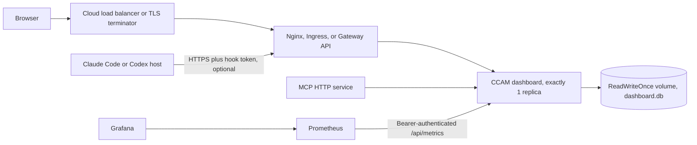

# Deployment

CCAM supports three production paths:

1. **Docker or Podman Compose on one Linux host** for the complete dashboard, MCP, Nginx, Prometheus, and Grafana stack.
2. **Helm or Kustomize on any conformant Kubernetes cluster**, including EKS, GKE, AKS, OKE, and self-managed clusters.
3. **Terraform against an existing Kubernetes cluster**, using the same validated Helm chart.

The persistence contract is the same everywhere: **one active dashboard writer per SQLite volume**. CCAM does not support HPA, active-active replicas, blue-green, or canary deployments while SQLite is the database. Nginx, Prometheus, Grafana, and MCP can run around the dashboard, but the dashboard itself remains one Recreate-managed writer.

## Production topology



### Why one writer

SQLite coordinates concurrent operations inside one process well, but CCAM is not designed for multiple independent application processes writing the same database file over a shared filesystem. The supplied chart schema rejects `replicaCount != 1` and `autoscaling.enabled=true`. Kustomize uses `replicas: 1` plus `strategy.type: Recreate`. Upgrades intentionally have a brief application interruption while the old pod exits and the new pod acquires the volume.

Availability comes from:

- retained persistent storage
- consistent SQLite online backups
- CSI snapshots when the cluster supports `VolumeSnapshot`
- atomic Helm upgrades or controlled Kustomize rollouts
- health checks and image rollback
- short recovery time, not simultaneous writers

## Validate before deployment

Run the same gate used by CI:

```bash
npm run deploy:validate
```

It checks Dockerfiles, Compose profiles, Nginx syntax, Helm lint and schema rejection, every Kustomize overlay and optional component, Terraform formatting/provider validation, production dependency audits, file headers, and the one-writer invariant.

The dependency audit retries malformed registry or transport responses up to three times with bounded backoff. A valid report containing any vulnerability fails immediately and prints the complete audit payload; malformed reports never pass as clean.

## Secrets

Production deployments use three independent tokens:

| Secret key | Consumer | Purpose |
| --- | --- | --- |
| `dashboard-token` | browser, CLI, Prometheus, MCP sidecar | Protects dashboard REST and WebSocket access |
| `hook-token` | Claude Code/Codex hook handlers | Protects remote `/api/hooks/*` ingestion |
| `mcp-token` | MCP HTTP/SSE clients | Protects `/mcp`, `/sse`, and `/messages` |

The complete Compose stack also needs `grafana-admin-password`.

CCAM consumes these as `DASHBOARD_TOKEN_FILE`,
`DASHBOARD_HOOK_TOKEN_FILE`, `MCP_DASHBOARD_API_TOKEN_FILE`, and
`MCP_HTTP_AUTH_TOKEN_FILE` inside containers and pods.

Create local ignored files for Docker or Podman:

```bash
umask 077
openssl rand -hex 32 > deployments/secrets/dashboard-token
openssl rand -hex 32 > deployments/secrets/hook-token
openssl rand -hex 32 > deployments/secrets/mcp-token
openssl rand -base64 32 > deployments/secrets/grafana-admin-password
```

For Kubernetes, create `agent-monitor-secrets` through External Secrets Operator, your cloud secret controller, SOPS, Sealed Secrets, or a manual bootstrap process. Required keys are `dashboard-token`, `hook-token`, and `mcp-token`. Do not put production tokens in Helm values or Terraform state.

## Docker and Podman

### Dashboard only

```bash
# Docker
docker compose up -d --build

# Podman
podman compose up -d --build
```

The dashboard is published on `127.0.0.1:4820`. Claude and Codex homes are mounted read-only. SQLite and persisted Settings overrides live in named volumes. The image runs as UID/GID 1000, uses a read-only root filesystem through Compose, drops all Linux capabilities, enables `no-new-privileges`, includes Git/OpenSSH/SQLite CLI, and uses Tini as PID 1.

### Complete stack

```bash
npm run docker:full:up
npm run monitoring:verify
```

Services:

| Service | Host endpoint | Default exposure |
| --- | --- | --- |
| Dashboard | `127.0.0.1:4820` | loopback |
| MCP HTTP/SSE | `127.0.0.1:8819` | loopback, bearer token required |
| Nginx edge | `127.0.0.1:8080` | loopback |
| Prometheus | `127.0.0.1:9090` | loopback |
| Grafana | `127.0.0.1:3000` | loopback, password file required |

Nginx proxies the UI, authenticated REST API, and WebSocket. It returns `404` for `/api/hooks`, `/api/metrics`, `/mcp`, `/sse`, and `/messages` by default. Prometheus scrapes `/api/metrics` on the private network with `dashboard-token`.

To expose authenticated remote hooks behind TLS:

```bash
CCAM_NGINX_HOOK_POLICY=./deployments/nginx/snippets/hooks-proxy.conf \
CCAM_EDGE_BIND=0.0.0.0 \
npm run docker:full:up
```

Configure the client host:

```bash
export CCAM_DASHBOARD_URL=https://agent-monitor.example.com
export CCAM_HOOK_TOKEN_FILE=/secure/path/hook-token
```

Non-loopback hook URLs must use HTTPS and a hook token. The hook handler remains fail-safe and non-blocking.

To expose MCP through the same TLS edge, also set:

```bash
CCAM_NGINX_MCP_POLICY=./deployments/nginx/snippets/mcp-proxy.conf
```

MCP clients send `Authorization: Bearer <mcp-token>` or `x-mcp-token`. `/health` stays unauthenticated for probes.

### Optional Run Agent image

The default `runtime` target supports monitoring, imports, updates, SSH sources, configuration, and MCP. To run Claude Code or Codex inside the container, build the opt-in target:

```bash
CCAM_DOCKER_TARGET=agent-runtime \
CCAM_AGENT_HOME_MODE=rw \
CCAM_WORKSPACE_MODE=rw \
docker compose up -d --build
```

The `agent-runtime` target installs pinned Claude Code and Codex CLIs. Mount only the credentials and workspace needed for that environment.

### Stop without deleting data

```bash
npm run docker:full:down
```

Named volumes remain. Delete them only after a verified backup.

## Kubernetes

### Prerequisites

- Kubernetes 1.29 or newer is recommended
- a ReadWriteOnce CSI StorageClass
- `agent-monitor-secrets` with the three token keys
- an Ingress controller or Gateway API implementation for public access
- cert-manager or provider-managed TLS
- Prometheus Operator when enabling the `ServiceMonitor`

### Helm

```bash
REGISTRY="ghcr.io/$(gh repo view --json owner -q .owner.login)"
IMAGE_TAG="$(git rev-parse --short HEAD)"
helm upgrade --install agent-monitor deployments/helm/agent-monitor \
  --namespace agent-monitor-production \
  --create-namespace \
  --values deployments/helm/agent-monitor/values-production.yaml \
  --set image.registry= \
  --set image.repository=${REGISTRY}/claude-code-agent-monitor \
  --set image.tag=${IMAGE_TAG} \
  --set mcp.image.registry= \
  --set mcp.image.repository=${REGISTRY}/claude-code-agent-monitor-mcp \
  --set mcp.image.tag=${IMAGE_TAG} \
  --atomic --wait --timeout 10m
```

Prefer `image.digest=sha256:...` after CI publishes the image. The chart supports standard Ingress and Gateway API `HTTPRoute`, but the schema rejects enabling both.

### Kustomize

Render and replace the local image name with an immutable registry reference:

```bash
REGISTRY="ghcr.io/$(gh repo view --json owner -q .owner.login)"
IMAGE_TAG="$(git rev-parse --short HEAD)"
kubectl kustomize deployments/kubernetes/overlays/production \
  | sed "s|ccam-dashboard:2.1.0|${REGISTRY}/claude-code-agent-monitor:${IMAGE_TAG}|g" \
  | kubectl apply --server-side --field-manager=ccam-deployer -f -
```

Optional components:

- `components/mcp-sidecar`: authenticated MCP sidecar plus private Service and NetworkPolicy
- `components/monitoring`: authenticated Prometheus Operator `ServiceMonitor`
- `components/gateway-api`: `HTTPRoute`, replacing the base Ingress
- `components/volume-snapshot`: manual CSI `VolumeSnapshot` template

### Network policy labels

The Helm chart allows same-namespace dashboard access. Cross-namespace dashboard clients need `ccam.dev/dashboard-client=true` on their namespace. Exposed MCP clients need `ccam.dev/mcp-client=true`. MCP is not exposed outside the pod unless `mcp.exposeService=true`.

## Terraform

Terraform deploys the validated Helm chart to an **existing Kubernetes cluster**. This is provider-neutral across EKS, GKE, AKS, OKE, and self-managed Kubernetes. Cloud networking, cluster identity, CSI, TLS, and secret synchronization remain owned by the platform-specific layer.

```bash
cd deployments/terraform
cp terraform.tfvars.example terraform.tfvars
terraform init
terraform validate
terraform plan -out=tfplan
terraform apply tfplan
```

The module enforces one replica, disabled HPA, persistent ReadWriteOnce storage, and mutually exclusive Ingress/Gateway API. It requires an immutable image tag and supports a digest override.

## Backup

The dashboard image includes `sqlite3`. Backups use SQLite's online backup API and verify `PRAGMA integrity_check` before copying the artifact.

```bash
./deployments/scripts/db-backup.sh \
  --env production \
  --namespace agent-monitor-production \
  --output ./backups/
```

The script writes a compressed database and SHA-256 checksum. Optional upload destinations support S3, GCS, and Azure Blob when the corresponding CLI is installed.

## Restore

Restore requires downtime because no dashboard writer may hold the database:

```bash
BACKUP_FILE="$(find ./backups -name 'agent-monitor_production_*.db.gz' -type f -print | sort | tail -1)"
test -n "${BACKUP_FILE}"
./deployments/scripts/db-restore.sh \
  --env production \
  --namespace agent-monitor-production \
  --input "${BACKUP_FILE}"
```

The script verifies the checksum and SQLite integrity, creates a mandatory pre-restore backup, scales the Deployment to zero, mounts the PVC in a restricted helper pod using the current CCAM image, replaces the database, removes WAL/SHM files, verifies integrity again, restores one replica, and runs health checks. If the script exits early after scale-down, an exit trap attempts to restore the writer.

## Deploy and rollback

The deploy orchestrator supports Helm and Kustomize only:

```bash
REGISTRY="ghcr.io/$(gh repo view --json owner -q .owner.login)"
IMAGE_TAG="$(git rev-parse --short HEAD)"
./deployments/scripts/deploy.sh \
  --env production \
  --method helm \
  --registry "${REGISTRY}" \
  --image claude-code-agent-monitor \
  --tag "${IMAGE_TAG}" \
  --skip-build
```

Without `--skip-build`, it uses Buildx to publish amd64/arm64 app and MCP images with SBOM and provenance attestations. Production deploys require confirmation and a successful backup.

Rollback also backs up first:

```bash
./deployments/scripts/rollback.sh \
  --env production \
  --method helm \
  --namespace agent-monitor-production
```

A Helm rollback restores the previous manifest/image. Database restoration is separate and should only be used when a schema or data issue requires it.

## CI supply chain

The active `.github/workflows/ci.yml`:

- runs server, client, and MCP tests
- runs `npm run deploy:validate`
- builds dashboard and MCP images
- scans both with Grype through an immutable action SHA
- publishes amd64/arm64 images to GHCR
- attaches BuildKit SBOM and SLSA provenance
- keyless-signs image digests with Cosign and GitHub OIDC
- publishes releases only after the signed image job succeeds

All deployment-related actions are pinned by commit SHA.

## Production checklist

- [ ] `npm run deploy:validate` passes
- [ ] production dependency audits report zero vulnerabilities
- [ ] `agent-monitor-secrets` has dashboard, hook, and MCP tokens
- [ ] TLS terminates before any public endpoint
- [ ] public hostname is in `DASHBOARD_ALLOWED_HOSTS`
- [ ] exactly one dashboard replica is rendered
- [ ] PVC is ReadWriteOnce and retained
- [ ] a verified backup exists outside the cluster
- [ ] Prometheus target is UP and Grafana dashboards load
- [ ] `/api/hooks`, `/api/metrics`, and MCP are not public unless explicitly enabled
- [ ] rollback image/tag and restore procedure are recorded

## Verified commands

```bash
npm run test:server
npm run test:client
npm run test:mcp
npm run mcp:typecheck
npm run mcp:build
npm run deploy:validate
npm run docker:full:up
npm run monitoring:verify
```
