# Panel de control del agente para Claude Code & Codex

### Plataforma de monitoreo en tiempo real para la actividad del agente Claude Code & Codex 🚀

Un panel profesional para rastrear y visualizar sus sesiones de agente Claude Code & Codex, el uso de herramientas y la orquestación de subagentes en tiempo real. Construido con Node.js, Express, React y SQLite, se integra directamente con Claude Code & Codex a través de su sistema de ganchos nativo para un seguimiento y análisis de sesiones sin problemas.


> [!TIP]
> Consulta también [README.md](./README.md) (English), [README-CN.md](./README-CN.md) (中文), [README-VN.md](./README-VN.md) (Tiếng Việt) y [README-KO.md](./README-KO.md) (한국어). Este es el README en español.

> [!NOTE]
> ¿Necesitas ayuda orientada a tareas? La [Wiki de GitHub](https://github.com/hoangsonww/Claude-Code-Agent-Monitor/wiki) es el manual práctico para el uso diario, las operaciones de equipo, la solución de problemas, la automatización con CLI/MCP y las recetas de despliegue. La [Wiki estática localizada](https://hoangsonww.github.io/Claude-Code-Agent-Monitor/wiki/) sigue siendo el recorrido del producto y la arquitectura en inglés, vietnamita, chino, coreano y español; los contratos técnicos exactos permanecen en [`docs/`](./docs/README.md).

---

## Índice de contenidos

- [Visión general](#resumen-general)
- [Internacionalización (i18n)](#internacionalización-i18n)
- [Funciones](#características)
- [Inicio rápido](#inicio-rápido)
- [Cómo funciona](#cómo-funciona)
- [Configuración](#configuración)
- [Scripts npm](#scripts-npm)
- [Mercado de complementos](#mercado-de-complementos)
- [Extensión de agentes](#extensión-de-agentes)
- [Integración MCP](#integración-mcp)
- [Referencia de API](#referencia-de-api)
- [Eventos de conexión](#eventos-de-enganchamiento)
- [Notificaciones del navegador](#notificaciones-del-navegador)
- [Notificador de actualización](#notificador-de-actualización)
- [Tabby — Compañero de gato flotante](#tabby--compañero-de-gato-flotante)
- [Señales de sonido](#señales-de-sonido)
- [Modal de estado de conexión](#modal-de-estado-de-conexión)
- [Extensión de VS Code](#extensión-de-vs-code)
- [Aplicación para escritorio (macOS y Windows)](#aplicación-de-escritorio-macos-y-windows)
- [Almacenamiento de datos](#almacenamiento-de-datos)
- [Línea de estado](#línea-de-estado)
- [Arquitectura del servidor](#arquitectura-del-servidor)
- [Routing del cliente](#enrutamiento-del-cliente)
- [Flujo del gestor de ganchos](#flujo-del-gestor-de-ganchos)
- [Modos de despliegue](#modos-de-despliegue)
- [Estructura del proyecto](#estructura-del-proyecto)
- [Solución de problemas](#solución-de-problemas)
- [Contribuyendo](#contribuyendo)
- [Licencia](#licencia)

---

## Resumen general

Realice sesiones de seguimiento, supervise a los agentes en tiempo real, visualice el uso de las herramientas y observe la orquestación de subagentes a través de una interfaz web profesional con tema oscuro. Se integra directamente con Claude Code & Codex a través de su sistema de ganchos nativo.

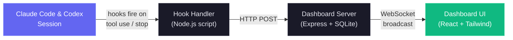

Además del panel de control de monitoreo en tiempo real, también incluye una implementación local del servidor MCP en `mcp/` que expone un catálogo de herramientas para introspeccionar y gestionar el propio panel de control, lo que facilita la integración de las operaciones del panel de control directamente en sus flujos de trabajo de Claude Code & Codex. También hay una capa de extensión de agentes, que proporciona complementos, habilidades y subagentes de Claude Code & Codex para la interacción del panel de control, el análisis y la inteligencia de los flujos de trabajo.

### Internacionalización (i18n)

La interfaz de usuario incluye selección de idioma para inglés (`en`), chino (`zh`), vietnamita (`vi`), coreano (`ko`) y español (`es`). El selector personalizado en forma de menú desplegable evita que la barra lateral se sature a medida que se agregan idiomas. Los recursos se cargan por espacio de nombres y la preferencia se conserva en el almacenamiento del navegador entre actualizaciones.

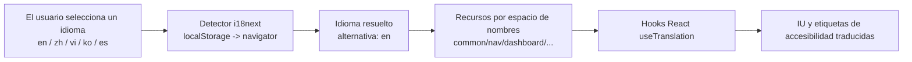

Para obtener una guía completa de arquitectura y funcionamiento, consulte [docs/I18N.md](./docs/I18N.md).

### Interfaz de usuario

Vino con un elegante tema oscuro, diseño responsive y navegación intuitiva para explorar tu actividad de agente:

<p align="center">

<br>
<em>📡 <strong>Panel de control · Monitor</strong> — estadísticas generales, tarjetas de agentes activos y feed de actividad reciente</em>
</p>

<p align="center">

<br>
<em>📋 <strong>Progreso de tareas · Resumen</strong> — las tarjetas de Agent del Dashboard y las filas de Sessions reutilizan el mismo donut compacto de finalización junto al estado; al pasar el cursor o enfocar se abre una vista previa por propietario del trabajo actual y los estados de las tareas</em>
</p>

<p align="center">

<br>
<em>🩺 <strong>Panel de control · Salud</strong> — anillo de puntuación de salud compuesto, gráfico de donas del motor de almacenamiento, indicadores de éxito / error / éxito de la caché, barras de invocación de herramientas, eficacia del subagente, distribución de tokens del modelo y estadísticas de compactación — todo se actualiza automáticamente cada 5 s</em>
</p>

<p align="center">

<br>
<em>📋 <strong>Tablero Kanban (agentes)</strong> — agentes agrupados por estado en 4 columnas: Trabajando / Esperando / Completado / Error. La columna amarilla Esperando muestra las sesiones bloqueadas por la entrada del usuario (peticiones de permiso, finalización de turno o en una nueva solicitud) — pasa el cursor sobre una insignia Esperando para ver <em>por qué</em> (Necesita entrada / Turno terminado / En solicitud / Interrumpido). Cada tarjeta muestra el modelo, el coste y la herramienta actual de un vistazo.</em>
</p>

<p align="center">

<br>
<em>🗂️ <strong>Tablero Kanban (sesiones)</strong> — sesiones agrupadas por estado en 5 columnas: Activo / Esperando / Completado / Error / Abandonado, puede cambiarse desde la misma página. Haga clic con el botón derecho del ratón en cualquier encabezado de columna para ver una herramienta de ayuda que explica la transición del ciclo de vida.</em>
</p>

<p align="center">

<br>
<em>📂 <strong>Sesiones</strong> — tabla de búsqueda, filtrable y paginada por servidor de todas las sesiones grabadas con costo, modelo, número de agentes y duración</em>
</p>

<p align="center">

<br>
<em>🤖 <strong>Detalles de la sesión · Agentes</strong> — baldosas de visión general en tiempo real (eventos, llamadas de herramientas, subagentes, compactaciones, errores, duración), barras de uso de herramientas principales, desglose del tipo de subagente, flujo de tokens y el árbol jerárquico del agente</em>
</p>

<p align="center">

<br>
<em>✅ <strong>Progreso de tareas · Detalles de la sesión</strong> — el rastreador completo por propietario combina un donut segmentado de finalización, la tarea activa, una barra de finalización, el desglose por propietario y una lista paginada de 10 filas por página</em>
</p>

<p align="center">

<br>
<em>💬 <strong>Detalles de la sesión · Conversación</strong> — visualizador de transcripciones en vivo con renderizado de markdown, bloques de código resaltados por sintaxis (números de línea + copia), llamadas de herramientas estilizadas por herramienta, píldoras de comandos con guiones con su salida TUI capturada y marcadores de renombramiento de sesiones en línea</em>
</p>

<p align="center">

<br>
<em>🔬 <strong>Detalle de sesión · Línea de tiempo</strong> — línea de tiempo cronológica de eventos con filtros multidimensionales, agrupación pre/post por `tool_use_id` y representadores de carga útiles según la herramienta</em>
</p>

<p align="center">

<br>
<em>📰 <strong>Feed de actividad</strong> — registro de eventos en tiempo real con pausa / continuar, agrupación, filtros multidimensionales y un botón de salto "Sesión →" por fila</em>
</p>

<p align="center">

<br>
<em>📊 <strong>Análisis</strong> — uso de tokens por modelo, frecuencia de herramientas, mapa de calor de actividad y tendencias de sesiones con indicador en vivo / sin conexión</em>
</p>

<p align="center">

<br>
<em>🔀 <strong>Flujos de trabajo</strong> — DAGs de orquestación de agentes, diagramas Sankey de ejecución de herramientas, redes de colaboración y 11 secciones interactivas de inteligencia de flujo de trabajo</em>
</p>

<p align="center">

<br>
<em>🧬 <strong>Ejecuciones de flujo de trabajo (página de flujos de trabajo)</strong> — "flujos de trabajo dinámicos" generados por la herramienta <code>Workflow</code>, reconstruidos a partir de los registros de ejecución en disco: estado, número de agentes, tokens y llamadas a la herramienta, expandibles en un desglose por agente (fase, estado, tokens, herramientas, duración) con vistas preliminares de resultados humanizados</em>
</p>

<p align="center">

<br>
<em>🧬 <strong>Ejecuciones de flujo de trabajo · expandido</strong> — una ejecución abierta: filtros de fase codificados por color interactivos, la tabla de métricas por agente y una lista completa de elementos de resultado interactivos que se expanden a la solicitud completa y el resultado de cada agente</em>
</p>

<p align="center">

<br>
<em>🧬 <strong>Ejecuciones de flujo de trabajo (detalles de la sesión)</strong> - las mismas flotas vinculadas a su sesión de lanzamiento, por lo que los subagentes del flujo de trabajo dinámico de una sesión y su costo de token incorporado son visibles en línea</em>
</p>

<p align="center">

<br>
<em>🧰 <strong>Configuración de agentes</strong> — cambia entre el explorador completo de Claude Code y un espacio de trabajo de Codex en vivo para valores predeterminados, modelos, perfiles, MCP, proyectos, habilidades, reglas, hooks, complementos e instrucciones. Las vistas previas de Codex ocultan secretos y sus archivos gestionados se editan con copias de seguridad.</em>
</p>

<p align="center">

<br>
<em>🧰 <strong>Explorador de configuración de Codex</strong> — el espacio de trabajo de Codex reúne <code>config.toml</code>, modelos de la cuenta, perfiles, servidores MCP, proyectos, habilidades, hooks, reglas, complementos e instrucciones. Edita los archivos compatibles gestionados por el usuario con copias de seguridad con marca de tiempo; <code>config.toml</code> es solo editable.</em>
</p>

<p align="center">

<br>
<em>🧩 <strong>Explorador de Configuración de Claude · Habilidades</strong> — la pestaña Habilidades enumera todas las habilidades descubiertas (usuario, proyecto y complemento) con su descripción y fuente, se puede buscar en todo el conjunto y abre cualquier archivo de habilidad para una edición segura respaldada por una hora y fecha</em>
</p>

<p align="center">

<br>
<em>▶️ <strong>Ejecutar agente</strong> — elige Claude Code o Codex cada vez que abras el iniciador. Claude conserva los modos Conversación / Una sola vez; Codex inicia un hilo interactivo nativo con sus propios controles de aprobación y sandbox. Los modelos de Codex provienen del catálogo de la CLI con sesión iniciada.</em>
</p>

<p align="center">

<br>
<em>💬 <strong>Ejecutar agente · transmisión en vivo</strong> — las envolturas stream-json de Claude y los eventos de app-server de Codex se muestran como un chat con razonamiento, comandos, cambios de archivos y actividad de herramientas. Las ejecuciones del panel permiten dejar un agente trabajando en segundo plano y volver a conectarte después.</em>
</p>

<p align="center">

<br>
<em>⚙️ <strong>Configuración</strong> — reglas de precios del modelo, estado de instalación del gancho, gestión de datos, preferencias de notificación e información del sistema</em>
</p>

<p align="center">

<br>
<em>🔔 <strong>Configuración · Alertas</strong> — motor de alertas basado en reglas y webhooks de salida en un solo lugar: reglas de alerta (patrón de eventos / inactividad / agente atascado / umbral de token) con tiempo de espera por regla, un feed de alertas lanzadas en vivo y 14 proveedores de webhook de primera clase (Slack, Discord, Teams, Google Chat, Mattermost, Rocket.Chat, Telegram, PagerDuty, Opsgenie, Splunk On-Call, Zapier, Make, n8n, Pipedream) además de un punto final JSON genérico con firma HMAC opcional</em>
</p>

<p align="center">

<br>
<em>🛰️ <strong>Configuración · Fuentes de datos remotas</strong> — obtenga la actividad de Claude Code y Codex de otras máquinas a través de SSH: configure de forma opcional rutas independientes de Inicio remoto de Claude e Inicio remoto de Codex, pruebe cada proveedor, sincronice manualmente o en un sondeo de fondo y cambie el alcance global de los datos entre local, todas las fuentes o una máquina específica, con insignias de fuente por sesión</em>
</p>

<p align="center">
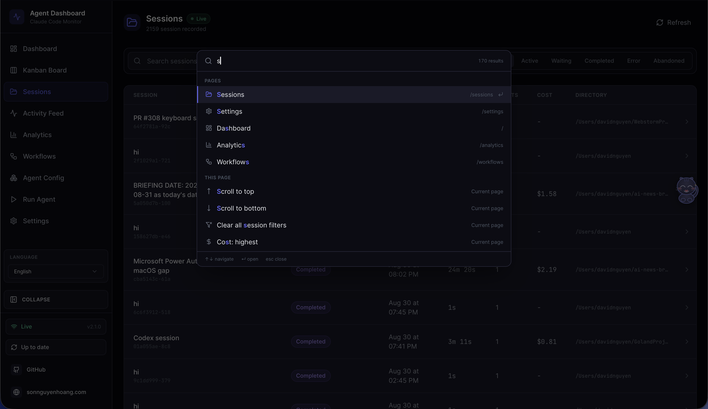
<br>
<em>⌘ <strong>Paleta de comandos</strong> — <kbd>Cmd/Ctrl+K</kbd> desde cualquier parte abre el único lanzador del panel. Una consulta resuelve nueve grupos: comandos recientes, las nueve páginas, búsqueda de sesiones en el servidor en tiempo real, las acciones propias de la página actual, cada directorio de proyecto conocido, subvistas y filtros de lista, las 13 secciones de Configuración, las 12 pestañas de Configuración del agente, y acciones para preferencias, alcance de datos e idioma. La coincidencia es por subsecuencia y resalta los caracteres coincidentes, así que <code>mcp</code> encuentra «MCP servers»</em>
</p>

La barra lateral proporciona acceso rápido a las nueve páginas: el Panel de control, el Tablero Kanban, la lista de Sesiones, el Feed de Actividades, las Análisis, los Flujos de trabajo, la Configuración del agente, Ejecutar agente y la Configuración. Cada página está diseñada para brindarle información profunda sobre la actividad de su agente Claude Code con actualizaciones en tiempo real y visualizaciones ricas.

---

## Características

El panel de control ofrece un conjunto completo de funciones para monitorear y analizar sus sesiones y agentes de Claude Code:

> **Sesiones del cursor también (informativas):** CCAM ingiere cualquier transcripción del agente que caiga bajo `~/.claude` - en esta máquina y en los remotos sincronizados. El uso del **Cursor** se cuenta de la misma manera: el **Cursor** por casualidad almacena sus sesiones del agente en esos archivos junto con el Código Claude. CCAM no distingue qué aplicación escribió un archivo.

| Característica                            | Descripción                                                                                                                                                                                                                                                                  |
|------------------------------------|------------------------------------------------------------------------------------------------------------------------------------------------------------------------------------------------------------------------------------------------------------------------------|
| **Progreso de tareas**             | Seguimiento de tareas con atribución al agente propietario a partir del estado realmente emitido: `TaskCreate` / `TaskGet` / `TaskUpdate` / `TaskList` y eventos de ciclo de vida de Claude actual, `TodoWrite` heredado y `update_plan` de Codex directo o envuelto por el `exec` unificado. Las sesiones con tareas muestran el mismo donut pequeño y la vista previa al pasar el cursor o enfocar junto a la insignia de estado en la tabla Sessions y en cada tarjeta de agente del Dashboard. Detalles de la sesión muestra el panel completo con segmentos de estado, trabajo activo, desglose por agente y 10 filas de tareas por página. El progreso pertenece solo al trabajo principal más reciente: un nuevo turno humano de Claude o una nueva tarea de Codex sin tracker elimina el estado anterior, y el estado incompleto se descarta cuando el turno o la tarea termina sin una actualización final. El historial totalmente completado permanece visible. |
| **Panel de control**                      | Dos pestañas persistieron en `localStorage`: **Monitor** — estadísticas generales (6 tarjetas estadísticas), tarjetas de agentes activos con jerarquía de subagentes colapsables y feed de actividad reciente con conteos dinámicos de elementos que llenan la altura disponible de la ventana de visualización a través de `ResizeObserver`. **Salud** — anillo de puntuación de salud del sistema compuesto (pesado: 0,4 × tasa de éxito + 0,25 × tasa de éxito de la caché + 0,25 × (100 − tasa de error) + 0,1 × (100 − % de la pila)), gráfico de donut del motor de almacenamiento con distribución de registros, medidores de rendimiento de la caché / tasa de error / tasa de éxito, gráfico de barras horizontal de invocación de herramientas (8 principales), barras de eficacia de subagentes, distribución de tokens del modelo y estadísticas de impacto de la compactación. Todas las métricas de salud se actualizan automáticamente cada 5 s desde `/api/settings/info` y `/api/workflows`. Etiquetas de herramientas de seguimiento del cursor con detección de bordes de la ventana de visualización en todos los gráficos |
| **Tablero Kanban**                   | Dos vistas con un alternador de encabezado (persistente en `localStorage`): **Agentes** — 4 columnas (Trabajando / Esperando / Completado / Error) — y **Sesiones** — 5 columnas (Activa / Esperando / Completado / Error / Abandonada). La columna **Esperando** se asigna directamente al estado persistente de "esperando" en los agentes, que se establece cuando Claude Code está en una solicitud (sesión nueva, entre turnos o bloqueado por una notificación de permiso) y pasa a "trabajando" en el momento en que el usuario vuelve a iniciar (UserPromptSubmit / PreToolUse). Cada encabezado de columna muestra una leyenda de herramientas `?` que explica las transiciones del ciclo de vida. Las tarjetas se obtienen por estado persistente del servidor (efectivamente ilimitadas por estado), luego se paginan en el lado del cliente a 10 tarjetas por columna con una opción "Mostrar más". Los escenarios de suscripción de WS se limitan a la vista activa (marcos `agent_*` vs `session_*`), por lo que las actualizaciones fuera de la vista no desencadenan nuevas recuperaciones. Los insignias de espera exponen el `awaiting_reason` de la fila como una leyenda de hover - **Necesita entrada** (`notification`), **Convertir a terminado** (`stop`), **En el mensaje** (`session_start`), **Interrumpido** (`interrupted`) - manteniéndose solo la leyenda de hover en las tarjetas compactas para que los títulos mantengan su espacio; las superficies más anchas (tabla de Sesiones, encabezado de detalles de sesión) además muestran la razón en línea como un chip anidado, con razones urgentes (mensajes de permiso, interrupciones) en un ámbar más cálido |
| **Sesiones**                       | Tabla **paginada por servidor**, buscable y filtrable de todas las sesiones registradas. Cada clic en una página hace que se acceda a `/api/sessions?status=&q=&limit=10&offset=…`, por lo que el cálculo de costos solo se realiza sobre la página visible, independientemente de cuántas sesiones existan en la base de datos. La primera página también muestra la misma fila local y en memoria de inicio de Codex que Dashboard y Kanban; aparece de inmediato pero no es navegable hasta que la reemplaza un ID de sesión duradero, y no cambia el `total` duradero ni la paginación. La caja de búsqueda (`q=`) realiza coincidencias insensible a mayúsculas y minúsculas entre `id` / `name` / `cwd` en el servidor con un retraso de 300 ms, y la respuesta lleva un conteo `total` para la interfaz de usuario del paginador. Composición de filtro de estado, búsqueda y paginación. El **nombre** legible por humanos de cada sesión se lee de la transcripción y se mantiene sincronizado en tiempo real, una vez que un título explícito de `/rename`, `claude -n` o el `Ctrl+R` del seleccionador (la línea `custom-title` de JSONL) siempre gana, de lo contrario el `ai-title` generado automáticamente se completa, de lo contrario el **primer mensaje de usuario** de la sesión (cortado, con el ruido del resultado de la herramienta / comando de guión roto) completa el nombre de lugar de almacenamiento y el nombre/tarea de lugar de almacenamiento del agente principal, por lo que las sesiones que nunca reciben un título (incluidas las importadas) todavía dicen lo que están haciendo; el panel de control muestra ese nombre (volviendo al ID corto) en las tarjetas, el Panel de Control, el Feed de Actividades y el seleccionador de inicio de sesión de Ejecución. |
| **Detalles de la sesión** | Panel de visión general en tiempo real por sesión con banner de agente activo (herramienta actual + tarea), seis contadores de cuadros (eventos con tasa de eventos/min, llamadas de herramientas, subagentes, compactaciones, errores, duración del tic-tac), barras de uso de herramientas principales, desglose del tipo de subagente, tira de flujo de tokens apilada y nube de píldoras de tipo de evento, todo actualizado en vivo en eventos conectados. Debajo de él: árbol jerárquico de agentes, cronología completa del evento con filtros multidimensionales (estatus, tipo de evento, herramienta, agente, búsqueda de texto, rango de fechas), agrupación Pre/Post por `tool_use_id`, bloque de resumen legible por humanos, renderizadores de entrada/respuesta conscientes de herramientas (terminal para Bash, diferencia unificada para Editar, código numerado por línea para Leer/Escribir, lista de coincidencias para Grep, tarjeta clave/valor para herramientas MCP) y una pestaña de Conversación que renderiza transcripciones, incluidas las mensajes escritos a mitad de turno (en cola mientras Claude seguía trabajando), colocados donde Claude los recibió realmente, con notificaciones de arnés atribuidas al Sistema, con markdown (encabezados, listas, citas entre comillas, tablas, listas de tareas), bloques de código resaltados por sintaxis (js/ts, python, json, bash, html, css, sql, yaml, diff) con números de línea y copia al portapapeles, y llamadas de herramientas estilizadas por herramienta (Bash → terminal, Editar → Junto a lado antiguo/nuevo, Escribir → etiqueta de archivo, Leer → chip de ruta, Grep → tarjeta de patrón). Cuando la sesión se bloquea en el humano, un banner amarillo **esperando-entrada** debajo del encabezado nombra el `awaiting_reason`, su explicación y cuánto tiempo ha estado esperando la sesión (punto pulsante + tiempo relativo); el distintivo de Esperando del encabezado lleva la misma razón que un chip anidado |
| **Feed de actividad** | Registro de eventos de transmisión en tiempo real con pausa/resume, filtros multidimensionales (mismo panel de herramientas que el Detalles de sesión más un filtro de sesión), paginación "Cargar más" impulsada por el servidor, actualización en vivo con filtro sensible a los retrasos que preserva el tamaño de la página cargada, alternancia de agrupación, prefijo de origen que muestra proyecto › sesión › subagente y un botón "Sesión →" por fila, y una insignia de estado por fila procedente de la única correspondencia compartida con el Dashboard y el Detalle de sesión (tanto tipos de evento de Claude como de Codex) |
| **Análisis**                      | Uso de tokens, frecuencia de herramientas, mapa de calor de actividad (centrado, alineado con el día de la semana a partir del domingo, pestañas de herramientas con el nombre del día), tendencias de sesiones, indicador de conexión en vivo/desconectada. Mientras se carga el contenido de la carga útil de análisis, la región del gráfico (no solo las baldosas estadísticas) muestra **marcos de lugar de esqueleto pulsantes** que reflejan la disposición del gráfico, por lo que la página nunca muestra gráficos vacíos/nulos. Las leyendas largas de Analytics y Workflows se paginan; las que caben en una página no cambian |
| **Paleta de comandos**              | Lanzador global `Cmd/Ctrl+K` sobre **todo** el panel. Una consulta resuelve nueve grupos: los comandos ejecutados recientemente, las acciones propias de la página actual, cada directorio de proyecto conocido, las nueve rutas de la barra lateral (coincidiendo con sus etiquetas **traducidas**, así que funciona en cualquier idioma), búsqueda de sesiones en el servidor en tiempo real vía `/api/sessions?q=` (con debounce y respetando el alcance de datos, de modo que nunca mantiene un índice obsoleto de miles de sesiones en el cliente), cada subvista de página y filtro de lista, las 13 secciones de Configuración, las 12 pestañas de Configuración del agente, y acciones para preferencias, alcance de datos, idioma, historial y operaciones de página. El orden usa coincidencia por subsecuencia resaltando los caracteres que coinciden, así que `mcp` encuentra «MCP servers» y `kbrd` encuentra «Kanban Board»; un `>` / `@` / `#` inicial acota a acciones / páginas / sesiones. Totalmente manejable con el teclado — flechas, `Home`/`End`, `PageUp`/`PageDown`, `Tab` entre grupos, `Enter`, `Escape` — y sigue siendo utilizable si falla la consulta de sesiones. Un comando que aparece es un comando que funciona: las acciones de página se leen del registro de handlers activo, así que nunca se listan donde no harían nada, y todo lo que cambia el estado sin moverte se confirma con un aviso. Las operaciones destructivas se excluyen a propósito: la paleta navega hasta ellas, nunca las ejecuta |
| **Un solo atajo**             | `Cmd/Ctrl+K` es la única combinación que reclama el panel, y funciona incluso con el foco dentro de un campo. Una versión anterior incluía toda una capa de atajos —secuencias de navegación con prefijo `g`, teclas de página, una hoja de referencia `?`, una capa de pistas al mantener pulsado el modificador— y se eliminó a propósito: una secuencia es un modo oculto con temporizador, pulsar `g` parecía no hacer nada, y dos mecanismos de navegación dispersan la memoria muscular cuando la paleta ya llega a cada página con búsqueda difusa. Tabby conserva su histórico `Cmd/Ctrl+B` |
| **Actualizaciones en vivo** | WebSocket push -- sin consultas, actualizaciones instantáneas de la interfaz de usuario                                                                                                                                                                                                                             |
| **Auto-Descubrimiento** | Las sesiones y los agentes se crean automáticamente a partir de señales del proveedor. Claude Code crea una tarjeta **Esperando** inmediata en `SessionStart`. Codex muestra primero una tarjeta **Esperando** local y solo en memoria al iniciar su TUI interactiva, incluso antes de tener un ID estable. Después, un hook, una fila live-thread o un rollout crea la sesión duradera. Si el usuario selecciona un hilo existente en el selector Resume de Codex, CCAM lee el rollout o writer lock abierto por ese PID exacto y cambia a la sesión duradera reanudada antes del primer mensaje nuevo. La tarjeta temporal nunca se escribe en SQLite, historial, analítica, precios, workflows, alertas ni notificaciones de finalización. |
| **Importación de historial** | Importa sesiones de `~/.claude/` al iniciar la sesión. Extracción JSONL mejorada: errores de API (cuota/tarifa/solicitud_invalida), duraciones de turno, punto de entrada (cli/sdk-ts), modos de permiso, conteos de bloqueos de pensamiento, extras de uso (servicio_tier, velocidad, inferencia_geo), errores de resultados de herramientas y archivos JSONL de subagentes (`subagents/agent-*.jsonl` con `.meta.json`). Reabastece sesiones existentes al volver a importar. Los archivos JSONL recientes (< 10 min) se importan como "activos" |
| **Hierarquía de subagentes** | Árbol de agentes padre-hijo colapsible en el Panel de control y en los Detalles de la sesión. Los agentes con subagentes muestran flechas de expansión/colapso; los agentes hojas muestran un indicador de punto. Se expande automáticamente cuando los subagentes están activos                                                                           |
| **Agentes de fondo** | Rastrea correctamente a los subagentes con antecedentes sin completar prematuramente                                                                                                                                                                                                         |
| **Atribución de herramientas del subagente** | Las llamadas de herramientas internas del subagente (Leer, Bash, Editar, Grep, ...) solo están disponibles en archivos JSONL por subagente, y Claude Code no emite ningún gatillo para ellas. En cada `SubagentStop`, el panel de control dispara un paso `scanAndImportSubagents` de "fuego y olvido" que analiza cada `subagents/agent-*.jsonl`, empareja los bloques `tool_use` con sus correspondientes `tool_result` por `tool_use_id`, y emite eventos `PreToolUse` + `PostToolUse` bajo el propio `agent_id` del subagente. Idempotente (`data LIKE '%"tool_use_id":"X"%'` deduplicación) y se fusiona en una fila subagente creada en vivo por un gancho cuando una coincide por tipo + hora de inicio dentro de los 30 segundos, por lo que no se crean filas paralelas `<sid>-jsonl-*`. El mismo camino se ejecuta en la importación de inicio de `npm run setup` para un relleno histórico completo: las sesiones que preceden al panel de control obtienen plazos de herramientas completos por subagente. El Feed de Actividades y los Detalles de Sesión muestran la cadena padre como `principal › codificador › explorador` para los subagentes anidados. Esa cadena se reconstruye de forma autorizada por `reconcileSubagentParents`: primero se inserta una fila de subagente plana debajo del agente principal (un solo evento de gancho o archivo JSONL no lleva identidad de generador), luego se recupera el generador del resultado de la herramienta Task de cada transcripción de subagente (`toolUseResult.agentId`, capturado como `spawnedChildren`), por lo que un subagente que genera sus propios subagentes se anida bajo su generador **real** en lugar de colapsar a un solo nivel bajo el principal. Idempotente y aditivo: solo repunta el `parent_agent_id`, nunca inserta ni elimina filas y se ejecuta en la misma escaneo de `SubagentStop`, que devuelve un conteo `reparented`, por lo que el panel de control vuelve a recuperar los datos incluso cuando la re-parentación sola cambió la forma del árbol |
| **Seguimiento de costos** | Estimación de costos por modelo con reglas de precios configurables y desgloses por sesión. Admite **tarifas introductorias con tiempo limitado** (`intro_*` + `intro_until` en una regla de precios): el uso a partir/antes de la fecha límite se cobra a la tarifa introductoria y el uso después de ella a la tarifa estándar, por lo que una promoción como el descuento de lanzamiento de Claude Sonnet 5 (hasta el 31-08-2026) se mantiene correcta para el uso histórico **y** futuro: los precios finales de costo cobran el uso de cada día a la tarifa efectiva en esa fecha. **Las tarifas introductorias son completamente editable en Configuración**: el editor de Precios del Modelo muestra una fecha límite de promoción más los precios introductorios por categoría (entrada / salida / lectura de caché / escritura de caché 5m y 1h), por lo que una promoción futura para el lanzamiento de un modelo no necesita ningún cambio de código, solo una edición. **Las tarjetas de subagentes muestran el COSTE PROPIO de cada subagente** (derivado del uso del token de transcripción de ese subagente y con un precio a las tasas actuales), no el total de la sesión, una tarjeta de agente principal representa toda la sesión y muestra el total de la sesión, mientras que una tarjeta de subagente solo muestra lo que ese subagente gastó, por lo que una tarjeta de subagente ya no se lee engañosamente como si hubiera costado toda la sesión. La contabilidad de tokens consciente de la compactación preserva los totales a través de las compresiones de contexto. Las lecturas de la transcripción se almacenan en caché con actualizaciones incrementales de desplazamiento de bytes para una extracción eficiente de tokens |
| **Cache de transcripciones** | Extracción en tiempo real de transcripciones JSONL: tokens, compactaciones, errores de API (entradas `isApiErrorMessage` almacenadas como eventos `APIError`), duraciones de turno (almacenadas como eventos `TurnDuration`), conteos de bloques de pensamiento y extras de uso (service_tier, velocidad, inference_geo). Las matrices crecientes por entrada se acaban en la cola en `TRANSCRIPT_CACHE_MAX_ARRAY_LEN` (por defecto `1000`, configurable) tanto durante la parseación como al finalizar, por lo que incluso una sesión que se ejecuta durante días no puede crecer una sola entrada de caché sin límites. Cada entrada solo almacena `{mtimeMs, size, bytesRead, result}`, por lo que no hay una copia de sombra de los mismos datos tanto en el nivel superior como dentro de `result`. Los metadatos de la sesión se enriquecen con estos campos en tiempo real |
| **Notificaciones**                  | Pipe de Web Push completo (VAPID) para una entrega fiable. Llegue incluso cuando la pestaña esté en segundo plano o el navegador esté cerrado. Configurado explícitamente para el soporte de audio de macOS. Intercambios configurables por evento con gestión de suscripciones |
| **Alertas**                         | Motor de alertas basado en reglas — configurado completamente en **Configuración → Alertas y notificaciones**, un centro de control de **Reglas / Canales / Actividad** con pestañas (sin página separada). Define reglas de alerta con cuatro tipos de condiciones: **patrón de eventos** (correspondencia con el tipo de evento / nombre de la herramienta / texto de resumen, opcionalmente requiriendo N eventos coincidentes dentro de una ventana de tiempo, por ejemplo, "más de 5 errores en 2 minutos"), **inactividad** (sesión activa sin eventos durante N minutos), **agente atascado** (agente sentado en `trabajando`/`esperando` sin actividad durante N minutos) y **umbral de tokens** (total de tokens de la sesión que superan un límite). Las reglas basadas en eventos evalúan el lado del servidor en cada ingestión de gancho (después de la transacción de ingestión, la alerta nunca puede ralentizar o fallar la entrega del gancho); las reglas basadas en el tiempo se ejecutan en un escaneo de 60 s. Las alertas lanzadas se persisten en `alert_events` con **deduplicación de tiempo de espera** por regla + por sesión (por defecto 300 s), se transmiten como mensajes WebSocket `alert_triggered` y aparecen en el feed en vivo de la pestaña **Actividad** con confirmación / confirmación-todo, un filtro solo para no confirmados y enlaces "Ver sesión" por alerta. El soporte de reglas permite habilitar/deshabilitar el alternar y cascadenar su historial al eliminarlo. Las alertas lanzadas también se extienden a **objetivos webhook universales** configurados en la pestaña **Canales**: **14 proveedores de primera clase** más un punto final genérico: **Slack**, **Discord**, **Microsoft Teams**, **Google Chat**, **Mattermost**, **Rocket.Chat** (carga útil de chat nativa); **Telegram** (API de bots), **PagerDuty** (API de eventos v2), **Opsgenie** (API de alertas + autenticación GenieKey), **Splunk On-Call** (VictorOps REST); y **Zapier**, **Make**, **n8n**, **Pipedream** o cualquier punto final **genérico** (envelope JSON limpio con firma opcional **HMAC-SHA256** y encabezados personalizados). Cada proveedor se describe por un registro del lado del servidor que declara su formateador de carga útil, cómo se resuelve su URL (algunos la derivan de las credenciales, por ejemplo Telegram del token del bot, Opsgenie de la región, y otros lo establecen por defecto), y qué campos de credenciales renderiza la interfaz de usuario. Los objetivos admiten el alcance opcional por regla, una sonda "Enviar prueba" sincrónica y un registro de entrega grabado. La entrega se ejecuta separada del camino de alerta con un tiempo de espera de solicitud y un retry/backoff limitado, por lo que nunca puede ralentizar o bloquear el monitoreo; las URL de destino, los secretos y los campos de credenciales se almacenan en el lado del servidor y nunca se devuelven por la API (ocultados/redactados en cada respuesta) |
| **Notificador de actualización** | El servidor ejecuta periódicamente un `git fetch` no bloqueante y compara la salida local con `origin/master`/`origin/main`/`origin/HEAD`. Cuando el origen está por delante, la interfaz de usuario muestra un modal con el comando exacto `git pull && npm run setup` y un botón **Copiar** con un solo clic; la barra lateral obtiene un botón persistente "Comprueba actualizaciones" con un distintivo en vivo. El panel nunca se actualiza ni se reinicia por sí mismo, ya que el usuario ejecuta el comando en un terminal, por lo que el mecanismo no puede interrumpir las sesiones de desarrollo, la supervisión de pm2/systemd/Docker ni dejar procesos huérfanos |
| **Configuración**                       | Información del sistema, estado del gancho, gestión de precios del modelo, preferencias de notificación, exportación **y restauración** de datos (el modo **Restaurar copia de seguridad** del panel de Historial de Importación acepta una exportación `.json` de hasta 25 MiB y la reimporta de forma idempotente sin sobrescribir filas existentes, por lo que puede consolidar el historial de varias máquinas en un solo panel de control), limpieza de sesiones. La sección de Precios del Modelo expone una ventana emergente de información (el icono `i` junto al título) que explica cómo funciona la búsqueda de reglas (el patrón que coincida primero gana), la sintaxis de carácter wildcard `%` al estilo SQL con ejemplos concretos (`claude-opus-4-7%`, `claude-%-haiku`, ids exactos), y que los precios deben actualizarse manualmente cuando Anthropic publique nuevas tarifas: las sesiones ya almacenadas mantienen el precio aplicado en el momento de la ingestión. El editor de cada regla también lleva un bloque **Tarifas introductorias** plegable (un límite promocional de `AAAA-MM-DD` + precios introductorios por categoría); dejar la fecha vacía significa que no hay promoción, y una fecha vacía borra cualquier tarifa introductoria almacenada. La caja CLAUDE_HOME y el panel de historial de importaciones están completamente impulsados por i18n en en/vi/zh |
| **Ejecutar agente + Configuración de agentes** | `/run` comienza con una elección entre Claude Code y Codex, y mantiene el selector del proveedor junto al estado En vivo. Claude conserva los modos Conversación y stream-json; Codex usa el protocolo local `app-server` de la CLI para un hilo interactivo real, políticas nativas de aprobación/sandbox, reanudar, detener, salida en vivo y reconexión. Los modelos de Codex proceden directamente de la CLI con sesión iniciada, por lo que los nuevos lanzamientos no requieren una actualización del panel; Claude muestra sus alias duraderos más modelos observados localmente porque su CLI no tiene un comando de lista de modelos. `/cc-config` combina el explorador editable existente de Claude Code con un espacio de trabajo de Codex para valores predeterminados, caché de modelos, perfiles, MCP, proyectos, habilidades, reglas, hooks, complementos instalados y archivos de instrucciones. Sus vistas previas normales ocultan secretos; el editor local explícito admite `config.toml`, `hooks.json`, reglas, habilidades e instrucciones de usuario con guardados atómicos y copias de seguridad obligatorias con marca de tiempo, mientras advierte que no puede validar la sintaxis. Los comandos de perfil de Codex y las rutas de artefactos gestionados se copian con un clic, y las tarjetas de complementos usan el registro de complementos instalados de Codex en lugar de mostrar carpetas de caché. Ambos exploradores se actualizan mediante su vigilante de sistema de archivos específico del proveedor. |
| **Configuración del agente Codex** | La mitad de Codex de Configuración de agentes lee el catálogo completo de modelos de la cuenta local sin el límite genérico de vista previa que podría mostrar erróneamente cero modelos, e incluye siempre las anulaciones base/de perfil. Crea directamente superposiciones estándar de Codex `<name>.config.toml` en la aplicación; cada tarjeta copia con un clic su comando exacto `codex --profile <name>` y abre un editor protegido. Las rutas de vista previa se canonizan antes de comprobar su contención. El editor rechaza componentes de ruta con enlaces simbólicos bajo la raíz confiable, verifica que el padre canónico siga dentro del ámbito permitido y se niega a guardar contenido de vista previa que incluya `[redacted]`. Los perfiles, hooks, reglas, habilidades e instrucciones comparten acciones al estilo Claude de **Ver fuente / Copiar ruta / Editar / Eliminar**. Cada eliminación permitida se confirma y se respalda primero (una habilidad conserva todo su directorio); `config.toml` es permanentemente solo editable. |
| **Servidor MCP (Local)** | Servidor MCP local completo en `mcp/` con tres modos de transporte y 97 herramientas tipadas en 16 módulos de dominio. Cubre datos con ámbito, transcripciones e imágenes, precios Claude/GPT, flujos de trabajo, alertas, webhooks, importación/restauración, configuración Claude/Codex, Run Agent, fuentes remotas, hooks/homes/actualizaciones, push y mantenimiento. Todos los transportes comparten un catálogo validado y puertas de mutación/destrucción por niveles. HTTP de loopback directo puede llevar Bearer Token, pero los alias de host de contenedor con token exigen HTTPS. Se rechazan las redirecciones; las cargas de historial se limitan a 50 MiB por archivo y 100 MiB por llamada, las respuestas binarias a 10 MiB y la restauración de copias a 25 MiB |
| **Flujos de trabajo**                      | Página de visualización impulsada por D3.js con 11 secciones interactivas: DAG de orquestación de agentes, diagrama Sankey de ejecución de herramientas, red de colaboración, eficacia de subagentes (sparklines del día de la semana con herramientas de ayuda renderizadas por el portal que se salen del `overflow:hidden` de la tarjeta y se ajustan a la ventana de visualización para que nunca se recorten), patrones de flujo de trabajo detectados, flujo de delegación de modelos, mapa de propagación de errores (barras horizontales con insignias de tasa, desglose del tipo de agente, tarjetas de error API/sesión), línea de tiempo de concurrencia, dispersión de complejidad de sesión, análisis de impacto de compactación (rediseñado como un histograma claro de "sesiones por número de compactación" con títulos de ejes, baldosas estadísticas: total / sesiones afectadas / promedio / pico - una línea de ayuda explicativa y herramientas de ayuda de desplazamiento sobre la barra), y análisis detallado por sesión. El subtítulo alineado a la derecha de cada sección se sujeta a una sola línea (apóstrofe + título de resaltado) para que una larga traducción nunca envuelva el encabezado. **Rich, herramientas de ayuda con i18n en todas partes:** el título de la sección de cada gráfico lleva un icono `i` que abre una ventana emergente estructurada "Qué muestra esto / Cómo leerlo / Por qué es importante"; haciendo clic con el ratón sobre nodos, bordes, barras y superficies de burbujas se muestran herramientas de ayuda multiescénicas con interpretaciones deterministas y dependientes del valor (por ejemplo, porcentajes de participación en el código fuente / en el objetivo, cuencos de salud de tasa de éxito, descripciones familiares para Opus / Sonnet / Haiku, patrones de tiempo como cargado por adelantado / en el medio de la sesión / cargado por detrás). Cada una de las seis tarjetas estadísticas principales tiene un popover de información en la parte inferior derecha que explica cómo se calcula la métrica y qué significa su valor actual en lenguaje sencillo. Las herramientas de ayuda se mutan en el DOM a través de una sola referencia por gráfico con fallback de `mouseleave` a nivel de contenedor, por lo que nunca se quedan atrás del cursor o se quedan pegados después de la re-renderización. Hacer clic en una fila en **Patrones de flujo de trabajo detectados** expande un panel de detalles en el lugar con la secuencia completa de pasos, la cuadrícula de estadísticas, una narrativa determinista (detección de bucle, cubeta de frecuencia) y una sugerencia práctica. Las pestañas de filtro de estado (Solo activo / Terminado / Todo) filtran todas las 11 secciones. Filtrado cruzado, exportación JSON y actualización automática de WebSocket en tiempo real con retraso de 3 segundos. Una superficie del panel **Workflow Runs** muestra "procesos de trabajo dinámicos", las flotas de subagentes generados por la herramienta `Workflow` (y `/loop` a ritmo propio) que no emiten ningún gancho y que se reconstruyen en su lugar a partir de los registros de ejecución en disco (`workflows/wf_<runId>.json`): cada ejecución muestra sus fases y una desglose por token / llamada de herramienta / duración por agente, con detección en vivo de `ejecución` antes de que se escriba el registro y una subsección vinculada en cada página de Detalles de Sesión |
| **Seguimiento de compactación** | Detecta eventos `/compact` de transcripciones JSONL, crea agentes y eventos de compactación. Reemplaza las compactaciones heredadas al arrancar. Un escáner periódico (cadencia derivada de `DASHBOARD_STALE_MINUTES`) capta compactaciones incluso cuando no se disparan ningún gancho. Lee el camino de transcripción de cada sesión activa directamente desde `sessions.transcript_path` (llenado por el gestor de ganchos en el primer evento que lo lleva, además de un relleno único de `events`) en lugar de hacer una `SELECT DISTINCT json_extract(events.data, '$.transcript_path')` sobre toda la tabla de eventos, por lo que la limpieza es O(sesiones activas) y se mantiene barata en una base de datos madura. Comparte la caché de transcripciones para evitar que se lean archivos duplicados. Las filas de compactación sintética están estampadas con la hora y la fecha de la transcripción tanto en `started_at` como en `ended_at`, por lo que la duración es exactamente 0 (la compactación es instantánea); una migración de reparación de inicio también cura cualquier fila preexistente donde `ended_at < started_at` (problema #156) |
| **Subsesiones/Sesiones reanudadas** | Reactiva automáticamente las sesiones cuando llegan nuevos eventos, maneja correctamente `/resume` y sesiones huérfanas. La escaneo periódico (cada ¼ de `DASHBOARD_STALE_MINUTES`, restringido a 60 s - 5 min) marca las sesiones abandonadas que pasan desapercibidas por la detección basada en eventos                                                                     |
| **Detección de sesiones preexistentes** | Las sesiones que ya están en ejecución cuando se inicia el servidor se importan como "activas" (basadas en la modificación reciente del archivo JSONL). Los eventos de detención también reactivan las sesiones completadas/abandonadas importadas, por lo que el primer gancho de una sesión en progreso siempre la muestra en el panel de control |
| **Sincronización continua del proyecto** | La importación automática de inicio de sesión de `~/.claude/projects` es única (con puerta de marcador), por lo que una carpeta de proyecto creada **después** del primer lanzamiento, cuyas sesiones nunca pasan por los ganchos (por ejemplo, los ganchos solo para el host desactivados), permanecería invisible hasta una escanear manual. Una sincronización de fondo (`startSessionSync`) cierra esa brecha a través de tres desencadenantes que comparten una caché de mtime + un escaneo único coalescido: un escaneo **immediato** al inicio, un **`fs.watch`** amortiguado que dispara en el instante en que aparece un nuevo archivo de sesión/carpeta de proyecto (recursivo en macOS/Windows; raíz + hijos inmediatos en Linux para evitar el peligro del observador recursivo en el sistema de usuario) y una **petición periódica** (`DASHBOARD_SESSION_SYNC_MS`, por defecto 30 s). Cada escaneo solo reparse los archivos cuyos mtime ha avanzado y transmite `session_created`/`session_updated` (además del agente principal), por lo que la interfaz de usuario se actualiza en vivo; una sesión sin cambios ya en la base de datos se omite sin reparse, por lo que el costo de reiniciar se mantiene O(nuevos/archivos cambiados) |
| **Fuentes de datos remotas** | Recolección en vivo de Claude Code y Codex desde otras máquinas por SSH. Cada fuente refleja de forma independiente `~/.claude/projects` y `~/.codex/sessions` (más `session_index.jsonl` de Codex para conservar títulos renombrados) mediante **scp**, o `wsl.exe` + `tar` para CLIs dentro de WSL. Las etapas aisladas usan los importadores normales de cada proveedor y etiquetan las sesiones con `sessions.source`; una fuente puede ser solo Claude, solo Codex o ambas. El sondeo de `DASHBOARD_REMOTE_SYNC_MS` (15 s por defecto) publica estados y contadores por proveedor. Si un proveedor no está disponible, falla o queda atascado, solo sus sesiones antiguas entran al barrido stale; un proveedor hermano sano sigue siendo propiedad de su espejo. Configure de forma opcional Inicio remoto de Claude e Inicio remoto de Codex independientes en **Configuración → Fuentes de datos remotas** o con `ccam remote-sources`; SSH conserva sus propias credenciales y no se guardan secretos. |
| **Diseño Responsivo** | Diseños compatibles con dispositivos móviles con cuadrículas apilables, tablas desplazables y barra lateral plegable                                                                                                                                                                                      |
| **Localización de la interfaz de usuario** | Cambio de idioma integrado con copia de la interfaz de usuario traducida y etiquetas de accesibilidad para inglés (`en`), chino (`zh`), vietnamita (`vi`), coreano (`ko`) y español (`es`). La cobertura ahora se extiende de extremo a extremo a través de las miniaturas de la herramienta Workflows: cálculos de tarjetas estadísticas e interpretaciones de contenedores de valores, pestañas emergentes "¿Qué / Cómo leer / Por qué" por gráfico, miniatura de la herramienta de desplazamiento sobre cada gráfico (orquestación, flujo de herramientas, tubería, delegación de modelos, concurrencia), las narrativas y sugerencias del panel de detalles de los patrones de flujo de trabajo, la pestaña de información de Configuración → Precios del modelo, el panel CLAUDE_HOME y todo el flujo de historial de importación                                                                                                                                                                       |
| **Datos de semilla**                      | Script de semilla incorporado para demostraciones y desarrollo                                                                                                                                                                                                                               |
| **Línea de estado**                     | Línea de estado CLI codificada por color que muestra el modelo, el uso del contexto, la rama de git, los tokens por dirección y el costo de la sesión (USD)                                                                                                                                                            |
| **Formato de nombres de modelos** | Nombres de modelos fáciles de entender para el usuario en toda la interfaz de usuario: identificadores brutos como `claude-opus-4-7-20260101` o `claude-opus-4-7[1m]` se muestran como "Claude Opus 4.7" o "Claude Opus 4.7 (1M)". Maneja las familias Claude, GPT y Gemini con uniones automáticas de puntos de versión, eliminación de sufijos de fecha/último, eliminación de prefijos del proveedor y formato de etiquetas de ventana de contexto. La página de configuración conserva los nombres brutos para la configuración de reglas de precios |
| **Mercado de plugins Claude + Codex** | Un árbol compartido de 14 plugins incluye manifests de Claude Code y Codex, dos catálogos, 66 habilidades empaquetadas, 18 subagentes de Claude, 34 comandos de Claude y metadatos OpenAI. La CLI de skills.sh descubre 76 habilidades del repositorio con `npx skills add hoangsonww/Claude-Code-Agent-Monitor --list`. Se instala con `claude plugin marketplace add`, `codex plugin marketplace add` o `npx skills add` |
| **Ejecutar Claude**                     | Crear subprocesos `claude` directamente desde el panel de control con una interfaz de usuario de streaming de estilo chat. Dos modos: **Conversación** (multi-turnos — la entrada estándar se mantiene abierta, los turnos de seguimiento se envían como paquetes stream-json) y **Una vez** (sin cabeza, solo un mensaje de inicio → solo una respuesta). El modo de conversación también admite **reanudar cualquier sesión existente** a través de `claude --resume <id>` - elige entre tu historial completo de sesiones con un selector de búsqueda. El modo de historial / ejecuciones activas unificado también ofrece dos botones de salto de configuración cero: **Resumen** en cualquier fila de conversación anterior genera `claude --resume <id>` inmediatamente y siembra el chat con la transcripción anterior para que llegues a la vista en vivo con el contexto completo (no es necesario volver a escribir un mensaje de inicio de sesión, el id de generación se queda en espera en stdin hasta que envíes un seguimiento); **Ver** en cualquier fila de una sola ejecución anterior carga la transcripción capturada directamente en el visualizador de ejecuciones como de solo lectura (sin generación, mismo panel, sin controles de Detener/seguimiento). El interruptor de carreras activas en el encabezado le permite dejar una carrera en segundo plano, iniciar otra y volver a adjuntarla más tarde. Re-attach es duradero: el cliente reconcilia el registro de sobrecargas en memoria del generador (`?envelopes=1`) con la transcripción JSONL en disco de la sesión y prefiere la que tenga más mensajes de usuario/asistente, por lo que navegar lejos de una ejecución suspendida y volver mantiene visible todo el historial anterior (el generador solo ve las vueltas posteriores a la generación; el archivo de transcripción tiene anterior + actual). Desplegable de modelos (Opus 4.7 / 1M / Sonnet 4.6 / Haiku 4.5 / personalizado), seleccionador de modo de permiso con advertencia explícita de `bypassPermissions`, campo de **efecto de pensamiento** (bajo / medio / alto - conectado a `--effort`), prelleno automático de cwd prellenado con el **directorio de inicio** del usuario - una ubicación de creación neutral que no hereda el propio contexto de proyecto `.claude` del repositorio del panel de control (agentes, habilidades, reglas, `CLAUDE.md`, `.mcp.json`); se vuelve a conectar al cwd del panel de control si no hay sugerencia de inicio disponible, con el inicio listado primero en los grupos de sugerencias (inicio → panel de control → recientes). Transmisión real de personajes por personaje a través de `--include-partial-messages`, además de una **capa de suavización de máquina de escribir** del lado del cliente que gotea cada `text_delta` / `thinking_delta` a través de `requestAnimationFrame`, por lo que incluso las respuestas cortas (donde claude empaqueta toda la respuesta en uno o dos trozos) parecen escribirse. El código de fusión mantiene intacto el indicador `_streaming` y la matriz `content` acumulada en delta cuando llega el sobre `assistant` canónico de claude a mitad del flujo, por lo que los bloques de pensamiento no se pierden al finalizar. La emisión de WebSocket envuelve cada sobre en `flushSync` para que el agrupamiento automático de React no colapse los picos de deltas en una sola renderización. **Paridad TUI (Nivel 1):** un **banner de limitaciones plegable** que se minimiza a una píldora delgada (nunca desaparece) explicando lo que el modo stream-json puede y no puede hacer frente al TUI terminal; un **editor de comandos con autocompletado de comandos con guiones** con puntuación por niveles (nombre exacto → comienza con → límite de palabra → contiene → subsecuencia → contiene descripción) que enumera los comandos de usuario / proyecto / plugin (ejecutados desde el lado del cliente a través de la expansión de plantillas antes del envío) y muestra comandos de CLI integrados como `/clear`, `/model`, `/config` con un distintivo "Solo CLI, no se ejecutará desde aquí"; **referencias de archivos `@`** con búsqueda borrosa amortiguada en todo el directorio de trabajo de la ejecución (omitiendo `node_modules`, `.git`, `dist`, `build`, etc.); una **ventana de contexto en vivo / medidor de tokens** que muestra tokens de entrada + salida + lectura de caché y costo de ejecución, calculados a partir de `stream_event` y `result.usage` sobres durante la transmisión en vivo y de los bloques de `uso` del asistente finalizados (entrada / salida / lectura de caché / creación de caché) cuando se inician desde una transcripción en reiniciar / ver / volver a adjuntar, para que el medidor se llene inmediatamente en lugar de quedarse en 0/200k. La barra de progreso pasa de índigo → ámbar → rojo al 80 % / 95 % del límite de contexto del modelo; un **encabezado de estado** con el modelo activo, el esfuerzo, el modo de permiso, el directorio actual, el ID de la sesión, el número de sobres y el tiempo transcurrido. Los menús desplegables de autocompletado se abren hacia arriba para que no colisionen con el selector cwd de abajo. Indicador de en vivo / sin conexión junto al título. La guardia de origen común en la ruta evita que el navegador genere ataques de tráfico cruzado. La concurrencia no está efectivamente limitada por defecto (techo de cordura de 10000 para evitar que las pistolas de pie fork-bomb causen problemas en el cliente; la TUI terminal no tiene límite y nosotros tampoco). Establezca `RUN_MAX_CONCURRENT` si desea un techo real. Las sesiones generadas disparan los mismos ganchos que cualquier proceso `claude`, por lo que aparecen automáticamente en Sesiones / Análisis / Kanban / Flujos de trabajo, y las superficies Sesiones / Detalle de sesión muestran un distintivo / banner verde **▶ Ejecutar** que vuelve a enlazar con la página Ejecutar para cualquier sesión que se esté ejecutando actualmente desde allí |
| **Explorador de Configuración de Claude** | Un inspector de 12 pestañas en `/cc-config` para todo lo que Claude Code sabe sobre: habilidades, subagentes, comandos de guión, estilos de salida, complementos (con el conteo de contribuciones por complemento + autor/licencia/Página de inicio de `plugin.json`), mercados (con el conteo de complementos leído de cada `marketplace.json`), servidores MCP, ganchos (con la lista de scripts `~/.claude/hooks/`), configuraciones (un resumen de **Configuración actual** a un vistazo de las opciones que controlan los controles `/config` — modelo, verbose, tema, estilo de salida, esfuerzo, compactación automática, notificaciones, ... — resueltas en los ámbitos de usuario/proyecto/proyecto local con opciones no establecidas mostradas como predeterminadas, además de la vista estructurada de clave-valor por archivo + interruptor JSON bruto, redacción de clave secreta), memoria (los archivos `CLAUDE.md` del usuario + proyecto **más** el almacenamiento de memoria basado en archivos por proyecto — cada `*.md` inferior a `~/.claude/projects/<slug>/memory/`, es decir, un índice `MEMORY.md` más un archivo por hecho recordado, a menudo más de 100; agrupados por proyecto en secciones colapsables que dividen los archivos de índice de los archivos por hecho, con una caja de búsqueda y enlaces de índice `MEMORY.md` interactivos que saltan a — desplazar hacia arriba + resaltar — el archivo de hecho correspondiente), atajos de teclado (agrupados por contexto con chips `<kbd>`) y línea de estado (configuración + contenido del script). Para superficies de archivos de texto de bajo riesgo (habilidades / agentes / comandos / estilos de salida / memoria, incluidos los archivos de memoria automática por proyecto), la página admite **crear / editar / eliminar con copias de seguridad con hora y fecha obligatorias** escritas atómicamente fuera de los directorios que Claude Code escanea, además de una modalidad de Copias de seguridad con comandos de restauración `mv` construidos automáticamente. Los plugins, MCP, ganchos en la configuración y los archivos `settings.json` permanecen de solo lectura con banners explicativos + comandos CLI copiables para que el usuario sepa el comando exacto que debe ejecutar él mismo. **Actualizaciones en vivo**: un `cc-watcher` que se ejecuta en el servidor utiliza `fs.watch` en `~/.claude/` (recursivo donde la plataforma lo admite) además de `~/.claude.json`, retrasado a 500 ms, para transmitir un mensaje WebSocket `cc_config_changed` cada vez que cambian las configuraciones de Claude Code, ya sea a través de mutaciones del panel de control o herramientas externas (instalación de un complemento en la CLI, edición manual de `settings.json`, eliminación de una nueva habilidad). La página se suscribe y se vuelve a recuperar automáticamente; una píldora en vivo / sin conexión junto al título muestra el estado de WebSocket |
| **Tabby**                          | Un compañero de gato flotante atado en la esquina inferior derecha de cada página. Construido enteramente sobre el existente WebSocket `eventBus` — **sin nuevo backend, sin clave API, sin nuevas dependencias**. Una mascota SVG reactiva con ojos que rastrean el cursor y **ocho estados de ánimo** derivados del flujo de la sesión en vivo (`idle`, `watching`, `happy`, `worried`, `stuck`, `thinking`, `sleeping`, `disconnected`), cada uno con su propia animación (golpe de cola, levantamiento de orejas, movimiento de cabeza, sacudida, brillo, zzz, alerta "!"). **Bolas de diálogo automáticas** publican chistes cortos, moderados y coalescidos sobre eventos notables (sesión iniciada/terminada, errores, ejecución completada) y se pueden silenciar. Haz clic en el gato o presiona **⌘B / Ctrl+B** (Esc cierra) para abrir un **panel** con una línea de estado en vivo (`N en vivo · M con errores · estado de conexión`), acciones rápidas (salta a Ejecutar Claude / Actividad / Sesiones / sesiones con errores, silenciar burbujas, eliminar alertas) y una casilla de **Pregunta**: las preguntas de estado simples ("¿qué está ejecutando?", "algunos errores", "estado") se responden localmente a partir de datos caché, mientras que cualquier otra pregunta se envía a la página de **Ejecutar Claude** (enlaces profundos a `/run?prompt=…`) para iniciar una sesión de Claude Code real. Accesible (operable con teclado, burbujas `aria-live`, respeta `prefers-reduced-motion`), degrada de forma segura a un estado tranquilo de `desconectado` si la conexión está rota, puede activarse o desactivarse en **Configuración** (localizado en en/zh/vi/ko/es). La implementación vive en `client/src/components/Tabby/` |
| **Señales de sonido**              | Retroalimentación de audio discreta para la actividad en vivo, **activada por defecto** y totalmente desactivable. Cada señal se **sintetiza en el navegador con la Web Audio API** — osciladores más envolventes de ganancia — así que **no hay archivos de audio que descargar ni nuevas dependencias**. Siete señales cubren el ciclo de vida de la sesión: una quinta ascendente cuando una sesión empieza, un arpegio mayor que resuelve cuando termina de responder, una tercera menor descendente suave en los errores, un pulso corto al generarse un subagente, una campana desafinada para las notificaciones de Claude Code, dos notas de subida/bajada cuando la conexión en vivo vuelve o se cae, y un tic apenas audible al pulsar botones y enlaces. Las señales están **limitadas en frecuencia** (enfriamiento por señal más un presupuesto global de ráfaga), pasan por un filtro paso bajo para quedarse detrás de tu trabajo y permanecen en silencio hasta tu primera interacción con la página (política de autoreproducción del navegador). **Configuración → Sonido** ofrece un interruptor maestro, un control de volumen y un interruptor por señal con vistas previas instantáneas; las preferencias se guardan en `localStorage` bajo `agent-monitor-sound` (localizado en en/zh/vi/ko/es). La implementación vive en `client/src/lib/sound.ts` y `client/src/hooks/useSoundCues.ts` |
| **Aplicación web progresiva (PWA)** | Tres PWAs independientes: panel de control, página de destino y wiki, cada una con su propio manifiesto de aplicación web y trabajador de servicios. Instala cualquiera de ellos en tu pantalla de inicio / dock para una experiencia independiente, sin Chrome. El SW del panel de control sirve los paquetes de contenido hashados de Vite bajo `/assets/` primero en la caché (los URL son inmutables por compilación, por lo que los accesos a la caché siempre son correctos) y trata todo lo demás, como las navegaciones, el SW en sí, `manifest.json`, los iconos, la raíz `/`, como primero en la red con fallback de caché. Combinado con encabezados explícitos de `Cache-Control` en el middleware estático de producción Express (`immutable` para `/assets/*`, `no-cache, must-revalidate` para `index.html`, `sw.js`, `manifest.json`), una reconstrucción siempre reemplaza el paquete en el navegador sin una actualización forzosa; un oyente de `controllerchange` en el cliente se carga exactamente una vez cuando un nuevo SW toma el control de una página ya controlada. El canal de notificaciones push de VAPID se conserva. La página de inicio y los SW wiki precargan sus respectivas cáscaras y imágenes de caché lento en la primera visita, lo que permite el acceso sin conexión después de una sola carga. Todas las manifestaciones utilizan iconos SVG (`favicon.svg`) con `sizes="any"` para navegadores modernos, e incluyen etiquetas meta `apple-mobile-web-app-capable` + `apple-touch-icon` para el modo independiente de iOS |
| **Aplicación de escritorio (macOS y Windows)** | Aplicación de escritorio nativa opcional construida con Electron 35, que vive en el espacio de trabajo `desktop/` junto con `client/`, `server/`, `mcp/` y `vscode-extension/`. Se envía como un `.app` (`.dmg`) de macOS **y** un `.exe` (instalador NSIS + portátil sin instalación) de Windows. Incorpora el servidor Express existente **en proceso** (`require()`s `server/index.js` - sin proceso hijo, sin IPC) y renderiza el cliente React construido en una `BrowserWindow`. Añade una barra de título nativa, un icono de barra de menú / área de notificaciones ( bandeja ) cuya lista desplegable de un solo clic muestra una **captura de estado en vivo** (sesiones, agentes, eventos de hoy) extraída de SQLite en el momento del clic, un menú de aplicación nativo, inicio automático al iniciar sesión (elementos de inicio de sesión de macOS a través de `SMAppService`; Windows `HKCU\…\Run` por usuario), un **dialog de confirmación ⌘Q / Ctrl+Q** (segundo clic por defecto), cierre de ventana que oculta pero mantiene el servidor en ejecución, bloqueo de una sola instancia y acciones de bandeja para **Abrir en el navegador**, **Reiniciar el servidor** y **Mostrar registros**. Prefiere el puerto 4820 (se vuelve al puerto 4821-4829 y luego a un puerto alto aleatorio), adopta un panel de control saludable que ya está funcionando en 4820 en lugar de doble vinculación, y **coexiste con el panel de control web**: tanto `npm run dev` como la aplicación de escritorio pueden ejecutarse juntas con ganchos que se extienden a ambas. Las notificaciones se envían cuando el sistema operativo nativo tosta (Web Push no funciona de forma fiable dentro de Electron). En el primer arranque del servidor, se instalan automáticamente los ganchos de Claude Code y se inician los servicios de fondo, por lo que un usuario que solo instale recibe eventos sin necesidad de configuración manual. Ver [`DESKTOP.md`](./DESKTOP.md) y [`desktop/README.md`](./desktop/README.md) |
| **Activos alojados por el propio usuario (sin CDN)** | Cada fuente y script se sirve localmente, por lo que el panel de control y los documentos realizan **cero solicitudes de CDN de terceros**: se renderizan completamente sin conexión y no filtran nada a los hosts externos. La aplicación React empaqueta Inter + JetBrains Mono a través de [`@fontsource`](https://fontsource.org/) (subconjunto latino; Vite emite WOFF2 con contenido hashed en `dist/assets/` en el momento de la compilación, sin `<link>` a Google Fonts). La página de inicio y el wiki cargan una hoja `@font-face` `fonts/fonts.css` alojada por el propio usuario desde el directorio `fonts/` de la raíz del repositorio. La Mermaid del wiki se vende localmente como `wiki/mermaid.min.js` (la auténtica `mermaid@10.9.6` minificada) en lugar de jsDelivr, y la página de error de la extensión de VS Code recurre a una pila de fuentes del sistema. No quedan llamadas a `fonts.googleapis.com`, `fonts.gstatic.com` o `cdn.jsdelivr.net` en ningún lugar |
| **Pantalla de inicio de sesión** | Un breve mensaje de marca al cargar la aplicación (una vez por sesión de navegador): un **saludo con tiempo** (Buenos días / tarde / noche / Trabajando tarde), un lema llamativo, dos subtítulos y una marca de marca gráfica de nodo animada sobre un fondo atmosférico oscuro (luz radial + constelación flotante + grano). Totalmente localizado (en/zh/vi/ko/es). La superposición es **opaca desde el primer pincelazo**, por lo que la aplicación nunca parpadea, permanece unos 2,5 segundos y luego se desvanece; haga clic en cualquier lugar para saltar y respeta `prefers-reduced-motion`. Animaciones solo CSS, sin dependencias adicionales |

> **Ámbito de proveedor y ubicaciones:** Configuración mantiene globalmente coherente la elección Claude Code / Codex / Ambos y permite cambiar cualquiera de los dos directorios de datos de sesión sin reiniciar el panel.
>
> **Límites de seguridad local:** Run Agent acepta cualquier directorio de trabajo absoluto existente y canoniza la ruta antes de usarla, por lo que siguen funcionando los lanzamientos desde el directorio personal y proyectos recientes. Los proveedores Webhook alojados requieren HTTPS; generic y n8n pueden usar HTTP para receptores locales/autohospedados, y la entrega no sigue redirecciones.

---

## Inicio rápido

### Prerequisitos

- **Node.js** >= 22.22.0 (se recomienda Node 24 LTS)
- **npm** >= 9.0.0

### 1. instalar

```bash
git clone https://github.com/hoangsonww/Claude-Code-Agent-Monitor.git
cd Claude-Code-Agent-Monitor
npm run setup
```

### 2. Configurar los ganchos de código de Claude

```bash
npm run install-hooks
```

El instalador abre un selector múltiple interactivo: usa las teclas de flecha, <kbd>Space</kbd> y <kbd>Enter</kbd> para elegir **Claude Code**, **Codex (beta)** o ambos (Claude Code está preseleccionado). Las entradas de Claude Code se encuentran en `~/.claude/settings.json`; las de Codex en `~/.codex/hooks.json`. Si ya existe un conjunto de hooks del panel para la selección, avisa antes de reemplazar únicamente las entradas de este panel y conserva los hooks no relacionados. Más adelante puedes hacer la misma selección en **Settings → Hook Configuration → Install hooks**.

Al entrar al panel por primera vez, elige la fuente de datos y la aplicación comprueba los hooks necesarios solo para esa selección. Claude Code requiere hooks de Claude, Codex requiere hooks de Codex y Ambos requiere los dos conjuntos. Si todos los hooks necesarios ya están instalados, el panel se abre inmediatamente. Si falta alguno, la configuración solo enumera e instala los proveedores seleccionados que faltan, conserva los hooks no relacionados y vuelve de forma segura a la configuración manual si no se puede comprobar el estado.

Los rollouts de Codex en `~/.codex/sessions` también se detectan de forma continua. El panel lee su JSONL de solo anexado de manera incremental, prioriza los rollouts más recientes y aísla para reintento un archivo histórico defectuoso, por lo que las sesiones, los tokens, los costos, las filas de conversación y las actualizaciones de WebSocket se mantienen al día aunque se pierda una notificación de hook.

Los registros de ciclo de vida de los rollouts de Codex impulsan los mismos estados en vivo de las tarjetas que Claude Code: `user_message` y `task_started` marcan al agente principal como **Trabajando**; `task_complete` mantiene activa la sesión, pero muestra **Esperando**; y `turn_aborted` muestra **Esperando** con el motivo de interrupción. Un nuevo registro de rollout corrige automáticamente una sesión completada por error, mientras que el reap de actividad de procesos solo completa una sesión local de Codex cuando su CLI correspondiente ya no existe.

Los títulos de `/rename` de Codex se leen desde su índice de sesiones nativo y actualizan las tarjetas de sesión y agente en tiempo real. La repetición de conversaciones incluye turnos humanos, llamadas y salidas de herramientas personalizadas `exec`, con paginación por cursor que carga mensajes anteriores al llegar a la parte superior de la transcripción.

Las tarjetas de Claude Code y Codex muestran un historial compacto de dos líneas de sus últimas indicaciones humanas distintas bajo el título nativo del proveedor, de modo que un nombre breve o un seguimiento conciso nunca oculten la tarea activa. Claude actualiza este contexto desde su caché local de transcripciones durante los hooks en vivo, las importaciones y los barridos del watchdog; Codex lo actualiza desde los registros de rollout y recurre a eventos `user_message` conservados para las importaciones antiguas. La transcripción renderiza adjuntos PNG/JPEG/GIF/WebP persistidos de Claude Code y Codex cuando están disponibles, y las copias response/event duplicadas de Codex se contraen en un único turno humano.

### 3. inicio

```bash
# Development (hot reload on both server and client)
npm run dev

# Production (single process, built client)
npm run build && npm start
```

> [¡CONSEJO!]
> **Alternativa de Makefile** - todos los comandos también están disponibles a través de `make` si lo tienes instalado en tu sistema. Ejecuta `make help` para ver todos los destinos, o usa atajos como `make dev`, `make build`, `make test`, etc.

### 4. aire libre

| Modo | URL                     |
| ----------- | ----------------------- |
| Desarrollo | `http://localhost:5173` |
| Producción | `http://localhost:4820` |

### 5. Opcional: Construir y ejecutar el servidor MCP local

```bash
npm run mcp:start              # stdio (default — for MCP host integration)
npm run mcp:start:http         # HTTP + SSE server on port 8819
npm run mcp:start:repl         # interactive CLI with tab completion
ccam mcp stdio                 # lanzador estable usado por los plugins incluidos
```

Para el modo stdio, configure su host MCP (Claude Code / Claude Desktop / otros clientes MCP):

- comando: `ccam`
- argumentos: `["mcp", "stdio"]`

Para el modo HTTP, dirija a los clientes MCP remotos a `http://127.0.0.1:8819/mcp` (HTTP transmisible por flujo) o `http://127.0.0.1:8819/sse` (SSE heredado).

Consulte [mcp/README.md](./mcp/README.md) para obtener la configuración completa del host, los detalles del transporte, las banderas de seguridad y el catálogo de herramientas.

### Opcional: Datos de demostración de semillas

```bash
npm run seed
```

Crea 8 sesiones de muestra, 23 agentes y 106 eventos para que puedas explorar la interfaz de usuario inmediatamente.

### Alternativa: Aplicación para escritorio (macOS y Windows)

Si prefieres no mantener un terminal abierto, instala la aplicación de escritorio **opcional nativa**. Incorpora el servidor en el proceso, agrega un icono de barra de menú / área de notificaciones ( bandeja) y admite el inicio automático al iniciar sesión (elementos de inicio de sesión de macOS / inicio de sesión de Windows).

El camino más rápido es **descargar un instalador precompilado** desde la [última versión de GitHub](https://github.com/hoangsonww/Claude-Code-Agent-Monitor/releases/latest) (CI publica automáticamente una `vX.Y.Z` cada vez que `package.json` se actualiza en `master`):

- **macOS** — agarra `ClaudeCodeMonitor-<version>-arm64.dmg` (Apple Silicon) o `-x64.dmg` (Intel) y arrastra **Claude Code Monitor.app** a `/Applications`.
- **Windows** — obtenga `ClaudeCodeMonitor-Setup-<version>-x64.exe` (instalador) o `ClaudeCodeMonitor-<version>-x64-portable.exe` (sin instalar) y ejecútelo.

Para construirlos tú mismo en su lugar:

```bash
npm run desktop:install        # install Electron + electron-builder into desktop/ (preflights native deps; prints setup help on failure)
npm run desktop:dmg:arm64      # macOS: fast single-arch DMG (Apple Silicon)
npm run desktop:win            # Windows: NSIS installer .exe (run on Windows)
```

La cobertura completa de la aplicación de escritorio, incluida la descarga, la instalación, las funciones de bandeja/menú, los comandos de construcción y la firma, se encuentra en la sección [Aplicación de escritorio (macOS y Windows)](#aplicación-de-escritorio-macos-y-windows) a continuación. Consulte también [`DESKTOP.md`](./DESKTOP.md) (guía del usuario) y [`desktop/README.md`](./desktop/README.md) (arquitectura).

### Alternativa: Docker / Podman

La imagen OCI se ejecuta sin root, elimina todas las capabilities, usa Tini como PID 1 e incluye Git, OpenSSH y SQLite. Docker Compose y Podman Compose usan el mismo archivo.

```bash
# Solo Dashboard
docker compose up -d --build
# o
podman compose up -d --build

# Pila autenticada completa
umask 077
openssl rand -hex 32 > deployments/secrets/dashboard-token
openssl rand -hex 32 > deployments/secrets/hook-token
openssl rand -hex 32 > deployments/secrets/mcp-token
openssl rand -base64 32 > deployments/secrets/grafana-admin-password
npm run docker:full:up
```

Los puertos del host solo se enlazan a loopback por defecto: Dashboard `4820`, MCP `8819`, Nginx `8080`, Prometheus `9090` y Grafana `3000`. Los homes de Claude/Codex se montan como solo lectura. Nginx bloquea hooks, métricas y MCP en el borde salvo que se habiliten explícitamente.

> [!IMPORTANT]
> Instale los hooks en el host. Los hooks remotos usan `CCAM_DASHBOARD_URL=https://...` y `CCAM_HOOK_TOKEN`; los destinos no-loopback exigen HTTPS. Consulte [DEPLOYMENT.md](DEPLOYMENT.md).

---

## Cómo funciona

El panel de control se integra con Claude Code a través de su sistema de ganchos nativo para proporcionar un monitoreo en tiempo real de la actividad del agente. Aquí hay una descripción general de la arquitectura y el flujo de datos:

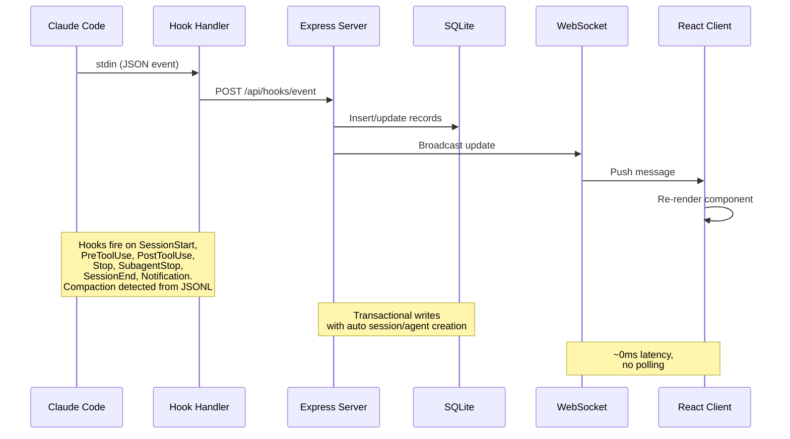

> [¡IMPORTANTE!]
> Consulte [ARCHITECTURE.md](./ARCHITECTURE.md) para una inmersión profunda en la arquitectura del servidor, el esquema de la base de datos, las rutas de la API, el diseño de WebSocket, la enrutación de clientes, el flujo del gestor de ganchos, los modos de despliegue y los diagramas detallados del ciclo de vida para sesiones y agentes.

### Ciclo de vida del gancho

1. **Claude Code** dispara un gancho al inicio de la sesión, al uso de la herramienta, al final de la vuelta, al final de la finalización del subagente y al final de la sesión.
2. **Hook Handler** (`scripts/hook-handler.js`) lee el evento JSON desde stdin, resuelve los paneles de control en vivo a través de `~/.claude/.agent-dashboard.json` (o `CLAUDE_DASHBOARD_PORT` si está configurado), y POSTa la misma carga útil a **un solo destino de ingestión por directorio de datos SQLite único** (el puerto más bajo gana cuando Docker y `npm run dev` comparten `~/.claude/agent-dashboard`, por lo que los eventos nunca se ingieren dos veces). Los servidores con bases de datos **diferentes** (por ejemplo, la aplicación de escritorio que utiliza su propia carpeta de Soporte de Aplicaciones junto con `npm run dev`) todavía reciben cada uno los ganchos. Falla silenciosamente con un tiempo de espera de red de seguridad de 5 s, por lo que nunca bloquea el Código Claude, y las promesas por destino nunca se rechazan, por lo que un único oyente muerto no puede hacer que los demás se mueran de hambre.
3. **Servidor** procesa el evento dentro de una transacción SQLite:
- Crea automáticamente sesiones y agentes principales en el primer contacto
- Detecta las llamadas de la herramienta `Agent` para rastrear la creación de subagentes
- En `SessionStart`, marca la sesión y el `awaiting_input_since` del agente principal para que una nueva CLI que se encuentra en el prompt aterrice inmediatamente en **Esperando**.
- En `UserPromptSubmit` (el usuario presiona enter), borra la bandera de espera y promueve al agente principal a `working` (en funcionamiento): la única señal fiable de que los turnos de asistente de texto han comenzado, ya que no emiten `PreToolUse`.
- Establece al agente como "en funcionamiento" en `PreToolUse` (también borra la bandera de espera), lo mantiene funcionando a través de `PostToolUse`
- En "Detener" (Claude termina de responder), el agente principal va a "esperar" - Claude terminó su turno, la pelota está en el campo del usuario. Los subagentes de fondo continúan corriendo. La sesión permanece "activa". Detener con "stop_reason=error" marca al agente como "error" y a la sesión como "error"
- En una "notificación de permiso" (correspondiente al patrón de mensaje: `permiso`, `esperando entrada`, `necesita su aprobación`, ...), establece al agente como `esperando` y marca `awaiting_input_since`
- `SubagentStop` deliberadamente NO borra la bandera de espera (un subagente en segundo plano que termina no nos dice nada sobre el humano)
- Marca los subagentes completados individualmente a través de `SubagentStop`. Después de que `res.json()` devuelva, dispara un paso `scanAndImportSubagents` de "fire-and-forget" que recorre los archivos `subagents/agent-*.jsonl` de la sesión, empareja los bloques `tool_use` ↔ `tool_result` por `tool_use_id` y emite eventos `PreToolUse` + `PostToolUse` bajo el propio `agent_id` de cada subagente, cerrando la brecha donde las llamadas internas de herramientas de subagentes de otro modo serían invisibles en el panel de control.
- En `SessionEnd` (salida del proceso CLI), elimina la bandera de espera. Si la sesión está en `error`, el estado de error se preserva; de lo contrario, marca a todos los agentes + la sesión como `completada`
- En `SessionStart`, cualquier otra sesión activa sin actividad durante `DASHBOARD_STALE_MINUTES` (por defecto 180 = 3 h, superable por el entorno) se marca automáticamente como "abandonada" con sus agentes completados. Esto maneja `/resume` dentro de una sesión, Ctrl+C, y otros escenarios donde una sesión queda huérfana sin un `SessionEnd` limpio.
- Reactiva las sesiones completadas/erróneas/abandonadas cuando llegan nuevos eventos de trabajo (sesión reanudada). Los eventos Stop y SubagentStop también reactivan las sesiones completadas/abandonadas, lo que se encarga de las sesiones preexistentes importadas antes de que el servidor se iniciara, donde el primer evento de gancho puede ser un Stop
- **Recuperación de errores**: solo `UserPromptSubmit` y `PreToolUse` pueden recuperar una sesión de `error` a `active` — indicando que el usuario intentó activamente de nuevo
- Detecta la compactación de la conversación (entradas `isCompactSummary` en la transcripción JSONL) y crea agentes + eventos de `Compactación`. Las bases de tokens se conservan a lo largo de las compactaciones, por lo que no se pierde ningún uso. Las lecturas de la transcripción utilizan una caché compartida basada en estadísticas con lecturas de desplazamiento de bytes incrementales, solo se analizan los nuevos bytes añadidos desde la última lectura, lo que da una velocidad de ~50 veces mayor para sesiones largas.
- Extrae errores de la API (entradas de `isApiErrorMessage: límites de cuota, límites de tasa, solicitud inválida`) y respuestas brutas de `type: "error"` de transcripciones JSONL, almacenadas como eventos `APIError`. Las duraciones (subtipo `system` `turn_duration`) se almacenan como eventos `TurnDuration`. Los errores de resultado de la herramienta (`toolUseResult.is_error`) se rastrean como eventos `ToolError`.
- **Supervisor de detección de errores**: un temporizador en segundo plano se ejecuta cada 15 segundos, escaneando las sesiones activas sin eventos de conexión recientes (>10 s caducados). Relee sus archivos de transcripción buscando errores de API (fallos de autenticación, límites de tasa, agotamiento de cuotas), deriva los rutas de transcripción desde el directorio actual de la sesión para las sesiones importadas sin `transcript_path` en los datos del evento y marca las sesiones/agentes como `error` cuando se encuentran errores de API. Esto captura casos en los que la CLI de Claude no dispara un gatillo después de un error de API (por ejemplo, 401 fallos de autenticación donde la CLI muestra el error y espera)
- **Recuperación por interrupción del usuario (Esc)**: cancelar un turno con `Esc` no dispara **ningún gatillo** (una limitación documentada del Código Claude), por lo que sin intervención el agente principal se quedaría atascado en `trabajando` para siempre. El mismo vigilante de 15 s recupera estas dos formas: (1) cuando el cancelar deja un marcador `[Solicitud interrumpida por el usuario]` en la transcripción (Esc *después* de alguna salida), la caché de transcripción lo marca a través de `pendingInterrupt` - derivado puramente del ordenamiento de la transcripción (interrupción más reciente vs última actividad real de la ronda, mismo reloj, por lo que funciona incluso para un cancelar de subsegundos) - y la sesión se mueve a **Esperando** dentro de ~15 s; (2) cuando Esc se presiona *antes de cualquier salida*, Claude Code no escribe ningún marcador en absoluto, por lo que se aplica un fallback de tiempo de espera inactivo - si el agente principal ha estado `trabajando` con **sin herramienta en vuelo** y **ni un evento de gancho ni la transcripción han avanzado** durante `DASHBOARD_WORKING_IDLE_SECONDS` (por defecto `120`), la ronda se trata como muerta y la sesión se mueve a **Esperando**. Ambos caminos registran un evento "Interrumpido" y ponen la sesión en el mismo estado de espera que produce una "Detener" normal. La salida de transmisión en vivo (la transcripción sigue creciendo) y las llamadas de herramientas en vuelo (el conjunto `current_tool`) están exentos; un raro falso flip se cura automáticamente en el próximo gancho real
- **Recolección de la vitalidad de la sesión muerta**: salir de Claude Code (Ctrl+C, cerrar el terminal) dispara un gancho `SessionEnd`, pero si el panel de control no está ejecutándose en ese momento, el evento se pierde para siempre y la sesión permanecerá en **Esperando** hasta la limpieza de datos obsoletos (3 horas por defecto). El mismo vigilante de 15 s cierra la brecha con una **probe de vitalidad del proceso**: enumera los procesos CLI de `claude` en ejecución (`ps` + `lsof` en macOS, `/proc` en Linux) y completa cualquier sesión `activa` cuya `cwd` no tenga un proceso claude en vivo, lo que lo lleva al mismo estado `completado` que produce un verdadero `SessionEnd`, con un evento `SessionEnd` sintético en la línea de tiempo. Guardias: en watchdog, el transcurso de la sesión no debe haber sido escrito durante al menos `DASHBOARD_LIVENESS_IDLE_SECONDS` (por defecto `60`; la última escritura del gancho es el reloj de respaldo cuando no existe un transcurso en el disco) — los **pasos de arranque saltan completamente este umbral**, por lo que una sesión que se cierra incluso un segundo antes del lanzamiento se limpia inmediatamente — y la sonda informa de "sin respuesta" (sin cambiar nada) en Windows, dentro de contenedores (los procesos del host son invisibles allí), cuando `ps`/`lsof` fallan, o cuando se deshabilita explícitamente a través de `DASHBOARD_LIVENESS_PROBE=0`. En un despliegue **mezclado**, la cosecha también omite automáticamente cualquier sesión cuyo `cwd` no es absoluto POSIX: una sesión enviada desde otra máquina a través de ganchos domésticos informa del propio camino de la fuente (por ejemplo, un `D:\Git\ai-deck` de Windows) que una escaneo local de `ps`/`lsof`/`/proc` nunca puede igualar, por lo que las sesiones remotas están protegidas sin desactivar la sonda para las genuinamente locales. **Las sesiones de fuente de datos remota** (`sessions.source` ≠ `local`) también se saltan siempre; su `cwd` es legítimamente absoluto POSIX en otra máquina, por lo que la sonda del proceso local no dice nada sobre ellas; su ciclo de vida es completamente propiedad de la reconciliación de sincronización remota descrita anteriormente. Una falsa finalización se auto-curará: el siguiente evento de conexión reactiva la sesión. Además de la cadencia de vigilancia de 15 s, la recolección se ejecuta **inmediatamente al arrancar** (limpiando las sesiones inactivas ya en la base de datos de una ejecución anterior antes de que se rendericen) y **de nuevo ~5 s después** (cubriendo las sesiones que la sincronización de arranque acababa de importar), por lo que una sesión que murió mientras el panel de control estaba inactivo nunca aparece como Esperando.
- Una escaneo periódico del servidor captura sesiones abandonadas y nuevas compactaciones que se han escapado de la detección basada en eventos (por ejemplo, `/compact` no dispara ningún gancho, `/resume` dentro de segundos de la creación de la sesión). La cadencia se deriva de `DASHBOARD_STALE_MINUTES` (¼ del umbral, atado a 60 s - 5 min). La escaneo lee `transcript_path` directamente de cada fila de sesión activa (una pequeña búsqueda de índice) en lugar de escanear la tabla de eventos para ello; la columna se llena por el gestor de ganchos la primera vez que ve un camino de transcripción y se rellena una sola vez desde los eventos existentes por la migración `db.js`, con un índice parcial `idx_sessions_active_tp` que cubre exactamente las filas que lee el escaneo. La limpieza comparte la caché de transcripciones con el gestor de ganchos, evitando la I/O duplicada. La limpieza de sesiones abandonadas también expulsa la entrada de la caché de transcripciones a la memoria vinculada. Tanto esta limpieza como la limpieza inicial de 1 hora saltan las sesiones de **Fuente de datos remota** (`source` ≠ `local`): su `updated_at` rastrea la cadencia de sincronización en lugar de la actividad real de la CLI remota, por lo que su estado se reconcilia desde el espejo por la sincronización en su lugar.
- **Sincronización continua del proyecto** (`startSessionSync`) mantiene `~/.claude/projects` descubrible más allá del relleno de inicio único, con marcadores: un proyecto agregado más tarde cuyas sesiones nunca pasan por los ganchos de otro modo permanecería invisible hasta una escanear manual. Una escanear de inicio inmediata, un `fs.watch` amortiguado (recursivo en macOS/Windows; raíz + hijos inmediatos en Linux) y una consulta `DASHBOARD_SESSION_SYNC_MS` (por defecto 30 s; `0` desactiva la consulta, el observador permanece) comparten una caché de mtime y una escanear coalescida que solo reinterpreta los archivos cuyos mtime ha avanzado — y omite una sesión ya importada e inalterada sin reinterpretar, por lo que el costo de reiniciar se mantiene O(nuevos/archivos cambiados). Cada sesión recién descubierta/crecida emite `session_created`/`session_updated` además de su agente principal, los mismos ganchos de cuadros emiten
4. **WebSocket** transmite el cambio a todos los clientes conectados
5. **UI** recibe la actualización y vuelve a renderizar los componentes afectados en tiempo real sin necesidad de consultar.

### Máquina de Estado del Agente

Estados persistentes: `trabajando | esperando | completado | error`. el
La columna `awaiting_input_since` es suplementaria, rastrea cuándo el agente
Empezó a esperar y se utiliza para la visualización de la duración, pero `esperando` ahora es un
Estado real persistente.

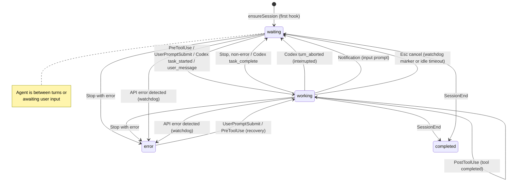

### Máquina de estado de sesión

Estados persistentes: `activo | completado | error | abandonado`. el
El estado de la sesión **esperando** es una superposición de interfaz de usuario (estado=`activo` con
`awaiting_input_since` establecido).

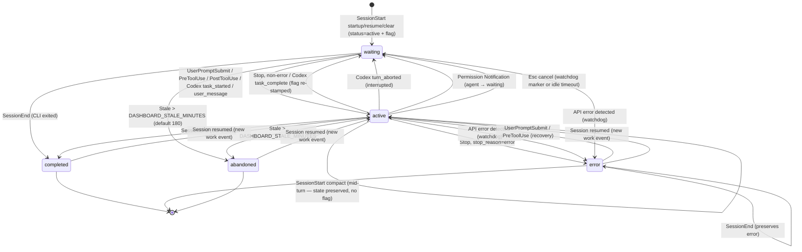

### Flujo de cálculo de costos

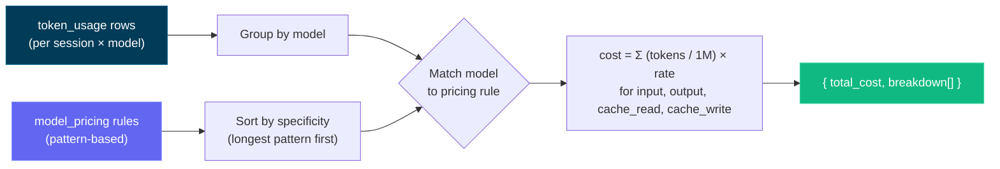

> [¡IMPORTANTE!]
> El flujo de cálculo de costos se basa en el uso de tokens y las reglas de precios del modelo. Asegúrese de que sus reglas de precios estén actualizadas para reflejar costos precisos. Actualice la tabla de precios del modelo a través de la página de Configuración para mantener un seguimiento preciso de los costos, ya que el panel de control no obtiene automáticamente actualizaciones de precios de fuentes externas. Una vez que haya establecido las reglas de precios, el panel de control las aplica retroactivamente a todas las sesiones para un informe de costos consistente.

---

## Configuración

| Variable de entorno | Valor predeterminado | Descripción                                   |
| ----------------------- | ------------- | --------------------------------------------- |
| `DASHBOARD_PORT` | `4820` | Puerto para el servidor Express                   |
| `CLAUDE_DASHBOARD_PORT` | `4820`        | Puerto utilizado por el gestor de ganchos para llegar al servidor |
| `NODE_ENV`              | `desarrollo` | Configurado en `producción` para servir al cliente construido |
| `DASHBOARD_UPDATE_CHECK` | _(activado)_ | Establecido en `0` / `falso` / `desactivado` para desactivar las comprobaciones periódicas de git upstream |
| `DASHBOARD_UPDATE_CHECK_INTERVAL_MS` | `300000` (5 min) | Intervalo entre las comprobaciones automáticas; piso 60 000 ms. Los usuarios también pueden hacer clic en **Comprobar ahora** en la modalidad de actualización o en la barra lateral para ejecutarla a demanda. |
| `DASHBOARD_STALE_MINUTES` | `180` (3 h) | Minutos de inactividad antes de una sesión aún `activa` (incluyendo una sesión en **Esperando** la entrada del usuario — "Esperando" es una superposición de interfaz de usuario en una fila `activa`, no un estado almacenado) se marca automáticamente como **abandonada** y se elimina de la lista activa. Impulsado por el rastreador de 15 s y la limpieza periódica de mantenimiento (que se ejecuta cada ¼ de este valor, restringido a 60 s - 5 min). Baja el valor (por ejemplo, `60`) para un tiempo de espera de inactividad más corto |
| `DASHBOARD_WORKING_IDLE_SECONDS` | `120` | Tiempo de espera de inactividad para recuperar un turno cancelado con `Esc` **antes de cualquier salida** (lo que no deja ningún marcador de transcripción). Cuando el agente principal ha estado `trabajando` sin herramienta en vuelo y ni un evento de gancho ni la transcripción han avanzado tanto tiempo, el vigilante mueve la sesión a **Esperando**. Baja el tiempo para una recuperación más rápida a costa de ocasionales vuelcos falsos en giros largos de pensamiento silencioso (que se auto-curan) |
| `DASHBOARD_LIVENESS_PROBE` | `1` (activado) | Ajustado a `0` para desactivar el **reap de vitalidad de sesiones muertas** del vigilante (la sonda basada en `ps`/`lsof` que completa las sesiones locales `activas` de Claude Code o Codex cuyo proceso CLI correspondiente ya no existe, recuperando un `SessionEnd` perdido mientras el panel estaba inactivo). Las sesiones enviadas desde **otra máquina** (enlaces domésticos) informan de un `cwd` no POSIX y son omitidas automáticamente por el reap, por lo que una implementación local + enviada mixta ya no necesita esto desactivado; desactívalo solo para una configuración puramente remota donde los procesos locales no demuestren nada. Desactivado automáticamente en Windows y dentro de contenedores |
| `DASHBOARD_LIVENESS_IDLE_SECONDS` | `60` | Puerta de inactividad para la cosecha de vitalidad del **tiempo de muestreo del vigilante**: una sesión solo se completa cuando su transcripción no se ha escrito durante al menos este tiempo (la última escritura del gancho es el reloj de respaldo cuando no existe una transcripción en el disco), por lo que una sesión a mitad de turno o recién reanudada nunca se apaga en una falta de prueba transitoria. El arranque pasa por alto esta puerta: al arrancar, la prueba sola decide, por lo que las sesiones se cierran momentos antes del lanzamiento, se limpia inmediatamente |
| `DASHBOARD_TASK_SUMMARY_TTL_MS` | `2000` | Ventana de tolerancia para servir datos obsoletos (ms) para la caché de progreso de tareas por transcripción detrás de las peticiones de lista `include_task_progress` **y** del `todo_snapshot` del detalle de sesión. Una transcripción a la que se está añadiendo contenido activamente casi nunca acierta en la clave de caché size+mtime, así que sin este mínimo una ráfaga de recargas de lista (por ejemplo, el panel refrescándose con cada evento WebSocket disparado por un gancho) vuelve a analizar por completo una transcripción activa de varios MB en cada petición. Dentro de la ventana se devuelve el resultado recién analizado (ligeramente obsoleto, solo para visualización); ponlo a `0` para restaurar el reanálisis inmediato en cada cambio |
| `DASHBOARD_SESSION_SYNC_MS` | `30000` | Intervalo de encuesta (ms) para la sincronización continua de fondo `~/.claude/projects` que muestra los proyectos añadidos después del inicio que nunca pasan por los ganchos. El observador `fs.watch` dispara casi instantáneamente independientemente; esta encuesta es la red de seguridad (los observadores pueden perder eventos / no disparar en los sistemas de archivos de red). Ajustado a `0` para desactivar la encuesta mientras deja que el observador funcione |
| `DASHBOARD_CODEX_HOME` | `CODEX_HOME` o `~/.codex` | Directorio de estado local de Codex opcional. En Configuración, guardar una nueva ubicación persiste esta anulación exclusiva del panel, reactiva la supervisión en vivo y analiza inmediatamente el nuevo árbol `sessions/`. |
| `DASHBOARD_CODEX_HOOK_IDLE_SECONDS` | `60` | Cuánto puede una sesión de Codex **solo de hooks** — una cuya ejecución no escribió ningún rollout en disco (`codex exec --ephemeral`) — dejar sin respuesta un turno ya reportado como terminado antes de que el panel concluya que su hook `SessionEnd` se perdió. Solo es elegible una sesión cuyo `awaiting_reason` sea `stop`: Codex envía `SessionEnd` unos cientos de ms después de `Stop`, así que un `Stop` sin respuesta es evidencia real. El silencio deliberadamente nunca es el disparador — una ejecución sin rollout no emite ningún hook durante toda una llamada de herramienta, así que una regla basada en inactividad completaría una compilación de CI en curso |
| `DASHBOARD_REMOTE_SYNC_MS` | `15000` (15 s) | Intervalo de encuesta (ms) para la sincronización de fondo de **Fuentes de datos remotas** que obtiene de forma independiente `~/.claude/projects` y `~/.codex/sessions` de cada remoto habilitado (además del índice ligero `session_index.jsonl` de Codex), y las reimporta mediante sus importadores locales. Las fuentes nuevas/habilitadas también se sincronizan inmediatamente. Ajustado a `0` para desactivar el encuestador (las sincronizaciones manuales/a pedido todavía funcionan) |
| `DASHBOARD_REMOTE_ACTIVE_WINDOW_MS` | `600000` (10 min) | Ventana de frescura para el estado en vivo de una sesión de **Fuente de datos remota**. En cada sincronización, una sesión remota de Claude Code o Codex cuyo transcript reflejado correspondiente tiene un **último evento JSONL** dentro de esta ventana se trata como si aún estuviera en ejecución (`activa`); una vez que el espejo deja de avanzar más tiempo, la sesión se reconcilia con `completada`. Las sesiones remotas no reciben ganchos en vivo, por lo que la reconciliación del espejo por proveedor sustituye a la comprobación local de actividad; los espejos de proveedores con error, no disponibles o atascados recurren a la limpieza normal por inactividad. Aumente esto para enlaces lentos o giros de inactividad muy largos |
| `DASHBOARD_REMOTE_SYNC_TIMEOUT_MS` | `600000` (10 min) | Tiempo de espera por fuente (ms) para una sincronización remota única (`scp` pull + importación) antes de que se aborte |
| `DASHBOARD_REMOTE_TEST_TIMEOUT_MS` | `15000` (15 s) | Tiempo de espera (ms) para la sonda SSH de **Prueba** (`POST /api/remote-sources/:id/test`) que verifica que una fuente remota es accesible |
| `DASHBOARD_HOST` | `127.0.0.1` | Interfaz a la que el servidor se vincula. Retroceso por defecto (no accesible desde la red). Ajustado a `0.0.0.0` para exponerse en una LAN (registra una advertencia de inicio) |
| `DASHBOARD_TOKEN`       | _(no establecido)_     | Cuando está establecido, cada solicitud `/api/*` y el WebSocket deben presentar el token (`Autorización: Portador <token>`, encabezado `x-dashboard-token` o `?token=`). Desactivado por defecto, la vinculación de bucle es el límite de confianza |
| `DASHBOARD_ALLOWED_HOSTS` | _(loopback)_ | Se permiten valores adicionales de `Host` separados por coma en las actualizaciones de HTTP + WebSocket (guarda de rebinde DNS). Añada sus nombres de host LAN aquí cuando se vincule más allá del loopback |

> [¡IMPORTANTE!]
> **Seguro por defecto.** El servidor vincula `127.0.0.1` y **no** es alcanzable desde la red de fábrica ([GHSA-gr74-4xfh-6jw9](./.github/SECURITY.md)). Para exponerlo en una LAN, configure **ambos** `DASHBOARD_HOST` (por ejemplo, `0.0.0.0`) **y** `DASHBOARD_TOKEN` (que luego bloquea `/api/*` y el WebSocket), y enumere los nombres de host de su LAN en `DASHBOARD_ALLOWED_HOSTS`. Consulte [`.env.example`](./.env.example) y [`.github/SECURITY.md`](./.github/SECURITY.md) para obtener más detalles.

Para los clones de git, el servidor `git fetch` periódicamente `origin` y compara tu salida con `origin/master`, `origin/main` o `origin/HEAD`. Cuando estás atrasado, aparece un mensaje en el terminal del servidor y aparece una modal en la interfaz de usuario con el comando exacto para ejecutar. El panel nunca se carga ni se reinicia por sí mismo: copias el comando, lo ejecutas en un terminal y luego reinicias el servidor de la misma manera en que lo iniciaste.

---

## CLI `ccam`

La superficie completa de funciones del panel de control también está disponible desde cualquier terminal a través de la CLI **`ccam`** sin dependencias (`bin/ccam.js`). Se vincula automáticamente por `npm run setup` (a través de `npm link`), después de lo cual `ccam <command>` funciona desde cualquier directorio. Descubre el panel de control en ejecución a través de `~/.claude/.agent-dashboard.json` (el mismo registro de servidor en vivo que utiliza el gestor de ganchos), con las sobrepasadas de las variables de entorno `CLAUDE_DASHBOARD_PORT` / `DASHBOARD_PORT`, cayendo en `http://127.0.0.1:4820`.

```bash
# Server
ccam status                       # ● running / ○ not running indicator
ccam start [--port N]             # start the server in the background (detached)
ccam repl                         # interactive shell (also: shell, i)

# Monitoring
ccam health                       # is the dashboard up?
ccam stats                        # totals, today's events, status distributions
ccam kanban                       # sessions + agents grouped by status columns
ccam tail [--session <id>]        # live event feed in the terminal (Ctrl+C stops)

# Data
ccam sessions [--status s] [--q text] [--limit n]
ccam session <id>                 # detail: agent tree, cost, recent events
ccam agents   [--status s] [--session id]
ccam events   [--session id] [--limit n]

# Insights
ccam analytics                    # token totals, top tools, agent types
ccam workflows [--session id]     # workflow intelligence stats and patterns
ccam runs [--session id]          # dynamic Workflow-tool runs
ccam cost [--session <id>]        # total estimated cost with per-model breakdown
                                  # (--session scopes to one; shows tool surcharges;
                                  #  warns about models with usage but no pricing rule)

# Alerts & webhooks
ccam alerts [--unacked]           # fired-alert feed
ccam alerts ack <id> | ack-all    # acknowledge alerts
ccam rules                        # list alert rules
ccam webhooks                     # list webhook targets
ccam webhooks test <id>           # send a synthetic test alert

# Pricing
ccam pricing                      # list model pricing rules (incl. fast-mode & intro columns)
ccam pricing set <pattern> --input N --output N [--cache-read N --cache-write N]
                 [--cache-write-1h N] [--fast-input N --fast-output N]
                 [--intro-input N --intro-output N … --intro-until YYYY-MM-DD]
ccam pricing delete <pattern>
ccam pricing reset

# Import
ccam import rescan                # re-scan ~/.claude/projects
ccam import path <dir>            # import every .jsonl under a directory

# Administration
ccam doctor                       # connectivity, hooks, and database diagnosis
ccam info                         # raw system info JSON
ccam export [file.json]           # full JSON data export
ccam import-data <file.json>      # restore an export (idempotent, non-destructive)
ccam cleanup --hours N --days M   # abandon stale / purge old sessions
ccam reinstall-hooks              # reinstall Claude Code hooks
ccam update-check                 # is the checkout behind upstream? (prints the update command)
ccam clear-data --yes             # delete ALL data (requires --yes)
ccam open                         # open the dashboard in your browser
ccam version                      # print the CLI version (also --version / -v)
```

Los comandos respaldados por API necesitan que el servidor esté en ejecución, cuando no lo está, **los comandos de solo lectura recurren a la lectura directa de `data/dashboard.db`** (con un banner explícito de `⚠ Modo sin conexión`, y las sesiones `activas` almacenadas pero inactivas corregidas por el mismo proceso de detección de actividad que utiliza el rastreador del servidor), mientras que los comandos que no pueden ejecutarse correctamente sin el servidor (`tail` en vivo, análisis/matemáticas de costos, mutaciones) imprimen el indicador `○ El servidor del panel de control NO está en ejecución` con la razón específica y los comandos de inicio; `ccam start` inicia un servidor de producción en segundo plano. Los comandos de lectura siempre son seguros; el único comando destructivo (`clear-data`) se niega a ejecutarse sin un explícito `--yes`. La salida es una interfaz de usuario completa del terminal: tablas dibujadas en cuadrados con columnas numéricas alineadas a la derecha, iconos de estado (`● activo`, `○ esperando`, `✔ completado`, `✖ error`), gráficos de barras en línea para estadísticas/análisis/costes y árboles de agentes reales `├─`/`└─`: con los colores ANSI habilitados automáticamente en un TTY, desactivados cuando se canalizan y controlables a través de `--no-color` / `NO_COLOR` / `FORCE_COLOR`. Para una sesión de monitoreo en vivo, **`ccam repl`** (alias `shell` / `i`) abre un shell interactivo donde escribes comandos sin el prefijo `ccam` — con un banner de bienvenida CCAM, completado de pestañas, historial persistente de teclas de flecha, una solicitud de estado del servidor en vivo (`● host` arriba / `○ offline` abajo), un menú `help` / `help <cmd>` agrupado y un `watch [secs] <cmd>` incorporado que actualiza automáticamente cualquier comando (por ejemplo, `watch 5 kanban`); cada línea se ejecuta como un proceso hijo aislado, por lo que una negativa fuera de línea o un `tail` bloqueante nunca derriba el shell. Si `ccam` no está en tu PATH (por ejemplo, Se necesitan permisos elevados para `npm link`, ejecute `npm link` una vez desde la raíz del repositorio. Referencia completa: banderas, orden de descubrimiento, el REPL, modelo de seguridad, scripts/códigos de salida, resolución de problemas, en [docs/CLI.md](./docs/CLI.md).

## Scripts npm

| Comando                 | Descripción                                                |
| ----------------------- | ---------------------------------------------------------- |
| `npm run setup`         | Instalar dependencias de root, cliente, extensión y MCP, compilar MCP y enlazar `ccam` |
| `npm run update:pull-setup` | `git pull --ff-only` luego `npm run setup` (actualización manual) |
| `npm run dev`           | Iniciar el servidor (modo de observación) + el cliente (Vite HMR) de forma concurrente |
| `npm run dev:server` | Inicia solo el servidor Express con `--watch` |
| `npm run dev:client` | Iniciar solo el servidor de desarrollo Vite                             |
| `npm run build`         | Construir el cliente React en `client/dist/`                   |
| `npm start`             | Iniciar el servidor de producción (sirve al cliente construido)              |
| `npm test`              | Ejecuta la suite completa (servidor `node --test` + cliente Vitest)  |
| `npm run test:server` | Ejecutar pruebas de backend (`node --test server/__tests__/`) |
| `npm run test:client` | Ejecuta las pruebas de Vitest de la interfaz de usuario, incluidas **capturas de pantalla de renderizado para cada pantalla** (`client/src/pages/__tests__/screens.snapshot.test.tsx`); regenera las líneas de base después de cambios intencionados en la interfaz de usuario con `cd client && npx vitest run -u` |
| `npm run install-hooks` | Configurar los ganchos de código Claude en `~/.claude/settings.json` |
| `npm run seed`          | Rellenar la base de datos con datos de muestra                         |
| `npm run import-history`| Importar sesiones heredadas desde `~/.claude/` (también se ejecuta al iniciar la sesión) |
| `npm run reconcile-tokens`| Actualizar los totales de tokens de las sesiones importadas (nunca reduce un total existente) |
| `npm run repair-tokens` | Volver a derivar los totales de tokens **ajenos a workflow** de todas las sesiones de **Claude** cuya transcripción siga en disco (localizada en `~/.claude/projects/` o mediante el `transcript_path` guardado de la sesión) y poner a cero las líneas base de compactación; las filas de workflow y de Codex se conservan. Reparación única para bases de datos infladas por la suma de usage por registro anterior a v2.0.9. Detén el dashboard primero |
| `DASHBOARD_TOKEN_REPAIR` | `1` (activado) | Reparación automática única de los totales de tokens inflados antes de que el uso se reconciliara por `message.id`. `replaceTokenUsage` es una marca de nivel máximo, así que la corrección del analizador por sí sola nunca puede bajar un total histórico: sin este paso, cada sesión anterior a la actualización conserva su coste inflado para siempre. Se ejecuta una vez por base de datos (con marcador, diferida fuera del arranque, omitida si otro dashboard comparte el directorio de datos) y guarda primero las filas antiguas en `token_usage_pre_repair`. Ponlo a `0` para omitirla y reparar a mano con `npm run repair-tokens` |
| `npm run clear-data` | Eliminar todas las sesiones, agentes, eventos y uso de tokens |
| `npm run mcp:install` | Instalar dependencias para el paquete MCP local (`mcp/`) |
| `npm run mcp:build` | Construir el servidor MCP TypeScript en `mcp/build/` |
| `npm run mcp:start` | Iniciar el servidor MCP (transporte stdio — para hosts MCP) |
| `npm run mcp:start:http`| Iniciar el servidor MCP (transporte HTTP + SSE en el puerto 8819)      |
| `npm run mcp:start:repl`| Iniciar el servidor MCP (REPL interactivo con completación de pestañas) |
| `npm run mcp:dev`       | Ejecutar el servidor MCP en modo dev (`tsx`, stdio)                 |
| `npm run mcp:dev:http` | Ejecutar el servidor MCP en modo de desarrollo (`tsx`, HTTP + SSE) |
| `npm run mcp:dev:repl` | Ejecutar el servidor MCP en modo de desarrollo (`tsx`, REPL interactivo) |
| `npm run mcp:typecheck` | Verificar el tipo de la fuente MCP sin emitir la salida de la compilación |
| `npm run mcp:docker:build` | Construir la imagen del contenedor MCP con Docker (`agent-dashboard-mcp:local`) |
| `npm run mcp:podman:build` | Construir la imagen del contenedor MCP con Podman (`localhost/agent-dashboard-mcp:local`) |
| `npm run desktop:install` | Instala Electron + electron-builder en el espacio de trabajo `desktop/` (reconstruye `better-sqlite3` para la ABI de Electron); realiza pruebas preliminares de la construcción nativa de `better-sqlite3` e imprime ayuda de configuración factible (incluyendo una alternativa sin cadena de herramientas) en caso de fallo |
| `npm run desktop:dev` | Construye y lanza la aplicación Electron para escritorio para iteraciones locales |
| `npm run desktop:build` | Compila las fuentes TypeScript del escritorio en `desktop/out/`      |
| `npm run desktop:test` | Ejecuta la prueba de humo del escritorio (inicia Electron, prueba `/api/health`) |
| `npm run desktop:dmg` | Construir **ambos** DMG de macOS (arm64 + x64) - correctos para la versión, **más lentos** (paquetes para cada arquitectura) |
| `npm run desktop:dmg:arm64` | Construye un DMG solo de Apple-Silicona - **rápido**, recomendado para tu propio Mac |
| `npm run desktop:dmg:x64` | Construye un DMG solo para Intel — **rápido**                           |
| `npm run desktop:dmg:universal` | Construye un DMG **universal** fusionado (arm64 + x86_64) - opcional, **más lento**, no es lo que se envía con la versión |
| `npm run desktop:win` | Construir un instalador **NSIS** para Windows `.exe` (x64) — ejecutar en Windows |
| `npm run desktop:win:portable` | Construir un **portátil** de Windows (sin instalar) `.exe` (x64) — ejecutar en Windows |
| `npm run monitoring:install` | Ejecuta `npm install` en `monitoring/` — descarga Prometheus + Grafana a través de `postinstall` |
| `npm run monitoring:setup` | Alias para `monitoring:install` |
| `npm run monitoring:up` | Iniciar Prometheus (:9090) + Grafana (:3000) en segundo plano (sin Docker) |
| `npm run monitoring:down` | Detener la pila de monitoreo gestionada por npm |
| `npm run monitoring:start` | Pilas de monitoreo en primer plano (Ctrl+C detiene ambas) |
| `npm run monitoring:docker:up` | Iniciar Prometheus + Grafana a través de Docker Compose |
| `npm run monitoring:docker:down` | Desmontar la pila de monitoreo de Docker |
| `npm run monitoring:verify` | Panel de control de verificación de salud, Prometheus, Grafana y scraping de destino |
| `npm run docker:up` | Iniciar el panel de control en Docker (`docker compose up -d --build`) |
| `npm run docker:down` | Detener el contenedor del panel de control |
| `npm run docker:full:up` | Panel de control + Prometheus + Grafana, todo en Docker |
| `npm run docker:full:down` | Desmontar la pila Docker completa |

---

## Extensión de agentes

Este repositorio incluye una capa de extensión integral tanto para Claude Code como para Codex:

- Código Claude: `CLAUDE.md`, `.claude/rules/`, `.claude/skills/`
- Subagentes de Claude: `.claude/agents/`
- Codex: `AGENTS.md`, `.codex/rules/`, `.codex/agents/`, `.codex/skills/`

### Arquitectura de extensión

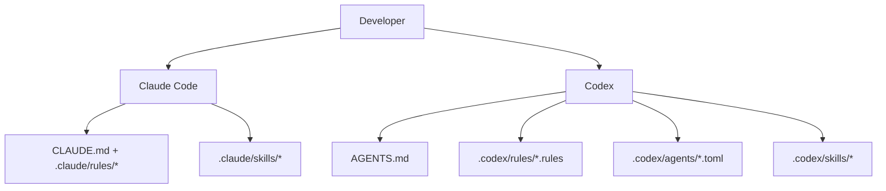

### Capa de código Claude

- Contexto persistente:
- [`CLAUDE.md`](./CLAUDE.md)
- Reglas de alcance de ruta:
- [`.claude/rules/backend-node.md`](./.claude/rules/backend-node.md)
- [`.claude/rules/frontend-react.md`](./.claude/rules/frontend-react.md)
- [`.claude/rules/mcp-typescript.md`](./.claude/rules/mcp-typescript.md)
- [`.claude/rules/docs-markdown.md`](./.claude/rules/docs-markdown.md)
- Habilidades:
- `repo-onboarding`
- `característica de envío`
- `version-release`
- `mcp-operaciones`
- `debug-live-issue`
- Subagentes:
- `revisor de backend`
- `revisor de frontend`
- `mcp-revisor`

### Capa del Codex

- Contexto persistente:
- [`AGENTES.md`](./AGENTES.md)
- Política de ejecución:
- [`.codex/rules/default.rules`](./.codex/rules/default.rules)
- Plantillas de subagentes personalizadas:
- [`.codex/agents/`](./.codex/agents)
- Habilidades:
- [`.codex/skills/`](./.codex/skills)
- Configuración:
- [`.codex/README.md`](./.codex/README.md)

---

## Integración MCP

Este proyecto incluye un servidor MCP local de grado de producción en `mcp/` que expone las operaciones del panel de control como herramientas para agentes de IA. Soporta tres modos de transporte para adaptarse a diferentes escenarios de integración.

### Modos de transporte MCP

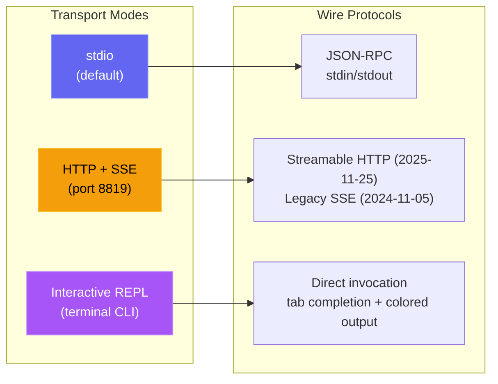

| Modo | Comando | Caso de uso |
| --- | --- | --- |
| **stdio** | `npm run mcp:start` | Código Claude, Claude Desktop, hosts IDE MCP |
| **HTTP** | `npm run mcp:start:http` | Clientes MCP remotos, integraciones web, múltiples sesiones |
| **REPL** | `npm run mcp:start:repl` | Debug de operaciones, invocación manual de herramientas, administrador local |

<p align="center">

</p>

### Arquitectura MCP

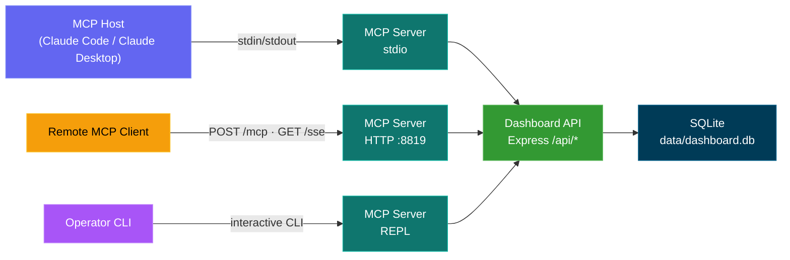

### Superficie de la herramienta MCP

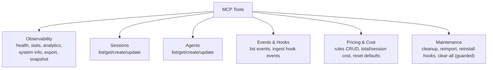

### Modelo de seguridad MCP

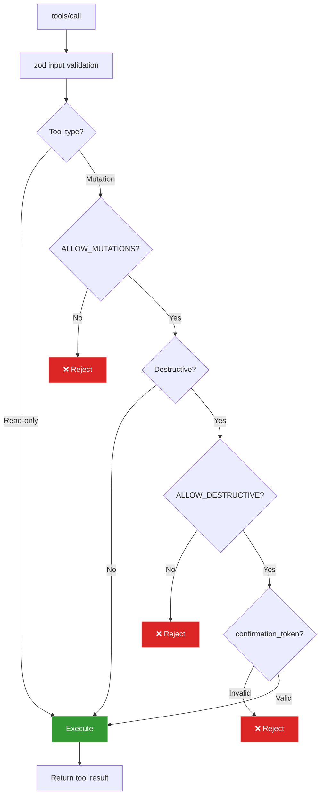

### Modos operativos del MCP

- Modo de lectura única (por defecto): `MCP_DASHBOARD_ALLOW_MUTATIONS=false`
- Modo de administrador: `MCP_DASHBOARD_ALLOW_MUTATIONS=true`
- Autenticación: `MCP_DASHBOARD_API_TOKEN` (con `DASHBOARD_API_TOKEN` como respaldo) debe coincidir con `DASHBOARD_TOKEN`
- Protección de transporte: HTTP de loopback directo puede llevar el token; los alias de host de contenedor exigen HTTPS; todas las redirecciones se rechazan
- Protección de carga: 50 MiB por archivo de historial, 100 MiB por llamada, 10 MiB para respuestas binarias y 25 MiB para restaurar copias
- Modo destructivo: requiere ambos:
- `MCP_DASHBOARD_ALLOW_MUTATIONS=true`
- `MCP_DASHBOARD_ALLOW_DESTRUCTIVE=true`
- entrada de la herramienta `confirmation_token: "CLEAR_ALL_DATA"`

Detalles completos: [mcp/README.md](./mcp/README.md)

---

## Referencia de API

Todos los puntos finales devuelven JSON. Las respuestas de error siguen la forma `{ error: { código, mensaje } }`.

### OpenAPI / Swagger / ReDoc

Hay tres maneras de explorar la API HTTP, todas impulsadas por una sola especificación OpenAPI 3.0.3 (Puerto de servidor predeterminado `4820`):

| Método | Camino                            | Descripción                                                                                       |
| ------ | ------------------------------- | ------------------------------------------------------------------------------------------------- |
| `GET` | `/api/openapi.json` | Especificación JSON Raw OpenAPI 3.0.3                                                                                 |
| `GET` | `/api/docs`                     | **Interactiva interfaz de usuario Swagger** — ejecución de la solicitud de prueba                                         |
| `GET` | `/api/redoc`                    | Referencia de **ReDoc**: una renderización limpia y optimizada para lectura de tres paneles de la misma especificación |
| `GET` | `/api/redoc/redoc.standalone.js` | Paquete ReDoc alojado por sí mismo (servido localmente a través de la dependencia `redoc`, nunca un CDN, funciona sin conexión) |

El documento OpenAPI se genera desde `server/openapi.js` (`createOpenApiSpec()`), fusionado con fragmentos suplementarios en `server/openapi-extra/`. Tanto la interfaz de usuario Swagger como ReDoc son servidas directamente por el backend; el paquete ReDoc se sirve localmente (`GET /api/redoc/redoc.standalone.js`), por lo que la referencia funciona completamente sin conexión a Internet, consistente con la política del proyecto de no tener recursos externos.

La cobertura es completa: cada ruta de backend está documentada (82 entradas de ruta) en estas etiquetas: Salud, Sesiones, Agentes, Eventos, Estadísticas, Métricas, Análisis, Ganchos, Precios, Flujos de trabajo, Configuración, Actualizaciones, Alertas, Webhooks, Push, CcConfig (explorador de configuración de Claude Code), Ejecución (ejecuciones iniciadas por el panel de control) y Documentación, cada una con parámetros, esquemas de solicitud/respuesta, descripciones a nivel de campo y ejemplos realistas.

Un **`openapi.yaml`** comprometido en la raíz del repositorio refleja la especificación en vivo. Se genera a partir de `server/openapi.js` (nunca editado manualmente) - regeneréalo después de los cambios en la API con:

```bash
npm run openapi:yaml
```

### Métricas de Prometheus y Grafana

`GET /api/metrics` expone los contadores en vivo del panel de control: sesiones/agentes por estado, totales de eventos y tokens, clientes conectados en tiempo real, fuentes remotas configuradas, tiempo de actividad del proceso/memoria y versión de la compilación, en el formato de exposición de texto de Prometheus, para que CCAM pueda ser raspado en su propia pila de observabilidad. Una pila Prometheus + Grafana lista para usar con **cuatro paneles de control auto-provisionados** (página de inicio predeterminada: **CCAM - Visión general**) se encuentra en [`monitoring/`](./monitoring/README.md).

**npm (sin Docker - macOS, Linux o Windows):**

```bash
npm start                          # dashboard on :4820
npm run monitoring:install         # one-time: npm postinstall pulls binaries
npm run monitoring:up              # Grafana on :3000; consulte monitoring/README.md para las credenciales
```

**Docker / Podman** (cuando el panel de control se ejecuta en un contenedor o prefieres Compose):

```bash
# Dashboard only
npm run docker:up

# Dashboard + Prometheus + Grafana (one command)
npm run docker:full:up

# Or mix: native/docker dashboard + docker monitoring
DASHBOARD_ALLOWED_HOSTS=host.docker.internal npm start   # or docker:up with same env
npm run monitoring:docker:up
npm run monitoring:verify
```

<p align="center">

<br>
<em>📊 <strong>Grafana · CCAM — Descripción general</strong> — panel de control principal predeterminado (cuatro tableros provistos automáticamente): instantánea de la flota, totales de la base de datos, gráficos de desglose y tarifas — todo desde raspados en vivo de <code>/api/metrics</code></em>
</p>

<p align="center">

<br>
<em>🔥 <strong>Prometheus · Consola CCAM</strong> — página de inicio preconstruida en <code>/consoles/index.html</code> que consulta directamente a Prometheus para obtener la salud de la escraping, los totales de sesiones, los eventos, los tokens y los enlaces de gráfico para profundizar</em>
</p>

<p align="center">

<br>
<em>📈 <strong>Prometheus · Gráfico</strong> — ejecute PromQL contra métricas CCAM raspadas (por ejemplo, <code>sum(ccam_sessions)</code>, <code>ccam_events_total</code>, <code>rate(ccam_tokens_total[5m])</code>) con enlaces de inicio desde la consola CCAM y <a href="./monitoring/README.md">monitoring/README.md</a></em>
</p>

Consulte [docs/API.md → Metricas](./docs/API.md#metrics) para obtener la lista completa de métricas y los detalles de scraping/autenticación.

<p align="center">

</p>

<p align="center">

</p>

### Salud

| Método | Camino | Descripción                           |
| ------ | ------------- | ------------------------------------- |
| `GET` | `/api/health` | Devuelve `{ status: "ok", timestamp }` |

### Sesiones

| Método | Ruta                                | Parámetros de la consulta                                                                 | Descripción                                                                                  |
| ------- | ------------------------------- | ---------------------------------------------------------------- | -------------------------------------------------------------------------------------------- |
| `GET` | `/api/sessions`                 | `status`, `q`, `limit`, `offset`                                 | Lista las sesiones con el número de agentes y el costo por sesión. `q` realiza una búsqueda insensible a mayúsculas y minúsculas en `id` / `name` / `cwd`. `limit` por defecto es 50, máximo 10000. La respuesta incluye `total` para los paginadores. |
| `GET` | `/api/sessions/:id` | --                                                                | Detalles de la sesión con agentes y eventos                                                        |
| `GET` | `/api/sessions/:id/stats` | --                                                                 | Contas agregadas que alimentan el panel de resumen de detalles de la sesión: eventos, eventos por tipo, uso principal de las herramientas, número de errores, contadores de tipo/estatus del agente, desglose del tipo de subagente, totales de tokens, rango de tiempo |
| `GET` | `/api/sessions/:id/transcripts` | --                                                               | Lista de transcripciones JSONL disponibles para la sesión (principales + subagentes + compactaciones)            |
| `GET` | `/api/sessions/:id/transcript` | `agent_id`, `limit`, `offset`, `after`, `before` | Transmite mensajes de un transcripción específica con paginación basada en el cursor. El `uso` del asistente incluye `input_tokens`, `output_tokens`, `cache_read_input_tokens`, `cache_creation_input_tokens`, por lo que el medidor de la página de Ejecución puede hidratarse completamente al reiniciar / volver a adjuntar |
| `POST` | `/api/sessions`                 | --                                                               | Crear sesión (idempotente en `id`)                                                          |
| `PATCH` | `/api/sessions/:id`             | --                                                               | Actualizar el estado/metadata de la sesión                                                               |

### Agentes

| Método | Ruta | Parámetros de la consulta | Descripción |
| ------- | ----------------- | ----------------------------------------- | ----------------------------- |
| `GET` | `/api/agents` | `status`, `session_id`, `limit`, `offset` | Lista de agentes con filtros |
| `GET` | `/api/agents/:id` | --                                        | Detalles de un solo agente |
| `POST` | `/api/agents` | --                                        | Crear agente                  |
| `PATCH` | `/api/agents/:id` | --                                        | Actualizar el estado/tarea/herramienta del agente |

### Eventos

| Método | Ruta | Parámetros de la consulta | Descripción |
| ------ | ------------- | ------------------------------- | -------------------------- |
| `GET` | `/api/events` | `session_id`, `limit`, `offset` | Lista de eventos (los más recientes primero) |

### Estadísticas

| Método | Camino | Descripción                                            |
| ------ | ------------ | ------------------------------------------------------ |
| `GET` | `/api/stats` | Contas agregadas, distribuciones de estado, conexiones WS |

### Análisis

| Método | Camino | Descripción                                                |
| ------ | ---------------- | ---------------------------------------------------------- |
| `GET` | `/api/analytics` | Agregados de tokens/herramientas/sesiones para gráficos y vistas de tendencias |

### Fuentes de datos remotas

| Método | Ruta                            | Parámetros de la consulta | Descripción                                                                                 |
| -------- | ------------------------------- | ------------ | ------------------------------------------------------------------------------------------- |
| `GET` | `/api/remote-sources` | -- | Lista de fuentes remotas configuradas con estado, último error y conteos de última sincronización |
| `POST` | `/api/remote-sources` | -- | Crear una fuente. Cuerpo: `{ label, host, ssh_port?, identity_file?, remote_home?, remote_codex_home?, enabled? }` |
| `PATCH` | `/api/remote-sources/:id` | -- | Actualizar una fuente (etiqueta, campos de conexión, habilitado)                                         |
| `ELIMINAR` | `/api/remote-sources/:id`       | `purge`      | Eliminar una fuente; `?purge=true` también elimina las sesiones importadas de esa fuente' |
| `POST` | `/api/remote-sources/:id/test` | --           | Probar la conectividad SSH a la fuente                                                        |
| `POST` | `/api/remote-sources/:id/sync` | --           | Extraiga e importe de nuevo desde la fuente ahora                                                      |

`GET /api/sessions`, `/api/events`, `/api/agents`, `/api/stats`, y `/api/analytics` también aceptan un parámetro de consulta opcional `sources` (ids de fuente separados por coma; omitir para todos) para restringir los resultados por origen, y `GET /api/sessions/facets` devuelve una matriz `sources` para el selector de rango de datos.

### Ganchos

| Método | Camino | Descripción                                  |
| ------ | ------------------ | -------------------------------------------- |
| `POST` | `/api/hooks/event` | Recibir y procesar un evento de gancho de código Claude |

**Peso de carga del evento de conexión:**

```json
{
  "hook_type": "PreToolUse",
  "data": {
    "session_id": "abc-123",
    "tool_name": "Bash",
    "tool_input": { "command": "ls -la" }
  }
}
```

### Precios

| Método | Ruta                     | Descripción                              |
| -------- | ------------------------ | ---------------------------------------- |
| `GET` | `/api/pricing` | Lista todas las reglas de precios |
| `PUT` | `/api/pricing` | Crear o actualizar una regla de precios |
| `ELIMINAR` | `/api/pricing/:pattern` | Eliminar una regla de precios                    |
| `GET` | `/api/pricing/cost` | Costo total de todas las sesiones |
| `GET` | `/api/pricing/cost/:id` | Desglose de costos para una sesión específica |

### Flujos de trabajo

| Método | Camino                          | Descripción                                             |
| ------ | ----------------------------- | ------------------------------------------------------- |
| `GET` | `/api/workflows` | Agrupa los datos del flujo de trabajo (orquestación, herramientas, patrones). El filtro opcional de la consulta `?status=active\|completed` filtra todas las 11 secciones de datos por el estado de la sesión |
| `GET` | `/api/workflows/session/:id` | Entrenamiento por sesión (árbol de agentes, cronología de herramientas, eventos) |

### Alertas

| Método | Ruta                     | Descripción                                                                 |
| -------- | ------------------------ | ---------------------------------------------------------------------- |
| `GET` | `/api/alerts` | Feed de alertas de disparos, desde el más reciente primero (`?unacked=true`, `limit`, `offset`) |
| `POST` | `/api/alerts/:id/ack` | Reconocer una alerta                                                  |
| `POST` | `/api/alerts/ack-all` | Reconocer cada alerta no reconocida                                        |
| `GET` | `/api/alerts/rules` | Lista de reglas de alertas                                                       |
| `POST` | `/api/alerts/rules` | Crear una regla (`event_pattern` \| `inactivity` \| `status_duration` \| `token_threshold`) |
| `PATCH` | `/api/alerts/rules/:id` | Actualizar nombre / configuración / habilitado / tiempo de espera (el tipo de regla es inmutable) |
| `ELIMINAR` | `/api/alerts/rules/:id` | Eliminar una regla y su historial de alertas activadas |

### Webhooks

| Método | Ruta                                | Descripción                                                                                |
| -------- | --------------------------------- | ------------------------------------------------------------------------------------ |
| `GET` | `/api/webhooks/providers` | Proveedores compatibles + sus campos de configuración (ejecuta el formulario de la interfaz de usuario) |
| `GET` | `/api/webhooks`                   | Lista de objetivos de webhook (URLs encriptadas, secretos redactados)                                 |
| `POST` | `/api/webhooks`                   | Crear un objetivo (14 proveedores de primera clase + `genérico`)                               |
| `PATCH` | `/api/webhooks/:id`               | Actualizar nombre / URL / habilitado / secreto / encabezados / alcance de la regla (el tipo es inmutable)      |
| `ELIMINAR` | `/api/webhooks/:id`               | Eliminar un objetivo y su registro de entrega                                                 |
| `POST` | `/api/webhooks/:id/test` | Enviar una alerta de prueba sintética y informar el resultado de la entrega                           |
| `GET` | `/api/webhooks/:id/deliveries` | Registro de entregas recientes para un objetivo (`limit`, `offset`)                                  |

### Configuración

| Método | Camino                           | Descripción                                      |
| ------ | ------------------------------ | ------------------------------------------------ |
| `GET` | `/api/settings/info` | Información del sistema, estadísticas de la base de datos, estado del gancho |
| `POST` | `/api/settings/clear-data` | Eliminar todas las sesiones, agentes, eventos, uso de tokens |
| `POST` | `/api/settings/reimport`       | Reimportar sesiones heredadas desde `~/.claude/`      |
| `POST` | `/api/settings/reinstall-hooks`| Reinstalar los ganchos de código Claude |
| `POST` | `/api/settings/reset-pricing` | Restablecer los precios a los valores predeterminados                        |
| `GET` | `/api/settings/export` | Exportar todos los datos (sesiones, agentes, eventos, uso de tokens, flujos de trabajo, ejecuciones de panel de control, reglas de alerta, precios de modelos) como una descarga JSON versificada |
| `POST` | `/api/settings/import`         | Restaurar un paquete de hasta 25 MiB desde `/export` (`file` multipart o `{ path }` JSON). Idempotente + no destructivo: se omiten por completo las sesiones existentes |
| `POST` | `/api/settings/cleanup`        | Abandonar sesiones obsoletas, purgar datos antiguos           |

### Explorador de configuración de Claude (`/api/cc-config`)

Inspección de lectura única de cada superficie de configuración de Claude Code, además de mutaciones cuidadosamente controladas para artefactos de archivos de texto de bajo riesgo. Todos los caminos de escritura crean copias de seguridad con hora y fecha bajo `<root>/cc-config-backups/<type>/` antes de mutar.

| Método | Ruta                                | Descripción |
| -------- | ----------------------------------- | ----------- |
| `GET` | `/api/cc-config/overview` | Raíces (claude home, proyecto .claude, raíz del proyecto, ~/.claude.json) + contadores para cada superficie |
| `GET` | `/api/cc-config/skills` | Habilidades bajo `<scope>/.claude/skills/<name>/SKILL.md` con materia principal parseada; `?scope=user\|project\|all` |
| `GET` | `/api/cc-config/agents` | Subagentes `<scope>/.claude/agents/*.md` |
| `GET` | `/api/cc-config/commands` | Comandos de guiones bajos `<scope>/.claude/commands/*.md` |
| `GET` | `/api/cc-config/output-styles` | Estilos de salida `<scope>/.claude/output-styles/*.md` |
| `GET` | `/api/cc-config/plugins` | Plugins instalados desde `~/.claude/plugins/installed_plugins.json`, unidos con `enabledPlugins` de la configuración; cada entrada incluye `contributes` (cuenta de habilidades/agentes/comandos/gatillos/estilos de salida dentro de la carpeta de instalación del plugin) más metadatos `plugin.json` |
| `GET` | `/api/cc-config/marketplaces` | Mercados registrados de `known_marketplaces.json`, enriquecidos con el propio `marketplace.json` de cada mercado (número de complementos, propietario, descripción) |
| `GET` | `/api/cc-config/mcp`                | Servidores MCP desde `~/.claude.json` (nivel superior + por proyecto) y `settings.json` |
| `GET` | `/api/cc-config/hooks` | Hooks agregados en los archivos `settings.json` de usuario / proyecto / proyecto local |
| `GET` | `/api/cc-config/hook-scripts` | Archivos en `~/.claude/hooks/` (los scripts auxiliares que se refieren a `hooks.<event>.command`) |
| `GET` | `/api/cc-config/keybindings` | `~/.claude/keybindings.json` parseado en pares clave/acción agrupados por grupo de contexto |
| `PUT` | `/api/cc-config/keybindings` | Sustituye `keybindings.json` por `{ groups: [{ context, bindings: [{ key, action }] }] }`. Hace una copia de seguridad primero, preserva los metadatos de nivel superior (`$schema`/`$docs`), rechaza contextos/keys duplicados. Seguro de editar (a diferencia de `settings.json`, la CLI nunca lo vuelve a escribir en medio de la sesión) |
| `GET` | `/api/cc-config/statusline` | configuración de `settings.json.statusLine` + el contenido actual de `statusline.py` / `statusline-command.sh` si está presente |
| `GET` | `/api/cc-config/settings` | Configuración JSON de usuario / proyecto / configuración local del proyecto, con claves similares a secretos (correspondientes a `/token\|secret\|password\|api[_-]?key\|auth/i`) reemplazadas por `"<redacted>"` |
| `GET` | `/api/cc-config/memory` | Archivos `CLAUDE.md` en el ámbito del usuario + proyecto, además de la memoria basada en archivos por proyecto: elementos `scope:"auto-memory"` (cada uno con `project`, `name`, `isIndex` y `frontmatter` parseado) para cada `*.md` bajo `~/.claude/projects/<slug>/memory/`. Mutar a través de `PUT`/`DELETE /api/cc-config/file` con `{ scope: "auto-memory", type: "auto-memory", project, name }` (las copias de seguridad se almacenan en `<memory-dir>/.cc-config-backups/auto-memory/`) |
| `GET` | `/api/cc-config/file?path=…` | Cuerpo de un solo archivo (ruta contenida en CLAUDE_HOME / proyecto .claude / proyecto CLAUDE.md) |
| `GET` | `/api/cc-config/backups` | Lista de todas las copias de seguridad con fecha y hora, opcionalmente filtradas `?scope=&type=` |
| `PUT` | `/api/cc-config/file` | Crear o sobrescribir un artefacto de archivo de texto. Cuerpo: `{ scope, type, name?, content }`. Copia de seguridad automática si el archivo existe. Temporal atómico + renombrar. Límite de contenido de 256 KB, regex estricta de `name` |
| `ELIMINAR` | `/api/cc-config/file`               | Hacer una copia de seguridad y luego eliminar un artefacto de archivo de texto. Las carpetas de habilidades se copian de seguridad enteras (preservando los activos empaquetados) antes de la eliminación recursiva |

### Ejecutar Claude (`/api/run`)

Superficie HTTP para iniciar y supervisar subprocesos `claude` desde el panel de control. Guardia de origen compartido en todas las rutas: las solicitudes del navegador deben provenir de un origen localhost; las solicitudes con origen faltante (CLI/curl) pasan.

| Método | Ruta                              | Descripción |
| -------- | --------------------------------- | ----------- |
| `GET` | `/api/run`                        | Lista todas las manejadoras de ejecución en memoria (en vivo + recientemente terminadas); también devuelve `maxConcurrent` y `activeCount` |
| `GET` | `/api/run/binary`                 | Probar si `claude` está en `PATH` y dónde vive, utilizado por la interfaz de usuario para mostrar un error claro antes de generar |
| `GET` | `/api/run/cwds`                   | Directorios de trabajo sugeridos: servidor de panel de control cwd, `$HOME` y cwds recientes de la tabla de sesiones |
| `GET` | `/api/run/files?cwd=…&q=…` | Búsqueda de archivos borrosos dentro de `cwd` para el autocompletado de archivos `@` de la página de Ejecución. Saltan `node_modules`, `.git`, `dist`, `build`, `.next`, `.cache`, `coverage`, etc. Cwd es obligatorio y debe existir; los resultados están limitados y clasificados por la coincidencia del nombre raíz |
| `POST` | `/api/run`                        | Genera una nueva ejecución. Body: `{ prompt, mode: "headless"\|"conversation", cwd?, model?, permissionMode?, resumeSessionId?, effort? }`. Headless coloca el prompt en argv a través de `-p` y cierra stdin. Conversation canaliza el prompt a través de stdin como un paquete stream-json y mantiene stdin abierto para los siguientes pasos. `resumeSessionId` (solo para conversación) agrega `--resume <id>`; cuando se establece, `prompt` puede estar vacío: el generador omite la escritura inicial de stdin y `claude` se queda en espera en la conversación reanudada hasta que el usuario publique un seguimiento a través de `POST /api/run/:id/message`. `effort` (`low` / `medium` / `high`) se traduce a `--effort`. El generador siempre pasa `--output-format stream-json --verbose --include-partial-messages` para que la interfaz de usuario pueda renderizar las diferencias carácter por carácter. La concurrencia no está efectivamente limitada (techo predeterminado de 10000 - sobrescribir con `RUN_MAX_CONCURRENT`) |
| `GET` | `/api/run/:id`                    | Estado actual del manejador. `?envelopes=1` incluye el registro de sobres en memoria para que la interfaz de usuario pueda reproducir el historial cuando se vuelva a adjuntar |
| `POST` | `/api/run/:id/message` | Enviar una ronda de seguimiento a una conversación en curso (solo modo de conversación). Texto: `{ texto }` |
| `ELIMINAR` | `/api/run/:id`                    | Detener una ejecución. SIGTERM, escalando a SIGKILL después de 5 s |

Los flujos de salida sobre el WebSocket del panel de control existente se dividen en tres tipos de mensajes: `run_stream` (envelope stream-json procesado, incluyendo deltas de `stream_event` de `--include-partial-messages`), `run_status` (transiciones de estado), `run_input_ack` (escritura confirmada en stdin). La página Config Explorer se suscribe a un cuarto mensaje — `cc_config_changed` — emitido por `server/lib/cc-watcher.js` (a través de `fs.watch` en `~/.claude/`) y por `routes/cc-config.js` después de cada PUT/DELETE exitoso, con un payload `{ source: "dashboard"|"fs", action?, scope?, type?, name?, paths? }`. La lista de Sesiones y la página SessionDetail consultan `/api/run` (y escuchan por `run_status`) para marcar cualquier sesión actualmente ejecutada por una Run en vuelo con un indicador **▶ Run** interactivo que vuelve a `/run`.

### Historial de importaciones

Traiga las sesiones existentes de Claude Code al panel de control desde tres
Fuentes diferentes, todas canalizadas a través del mismo analizador que utiliza el servidor
Para la ingestión en vivo, por lo que los tokens importados, el costo por modelo, las compactaciones,
Los subagentes, el uso de herramientas y las duraciones de los turnos coinciden con la captura en tiempo real
Bits por bit. Las reimportaciones son idempotentes: las sesiones se codifican por ID y
Las líneas de base de compactación preservan los totales de tokens previos a la compactación, por lo que ejecutar
El importador nunca cuenta el uso o el costo dos veces.

Un cuarto modo: **Restaurar copia de seguridad**, importa una exportación completa del panel de control.
`.json` (producido por el botón **Exportar datos**, `ccam export`, o
`GET /api/settings/export`) en lugar de transcripciones brutas de Claude. Esto es
La contraparte de ida y vuelta de Exportación: restaura cada tabla (sesiones,
Agentes, eventos, uso de tokens, flujos de trabajo, ejecuciones de panel de control, reglas de alerta,
model_pricing) y es idempotente + no destructivo, una sesión ya
El presente se omite por completo, por lo que puedes **consolidar varios de forma segura
Máquinas** en un panel de control sin duplicar ni sobrescribir
Cualquier cosa. Apoyado por `server/lib/data-transfer.js` y
`POST /api/settings/import` (también `ccam import-data <file>`).

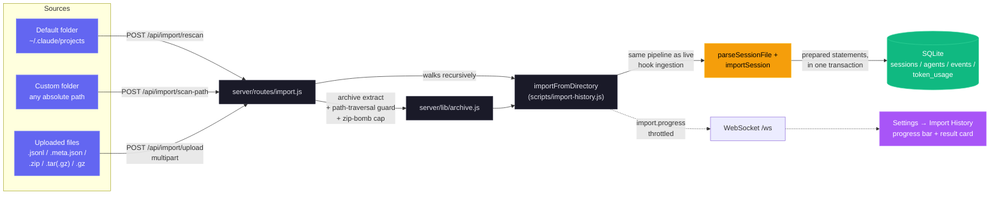

**Rutas**

| Método | Camino                    | Descripción                                                              |
| ------ | ----------------------- | ------------------------------------------------------------------------ |
| `GET` | `/api/import/guide` | Caminos compatibles con sistemas operativos, comando de archivo, extensiones compatibles, instrucciones paso a paso |
| `POST` | `/api/import/rescan`    | Recargar el directorio predeterminado `~/.claude/projects`                        |
| `POST` | `/api/import/scan-path` | Escanea un directorio absoluto (cuerpo `{ path }`); recorre recursivamente |
| `POST` | `/api/import/upload`    | Subida multipartita de `.jsonl`, `.meta.json`, `.zip`, `.tar(.gz)`, `.gz`   |

**Entradas compatibles.** Transcripciones de sesiones JSONL sueltas (`.jsonl`), sus
Companion `.meta.json` sidecars, y archivos (`.zip`, `.tar`,
`.tar.gz`/`.tgz`, `.gz` simple) que contenga cualquier disposición de directorios anidados.
Ambos diseños del código Claude canónico se reconocen automáticamente:
`<project>/<sessionId>/subagents/agent-*.jsonl` (por defecto) y
`<project>/subagents/<sessionId>/agent-*.jsonl` (alternativo).

**Garantías de precisión.** Las sesiones se deduplican por UUID; se repite la ejecución
el importador siempre está seguro. La compactación `baseline_input` /
`baseline_output` / `baseline_cache_read` / `baseline_cache_write`
Las columnas conservan el número de tokens de antes de que una transcripción fuera compactada,
Por lo tanto, reingestionar un JSONL posterior a la compactación nunca borra el costo histórico.
La deduplicación a nivel de evento utiliza una marca alta por tipo de evento
(`MAX(created_at) GROUP BY event_type` para la sesión): en cada
Solo se importan de nuevo las entradas JSONL con `ts > cutoff[type]` insertadas, por lo que
Sesiones de larga duración cuyas transcripciones crecen a lo largo de varios días
Continuar recibiendo Stop / PostToolUse / TurnDuration / ToolError
Eventos sin duplicar el trabajo anterior. `sessions.ended_at` se vuelve retroactivo
Avanzar a la última actividad de JSONL cuando supere la almacenada
El valor y los metadatos de número de mensajes se actualizan en cada pasada.

**Seguridad de transcripciones enormes.** La caché compartida de transcripciones
(`server/lib/transcript-cache.js`) lee archivos JSONL en trozos de 4 MiB
y descodifica solo una línea a la vez, por lo que las transcripciones más grandes que las de V8
Longitud máxima de cadena JS (~512 MiB en Node 20 de 64 bits) analizar sin
Abortando el proceso con `ERROR FATAL: v8::ToLocalChecked Empty
MaybeLocal`. El mismo camino fragmentado se utiliza por la ingestión de ganchos, el
Escaneo de compactación periódica y el importador de historial, ninguno de ellos
Materializar el archivo completo como una sola cadena JS. Crece de forma escalable por entrada
Arrays (`turnDurations`, `errors`, `compaction.entries`,
`usageExtras.*`) se acaban en la cola en `TRANSCRIPT_CACHE_MAX_ARRAY_LEN`
(por defecto `1000`), con recorte aplicado durante la parseo a un `2 × cap`
marca de agua para que una nueva y completa analítica de archivo en una sesión de varios días no pueda
Construir un transitorio ilimitado antes de la finalización.

**Seguridad.** La extracción de archivos valida cada entrada contra el camino
Travesía (se rechazan los caminos absolutos y los segmentos `..`). A
Tapón de extracción configurable (`CCAM_IMPORT_MAX_EXTRACT_BYTES`, predeterminado
4 GB) detiene las bombas zip/tar/gzip. El tamaño de carga se limita por archivo
(`CCAM_IMPORT_MAX_BYTES`, por defecto 1 GB) y por solicitud
(`CCAM_IMPORT_MAX_FILES`, por defecto 2000). Todos los directorios de ensayo son
Por solicitud y recuperado en `finalmente`, incluyendo cuando multer rechaza
Todos los archivos en primer plano.

**Progreso.** La actividad de importación se transmite a través del WebSocket existente
Como mensajes de `import.progress` (`fase`: `start` / `scan` / `extract` /
`parse` / `complete` / `error`), restringido para evitar inundar el
Canal sobre grandes importaciones.

**UI.** Utilice el panel **Configuración → Historial de importación** para una guía,
Experiencia de arrastrar y soltar con instrucciones paso a paso, progreso en vivo,
Y un resumen posterior a la importación que muestra importado / enriquecido / omitido /
Contas de errores.

<p align="center">

</p>

### WebSocket

Conéctese a `ws://localhost:4820/ws` para recibir mensajes push en tiempo real:

```json
{
  "type": "agent_updated",
  "data": { "id": "...", "status": "working", "current_tool": "Edit" },
  "timestamp": "2026-03-05T15:43:01.800Z"
}
```

**Tipos de mensajes:** `session_created`, `session_updated`, `agent_created`, `agent_updated`, `new_event`, `alert_triggered`, `alert_updated`, `remote_source.status` (datos `{ id, status: "idle"|"syncing"|"ok"|"error"|"deleted", error?, last_sync_at? }`)

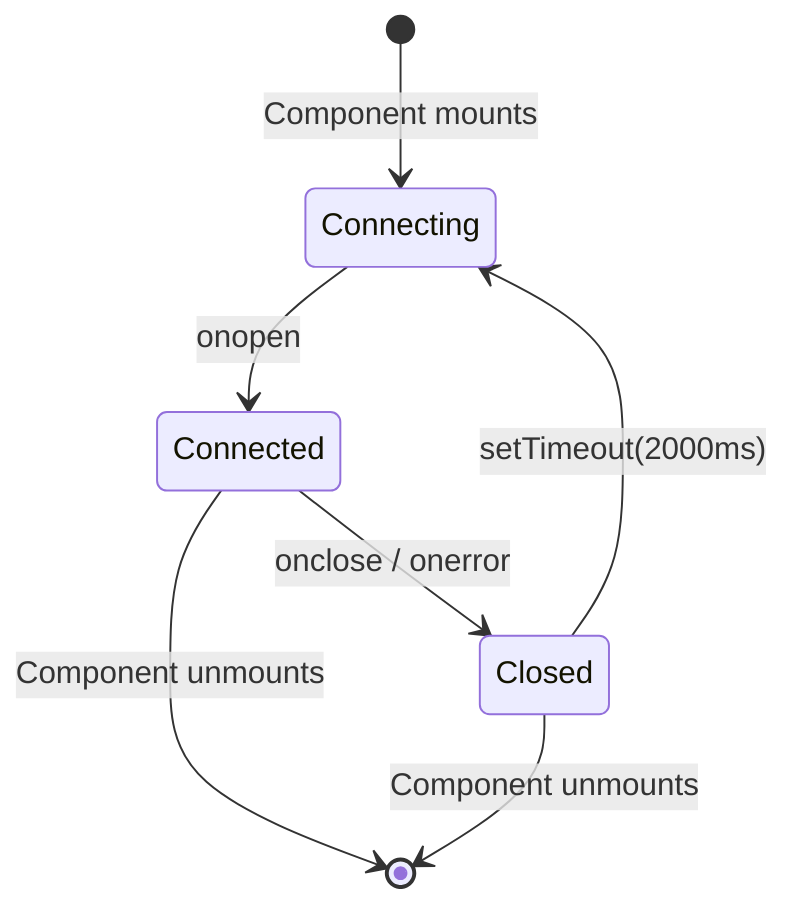

---

## Eventos de enganchamiento

El panel de control procesa estos tipos de ganchos de código Claude:

| Tipo de gancho | Activador                        | Acción del panel de instrumentos                                                                             |
| ------------------- | ------------------------------ | -------------------------------------------------------------------------------------------- |
| `SessionStart`      | Comienza la sesión de Claude Code | Crea la sesión y el agente principal. Marca `awaiting_input_since` (con `awaiting_reason=session_start`) para que una nueva sesión se encuentre en **Esperando**, excepto una SessionStart de fuente `compact` (compactación automática a mitad de turno), que deja la bandera sin tocar para que una sesión activa siga **Activa**. Reactiva las sesiones suspendidas. Abandona las sesiones huérfanas sin actividad durante `DASHBOARD_STALE_MINUTES` (por defecto 180) |
| `UserPromptSubmit` | El usuario pulsa enter en una solicitud | Borra la bandera de espera y promueve al agente principal a `working` (en funcionamiento) - la única señal de que las conversaciones con el asistente de texto han comenzado, ya que no emiten `PreToolUse` |
| `PreToolUse`        | El agente comienza a usar una herramienta | Borra la bandera de espera, establece al agente en `working`, establece `current_tool`. Si la herramienta es `Agent`, crea un registro de subagente |
| `PostToolUse`       | Ejecución de la herramienta completada       | Borra la bandera de espera (maneja las aprobaciones de solicitud de permiso donde la Notificación la estampó en medio de la herramienta). Borra `current_tool`. El agente permanece `trabajando` |
| `Stop`              | Claude termina de responder | Sin error: agente principal → `esperando` — Claude terminó su turno, la pelota está en el campo del usuario. `stop_reason=error`: marca el agente y la sesión `error`. Los subagentes de fondo siguen ejecutándose |
| `SubagentStop`      | Agente de fondo terminado      | Encuentra y completa el subagente por descripción, tipo o tarea. No borra deliberadamente la bandera de espera, ya que el fin de un subagente no nos dice nada sobre el humano. **Activa una escaneo JSONL de "fire-and-forget"** (`scanAndImportSubagents`) que emite eventos `PreToolUse` + `PostToolUse` por herramienta bajo el propio `agent_id` del subagente, por lo que la Línea de Tiempo muestra todas las herramientas que ejecutó el subagente, no solo el marcador de aparición |
| `Notificación` | Notificación del agente | Registra el evento. Los mensajes de permiso/petición de entrada establecen al agente en `esperando` y estampan `awaiting_input_since` (con `awaiting_reason=notification`, coincidiendo con el patrón: `permission`, `waiting for input`, `needs your approval`, ...). Las notificaciones de compactación se etiquetan como eventos de `Compactación`. Desactiva una notificación del navegador si está habilitada |
| `SessionEnd`        | El proceso CLI de Claude Code termina | Quita la bandera de espera. Si la sesión ya está en `error`, el estado de error se preserva; de lo contrario, marca a todos los agentes y la sesión como `completada` |
| `Compactación` | `/compact` detectado en JSONL | Crea un subagente de compactación (tipo `compactación`) y un evento de compactación. Detectado a través de las entradas `isCompactSummary` en el JSONL de la transcripción. También detectado por el escáner periódico para sesiones activas |
| `APIError` | Error API en la transcripción JSONL | Extraído de las entradas de `isApiErrorMessage` (cuota, límite de tasa, solicitud inválida) y las respuestas brutas de `type: "error"`. **Ahora marca inmediatamente la sesión y el agente como `error`**, anteriormente registrados como eventos sin cambiar el estado. Almacenado como evento con detalles de error |
| `TurnDuration` | Tiempo de giro en la transcripción JSONL | Extraído de los mensajes del subtipo `turn_duration` de `system` con `durationMs`. Almacenado como evento para el análisis del tiempo de nivel de giro |
| `ToolError` | Error de resultado de la herramienta en JSONL | Extraído de las entradas de `toolUseResult.is_error`. Registra los fallos a nivel de herramienta para el análisis de propagación de errores |
| `Interrumpido` | Turno cancelado por el usuario (Esc) | Sintetizado por el vigilante — `Esc` no dispara ningún gancho, por lo que se detecta una sesión `trabajando` atascada desde el marcador `[Solicitud interrumpida por el usuario]` de la transcripción o, cuando Esc precedió a cualquier salida, desde el tiempo de espera de `trabajo inactivo` (`DASHBOARD_WORKING_IDLE_SECONDS`). La sesión pasa a **Esperando** (mismo que un `Detener` normal) |

---

## Notificaciones del navegador

El panel de control admite notificaciones persistentes del navegador a través de Web Push (VAPID) para alertas en tiempo real incluso cuando la pestaña del panel de control no está enfocada o el navegador está en segundo plano.

### Cómo funciona

1. **Activar** las notificaciones en la página de Configuración a través del interruptor principal
2. **Conceder** permiso al navegador cuando se le solicite, esto registra un Servidor de Servicios y crea una suscripción push.
3. **Configurar** qué eventos desencadenan notificaciones:

| Evento                        | Por defecto | Descripción                                                     |
| ---------------------------- | ------- | --------------------------------------------------------------- |
| Comienza una nueva sesión | En | Se activa cuando se crea una nueva sesión de Claude Code |
| Claude terminó de responder | Desactivado | Lanza eventos de "Detener" cuando Claude termina una ronda de respuesta |
| Sesión cerrada | Desactivada | Se cierra en `SessionEnd` cuando el proceso CLI termina |
| Errores de sesión | En | Se cierra cuando una sesión termina con un error |
| Subagente generado | Desactivado | Se dispara cuando se crea un subagente de fondo |

Además, cualquier evento de gancho de `Notificación` de Claude Code desencadena una notificación del navegador independientemente de los interruptores por evento (siempre que el interruptor principal esté habilitado).

### Arquitectura de notificaciones

- **Pipeline VAPID:** Utiliza `web-push` en el servidor para la entrega segura de mensajes. Las claves VAPID se generan automáticamente y se almacenan en `data/vapid-keys.json`.
- **Trabajador de servicio:** Un trabajador dedicado (`client/public/sw.js`) maneja los eventos de `push` entrantes y muestra notificaciones con `silent: false` para garantizar la reproducción de audio en macOS.
- **Suscriptiones:** Los puntos finales específicos del navegador se almacenan en la tabla `push_subscriptions` en SQLite.
- **Persistencia:** Las notificaciones llegan incluso si el navegador está cerrado, ya que el Servidor de Servicios opera en segundo plano.
- **Notificación de prueba:** el botón en Ajustes le permite verificar el pipeline VAPID y la reproducción de audio.

### Soporte PWA y sin conexión

El proyecto envía tres aplicaciones web progresivas independientes: una para cada **pantalla de control**, **página de inicio** y **wiki**. Cada una tiene su propio `manifest.json` y Servidor de Servicios, por lo que el navegador las trata como aplicaciones instalables separadas.

| Superficie | Manifestación | Trabajador de servicio | Estrategia de caché |
| --- | --- | --- | --- |
| Panel de control (`client/`) | `client/public/manifest.json` | `client/public/sw.js` | Los paquetes con contenido hash de Vite bajo `/assets/*` se sirven primero en la caché (las URL son inmutables por compilación). Todo lo demás, como las navegaciones, el propio SW, `manifest.json`, los iconos y la raíz `/`, es primero la red con fallback de caché, por lo que una reconstrucción siempre muestra la interfaz de usuario más reciente sin una actualización completa. Las solicitudes API (`/api/*`), WebSocket (`/ws`) y Vite HMR nunca se almacenan en caché. Los manejadores de notificaciones push se conservan junto con la lógica de caché. El middleware estático de Express (`server/index.js`) refuerza esto enviando `Cache-Control: public, max-age=31536000, immutable` para `/assets/*` y `Cache-Control: no-cache, must-revalidate` para `index.html`, `sw.js` y `manifest.json`. `client/src/main.tsx` escucha por `controllerchange`: cuando un nuevo SW se activa en una página ya controlada, se carga de nuevo exactamente una vez (las primeras instalaciones no lo hacen). |
| Página de inicio (raíz) | `manifest.json` | `sw.js` | Precarga la cáscara HTML, el icono de favoritos y la imagen OG. Las capturas de pantalla en formato PNG se almacenan en caché por inercia en la primera vista (caché primero) para evitar una precarga inicial pesada. La navegación es primero por red con fallback sin conexión. |
| Wiki (`wiki/`) | `wiki/manifest.json` | `wiki/sw.js` | Precarga `index.html`, `style.css`, `script.js`, manifest y favicon. Totalmente compatible con offline después de una visita. HTML primero en la red, caché primero para CSS/JS. |

**Ciclo de vida del caché:** Los tres SW llaman a `skipWaiting()` al instalarse y eliminan los cachés obsoletos al activarse (claveados por cadenas de versión como `dashboard-v2`, `landing-v1`, `wiki-v1`). Desactivar la constante de versión fuerza una actualización limpia.

**Soporte para iOS:** Los tres archivos HTML incluyen `<meta name="apple-mobile-web-app-capable" content="yes">` y `<meta name="apple-mobile-web-app-status-bar-style" content="black-translucent">` para el modo de pantalla de inicio independiente en Safari.

**Iconos:** Manifests hace referencia a `favicon.svg` con `sizes="any"` y `type="image/svg+xml"` — soportado en Chrome 107+, Firefox 110+, Edge 107+. Las iconos de Apple Touch también utilizan el favicon SVG.

---

## Notificador de actualización

El panel de control observa su propia verificación de git y muestra una modalidad cada vez que la rama predeterminada canónica tiene commits por delante de HEAD. **Conocedor de ramas y bifurcaciones:** si tiene una remota `upstream` (la convención estándar para bifurcaciones), se prefiere sobre `origin`; el `master`, `main` o `HEAD` de la remota elegida es la referencia de comparación. El `manual_command` se adapta a su situación: `git pull --ff-only` solo cuando su rama realmente rastrea la referencia canónica, de lo contrario una `git fetch` (y una fusión de avance rápido en el caso de la bifurcación) para que el comando nunca mienta. Los usuarios obtienen el comando exacto para ejecutar en un terminal: el servidor **nunca** se carga o reinicia, lo que mantiene el mecanismo portátil a través de las sesiones de desarrollo, la supervisión de pm2/systemd/launchd/Docker y las implementaciones remotas.

<p align="center">

</p>

### Cómo funciona

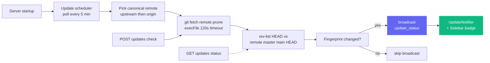

Un solo cheque es barato (`git fetch <remote> --prune` contra el remoto canónico — `upstream` si está configurado, de lo contrario `origin`), envuelto con `execFile` (sin shell) y un tiempo de espera de 120 segundos. Los fallos — red sin conexión, instalación no git, no hay remotos configurados, referencia upstream no resoluble — todos devuelven **carga útiles suaves** (por ejemplo, `fetch_error: "..."`) en lugar de lanzar, por lo que un remoto inestable nunca bloquea el panel de control.

### Superficies de interfaz de usuario

| Superficie | Comportamiento |
| --- | --- |
| **Modal** (`client/src/components/UpdateNotifier.tsx`) | Aparece cuando `update_available === true` y el usuario aún no ha descartado este `remote_sha` específico. Muestra los commits-behind, la referencia rastreada, una `situacion_note` opcional (cuando está en un ramaje / bifurcación de la función, la nota explica por qué el comando difiere), el comando que se puede copiar y pegar y tres botones: **Comando de copia** (principal), **Comprueba ahora**, **Descargar**. ESC y los clics en el fondo desactivan. Se activa por `remote_sha` en `localStorage`, por lo que un commit más reciente en el origen reabre el modal automáticamente. |
| **Botón de barra lateral** (`client/src/components/Sidebar.tsx`) | Botón "Verificar actualizaciones" siempre visible en el pie de página. Bordura esmeralda + punto de distintivo verde cuando está detrás, ámbar cuando el último control ha fallado en la obtención de datos. Hacer clic en él elimina cualquier despido previo y luego dispara `POST /api/updates/check`. |
| **Terminal del servidor** | Cuando el programador cambia de "actualizado" a "desactualizado", imprime un bloque enmarcado en stdout con el comando para que los usuarios que ejecutan sin cabeza todavía lo vean. |

### Superficie de la API

| Punto final | Propósito |
| --- | --- |
| `GET /api/updates/status` | Comprobación de lectura única: ejecuta `git fetch` contra el remoto canónico, compara HEAD con su rama predeterminada, devuelve el payload. |
| `POST /api/updates/check` | La misma comprobación, pero también transmite `update_status` a través de WebSocket para que todos los clientes conectados se actualicen al mismo tiempo. |

Ambos extremos devuelven la misma forma de carga útil:

```json
{
  "git_repo": true,
  "update_available": true,
  "repo_root": "/Users/you/Claude-Code-Agent-Monitor",
  "remote_ref": "upstream/master",
  "canonical_remote": "upstream",
  "current_branch": "master",
  "tracking_upstream": "origin/master",
  "tracks_canonical": false,
  "situation": "fork_or_diverged_tracking",
  "local_sha": "abc1234...",
  "remote_sha": "def5678...",
  "commits_behind": 3,
  "manual_command": "cd \"/...\" && git fetch upstream && git merge --ff-only upstream/master && npm run setup",
  "situation_note": "You're on 'master' tracking 'origin/master'. This command fast-forwards your branch from upstream/master (the canonical default).",
  "message": "3 commit(s) on upstream/master not in your checkout."
}
```

`situación` es una de `tracking_canonical` (clon típico en la rama predeterminada, `git pull --ff-only` funciona), `fork_or_diverged_tracking` (el nombre de la rama local coincide con el canónico, pero rastrea una ubicación remota diferente, `git fetch <remote> && git merge --ff-only <ref>`), `feature_branch` (fuera de la rama predeterminada, solo se busca, la integración queda a cargo del usuario) o `detached_head`.

### Lo que está intencionalmente **No** aquí

No hay `POST /api/updates/apply` y no hay asistente de reinicio automático, por diseño. Actualizarse automáticamente un proceso desde dentro de sí mismo es poco fiable sin un supervisor externo: `npm run dev` (concurrentemente), `npm start`, `pm2`, `systemd`, `launchd` y Docker requieren diferentes lógica de reinicio, y los fallos de `git pull` / `npm install` en un servidor en peligro de muerte no tienen un camino de desinstalación limpio. La detección solo mantiene el comportamiento predecible en todos los supervisores, todos los sistemas operativos y todos los estados de la rama, mientras aún cierra la brecha de información de "¿cuándo necesito realizar una extracción?"; el usuario es el dueño de la actualización real en su propia shell.

### Configuración

| Env Var | Valor predeterminado | Notas |
| --- | --- | --- |
| `DASHBOARD_UPDATE_CHECK` | habilitado | Establecido en `0` / `false` / `off` para deshabilitar por completo el programador. |
| `DASHBOARD_UPDATE_CHECK_INTERVAL_MS` | `300000` (5 min) | Intervalo entre las comprobaciones automáticas. El piso es de 60 000 ms, los valores inferiores están atornillados. |

---

## Tabby — Compañero de gato flotante

**Tabby** es un lindo compañero de gato flotante atado en la esquina inferior derecha de cada página en el panel de control. Siempre presente, convierte el flujo de la sesión en vivo en una mascota reactiva de un vistazo con la que también puedes hablar.

<p align="center">

</p>

### Mascota reactiva

Tabby es un gato SVG que rastrea el cursor con **ocho estados de ánimo** derivados del flujo de la sesión en vivo, cada uno con su propia animación:

| Estado de ánimo | Cuando | Animación |
| --- | --- | --- |
| `idle` | Nada notable sucediendo | Golpeo de cola descansando |
| `observando` | Las sesiones están activas | La oreja se erige, los ojos siguen el cursor |
| `feliz` | Una sesión o ejecución terminada de forma limpia | Movimiento de cabeza + brillo |
| `preocupado` | Algo no parece bien | Tremor sutil |
| `atascado` | Una sesión parece estar bloqueada | Alerta "!" |
| `pensando` | Un agente está en medio del trabajo | Movimiento lento de la cabeza |
| `dormiendo` | Tranquilo por un rato | `zzz` |
| `desconectado` | WebSocket está caído | Tranquilo, mantén la postura |

### Burbujas de diálogo

Tabby auto-superpone breves comentarios sobre eventos notables (sesión iniciada/terminada, errores, ejecución completada). Las burbujas están **controlando el flujo** y **coalesenciadas**, por lo que un parpadeo de eventos nunca llena la pantalla de spam, utilizan `aria-live` para lectores de pantalla y se pueden **silenciar** desde el panel.

### Panel

Abra el panel haciendo clic en el gato o presionando **⌘B / Ctrl+B** (Esc cierra). Muestra:

- Una **línea de estado en vivo**: `N en vivo · M con errores · estado de conexión`.
- **Acciones rápidas** - salta a Ejecutar Claude, Actividad, Sesiones o sesiones con errores; silenciar burbujas; eliminar alertas.
- Una casilla de **Preguntar** (ver abajo).

### Caja de preguntas → Ejecutar la transferencia de manos de Claude

La casilla **Pregunta** responde a preguntas de estado simples localmente a partir de datos almacenados en caché, por ejemplo "qué está ejecutando", "algunos errores" o "estado". Cualquier otra pregunta se pasa a la página existente de **Ejecutar Claude** (hace un enlace profundo a `/run?prompt=…`) para iniciar una sesión real de Código Claude. Tabby nunca llama a un LLM en sí mismo; simplemente reutiliza la página de Ejecutar Claude para cualquier cosa más allá de una búsqueda rápida de estado.

### Accesibilidad y degradación segura

Tabby es operable con el teclado, utiliza `aria-live` para sus burbujas y respeta `prefers-reduced-motion`. Si el WebSocket está inactivo, se degrada de forma segura a un estado tranquilo de `desconectado` en lugar de producir un error. Puedes activar o desactivar Tabby en **Configuración** (localizado en inglés, chino, vietnamita y coreano), y la implementación reside en `client/src/components/Tabby/`.

---

## Señales de sonido

El panel de control ofrece **retroalimentación de audio discreta** para la actividad de sesiones en vivo, de modo que puedes dejarlo en un segundo monitor y aun así oír cuándo una ejecución termina o falla. El sonido está **activado por defecto** y se puede desactivar por completo con un clic.

### Síntesis sin dependencias

No hay ningún archivo `.mp3` ni `.wav` en el repositorio ni ninguna biblioteca de audio en `package.json`. Cada señal se genera en el momento de reproducirse con la **Web Audio API**: una lista corta de osciladores (seno o triángulo), cada uno con su propia envolvente de ganancia exponencial, mezclados a través de un nodo de ganancia maestro y un filtro paso bajo para que el resultado se quede detrás de tu trabajo en lugar de atravesarlo. Todo el motor es un solo archivo, `client/src/lib/sound.ts`.

### Las señales

| Señal | Cuándo suena | Cómo suena |
| --- | --- | --- |
| `sessionStart` | Aparece una nueva sesión | Quinta justa ascendente (C5 → G5) |
| `sessionComplete` | Una sesión termina de responder (`Stop`) o se cierra (`SessionEnd`) | Arpegio mayor que resuelve (E5 → G5 → C6) |
| `sessionError` | Una sesión entra en estado `error` | Tercera menor descendente suave en onda triangular: perceptible, no alarmante |
| `subagentSpawn` | Se genera un subagente | Un único pulso corto |
| `notification` | Claude Code emite un evento `Notification` | Par desafinado que suena como una campanita |
| `connected` / `disconnected` | El WebSocket del panel vuelve o se cae | Dos notas de subida / bajada |
| `click` | Pulsas un botón, enlace, pestaña o interruptor | Tic apenas audible |

Las señales viven dentro de un conjunto de do mayor, así que las colas superpuestas nunca suenan disonantes, y cada envolvente decae exponencialmente en lugar de cortarse, lo que evita el chasquido de una parada brusca.

### Sin estorbarte

Tres salvaguardas evitan que el audio se convierta en ruido:

- **Enfriamiento por señal**: la misma señal no se repite dentro de ~350 ms (45 ms para el tic de interacción).
- **Presupuesto global de ráfaga**: como máximo 4 señales comienzan en cualquier ventana de 1,2 s, así que importar el historial o reconectar tras una caída nunca convierte una avalancha de mensajes WebSocket en una avalancha de pitidos.
- **Política de autoreproducción**: nada suena hasta tu primera interacción de puntero, tecla o toque con la página, según las reglas del navegador. Las señales previas se descartan en silencio, no se encolan.

Si el navegador no soporta Web Audio en absoluto, cada llamada es una operación nula segura: el panel simplemente permanece en silencio.

### Configuración

**Configuración → Sonido** tiene un interruptor maestro, un control de volumen y un interruptor individual para cada señal. Activar un interruptor reproduce esa señal de inmediato para que oigas exactamente lo que acabas de habilitar, y un botón **Escuchar sonido** reproduce el tono de finalización cuando quieras. Las preferencias persisten en `localStorage` bajo `agent-monitor-sound` y surten efecto al instante en toda la aplicación, sin recargar. El panel está localizado en inglés, chino, vietnamita, coreano y español.

Por defecto están activados el inicio de sesión, la finalización de sesión, el error de sesión, las notificaciones de Claude Code y el tic de interacción; la generación de subagentes y los cambios de conexión están desactivados (son los más ruidosos). La implementación vive en `client/src/lib/sound.ts` (motor + preferencias) y `client/src/hooks/useSoundCues.ts` (conexión al bus de eventos), montada una sola vez en `client/src/App.tsx`.

---

## Modal de estado de conexión

Haga clic en la píldora **En vivo** / **Desconectado** en el pie de página de la barra lateral para abrir un pequeño panel de detalles sobre el transporte WebSocket del panel de control. Muestra el extremo de destino `ws://` activo, cuánto tiempo ha estado activo el socket actual, los eventos totales recibidos, los tipos de eventos más comunes como un gráfico de barras horizontal, una línea de chispa de rendimiento de 60 segundos y los últimos 8 eventos como una lista de actividad reciente. Las estadísticas acumulativas (totales, desglose por tipo, lista reciente) persisten a través de las recargas a través de `localStorage` bajo `sidebar-connection-stats`; la línea de chispa en movimiento y el temporizador "conectado desde" son intencionalmente efímeros. Un botón **Restablecer** en el pie de página borra todo a demanda.

<p align="center">

</p>

---

## Extensión de VS Code

El **Monitor de Agentes del Código Claude** está disponible como una extensión de VS Code de primera clase, lo que le permite monitorear sus agentes de IA sin salir de su editor.

<p align="center">

</p>

### 🚀 Características clave
- **Barra lateral en vivo**: Vista dedicada de la barra de actividad que muestra la salud real del agente en tiempo real (trabajando, esperando, completado, etc.).
- **Análisis de uso**: Realice un seguimiento del total de tokens, los costos en USD en vivo y el número de eventos directamente en la barra lateral.
- **Integración de la barra de estado**: Monitor de pulsos de visión rápida en la barra inferior que muestra las sesiones y agentes activos.
- **Navegación profunda**: Acceso con un solo clic a vistas específicas del panel de control (Kanban, Análisis, Configuración) o sesiones recientes.
- **Tabla integrada**: Abre el panel de control de monitoreo completo como una pestaña nativa de VS Code webview.

### 📦 Instalación y configuración
1. Abre el directorio [vscode-extension](./vscode-extension).
2. Instale la extensión del Marketplace o empaquetela usted mismo usando `vsce package`.
3. Asegúrese de que su servidor de panel local esté funcionando (`npm run dev`).
4. Haga clic en el icono **Radar** en la barra de actividad de VS Code para comenzar.

Para la configuración detallada del desarrollador, consulte los directorios [.vscode](./.vscode) y [vscode-extension](./vscode-extension).

> [¡CONSEJO!]
> Extensión en el mercado de VS Code: [Claude Code Agent Monitor](https://marketplace.visualstudio.com/items?itemName=hoangsonw.claude-code-agent-monitor)

---

## Aplicación de escritorio (macOS y Windows)

El panel de control también se envía como una **aplicación de escritorio nativa opcional** que instales una vez y olvidas - un `.app` de macOS (distribuido como un `.dmg`) y un `.exe` de Windows (un instalador NSIS más una construcción portátil sin instalación). Vive en el espacio de trabajo `desktop/`, un hermano de `client/`, `server/`, `mcp/` y `vscode-extension/`, y está construido con **Electron 35**.

<p align="center">

<br>
<em>🍎🪟 <strong>Aplicación para escritorio</strong> — shell nativo con una barra de menú / icono de área de notificaciones ( bandeja), Abre al iniciar sesión y un bloqueo de instancia única. El mismo panel de control, en una ventana real del sistema operativo (macOS mostrado).</em>
</p>

<p align="center">

<br>
<em>🪟 El mismo panel de control que una aplicación nativa de Windows: icono de la zona de notificaciones ( bandeja), menú de ventana nativo y Abrir al iniciar sesión.</em>
</p>

Todo lo que ves en el navegador en `localhost:4820` vive dentro de esta ventana, con el ciclo de vida nativo del sistema operativo encima: un icono de bandeja, un menú de aplicaciones nativo, integración de inicio automático y un solo botón de salida que apaga el servidor de forma limpia.

### Cómo funciona

A diferencia de ejecutar el panel de control desde un terminal, la aplicación de escritorio no necesita `npm start`, ni un shell abierto, ni una segunda copia del servidor. El **proceso principal** de Electron hospeda el servidor Express **en el proceso**: `require()` `server/index.js` directamente en el mismo tiempo de ejecución de Node, con **sin proceso hijo ni IPC**, y señala una `BrowserWindow` de Chromium al cliente React compilado.

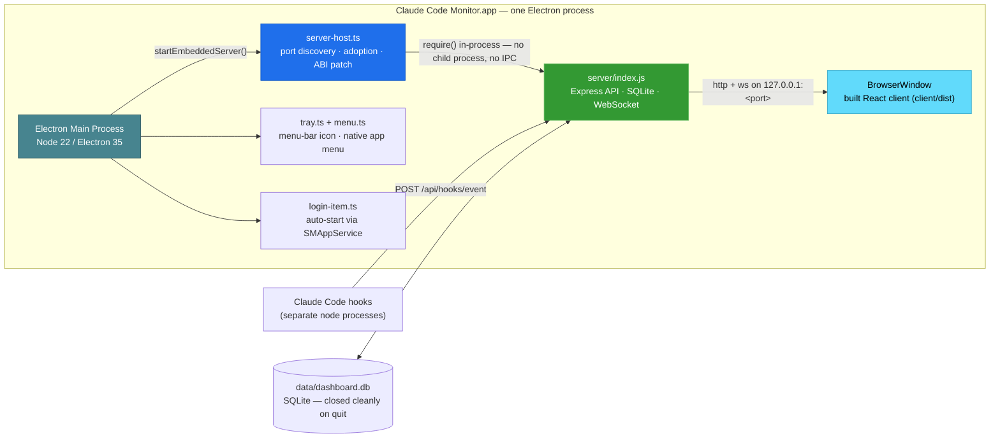

Al iniciar la aplicación:

1. Elige un puerto gratuito, prefiriendo **4820**, retrocediendo a **4821-4829**, y luego un puerto alto aleatorio si todos esos están ocupados.
2. Si un servidor de panel de control saludable ya responde a `/api/health` en `4820` (por ejemplo, has ejecutado `npm start` en un terminal), **adoptará ese servidor** en lugar de vincularlo de forma doble: sin colisión de puertos, sin competencia de SQLite. Un servidor adoptado sigue funcionando después de que cierres la aplicación.
3. De lo contrario, inicia el servidor incorporado y, en el **primer arranque del servidor propiedad**, instala automáticamente los ganchos del código Claude y inicia los servicios de fondo (programador de actualizaciones, `cc-watcher`, reconciliación de ejecución huérfana). Un usuario que solo tenga un DMG, por lo tanto, recibe eventos con **cero configuración manual**: sin realizar una compra, sin `npm run install-hooks`.
4. **(macOS)** Recupera tu **PATH de la cáscara de inicio de sesión** para que la función **Ejecutar Claude** pueda encontrar y crear la CLI `claude`: una aplicación lanzada desde Finder/Dock que de otra manera heredaría solo el PATH mínimo de launchd y perdería las CLIs en `~/.local/bin`, `/opt/homebrew/bin`, los contenedores del gestor de versiones, etc. (En Windows, el proceso ya hereda el PATH del usuario).
5. Abre la ventana del panel de control, a menos que la aplicación se haya iniciado al iniciar sesión (en macOS a través de los elementos de inicio de sesión; en Windows a través de la entrada etiquetada `HKCU\…\Run`), en cuyo caso solo se mantiene como bandeja.
6. Al salir, apaga el servidor incorporado con gracia y **cierra SQLite de forma limpia** (punto de control WAL).

### Características

- **Ícono de bandeja** — superficie de estado siempre activa (barra de menú de macOS / área de notificaciones de Windows). Haga clic con el botón izquierdo para alternar la ventana del panel de control; haga clic con el botón derecho para abrir un menú contextual con **Abrir panel de control**, **Abrir en el navegador**, **Reiniciar servidor**, **Mostrar registros**, **Abrir al iniciar sesión** (alternar) y **Salir**. macOS utiliza un glifo de plantilla con tono; Windows utiliza el icono `icon.ico` coloreado (una plantilla negra desaparecería en la barra de tareas oscura).
- **Icono de ventana y barra de tareas**: el `BrowserWindow` está conectado al logotipo de la aplicación de color (`icon.ico` en Windows, `icon.png` en otro lugar), por lo que la barra de título / barra de tareas muestra el verdadero icono de Claude Code Monitor: incluso una ejecución de `npm run desktop:dev` sin descomprimir ya no muestra el icono genérico de Electron.
- **Menú de aplicación nativo** — menú estándar de "Acerca de" / "Archivo" / "Editar" / "Ver" / "Ventana" / "Ayuda" con atajos de `⌘` / `Ctrl`. El elemento **Archivo → Abrir Panel de control** (`⌘1`) es **solo para macOS**: macOS mantiene una barra de menú global después de que la ventana se oculte, por lo que puede volver a abrir la ventana: en Windows/Linux el menú está adjunto a la ventana y no se puede ejecutar mientras está oculto, por lo que vuelva a abrir desde el menú **Abrir Panel de control** de la bandeja (que eleva la ventana de forma fiable incluso cuando está minimizada o detrás de otras ventanas).
- **Inicio automático al iniciar sesión** — alterna **Abrir al iniciar sesión** desde la bandeja o el menú de la aplicación. En macOS se registra a través de la moderna API `SMAppService`, por lo que la entrada aparece en **Configuración del sistema → General → Elementos de inicio de sesión**; en Windows escribe una entrada `HKCU\Software\Microsoft\Windows\CurrentVersion\Run` por usuario, visible en **Gestor de tareas → Inicio**.
- **El cierre de la ventana oculta, el servidor sigue funcionando**: cerrar la ventana solo la oculta; el servidor y la bandeja permanecen abiertos. Haga clic en la bandeja para volver a mostrar la ventana.
- **Bloqueo de una sola instancia**: el doble lanzamiento simplemente centra la ventana existente; no hay segundo servidor, no hay colisión de puertos. (Se aplica en todas las plataformas).
- **Los datos sobreviven a las reinstalaciones y actualizaciones**: la base de datos SQLite y las claves VAPID se encuentran en el directorio de datos de la aplicación por usuario **fuera del paquete de la aplicación / directorio de instalación**: `~/Biblioteca/Soporte de Aplicaciones/Claude Code Monitor/data/` en macOS, `%APPDATA%\Claude Code Monitor\data\` en Windows. Un paquete empaquetado es de solo lectura, por lo que escribir la base de datos dentro de él rompería la Importación de Historial y la persistencia de eventos; mantenerla en datos de la aplicación soluciona eso y significa que su historial importado no se ve afectado cuando reemplaza o actualiza la aplicación. (El desinstalador NSIS de Windows guarda estos datos por defecto).
- **`claude` CLI en PATH** — en macOS la aplicación recupera su `PATH` de inicio de sesión en el arranque, por lo que la función **Ejecutar Claude** funciona incluso si una aplicación lanzada desde Finder/Dock de otro modo solo heredaría el `PATH` mínimo de launchd. (En Windows el `PATH` de usuario heredado ya lo incluye).
- **Registros**: el proceso principal escribe en `~/Biblioteca/Registros/Claude Code Monitor/desktop.log` (macOS) o `%APPDATA%\Claude Code Monitor\logs\desktop.log` (Windows); accédalo desde el menú **Mostrar registros** del panel.

### Entiéndelo

**Opción A - descargar un instalador preconstruido (recomendado).** Desde **[Versiones → última](https://github.com/hoangsonww/Claude-Code-Agent-Monitor/releases/latest)** (público, sin inicio de sesión en GitHub). CI publica automáticamente una nueva versión `vX.Y.Z` cada vez que la versión en `package.json` se actualiza en `master`, por lo que este enlace siempre sirve para la construcción actual:

| Plataforma | Activo | Notas |
| --- | --- | --- |
| macOS (Apple Silicon) | `ClaudeCodeMonitor-<ver>-arm64.dmg` | arrastrar a `/Applications` |
| macOS (Intel) | `ClaudeCodeMonitor-<ver>-x64.dmg` | arrastrar a `/Applications` |
| Windows (instalador) | `ClaudeCodeMonitor-Setup-<ver>-x64.exe` | instalación por usuario, sin administrador |
| Windows (portátil) | `ClaudeCodeMonitor-<ver>-x64-portable.exe` | ejecutar sin instalar |

Las construcciones frescas por compromiso también existen como artefactos CI (se requiere inicio de sesión, retención de 14 días): `ClaudeCodeMonitor-dmg` del trabajo `🍎 macOS Desktop (DMG)` y `ClaudeCodeMonitor-win` del trabajo `🪟 Windows Desktop (EXE)`, útiles para probar `master` antes de la próxima etiqueta de lanzamiento.

**Opción B: construíselo tú mismo.** Desde la raíz del repositorio:

```bash
npm run setup                # install root + client deps, build client, install hooks
npm run build                # build the React client (client/dist)
npm run desktop:install      # install Electron + electron-builder into desktop/ (preflights native deps; prints setup help on failure)
npm run desktop:dmg:arm64    # macOS:   fast single-arch DMG → desktop/release/ClaudeCodeMonitor-<ver>-arm64.dmg
npm run desktop:win          # Windows: NSIS installer → desktop/release/ClaudeCodeMonitor-Setup-<ver>-x64.exe
```

> [!NOTA]
> **Los DMG se construyen en macOS; los `.exe` de Windows se construyen en Windows** — paquetes electron-builder para el sistema operativo de host. El paquete de construcción `npm run desktop:dmg` de macOS construye la aplicación **dos veces** (una vez por arquitectura) y emite **ambos** DMG por arquitectura (`arm64` + `x64`) — la construcción de lanzamiento; no los fusiona en un binario universal. Para su propio Mac, utilice el `desktop:dmg:arm64` / `desktop:dmg:x64` de arquitectura única. En Windows, `better-sqlite3` se obtiene como un binario Electron preconstruido por `npm run desktop:install`, por lo que no se necesita ninguna cadena de herramientas Visual Studio C++ en el caso común. Si la construcción falla (sin binario preconstruido o cadena de herramientas C++ faltante), `desktop:install` imprime la solución exacta por sistema operativo más una alternativa sin cadena de herramientas y falla ruidosamente en lugar de dejar una instalación rota.

### Instálalo

**macOS:**

1. Haga doble clic en el `.dmg` para montarlo.
2. Arrastra **Claude Code Monitor.app** a tu carpeta `/Applications`.
3. El DMG está **firmado ad hoc** por defecto, por lo que macOS Gatekeeper advierte en la primera vez que se inicia (*"Apple no pudo verificar..."*). Borra el atributo de cuarentena:

   ```bash
   xattr -cr "/Applications/Claude Code Monitor.app"
   ```

O abra **Configuración del sistema → Privacidad y seguridad** y haga clic en **Abrir de todos modos**.

4. Inicie la aplicación. Aparece el icono de la bandeja y se abre la ventana del panel de control.

**Ventanas:**

1. Ejecute `ClaudeCodeMonitor-Setup-<ver>-x64.exe`. Instala **por usuario** en `%LOCALAPPDATA%\Programas\Claude Code Monitor` (sin elevación de administrador) y le permite elegir el directorio de instalación; o ejecute `*-portable.exe` para iniciar sin instalar.
2. El instalador está **sin firmar** por defecto, por lo que Windows **SmartScreen** puede mostrar *"Windows protegido su PC"* en la primera vez que se inicie, haga clic en **Más información → Ejecutar de todos modos**.
3. Lanzar desde el menú Inicio / atajo del escritorio. Aparece el icono de la zona de notificaciones ( bandeja) y se abre la ventana del panel de control.

<p align="center">

<br>
<em>Instalador de Windows · Paso 1 — <strong>Elija las opciones de instalación</strong> (por usuario "Solo para mí" vs. todos los usuarios).</em>
</p>

<p align="center">

<br>
<em>Instalador de Windows · Paso 2 — <strong>Elija la ubicación de instalación</strong> (por defecto es <code>%LOCALAPPDATA%\Programas</code> por usuario).</em>
</p>

<p align="center">

<br>
<em>Instalador de Windows · Paso 3 — <strong>Completar la configuración</strong> (Finalizar y lanzar la aplicación).</em>
</p>

### Comandos de construcción

Todos los comandos se ejecutan desde la **raíz del repositorio**:

| Comando                     | Lo que hace                                                                 |
| --------------------------- | ---------------------------------------------------------------------------- |
| `npm run desktop:install` | Instalar Electron + electron-builder en `desktop/`; reconstruir `better-sqlite3` para la ABI de Electron; realizar pruebas preliminares de la construcción nativa de `better-sqlite3` e imprimir ayuda de configuración factible (incluyendo una alternativa sin cadena de herramientas) en caso de fallo |
| `npm run desktop:build` | Compila las fuentes TypeScript del escritorio en `desktop/out/`                    |
| `npm run desktop:dev`       | Construye y lanza la aplicación Electron para iteraciones locales                         |
| `npm run desktop:test`      | Ejecutar la prueba de humo (iniciar Electron, sondear `/api/health`, apagar)            |
| `npm run desktop:dmg`       | **macOS:** construye **ambos** DMG (arm64 + x64) — correctos para la versión, **más lentos** (paquetes para cada arquitectura) |
| `npm run desktop:dmg:arm64` | **macOS:** construye un DMG solo de Apple-Silicon — **rápido** (~1 min), recomendado para tu propio Mac |
| `npm run desktop:dmg:x64`   | **macOS:** construye un DMG solo para Intel — **rápido** (~1 min)                         |
| `npm run desktop:dmg:universal` | **macOS:** construye un DMG **universal** fusionado (arm64 + x86_64) — opcional, **más lento**, no es lo que se envía con la versión |
| `npm run desktop:win`       | **Windows:** construye el instalador NSIS `.exe` (x64)                             |
| `npm run desktop:win:portable` | **Windows:** construye el `.exe` portátil sin instalar (x64)                     |

El DMG de macOS resultante es **~80 MB** (≈ 250 MB en el disco una vez instalado) y el instalador de Windows es comparable: el impuesto estándar del paquete Electron.

### Firma y notariedad

El DMG de macOS está **firmado ad hoc** por defecto, por lo que cualquiera puede crear un `.app` funcional sin una cuenta de desarrollador de Apple pagada. El script `package` establece `CSC_IDENTITY_AUTO_DISCOVERY=false`, por lo que un certificado de firma de código ya en la llave de acceso del contribuyente nunca se selecciona automáticamente. La **firma de ID de desarrollador real** es opcional a través de `CSC_LINK` (un `.p12` codificado en base64) y `CSC_KEY_PASSWORD`; la **notificación de Apple** es opcional a través de `APPLE_ID`, `APPLE_TEAM_ID` y `APPLE_APP_SPECIFIC_PASSWORD`. La construcción de **Windows** está **sin firma** por defecto (SmartScreen puede aparecer al iniciar la aplicación por primera vez; *Más información → Ejecutar de todos modos*); la firma de Authenticode solo se activa cuando se proporciona un certificado explícito a través de `CSC_LINK` + `CSC_KEY_PASSWORD`. CI recoge todo esto automáticamente cuando se proporciona, sin necesidad de cambios en el código.

### Notas de implementación

- **`better-sqlite3`** es el único módulo nativo en el árbol de dependencias, y un módulo nativo debe compilarse contra la ABI exacta del Nodo A en la que se ejecuta. El espacio de trabajo `desktop/` envía su **propia copia** de `better-sqlite3` reconstruida para la ABI de Electron y utiliza un redireccionamiento `require` local al proceso para apuntar a `server/db.js`; la copia de la raíz del repositorio se mantiene construida para el Nodo del sistema (por lo que `npm run test:server` sigue funcionando).
- **La construcción de un DMG reconstruye `better-sqlite3` para la arquitectura de destino**, lo que puede dejar la copia del escritorio construida para la otra arquitectura de CPU y romper `npm run desktop:dev` / `npm run desktop:test` con `ERR_DLOPEN_FAILED`. El paso de `prebuild` del escritorio ahora **auto-curará** el módulo nativo para la máquina local en la próxima construcción, por lo que los flujos de desarrollo y prueba de humo siguen funcionando después de una construcción de DMG específica de la arquitectura. El paso de `prebuild` también **falla rápidamente con ayuda de configuración** cuando el binario nativo de `better-sqlite3` falta por completo, convirtiendo un fallo de tiempo de ejecución en un error de tiempo de construcción que se puede copiar y pegar.
- El **único cambio fuera de `desktop/`** es una refactorización que preserva el comportamiento de `server/index.js`: su post-listen bootstrap (programador de actualización, `cc-watcher`, reconciliación de ejecución huérfana) se extrajo en un `startBackgroundServices()` exportado para que el servidor incorporado ejecute exactamente lo que ejecuta `node server/index.js`. El camino independiente de `node server/index.js` no ha cambiado funcionalmente; `client/`, `scripts/`, `mcp/` y `vscode-extension/` no han sido tocados.
- Dos trabajos de CI de escritorio filtrados por ruta construyen, prueban con humo y empaquetan la aplicación: **`🍎 macOS Desktop (DMG)`** en `macos-latest` (carga el artefacto `ClaudeCodeMonitor-dmg` — dos DMG de arquitectura única) y **`🪟 Windows Desktop (EXE)`** en `windows-latest` (carga el artefacto `ClaudeCodeMonitor-win` — instalador NSIS + portátil). En una actualización de versión a `master`, el trabajo de `release` adjunta **ambos** los DMG de macOS y los `.exe` de Windows a la publicación de la versión `vX.Y.Z` de GitHub. El icono de Windows (`desktop/assets/icon.ico`) se compromete al repositorio (regénéralo desde `icon.png` con `npm run build:win-icon`, PowerShell + .NET, sin herramientas adicionales).

Para la guía completa del usuario (descargar, instalar, Gatekeeper / SmartScreen, menú de bandeja, inicio automático), consulte [`DESKTOP.md`](./DESKTOP.md); para la referencia del contribuyente / arquitectura (modelo de proceso, ciclo de vida de arranque, descubrimiento de puertos, pipeline de construcción, con diagramas de Mermaid), consulte [`desktop/README.md`](./desktop/README.md).

---

## Almacenamiento de datos

- **Motor:** SQLite 3 a través de `better-sqlite3` (opcional) o `node:sqlite` incorporado de Node.js
- **Ubicación:** `data/dashboard.db`
- **Modo de diario:** WAL (lecturas concurrentes durante las escrituras)
- **Restablecer:** Elimina `data/dashboard.db` para borrar todos los datos

### Diagrama de relaciones de entidades

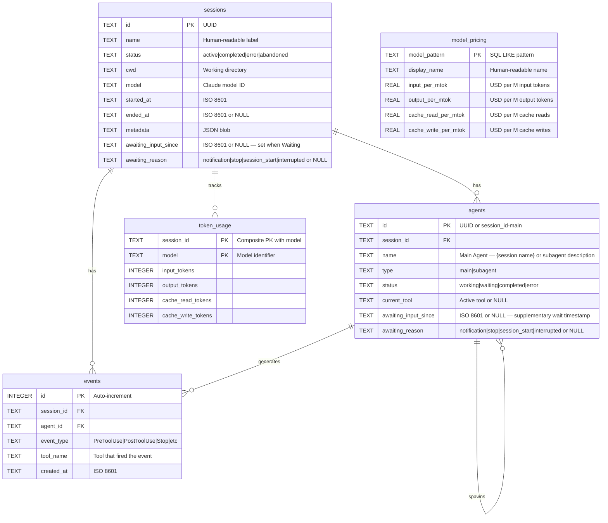

---

## Mercado de complementos

CCAM incluye 14 plugins compartidos por Claude Code y Codex, 66 habilidades empaquetadas, 18 subagentes de Claude, 34 comandos de Claude, 3 herramientas CLI, 3 configuraciones de hooks y 2 plugins con MCP. La CLI de skills.sh descubre 76 habilidades en todo el repositorio. Consulta `docs/PLUGINS.md` para el catálogo, la instalación y la validación.

### Agregar el mercado

```bash
claude plugin marketplace add hoangsonww/Claude-Code-Agent-Monitor
codex plugin marketplace add hoangsonww/Claude-Code-Agent-Monitor
```

### Instalar habilidades con skills.sh

```bash
# Enumerar las 76 habilidades sin instalarlas
npx skills add hoangsonww/Claude-Code-Agent-Monitor --list

# Instalar una habilidad para Claude Code y Codex en el proyecto actual
npx skills add hoangsonww/Claude-Code-Agent-Monitor \
  --skill mcp-server \
  --agent claude-code \
  --agent codex \
  --yes

# Verificar, actualizar y eliminar la habilidad del proyecto
npx skills list --json
npx skills update --project --yes
npx skills remove mcp-server --yes

# Añadir --global para instalar a nivel de usuario y administrar ese ámbito
npx skills add hoangsonww/Claude-Code-Agent-Monitor \
  --skill mcp-server \
  --agent claude-code \
  --agent codex \
  --global \
  --yes
npx skills list --global --json
npx skills update --global --yes
npx skills remove --global mcp-server --yes
```

Las instalaciones de proyecto usan `.agents/skills/` y enlaces específicos de cada agente. Las habilidades globales de Claude Code se instalan de forma predeterminada en `~/.claude/skills/`, o en el subdirectorio `skills/` de `CLAUDE_CONFIG_DIR` cuando se define. Las habilidades globales de Codex se instalan de forma predeterminada en `~/.codex/skills/`, o en el subdirectorio `skills/` de `CODEX_HOME` cuando se define. Las instalaciones para varios agentes pueden deduplicar archivos en un almacén compartido y enlazar esos destinos. La CLI de skills.sh descubre 76 habilidades del repositorio, incluidas 66 habilidades de plugins y las habilidades de mantenimiento del repositorio.

### Plugins disponibles

| Plugin | Comando de instalación | Habilidades |
|--------|----------------|--------|
| **ccam-analytics** | `claude plugin install ccam-analytics@claude-code-agent-monitor-plugins` | `reporte de sesión`, `desglose de costos`, `tendencias de uso`, `puntuación de productividad` |
| **ccam-cost-guard** | `claude plugin install ccam-cost-guard@claude-code-agent-monitor-plugins` | `budget-set`, `spend-forecast`, `cost-alert`, `model-savings`, `daily-budget-check` |
| **ccam-productividad** | `claude plugin install ccam-productivity@claude-code-agent-monitor-plugins` | `daily-standup`, `weekly-report`, `sprint-summary`, `workflow-optimizer` |
| **ccam-devtools** | `claude plugin install ccam-devtools@claude-code-agent-monitor-plugins` | `session-debug`, `hook-diagnostics`, `data-export`, `health-check` |
| **ccam-insights** | `claude plugin install ccam-insights@claude-code-agent-monitor-plugins` | `detectar patrones`, `alerta de anomalías`, `sugerencias de optimización`, `comparar sesiones` |
| **ccam-sessions** | `claude plugin install ccam-sessions@claude-code-agent-monitor-plugins` | `session-search`, `session-timeline`, `transcript-replay`, `cwd-rollup`, `session-cleanup` |
| **ccam-workflows** | `claude plugin install ccam-workflows@claude-code-agent-monitor-plugins` | `dag-map`, `delegation-audit`, `concurrency-report`, `error-propagation`, `fleet-runs` |
| **calidad ccam** | `claude plugin install ccam-quality@claude-code-agent-monitor-plugins` | `escaneo de errores`, `reporte de errores de API`, `auditoría de fallos de gancho`, `verificación slo`, `alerta de regresión` |
| **ccam-config** | `claude plugin install ccam-config@claude-code-agent-monitor-plugins` | `config-audit`, `memory-review`, `skill-inventory`, `mcp-audit`, `hook-inventory` |
| **ccam-dashboard** | `claude plugin install ccam-dashboard@claude-code-agent-monitor-plugins` | `dashboard-status`, `quick-stats` + servidor MCP |
| **ccam-runner** | `claude plugin install ccam-runner@claude-code-agent-monitor-plugins` | `run-agent`, `run-history` |
| **ccam-integrations** | `claude plugin install ccam-integrations@claude-code-agent-monitor-plugins` | `alert-management`, `webhook-management`, `remote-collection` |
| **ccam-platform** | `claude plugin install ccam-platform@claude-code-agent-monitor-plugins` | `config-explorer`, `history-portability`, `hook-setup`, `mcp-server` |
| **ccam-reports** | `claude plugin install ccam-reports@claude-code-agent-monitor-plugins` | `executive-report`, `cost-report`, `reliability-report`, `workflow-report` |

### Herramientas CLI incluidas

- `ccam-stats` — Panel de control terminal (sesiones, costos, tokens con bases de referencia de compactación)
- `ccam-doctor` — Diagnóstico del sistema (API, base de datos, ganchos, frescura de los datos)
- `ccam-export` — Exportación de datos (JSON, CSV) para sesiones, eventos, análisis, costos

### Ejemplo de uso

```bash
# In Claude Code, after installing a plugin:
/ccam-analytics:session-report latest
/ccam-analytics:cost-breakdown this week
/ccam-productivity:daily-standup today
/ccam-insights:pattern-detect tools
/ccam-dashboard:quick-stats
```

> Una prueba del servidor (`server/__tests__/plugins-marketplace.test.js`) valida la bijectividad de la carpeta marketplace ↔ `plugins/` y el `plugin.json`, agentes, habilidades y comandos de cada plugin.

📖 Documentación completa: [docs/plugins.md](docs/PLUGINS.md)

---

## Línea de estado

Una utilidad independiente de línea de estado CLI para Claude Code que muestra el nombre del modelo, el usuario, el directorio de trabajo, la rama de git, la barra de uso de la ventana de contexto, el número de tokens por dirección y el costo de la sesión, todo ello codificado por colores con secuencias de escape ANSI.

```
nguyens6@host ~/agent-dashboard/client | Sonnet 4.6 | main | ████████░░ 79% | 3↑ 2↓ 156586c | $0.4231
```

| Segmento | Color                | Ejemplo                                                        |
| ----------- | -------------------- | -------------------------------------------------------------- |
| Modelo | Cian                 | `Soneto 4.6`                                                   |
| Usuario | Verde                | `nguyens6`                                                     |
| CWD         | Amarillo               | `~/agent-dashboard`                                            |
| Rama de Git | Magenta | `main`                                                         |
| Barra de contexto | Verde / Amarillo / Rojo | `████████░░ 79%`                                               |
| Tokens | Verde / Cian / Oscuro | `3↑ 2↓ 156586c` (verde `↑` entrando, cian `↓` saliendo, caché oscuro `c`) |
| Costo (USD) | Verde / Amarillo / Rojo | `0,4231 $` (total de la sesión - mostrado en la API y planes de suscripción)|

Límites de color de costo: verde por debajo de 5 $, amarillo de 5 a 20 $, rojo de 20 $ en adelante.

Consulte [`statusline/README.md`](statusline/README.md) para obtener instrucciones de instalación.

<p align="center">

</p>

---

## Arquitectura del servidor

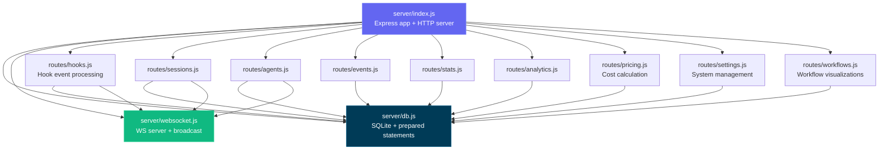

---

## Enrutamiento del cliente

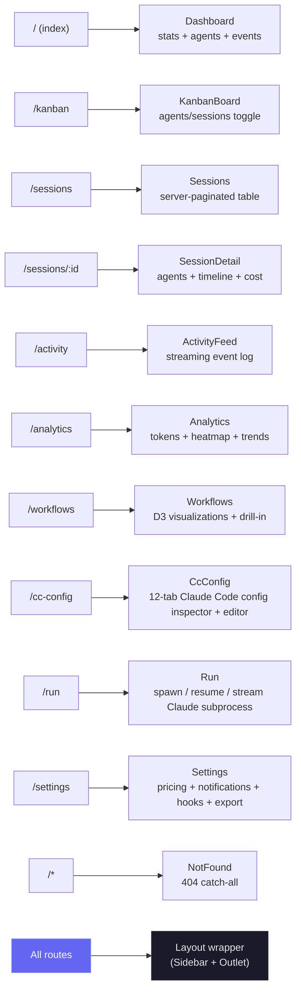

---

## Flujo del gestor de ganchos

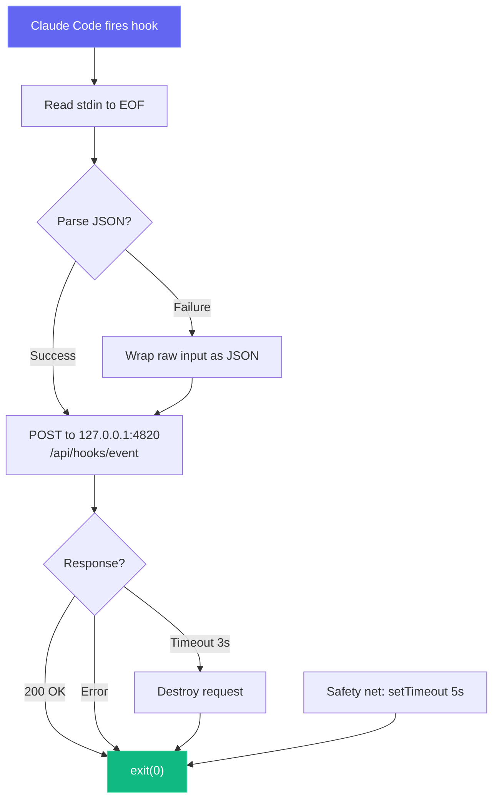

---

## Modos de despliegue

Apoyamos tanto los modos de despliegue de desarrollo como de producción con diferentes arquitecturas de procesos:

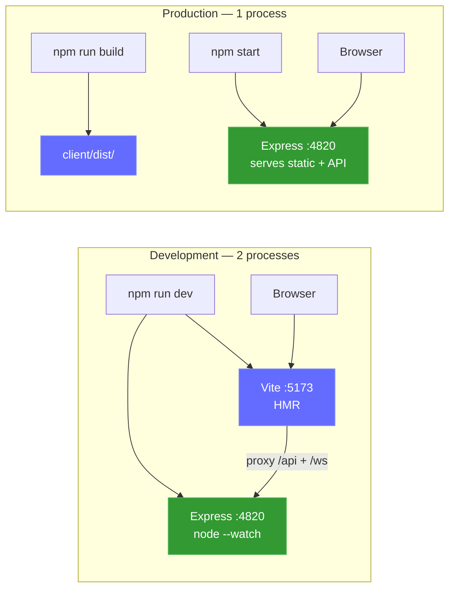

Sidecar MCP local opcional (soporta transportes stdio, HTTP+SSE y REPL):

```mermaid
graph LR
    subgraph "MCP Transport Options"
        M_STDIO["MCP Server (stdio)<br/>npm run mcp:start"]
        M_HTTP["MCP Server (HTTP)<br/>npm run mcp:start:http<br/>:8819"]
        M_REPL["MCP Server (REPL)<br/>npm run mcp:start:repl"]
    end

    H["MCP Host"] -->|"stdin/stdout"| M_STDIO
    RC["Remote Client"] -->|"POST /mcp · GET /sse"| M_HTTP
    OP["Operator"] -->|"interactive CLI"| M_REPL

    M_STDIO --> D["Dashboard Server<br/>:4820"]
    M_HTTP --> D
    M_REPL --> D

    style M_STDIO fill:#0f766e,stroke:#14b8a6,color:#fff
    style M_HTTP fill:#0f766e,stroke:#14b8a6,color:#fff
    style M_REPL fill:#0f766e,stroke:#14b8a6,color:#fff
```

Opcional **aplicación de escritorio (macOS y Windows)**: un solo proceso Electron que hospeda el servidor Express en el proceso (sin terminal, sin proceso hijo):

```mermaid
flowchart LR
    subgraph desktop["Desktop App (macOS & Windows) — 1 Electron process"]
        E_MAIN["Electron Main Process<br/>(Node 22 / Electron 35)"]
        E_HOST["server-host.ts<br/>require() server/index.js"]
        E_SRV["Embedded Express :4820<br/>API · SQLite · WebSocket"]
        E_WIN["BrowserWindow<br/>built React client"]
        E_TRAY["Menu-bar (tray) icon<br/>+ native app menu"]
        E_MAIN --> E_HOST
        E_HOST -->|"in-process require()"| E_SRV
        E_MAIN --> E_TRAY
        E_SRV -->|"http + ws on 127.0.0.1"| E_WIN
    end

    E_HOOKS["Claude Code hooks"] -->|"POST /api/hooks/event"| E_SRV

    style E_MAIN fill:#47848F,stroke:#2f5a62,color:#fff
    style E_SRV fill:#339933,stroke:#5cb85c,color:#fff
    style E_WIN fill:#61DAFB,stroke:#3aa9c9,color:#000
```

### Implementación en la nube

`deployments/` funciona en cualquier Kubernetes compatible, incluidos EKS, GKE, AKS, OKE y clústeres autogestionados. CCAM usa SQLite, por lo que todos los manifiestos admitidos fuerzan **exactamente un dashboard writer activo por persistent volume** con Recreate. HPA, active-active, múltiples réplicas, blue-green y canary no se admiten mientras SQLite sea el persistence backend.

- Helm rechaza réplicas múltiples/HPA y admite digest, PVC retenido, Ingress o Gateway API, Secret externo, NetworkPolicy, MCP y ServiceMonitor opcionales.
- Kustomize proporciona Restricted PSS base, overlays y componentes MCP, monitoring, Gateway API y CSI snapshot.
- Terraform despliega el chart validado en un Kubernetes existente.
- CI escanea app y MCP, publica amd64/arm64 con SBOM y SLSA provenance, y firma con Cosign.

```bash
npm run deploy:validate
```

Consulte [DEPLOYMENT.md](DEPLOYMENT.md) y [deployments/README.md](deployments/README.md).

---

## Estructura del proyecto

```
agent-dashboard/
|-- CLAUDE.md                   # Claude Code project memory and working agreements
|-- AGENTS.md                   # Codex project instructions
|-- package.json                # Root scripts (dashboard + MCP helpers) + server dependencies
|-- .claude/
|   +-- rules/                  # Path-scoped Claude rules
|   +-- skills/                 # Claude reusable project skills
|   +-- agents/                 # Claude custom subagents
|-- .claude-plugin/
|   +-- marketplace.json        # Manifest del mercado Claude Code (14 plugins)
|-- .agents/plugins/
|   +-- marketplace.json        # Manifest del mercado Codex (14 plugins)
|-- plugins/
|   |-- ccam-analytics/         # Analytics: session reports, cost breakdown, usage trends, productivity score
|   |   |-- .claude-plugin/plugin.json
|   |   |-- skills/ (4)         # session-report, cost-breakdown, usage-trends, productivity-score
|   |   |-- agents/             # analytics-advisor (Sonnet model)
|   |   |-- hooks/hooks.json    # Stop + SubagentStop event logging
|   |   +-- bin/ccam-stats      # Terminal dashboard CLI
|   |-- ccam-productivity/      # Productivity: standups, reports, sprints, workflow optimizer
|   |-- ccam-devtools/          # DevTools: debug, diagnostics, export, health checks
|   |   +-- bin/                # ccam-doctor + ccam-export CLIs
|   |-- ccam-insights/          # Insights: patterns, anomalies, optimization, comparison
|   |-- ccam-cost-guard/        # Cost guardrails: budgets, spend forecast, cost alerts, model savings
|   |-- ccam-sessions/          # Session forensics: search, timeline, transcript replay, cwd rollup, cleanup
|   |-- ccam-workflows/         # Workflow orchestration: DAG map, delegation audit, concurrency, fleet runs
|   |-- ccam-quality/           # Reliability & SLOs: error scan, API-error report, hook-failure audit, SLO check
|   |-- ccam-config/            # Config & memory governance: config audit, memory review, skill/MCP/hook inventory
|   +-- ccam-dashboard/         # Dashboard connector: status, quick stats, MCP integration
|       +-- .mcp.json           # MCP server configuration
|-- server/
|   |-- index.js                 # Express app, HTTP server, static serving
|   |-- db.js                    # SQLite schema, migrations, prepared statements
|   |-- websocket.js             # WebSocket server with heartbeat
|   +-- routes/
|       |-- hooks.js             # Hook event processing (transactional)
|       |-- sessions.js          # Session CRUD
|       |-- agents.js            # Agent CRUD
|       |-- events.js            # Event listing
|       |-- stats.js             # Aggregate statistics
|       |-- analytics.js         # Token, tool, and trend analytics
|       |-- workflows.js         # Aggregate workflow data and per-session drill-in
|       |-- pricing.js           # Model pricing CRUD and cost calculation
|       +-- settings.js          # System info, data management, export, cleanup
|   +-- lib/
|       +-- transcript-cache.js  # Stat-based JSONL transcript cache with chunked sync byte-stream reader (4 MiB chunks, line-by-line UTF-8 decode) so files larger than V8's max string length (~512 MiB) parse without aborting Node with "FATAL ERROR: v8::ToLocalChecked Empty MaybeLocal". Extracts tokens, compactions, API errors, turn durations, thinking blocks, and usage extras (service_tier, speed, inference_geo)
|   +-- compat-sqlite.js         # node:sqlite compatibility wrapper (fallback for better-sqlite3)
|-- client/
|   |-- package.json             # Client dependencies
|   |-- index.html               # HTML entry point
|   |-- vite.config.ts           # Vite + proxy config
|   |-- tailwind.config.js       # Custom dark theme
|   |-- tsconfig.json            # Strict TypeScript
|   +-- src/
|       |-- main.tsx             # React entry
|       |-- App.tsx              # Router + WebSocket provider
|       |-- index.css            # Tailwind + custom utilities
|       |-- lib/
|       |   |-- types.ts         # Shared TypeScript interfaces
|       |   |-- api.ts           # Typed fetch client
|       |   |-- format.ts        # Date/time formatting utilities
|       |   +-- eventBus.ts      # Pub/sub for WebSocket distribution
|       |-- hooks/
|       |   |-- useWebSocket.ts      # Auto-reconnecting WebSocket hook
|       |   +-- useNotifications.ts  # Browser notification triggers from WebSocket events
|       |-- components/
|       |   |-- Layout.tsx       # Shell with sidebar + outlet
|       |   |-- Sidebar.tsx      # Navigation + connection indicator
|       |   |-- AgentCard.tsx    # Agent info card with status
|       |   |-- StatCard.tsx     # Metric card
|       |   |-- StatusBadge.tsx  # Color-coded status pills
|       |   |-- EmptyState.tsx   # Placeholder for empty lists
|       |   +-- workflows/       # D3.js workflow visualization components
|       |       |-- OrchestrationDAG.tsx            # Horizontal DAG of agent spawning patterns
|       |       |-- ToolExecutionFlow.tsx           # d3-sankey diagram of tool-to-tool transitions
|       |       |-- AgentCollaborationNetwork.tsx   # Force-directed agent pipeline graph
|       |       |-- SubagentEffectiveness.tsx       # Scorecard grid with SVG success rings
|       |       |-- WorkflowPatterns.tsx            # Auto-detected orchestration sequences
|       |       |-- ModelDelegationFlow.tsx         # Model routing through agent hierarchies
|       |       |-- ErrorPropagationMap.tsx         # Error clustering by hierarchy depth
|       |       |-- ConcurrencyTimeline.tsx         # Swim-lane parallel agent execution
|       |       |-- SessionComplexityScatter.tsx    # D3 bubble chart (duration vs agents vs tokens)
|       |       |-- CompactionImpact.tsx            # Token compression events and recovery
|       |       |-- WorkflowStats.tsx               # Aggregate workflow statistics
|       |       +-- SessionDrillIn.tsx              # Per-session agent tree, tool timeline, events
|       +-- pages/
|           |-- Dashboard.tsx      # Overview page
|           |-- KanbanBoard.tsx    # Agents/Sessions toggle, status columns
|           |-- Sessions.tsx       # Server-paginated sessions table
|           |-- SessionDetail.tsx  # Single session deep dive
|           |-- ActivityFeed.tsx   # Real-time event stream
|           |-- Analytics.tsx      # Token usage, heatmap, trends
|           |-- Workflows.tsx      # D3.js workflow visualizations and session drill-in
|           |-- Settings.tsx       # Model pricing, notifications, hooks, export, cleanup
|           +-- NotFound.tsx       # 404 catch-all page
|-- scripts/
|   |-- hook-handler.js          # Lightweight stdin-to-HTTP forwarder
|   |-- install-hooks.js         # Auto-configures ~/.claude/settings.json
|   |-- import-history.js        # Imports sessions from ~/.claude/ with enhanced JSONL extraction (API errors, turn durations, entrypoint, permission modes, thinking blocks, usage extras, tool errors, subagent JSONL files). Re-import is fully incremental: a per-event-type high-water mark (`MAX(created_at) GROUP BY event_type` per session) is computed up-front and only JSONL entries with `ts > cutoff[type]` are inserted, so long-running sessions whose transcripts grow across multiple days continue to receive Stop / PostToolUse / TurnDuration / ToolError events on every re-run. Also rolls `sessions.ended_at` forward when the JSONL advances past the stored value and refreshes message-count metadata on every pass
|   +-- seed.js                  # Sample data generator
|-- mcp/
|   |-- package.json             # MCP package scripts + dependencies
|   |-- README.md                # MCP setup, host config, tool catalog, safety model
|   |-- src/
|   |   |-- index.ts             # MCP runtime entrypoint (transport router)
|   |   |-- server.ts            # MCP server assembly
|   |   |-- clients/             # Dashboard API client with retry/backoff
|   |   |-- config/              # Environment/CLI config parsing
|   |   |-- core/                # Logger, tool registry, result helpers
|   |   |-- policy/              # Mutation/destructive guards
|   |   |-- tools/               # 16 módulos de dominio que registran 97 herramientas
|   |   |-- transports/          # HTTP+SSE server, REPL, tool collector
|   |   |-- ui/                  # ANSI banner, colors, formatter, tables
|   |   +-- types/               # Shared MCP type definitions
|   +-- build/                   # Built MCP runtime output
|-- desktop/
|   |-- package.json             # Electron + electron-builder dependencies and scripts
|   |-- electron-builder.yml     # DMG packaging config; signing/notarization hooks
|   |-- tsconfig.json            # Strict TypeScript (src/ -> out/)
|   |-- README.md                # Desktop app architecture reference (contributor docs)
|   |-- assets/                  # icon.svg + generated icon.icns + tray PNGs
|   |-- src/
|   |   |-- main.ts              # Electron main process entry — lifecycle, wiring
|   |   |-- server-host.ts       # In-process Express boot, port discovery, adoption, DB close
|   |   |-- window.ts            # BrowserWindow + persisted window geometry
|   |   |-- tray.ts              # Menu-bar (tray) icon + context menu
|   |   |-- menu.ts              # Native application menu (File ▸ Open Dashboard is macOS-only)
|   |   |-- login-item.ts        # macOS Login Items auto-start toggle (SMAppService)
|   |   |-- logger.ts            # File logger -> ~/Library/Logs/Claude Code Monitor/desktop.log
|   |   |-- constants.ts         # App name, ports, timeouts, window size
|   |   +-- preload.ts           # Intentionally empty (zero renderer privilege)
|   |-- scripts/
|   |   |-- install.js           # Preflights native deps for desktop:install; prints setup help + exits non-zero on failure
|   |   |-- preflight.js         # Shared better-sqlite3 binary check + actionable per-OS setup help (incl. no-toolchain alternative)
|   |   |-- prebuild.js          # Ensures root + client are built before tsc; fails fast with setup help if native binary missing
|   |   |-- build-icons.sh       # SVG -> PNG/ICNS via qlmanage/sips/iconutil
|   |   +-- notarize.js          # electron-builder afterSign hook (opt-in notarization)
|   +-- tests/
|       +-- smoke.test.mjs       # Spawn Electron + probe /api/health
|-- deployments/
|   |-- README.md                # Referencia de despliegue de producción
|   |-- nginx/                   # Borde Nginx rootless y políticas hook/MCP
|   |-- secrets/                 # Archivos de token/password ignorados por Git
|   |-- terraform/               # Helm hacia un Kubernetes existente
|   |-- kubernetes/              # Kustomize single-writer y overlays
|   |-- helm/agent-monitor/      # Chart con schema de seguridad
|   +-- scripts/                 # validar, desplegar, backup, restore, rollback, health, teardown
|-- .codex/
|   |-- config.toml              # Codex runtime configuration
|   |-- README.md                # Codex setup guide for agents and skills
|   |-- rules/                   # Codex execution policy rules
|   |-- agents/                  # Codex custom agent templates
|   +-- skills/                  # Codex project skills
|-- statusline/
|   |-- README.md                # Statusline installation & usage guide
|   |-- statusline.py            # Python script that renders the statusline
|   +-- statusline-command.sh    # Shell wrapper for Claude Code's statusLine config
+-- data/
    +-- dashboard.db             # SQLite database (gitignored)
```

---

## Solución de problemas

| Problema                           | Solución                                                                                                                                                                         |
| --------------------------------- | ---------------------------------------------------------------------------------------------------------------------------------------------------------------- |
| `better-sqlite3` no se puede instalar | Esto no es fatal: el servidor vuelve automáticamente a `node:sqlite` incorporado de Node.js (Node 22+). En versiones anteriores de Node, instale Python 3 y las herramientas de compilación de C++, y luego ejecute `npm rebuild better-sqlite3` |
| Los ganchos no están disparando | Ejecute `npm run install-hooks` y reinicie Claude Code. Verifique que los ganchos existan en `~/.claude/settings.json`                                                             |
| El panel de control no muestra ningún dato | Asegúrese de que el servidor esté funcionando (`npm run dev`) antes de iniciar una sesión de Claude Code. Verifique `http://localhost:4820/api/health`                                     |
| WebSocket desconectado | El cliente se reconecta automáticamente cada 2 segundos. Verifique que la puerta de enlace 4820 no esté bloqueada por un cortafuegos                                                                    |
| Datos anticuados después del reinicio | La base de datos persiste a través de los reinicios. Ejecute `npm run seed` para obtener datos de demostración frescos, o elimine `data/dashboard.db` para restablecer                                            |
| Las herramientas MCP no pueden conectarse | Confirmar que la API del panel de control está activa en `MCP_DASHBOARD_BASE_URL` y reconstruir/iniciar MCP (`npm run mcp:build`, `npm run mcp:start`)                                         |

---

## Contribuyendo

Las contribuciones son bienvenidas, consulte [`.github/CONTRIBUTING.md`](.github/CONTRIBUTING.md) para la guía completa.

Todos los colaboradores deben firmar el [Acuerdo de Licencia del Colaborador](https://github.com/hoangsonww/Claude-Code-Agent-Monitor/blob/master/CLA.md). Esto se aplica automáticamente en cada solicitud de extracción por la Acción de GitHub `🖋️ Asistente de CLA`: la primera vez que abres una PR, un bot te pide que firmes comentando `He leído el Documento de CLA y por la presente firmo el CLA`. El control de estado del **Asistente de CLA** de la PR permanece en rojo hasta que lo hagas, y firmar una vez cubre todas las contribuciones futuras.

---

## Licencia

MIT. Consulte [LICENCIA](LICENCIA) para obtener detalles.
