# Client Application

Enterprise-grade React + TypeScript dashboard for real-time Claude Code agent monitoring.


---

## Table of Contents

- [Overview](#overview)
- [First-run hook setup](#first-run-hook-setup)
- [Architecture](#architecture)
- [Component Hierarchy](#component-hierarchy)
- [State Management](#state-management)
- [WebSocket Integration](#websocket-integration)
- [Routing](#routing)
- [API Client](#api-client)
- [UI Components](#ui-components)
- [Utilities](#utilities)
- [Testing](#testing)
- [Build & Deployment](#build--deployment)
- [Development](#development)
- [Performance](#performance)
- [Accessibility](#accessibility)

---

## Overview

The client is a single-page application (SPA) built with modern web technologies:

- **React 19.2** - Component-based UI with hooks and the current supported client runtime
- **TypeScript 5.7** - Full type safety across components, utilities, and API contracts
- **Vite 7.3** - Lightning-fast HMR during development, optimized production builds
- **Tailwind CSS 3.4** - Utility-first CSS framework for rapid UI development
- **React Router 8.3** - Declarative client-side routing with nested layouts
- **WebSocket** - Real-time event streaming from server
- **Lucide Icons** - Modern, consistent icon set

### First-run hook setup

`SplashScreen.tsx` asks which provider data to display (Claude Code, Codex, or both) before dashboard routes render. Continuing checks the current hook state against that exact scope: Claude-only needs Claude hooks, Codex-only needs Codex hooks, and Both needs both. A ready selection enters the dashboard immediately. A partial or missing setup opens the live-monitoring gate with only the missing selected providers, then calls `POST /api/settings/install-hooks` for that subset and shows command output in place. A status-check failure remains fail-soft by opening manual setup for the full selected scope. API paths are deliberately excluded, so Swagger, ReDoc, and the raw OpenAPI document remain unobstructed and retain the dashboard favicon.

Chart legends use the shared `PaginatedLegend.tsx` component. Lists at or below the configured page size render exactly as before with no controls. Longer Analytics donut legends and data-driven Workflows legends render one bounded page at a time with localized Previous / Next buttons and an accessible visible-range announcement, so labels stay reachable without expanding the chart card indefinitely.

### Run Agent and Agent Config

`/run` deliberately opens on a provider choice, then keeps an accessible Claude Code / Codex toggle beside the live-status chip. Claude preserves the established headless and stream-json conversation experience. Codex uses the native local `codex app-server` protocol for a real interactive thread: it supports a model selected from the signed-in live catalog, its own approval policy and sandbox selection, stop, resume, follow-ups, and re-attach. WebSocket `run_stream` frames are normalized in `Run.tsx`, so both providers render messages, reasoning, command/tool activity, file changes, and status changes in the same resilient live view.

`/cc-config` is presented as **Agent Config**. Its Claude Code switch keeps the existing editable, backup-first explorer. Its Codex switch renders `CodexConfigExplorer.tsx`, with a matching overview, stats, scrolling tab rail, redacted previews, real installed-plugin cards, and a full local account-model catalog that is not truncated by generic file-preview limits. Profiles are created as Codex-native `<name>.config.toml` overlays, opened immediately in the guarded editor, and expose a one-click copy action for their exact `codex --profile <name>` launch command. The explicit editor reads unredacted text only for its server allowlist, including `config.toml`, profiles, `hooks.json`, user rules, `SKILL.md` files, and Codex/project instructions, so redaction can never destroy real secret values on save. The server canonicalizes preview paths, rejects symlink escapes, and refuses payloads containing `[redacted]`. User-maintained profiles, hooks, rules, skills, and instruction files use Claude-parity View source / Copy path / Edit / Delete controls: deletion needs confirmation and makes a timestamped backup (a skill's complete directory is preserved). `config.toml` stays edit-only. The editor warns that syntax is not validated; saves are atomic and receive a timestamped backup. It subscribes to `codex_config_changed`, so a local CLI, filesystem, or dashboard edit refreshes visible configuration without a page reload.

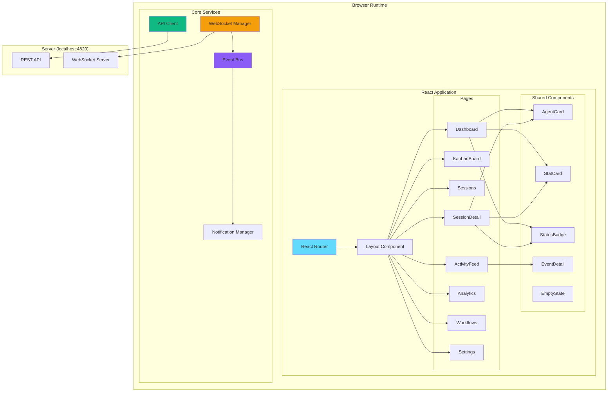

---

## Architecture

### Component Architecture

The client follows a layered architecture with clear separation of concerns:

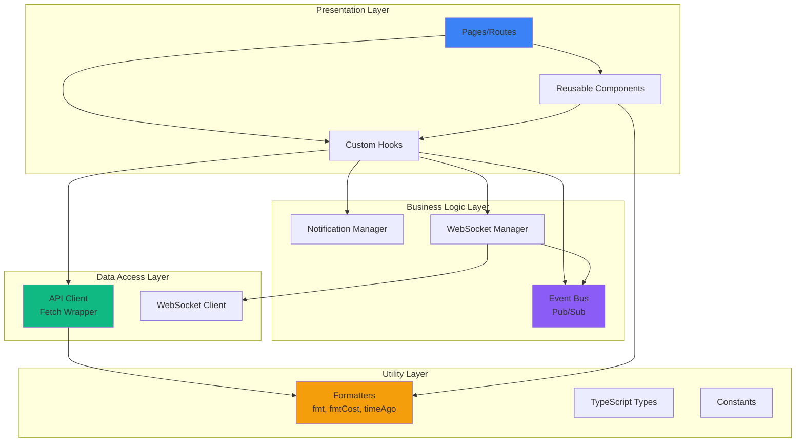

### Directory Structure

```
client/
├── src/
│   ├── components/         # Reusable UI components
│   │   ├── __tests__/      # Component tests
│   │   ├── AgentCard.tsx
│   │   ├── StatCard.tsx
│   │   ├── StatusBadge.tsx
│   │   ├── EventDetail.tsx  # Inline hook payload viewer (used by ActivityFeed + SessionDetail)
│   │   ├── EmptyState.tsx
│   │   ├── Sidebar.tsx
│   │   ├── Layout.tsx
│   │   ├── CommandPalette.tsx # Cmd/Ctrl+K launcher over the whole dashboard
│   │   ├── PaletteActionProvider.tsx # Registry of the actions the mounted page offers the palette
│   │   ├── ActionToast.tsx           # Confirms actions that change state without navigating
│   │   ├── SplashScreen.tsx   # First-run provider choice and live-hook setup gate
│   │   ├── PaginatedLegend.tsx # Bounded responsive legends for Analytics and Workflows
│   │   ├── RemoteSources.tsx  # Remote Data Sources settings panel (SSH multi-machine collection)
│   │   ├── TodoProgressIndicator.tsx # Micro donut + portal tooltip beside Sessions status
│   │   ├── TodoProgressPanel.tsx # Full owner-aware tracker on Session Detail
│   │   ├── todoProgress.ts       # Shared task status colors/formatters
│   │   └── workflows/      # D3.js workflow visualization components (12 files)
│   │
│   ├── pages/              # Route pages
│   │   ├── Dashboard.tsx
│   │   ├── KanbanBoard.tsx
│   │   ├── Sessions.tsx       # Server-paginated table with task-progress donut, page-zero transient Codex startup row, searchable multi-project filtering, and custom sort menus
│   │   ├── SessionDetail.tsx  # Overview + full task tracker + agent tree + event timeline + cursor-paginated Conversation tab
│   │   ├── ActivityFeed.tsx  # Real-time event log; row click expands payload; Session btn navigates
│   │   ├── Analytics.tsx
│   │   ├── Workflows.tsx
│   │   ├── Settings.tsx
│   │   └── NotFound.tsx
│   │
│   ├── lib/                # Core utilities & business logic
│   │   ├── __tests__/      # Utility tests
│   │   ├── api.ts          # REST API client
│   │   ├── eventBus.ts     # WebSocket pub/sub + connection state
│   │   ├── dataScope.ts    # Global data-scope store (app-wide ?sources= selection)
│   │   ├── format.ts       # Formatters (formatTime, timeAgo, fmtCost)
│   │   ├── sound.ts        # Web Audio cue synthesis + sound preferences
│   │   └── types.ts        # TypeScript type definitions
│   │
│   ├── hooks/
│   │   ├── useWebSocket.ts      # Auto-reconnecting WebSocket hook
│   │   ├── useNotifications.ts  # Browser push notification triggers
│   │   └── useSoundCues.ts      # Event-bus → synthesized audio cues
│   │
│   ├── i18n/               # Internationalization (en / zh / vi / ko / es)
│   ├── App.tsx             # Root component + router setup
│   ├── main.tsx            # Entry point
│   └── index.css           # Tailwind + custom utilities
│
├── public/                 # Static assets (sw.js service worker)
├── index.html              # HTML template
├── vite.config.ts          # Vite + proxy config
├── tailwind.config.js      # Custom dark theme
├── tsconfig.json           # Strict TypeScript config
└── package.json
```

---

## Component Hierarchy

### Page Components

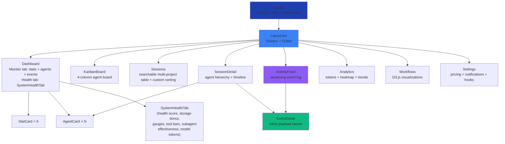

### Component Props Flow

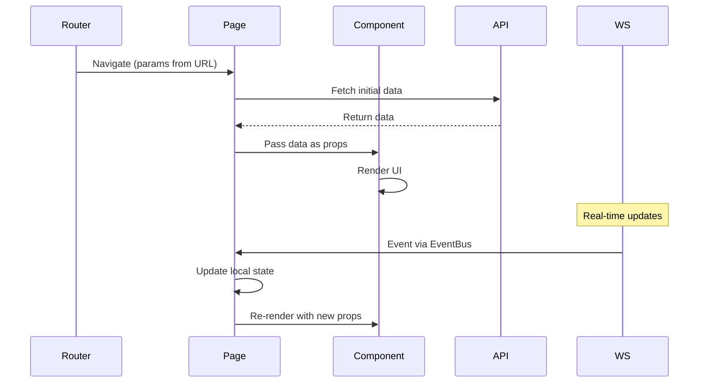

---

## State Management

The client uses **local component state** and **React hooks** for state management. No global state library (Redux, Zustand) is used to keep the architecture simple. The one small exception is the **data-scope store** (`lib/dataScope.ts`): a lightweight app-wide store holding the current source set (`local` plus any configured [Remote Data Sources](../server/README.md#remote-data-sources)) and provider set (`claude`, `codex`, or both). Pages append the resulting `?sources=` and `?providers=` parameters to their API requests, so the Settings selector immediately narrows the whole app to the chosen machines and/or agents. Remote sources are managed from the Settings page via the `RemoteSources` component (`components/RemoteSources.tsx`), which configures independent `~/.claude` and `~/.codex` homes, renders provider-specific connection/sync results, drives the `/api/remote-sources` CRUD/test/sync endpoints, and reflects live `remote_source.status` WebSocket updates. A source can be Claude-only, Codex-only, or both; a healthy provider's data keeps refreshing even if its sibling provider is unavailable. When a sync finishes, stats pages refetch via `lib/remoteDataEvents.ts` (`remote_data.updated`, `remote_source.status` with `ok`, or remote `import.progress` complete).

The Remote Data Sources form names its independent optional overrides **Remote Claude home** and **Remote Codex home**, with `~/.claude` / `~/.codex` defaults and `wsl:~/.claude` / `wsl:~/.codex` placeholders for CLI installs inside WSL.

**Cursor sessions (informational):** Settings surfaces a subtle note on the Claude Code home, Import History, and Remote Data Sources panels — **Cursor** agent sessions count too because Cursor stores transcripts under the same `~/.claude` paths as Claude Code locally (and on synced remotes).

**Settings data and homes:** the **Dashboard Data** cards select Claude Code, Codex, or both through the same global `dataScope` store used by Remote Data Sources. Every scoped sessions, agents, events, workflow, analytics, token, and cost request re-fetches as soon as the selection changes. The Session Data Locations section independently saves the Claude Code root and the dashboard-specific Codex root; saving the latter asks the server to re-arm its live rollout watcher and scan the new `sessions/` tree immediately. **Import History** uses matching Claude Code / Codex tabs: switching tabs reloads source-specific instructions and paths, then sends the selected provider with rescan, folder, and upload actions while provider-tagged WebSocket progress keeps concurrent work isolated.

**Pricing controls:** the Claude and OpenAI GPT pricing sections use the same title, info-tooltip, **Reset Defaults**, and **Add Model** layout. Each Settings reset button resets only its own provider, while the GPT tooltip holds the USD-per-million-token units, 272K Short/Long threshold, Fast-mode behavior, pattern matching, manual-update guidance, and unpublished-rate handling that would otherwise crowd the table.

**Provider-aware card context:** Dashboard agent cards and Kanban session cards show compact task context beneath a meaningful provider-native title. Claude Code and Codex both expose up to two recent distinct human prompts as a bounded two-row history: Claude refreshes its small persisted summary from the shared local JSONL cache during live hooks, imports, and watchdog sweeps; Codex refreshes from rollout records, with `codex_user_message` events covering older imports. Every real-time `session_updated` refresh flows through the ordinary scoped data path. Conversation rows render safe persisted raster attachments and quietly hide missing/expired files.

### State Strategy

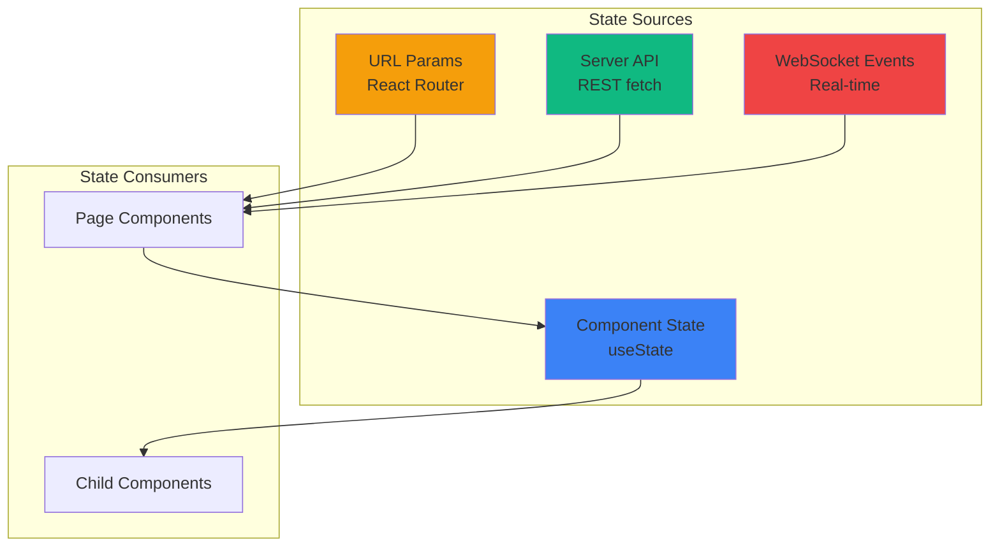

### State Update Pattern

1. **Initial Load**: Page component fetches data via API client on mount (`useEffect`)
2. **URL Changes**: React Router triggers re-render, page refetches data
3. **Real-time Updates**: WebSocket events trigger state updates via `EventBus`
4. **User Actions**: Click handlers call API, optimistically update local state

Example from `SessionDetailPage`:

```typescript
function SessionDetailPage() {
  const { sessionId } = useParams();
  const [session, setSession] = useState(null);
  const [agents, setAgents] = useState([]);
  
  // Initial load
  useEffect(() => {
    fetchSession(sessionId).then(setSession);
    fetchAgents(sessionId).then(setAgents);
  }, [sessionId]);
  
  // Real-time updates
  useEffect(() => {
    const unsubscribe = eventBus.on('agent.created', (agent) => {
      if (agent.session_id === sessionId) {
        setAgents(prev => [...prev, agent]);
      }
    });
    return unsubscribe;
  }, [sessionId]);
}
```

---

## WebSocket Integration

### Reload Throttling

Implemented in [`src/pages/Dashboard.tsx`](src/pages/Dashboard.tsx) and
[`src/pages/Sessions.tsx`](src/pages/Sessions.tsx).

`session_updated` fires on essentially every hook event of every active session, and the list requests it
triggers are expensive server-side (`include_task_progress` re-parses live transcripts). Both pages therefore
collapse WebSocket-driven reloads through a **2 s trailing throttle** rather than reloading per frame —
Sessions previously reloaded un-debounced and Dashboard on a 300 ms debounce, which together produced a
continuous parse storm with a few chatty sessions and one open tab. The trailing call keeps the list current,
the existing periodic polls remain the backstop, and effect cleanup clears any pending reload so a stale
closure cannot overwrite newer state after a filter change or unmount.

Validate with:

```bash
npm run test:client
```

### WebSocket Lifecycle

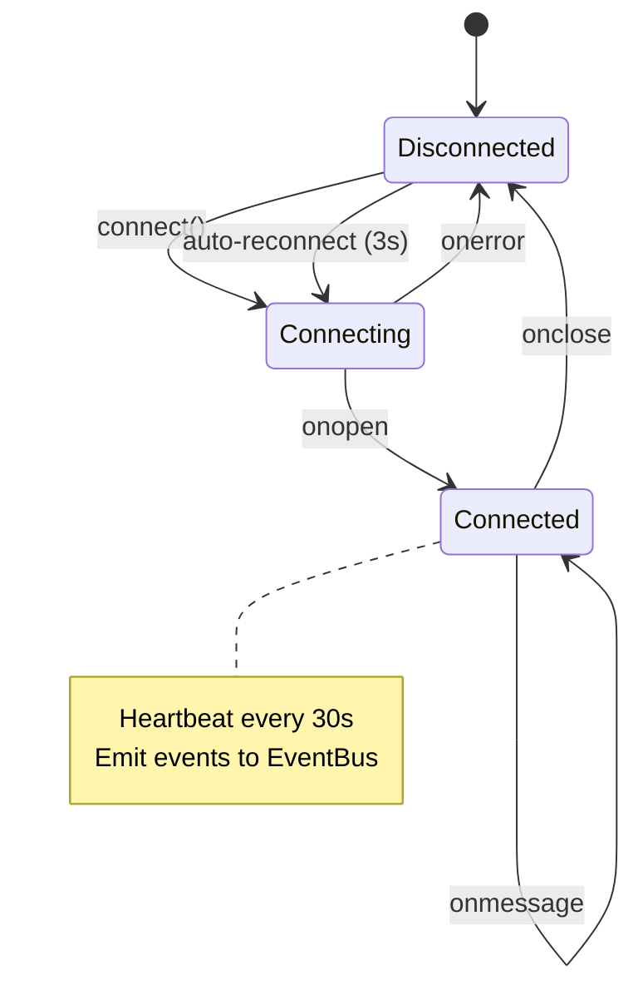

### WebSocket Message Flow

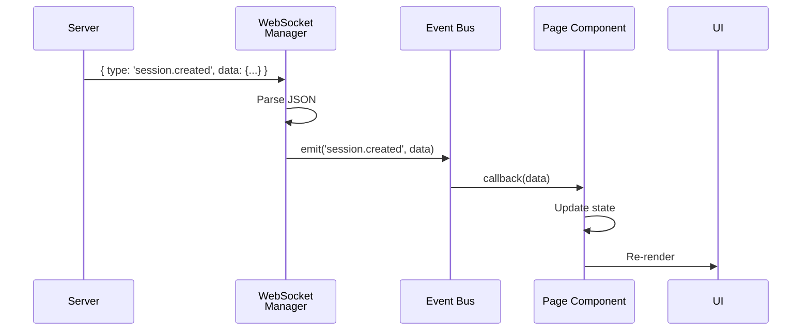

### Event Types

Server broadcasts these event types over WebSocket:

| Event Type | Payload | Triggered By |
|------------|---------|--------------|
| `session.created` | Session object | SessionStart hook |
| `session.updated` | Session object | Any hook touching session |
| `agent.created` | Agent object | PreToolUse hook |
| `agent.updated` | Agent object | PostToolUse/Stop hooks |
| `tool.executed` | Tool execution record | PostToolUse hook |
| `notification.received` | Notification object | Notification hook |
| `remote_source.status` | `{ id, status, error?, providers?, last_sync_at? }` (`status`: `idle`/`syncing`/`ok`/`error`/`deleted`; each provider can also be `unavailable`) | Remote Data Source sync poller + `/api/remote-sources` routes |
| `remote_data.updated` | `{ sourceId, source, label?, counters?, providers?, last_sync_at? }` | Emitted once per successful remote sync; provider-aware counters trigger stats/cost/session refetches. The server also broadcasts `session_created` / `session_updated` (and main-agent frames) for each mirrored session so Kanban/Sessions update immediately |

### EventBus Pattern

The `eventBus` is a simple pub/sub system:

```typescript
// lib/eventBus.ts
class EventBus {
  private listeners = new Map<string, Set<Function>>();
  
  on(event: string, callback: Function): () => void {
    if (!this.listeners.has(event)) {
      this.listeners.set(event, new Set());
    }
    this.listeners.get(event)!.add(callback);
    
    // Return unsubscribe function
    return () => this.listeners.get(event)?.delete(callback);
  }
  
  emit(event: string, data: any): void {
    this.listeners.get(event)?.forEach(cb => cb(data));
  }
}

export const eventBus = new EventBus();
```

Usage in components:

```typescript
useEffect(() => {
  const unsubscribe = eventBus.on('session.created', handleNewSession);
  return unsubscribe; // Cleanup on unmount
}, []);
```

---

## Routing

### Route Structure

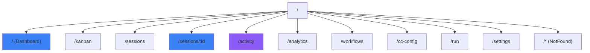

### Route Configuration

```tsx
// App.tsx
import { BrowserRouter, Routes, Route } from 'react-router';

function App() {
  return (
    <BrowserRouter>
      <Routes>
        <Route path="/" element={<Layout />}>
          <Route index element={<Dashboard />} />
          <Route path="kanban" element={<KanbanBoard />} />
          <Route path="sessions" element={<Sessions />} />
          <Route path="sessions/:id" element={<SessionDetail />} />
          <Route path="activity" element={<ActivityFeed />} />
          <Route path="analytics" element={<Analytics />} />
          <Route path="workflows" element={<Workflows />} />
          <Route path="cc-config" element={<CcConfig />} />
          <Route path="run" element={<Run />} />
          <Route path="settings" element={<Settings />} />
          <Route path="*" element={<NotFound />} />
        </Route>
      </Routes>
    </BrowserRouter>
  );
}
```

### Navigation Flow

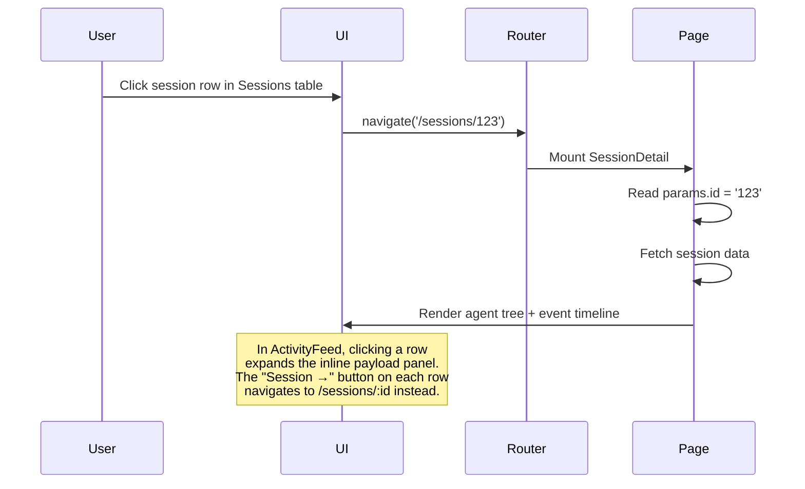

---

## API Client

### API Architecture

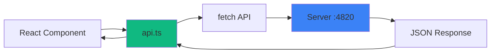

### API Client Structure

```typescript
// lib/api.ts
const BASE_URL = 'http://localhost:4820';

class APIClient {
  private async request(path: string, options?: RequestInit) {
    const response = await fetch(`${BASE_URL}${path}`, options);
    if (!response.ok) throw new Error(`API error: ${response.statusText}`);
    return response.json();
  }
  
  // Sessions
  getSessions() { return this.request('/api/sessions'); }
  getSession(id: string) { return this.request(`/api/sessions/${id}`); }
  
  // Agents
  getAgents(sessionId: string) {
    return this.request(`/api/sessions/${sessionId}/agents`);
  }
  getAgent(id: string) { return this.request(`/api/agents/${id}`); }
  
  // Tools
  getTools(agentId: string) {
    return this.request(`/api/agents/${agentId}/tools`);
  }
  
  // Pricing
  getPricingRules() { return this.request('/api/pricing'); }
  createPricingRule(rule: PricingRule) {
    return this.request('/api/pricing', {
      method: 'POST',
      headers: { 'Content-Type': 'application/json' },
      body: JSON.stringify(rule)
    });
  }
  deletePricingRule(pattern: string) {
    return this.request(`/api/pricing/${encodeURIComponent(pattern)}`, {
      method: 'DELETE'
    });
  }
}

export const api = new APIClient();
```

> **API reference:** the endpoints this client calls are fully documented by the server's OpenAPI 3.0.3 spec. With the dashboard running (default port `4820`), explore them at `/api/docs` (interactive Swagger UI), `/api/redoc` (read-optimized ReDoc reference), or `/api/openapi.json` (raw spec). A committed `openapi.yaml` at the repo root mirrors the live spec.

### Error Handling

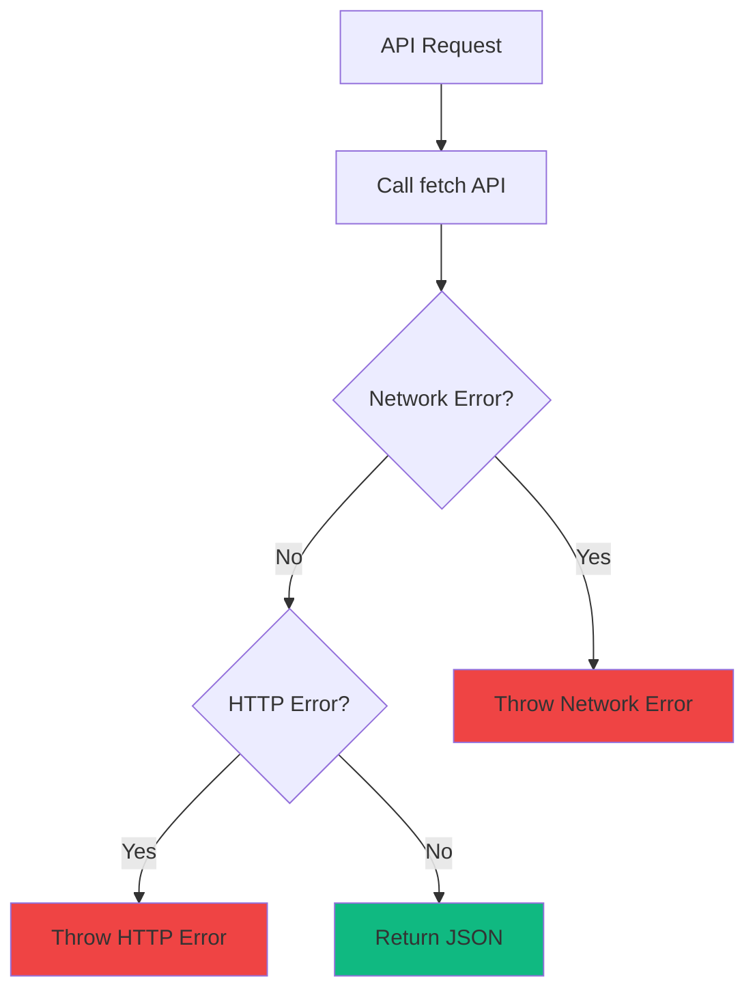

---

## UI Components

### Component Catalog

#### CommandPalette

Global launcher mounted once by `Layout`. Opens with `Cmd/Ctrl+K` anywhere in the app. Keyboard-only by design: a sidebar button that opens a list so you can pick a page the sidebar already shows costs a click and teaches nothing. Takes no props.

The catalog is built by `lib/paletteCommands.ts` as a pure function of one context object, so `lib/__tests__/paletteCommands.test.ts` can assert coverage directly against the app's route table, `SETTINGS_SECTIONS`, and `TABS` rather than trusting a hand-kept list. One query resolves nine groups:

| Group | Source |
| --- | --- |
| Recent | The last 5 command ids, from `lib/recentCommands.ts` (`localStorage`) |
| Pages | The nine sidebar routes, matched on their **translated** labels so it works in every locale |
| Sessions | `GET /api/sessions?q=` — debounced 180 ms, minimum 2 characters, capped at 6 results |
| This page | Whatever the mounted page registered via `usePaletteAction` — listed only where it is bound |
| Projects | `GET /api/sessions/facets` — jumps to `/sessions?cwd=…` |
| Views | Page sub-tabs and list filters (`/?tab=`, `/kanban?view=`, `/analytics?tab=`, `/sessions?status=`) |
| Settings | All 13 `SETTINGS_SECTIONS` anchors (`/settings#<id>`) |
| Agent Config | All 12 `TABS` keys (`/cc-config?tab=<key>`) |
| Actions | Sound (on/off, volume), Tabby (enable, mute), notifications, provider and per-machine data scope, the five languages, sidebar, reload, history, scroll, copy link, updates, API reference, issues, releases |

Ranking uses `lib/fuzzy.ts` — subsequence matching with positional scoring — and the matched characters are highlighted in each row. Session search is server-side on purpose: the dashboard routinely holds thousands of sessions, so no client-side index is kept, and reusing the same `?q=` filter the Sessions page uses means results automatically respect the active data scope. A failed or slow query degrades quietly — every other group is local and renders immediately, so the palette is never blocked by the network.

Only non-session picks are remembered: a session id stops resolving as soon as the session is pruned, so remembering one would fill the MRU list with dead rows.

```text
┌────────────────────────────────────────────────────────┐
│ 🔍  Search pages, sessions, and actions…    12 results │
├────────────────────────────────────────────────────────┤
│ RECENT                                                 │
│    Cost Analytics                        Analytics     │
│ PAGES                                                  │
│  ▸ Analytics                  /analytics    G then N   │
│ SESSIONS                                               │
│    Refactor the token parser      /work/api · active   │
│ SETTINGS                                               │
│    Alerts and webhooks                    Settings     │
│ ACTIONS                                                │
│    Sound cues                                  On      │
├────────────────────────────────────────────────────────┤
│ ↑↓ navigate      ↵ open              esc close         │
└────────────────────────────────────────────────────────┘
```

Other chrome can open it without lifted state or a context provider by calling `openCommandPalette()` from `lib/appEvents.ts` (re-exported here), which dispatches a `ccam:command-palette` window event.

Accessibility: modal `dialog`, `combobox` input driving an `aria-activedescendant` listbox, arrow-key navigation with feature-detected `scrollIntoView`, `Home`/`End` and `PageUp`/`PageDown` jumps, `Tab` between groups without leaking focus, `Enter` to run, `Escape` to close, and focus restored on close. Hover only takes the selection after a real `mousemove`, so keyboard navigation is never fought by `mouseenter` under a stationary cursor.

#### PaletteActionProvider

The registry of commands the mounted page offers the palette. Not a keyboard layer — the dashboard binds one chord (⌘/Ctrl+K), and Tabby's pre-existing ⌘/Ctrl+B.

```typescript
const { register, run, boundIds } = usePaletteActions();

usePaletteAction("page.refresh", load);          // offered while this page is mounted
usePaletteAction("session.copyId", () => {
  if (!session) return false;                    // decline; the stack falls through
  navigator.clipboard?.writeText(session.id);
});
```

`register(id, handler)` pushes onto a per-id stack, so the most recently mounted handler wins and unmounting restores the one beneath it — that is how every page registers `page.refresh` under its own reload. A handler returning `false` declines, which is how a contextual command stays out of the way until its data exists.

The palette reads `boundIds` and lists a page command **only** where its handler is mounted, so it cannot offer an action that would do nothing. `PAGE_ACTION_COMMANDS` in `lib/paletteCommands.ts` supplies each id's label and icon.

#### ActionToast

A one-line confirmation for commands that change something without moving the user. A toggle or a clipboard copy closes the palette and then visibly does nothing, which reads as broken even when it worked — navigation confirms itself, everything else needs this. `role="status"` with `aria-live="polite"`, one message at a time, no queue.

#### SessionCard

Displays session summary with status, model, cost, and agent count.

**Props:**
```typescript
interface SessionCardProps {
  session: Session;
}
```

**Visual Structure:**
```
┌────────────────────────────────────────┐
│ 🟢 Session Title         $0.45         │
│ claude-sonnet-4                        │
│ Started: 2 hours ago                   │
│ Agents: 3 | Tools: 12                  │
└────────────────────────────────────────┘
```

#### AgentCard

Shows agent type, status, tool usage, and cost breakdown. When the attached
session has a `todo_summary`, the card renders the same accessible task-progress
donut and portal tooltip used by the Sessions table immediately before the
status badge. Session Detail renders the full task list with 10 rows per page.
The server scopes these nullable values to the latest top-level work item, so a
new Claude human turn or Codex task that emits no tracker removes the donut and
detail panel instead of leaving an older in-progress list visible. A turn/task
that ends without a final tracker update also drops unfinished state; fully
completed progress remains available as history.

The Sessions table opts into `include_transient=true` only on page zero, so the
local in-memory Codex startup row appears immediately just as it does on
Dashboard and Kanban. That row remains non-navigable until the durable session
ID replaces it; durable totals and later pages stay unchanged.

**Props:**
```typescript
interface AgentCardProps {
  agent: Agent;
}
```

#### StatusBadge

Colored status pills for agents (`AgentStatusBadge`) and sessions (`SessionStatusBadge`). When a row is in the yellow **Waiting** overlay (`awaiting_input_since` set), an optional `reason` prop explains WHY: a hover tooltip carries the full explanation, and — unless `compact` is set — a small nested chip (icon + short label) renders inline. Card layouts (Kanban / Dashboard trees) pass `compact` so the chip never squeezes the card title; the Sessions table and session-detail header show the full chip:

| `awaiting_reason` | Label | Meaning |
| ----------------- | ----- | ------- |
| `notification` | Needs input | Blocked on a permission prompt / input request (urgent — amber) |
| `stop` | Turn done | Claude finished its reply; idle until the next prompt |
| `session_start` | At prompt | Fresh/resumed CLI sitting at an empty prompt |
| `interrupted` | Interrupted | Turn cut short — Esc or a recovered hook (urgent — amber) |

**Props:**
```typescript
interface AgentStatusBadgeProps {
  status: EffectiveAgentStatus;
  pulse?: boolean;
  reason?: AwaitingReason | null; // from agentAwaitingReason(agent)
  compact?: boolean; // tooltip-only (no inline chip) for tight card layouts
}
```

Unknown/future server reasons degrade to a plain Waiting badge (`normalizeAwaitingReason` filters them to null). SessionDetail additionally renders a waiting-for-input banner (same reason + relative time) under the header via the shared `REASON_ICONS` map.

#### ToolCard

Displays tool execution details with timing and token usage.

**Props:**
```typescript
interface ToolCardProps {
  tool: ToolExecution;
}
```

#### EventTimeline

Chronological view of session events (hooks, tools, notifications).

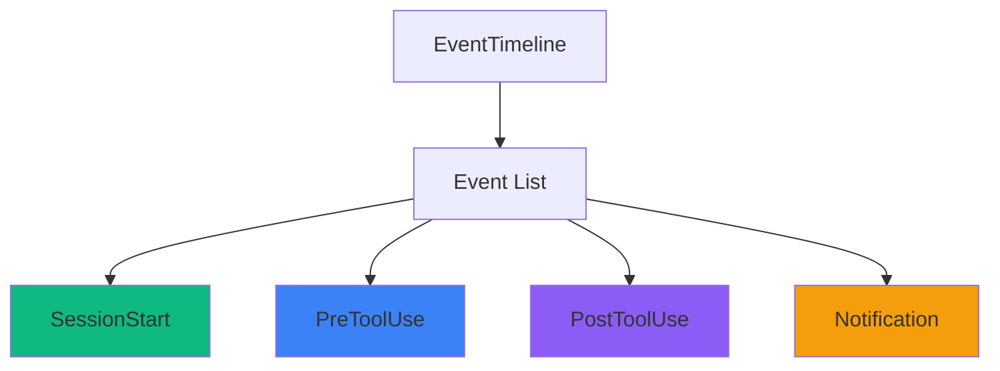

#### ActivityFeed (`pages/ActivityFeed.tsx`)

Real-time streaming event log with pause/resume, pagination, and inline payload expansion.

**UX interaction model:**

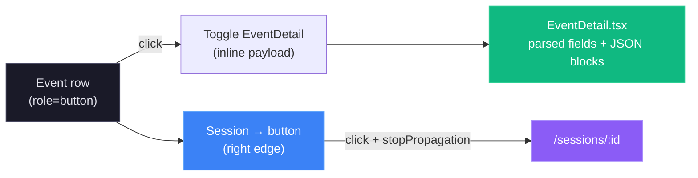

- The entire row is clickable (keyboard accessible via `Enter`/`Space`) and toggles the `EventDetail` dropdown.
- The chevron icon rotates 90° when a row is expanded — it is a visual indicator only, not a separate button.
- The **Session →** button uses `e.stopPropagation()` so navigating to session details never collapses an open payload panel.
- Multiple rows can be expanded simultaneously (state stored in `Set<number>`).

#### EventDetail (`components/EventDetail.tsx`)

Renders the hook payload for a single event inline below its row. Scalars appear as `key: value` pairs; objects and arrays render in a terminal-styled code block with a copy button.

---

## Utilities

### Formatters (lib/format.ts)

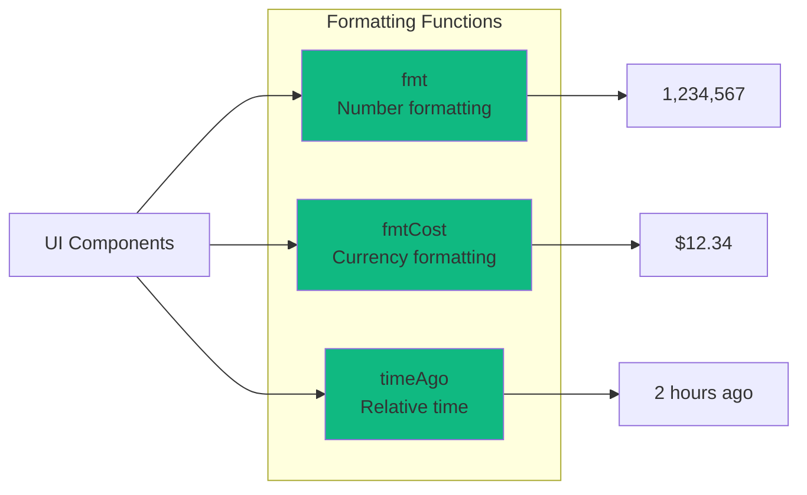

**Function Signatures:**

```typescript
// Format large numbers with commas
export function fmt(n: number | null | undefined): string;
// Examples: fmt(1234) → "1,234"
//           fmt(null) → "—"

// Format cost in dollars
export function fmtCost(cost: number | null | undefined): string;
// Examples: fmtCost(1.234) → "$1.23"
//           fmtCost(0) → "$0.00"

// Relative time string
export function timeAgo(date: string | Date | null | undefined): string;
// Examples: timeAgo('2024-03-18T12:00:00Z') → "2 hours ago"
//           timeAgo(null) → "—"
```

### Browser storage keys

The client keeps every user preference in the browser rather than the database,
so preferences stay per-machine and no settings round-trip is needed. There is
no central store — each feature owns its own key — so this is the inventory:

| Key | Storage | Owner | Holds |
| --- | --- | --- | --- |
| `agent-monitor-sound` | local | `lib/sound.ts` | Audio-cue preferences: master switch, volume, per-cue flags. Defaults to enabled |
| `agent-monitor-notifications` | local | `hooks/useNotifications.ts` | Browser-notification preferences. Defaults to disabled (opt-in, needs permission) |
| `agent-monitor-update-dismissed-sha` | local | `components/UpdateNotifier.tsx` | Upstream SHA the user dismissed, so a new commit re-surfaces the notice |
| `agent-dashboard-tabby-enabled` | local | `components/Tabby/prefs.ts` | Whether the Tabby companion is shown |
| `agent-dashboard-tabby-muted` | local | `components/Tabby/prefs.ts` | Whether Tabby's speech bubbles are muted |
| `agent-dashboard-tabby-pos` | local | `components/Tabby/prefs.ts` | Tabby's docked edge and vertical offset, as a viewport fraction |
| `ccam-data-scope` | local | `lib/dataScope.ts` | App-wide data scope — selected remote sources and providers |
| `sidebar-collapsed` | local | `components/Sidebar.tsx` | Sidebar collapsed state |
| `sidebar-connection-stats` | local | `components/Sidebar.tsx` | Cumulative WebSocket stats for the connection modal |
| `provider-onboarding-shown-v1` | **session** | `components/SplashScreen.tsx` | Splash shown once per browser session, not once ever |

Conventions worth keeping:

- **Reads must never throw.** Private mode and quota limits make storage
  unavailable at any moment; every reader wraps access in `try`/`catch` and
  falls back to defaults.
- **Merge over defaults rather than trusting the parse.** A key written by an
  older build can be missing fields, so readers spread the stored object over a
  complete default object instead of using it directly.
- **Writes are best-effort.** A failed write should not break the interaction
  that triggered it; the in-memory value still applies for the session.

### Audio cues (lib/sound.ts + hooks/useSoundCues.ts)

`lib/sound.ts` is a self-contained audio-cue engine. It ships **no audio files and no third-party dependency** — every cue is synthesized at play time with the Web Audio API from a declarative list of partials (frequency, offset, duration, peak gain, oscillator type), routed through a master gain node and a low-pass filter.

| Export | Purpose |
| --- | --- |
| `playCue(cue, { force })` | Plays one of `sessionStart`, `sessionComplete`, `sessionError`, `subagentSpawn`, `notification`, `connected`, `disconnected`, `click`. Returns whether audio was actually scheduled. `force` bypasses the per-cue flag and the rate limiter (used by the Settings previews). |
| `getSoundPrefs()` / `setSoundPrefs(patch)` | Read / merge-write the `SoundPrefs` object persisted to `localStorage` under `agent-monitor-sound`. Defaults have `enabled: true`. |
| `subscribeToSoundPrefs(handler)` | Subscribe to preference changes within the tab; returns an unsubscribe function. |
| `installSoundUnlock()` / `unlockSound()` | Satisfy browser autoplay policy — cues stay silent until the first pointer / key / touch gesture. |
| `DEFAULT_SOUND_PREFS` | The shipped defaults, also used as the merge base for partial saved objects. |

`hooks/useSoundCues.ts` is the automatic, event-driven consumer of the engine (the Settings page is the other caller, driving `playCue(..., { force: true })` for its previews). Mounted once in `App.tsx`, it subscribes to `eventBus` (mapping `session_created`, `session_updated` with `status: "error"`, `agent_created` for subagents, and `new_event` for `Stop` / `SessionEnd` / `Notification`), to `eventBus.onConnection`, and installs a single delegated `pointerdown` listener for the interaction tick. It adds **no new WebSocket message types** and no server-side code.

Playback is throttled by a per-cue cooldown (~350 ms; 45 ms for `click`) plus a global budget of 4 cues per 1.2 s, so a burst of WebSocket traffic never becomes a burst of sound. Every call degrades to a silent no-op when sound is disabled, the volume is zero, the cue's own toggle is off, no gesture has happened yet, or Web Audio is unavailable.

Users control all of this from **Settings → Sound** (master toggle, volume slider, per-cue switches, preview button).

### Type Definitions (lib/types.ts)

All TypeScript interfaces match server response shapes:

```typescript
interface Session {
  id: string;
  session_id: string;
  model: string;
  status: 'active' | 'completed' | 'error' | 'abandoned';
  total_cost: number;
  created_at: string;
  updated_at: string;
}

interface Agent {
  id: number;
  agent_id: string;
  session_id: string;
  agent_type: string;
  status: 'working' | 'waiting' | 'completed' | 'error';
  input_tokens: number;
  output_tokens: number;
  cost: number;
  created_at: string;
}

interface ToolExecution {
  id: number;
  agent_id: string;
  tool_name: string;
  duration_ms: number;
  success: boolean;
  created_at: string;
}
```

---

## Testing

### Test Stack

- **Vitest** - Fast unit test runner (Vite-native)
- **React Testing Library** - Component testing
- **jsdom** - Browser environment simulation

### Test Structure

```
client/src/
├── components/__tests__/
│   ├── AgentCard.test.tsx
│   ├── SessionCard.test.tsx
│   └── EventTimeline.test.tsx
│
├── pages/__tests__/
│   ├── screens.snapshot.test.tsx          # render snapshots for every screen
│   └── __snapshots__/                      # committed .snap baselines
│
└── lib/__tests__/
    ├── format.test.ts
    ├── eventBus.test.ts
    └── api.test.ts
```

### Running Tests

```bash
# Run all tests
npm test

# Watch mode
npm run test:watch

# Coverage report
npm run test:coverage
```

### Example Test

```tsx
// components/__tests__/SessionCard.test.tsx
import { render, screen } from '@testing-library/react';
import { SessionCard } from '../SessionCard';

test('renders session title and cost', () => {
  const session = {
    id: '1',
    session_id: 'sess_123',
    model: 'claude-sonnet-4',
    total_cost: 1.23,
    status: 'active',
    created_at: '2024-03-18T12:00:00Z'
  };
  
  render(<SessionCard session={session} />);
  
  expect(screen.getByText('sess_123')).toBeInTheDocument();
  expect(screen.getByText('$1.23')).toBeInTheDocument();
});
```

### Snapshot Testing

`pages/__tests__/screens.snapshot.test.tsx` renders **every routed screen**
(Dashboard, Kanban, Sessions, Session detail, Activity feed, Analytics,
Workflows, Claude Config, Run, Settings, Not found) and asserts each against a
committed snapshot in `pages/__tests__/__snapshots__/`. These are structural
regression guards — they catch unintended changes to layout, markup, or
localized copy.

To keep snapshots **deterministic** across machines and CI, the suite:

- mocks the API layer (`vi.mock("../../lib/api", …)`) to a loaded-empty state
  (empty collections + zeroed scalars), so no live data or noisy chart DOM
  leaks in — `importOriginal` keeps non-`api` exports real;
- stubs `eventBus`, push notifications, and the jsdom-missing
  `ResizeObserver` / `IntersectionObserver` / `matchMedia` / `scroll*` APIs;
- pins the clock (`vi.useFakeTimers`) and timezone (`TZ=UTC`) so any rendered
  timestamps are stable.

When you change a screen **intentionally**, review the diff and regenerate the
baselines:

```bash
cd client && npx vitest run -u src/pages/__tests__/screens.snapshot.test.tsx
```

Commit the updated `.snap` file alongside the change.

---

## Build & Deployment

### Development Build

```bash
npm run dev
```

Starts Vite dev server with HMR at `http://localhost:5173`

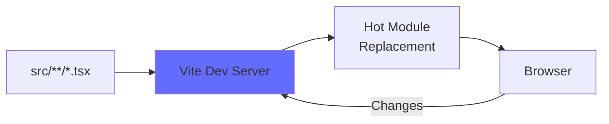

### Production Build

```bash
npm run build
```

Output: `client/dist/` (optimized static files)

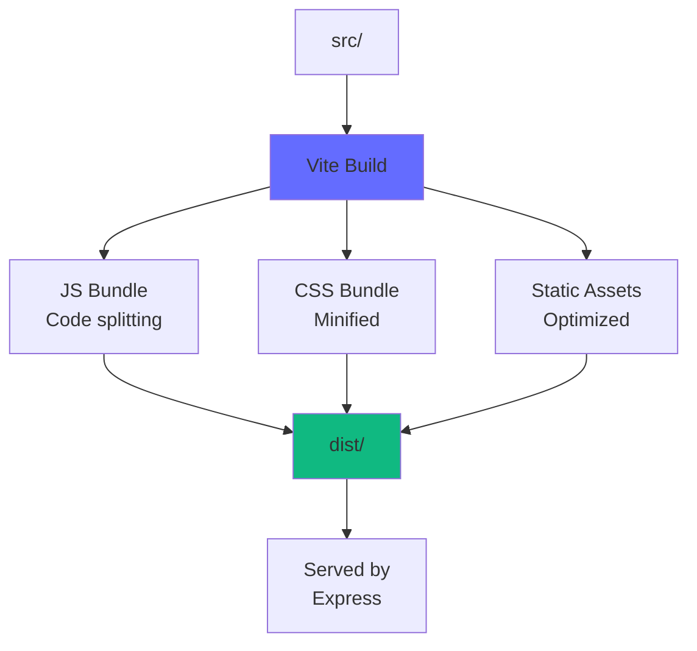

### Build Optimizations

1. **Code Splitting** - Lazy load routes with `React.lazy()`
2. **Tree Shaking** - Remove unused code
3. **Minification** - Terser for JS, cssnano for CSS
4. **Asset Hashing** - Cache busting with content hashes
5. **Compression** - Gzip/Brotli (handled by Express)

---

## Development

### Prerequisites

- Node.js >= 22.22.0 (Node 24 LTS recommended)
- npm >= 9.0.0

### Setup

```bash
# Install dependencies
npm install

# Start dev server
npm run dev
```

### Environment Variables

The client uses hardcoded API URL (`http://localhost:4820`). For custom configuration, update `lib/api.ts`:

```typescript
const BASE_URL = import.meta.env.VITE_API_URL || 'http://localhost:4820';
```

Then create `.env`:

```
VITE_API_URL=http://localhost:4820
```

### Hot Module Replacement (HMR)

Vite provides instant feedback on code changes:

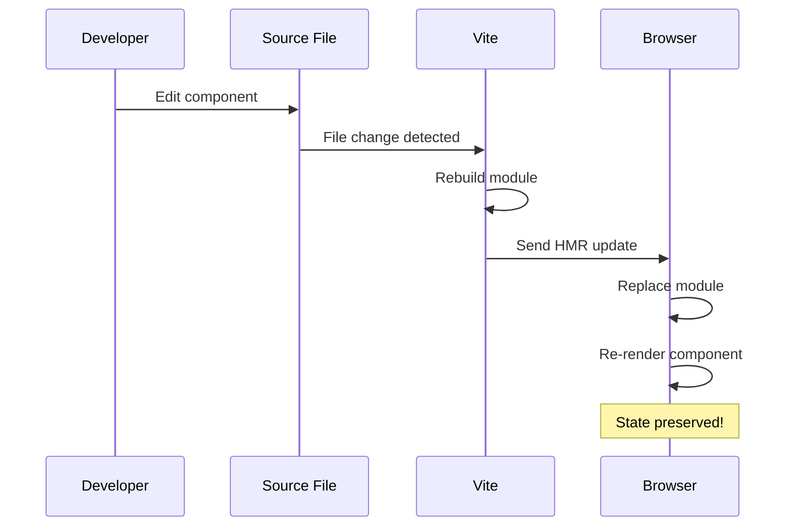

---

## Performance

### Metrics

- **First Contentful Paint (FCP)**: < 0.5s
- **Time to Interactive (TTI)**: < 1.5s
- **Bundle Size**: ~150KB gzipped (main chunk)

### Optimization Techniques

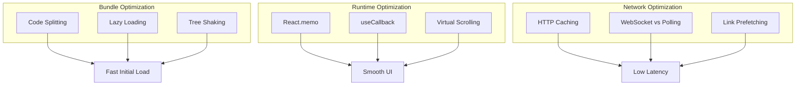

### Virtual Scrolling

For large lists (100+ sessions), implement virtual scrolling:

```tsx
import { useVirtualizer } from '@tanstack/react-virtual';

function SessionList({ sessions }) {
  const parentRef = useRef(null);
  const virtualizer = useVirtualizer({
    count: sessions.length,
    getScrollElement: () => parentRef.current,
    estimateSize: () => 100, // estimated row height
  });
  
  return (
    <div ref={parentRef} style={{ height: '600px', overflow: 'auto' }}>
      <div style={{ height: `${virtualizer.getTotalSize()}px` }}>
        {virtualizer.getVirtualItems().map(virtualRow => (
          <SessionCard
            key={sessions[virtualRow.index].id}
            session={sessions[virtualRow.index]}
          />
        ))}
      </div>
    </div>
  );
}
```

---

## Accessibility

### WCAG 2.1 Level AA Compliance

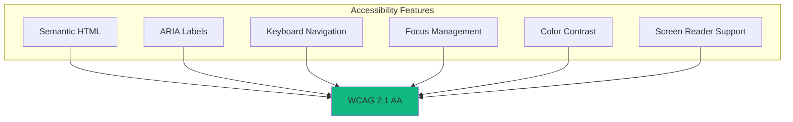

### Implementation Checklist

- ✅ Semantic HTML5 elements (`<nav>`, `<main>`, `<article>`)
- ✅ ARIA labels on interactive elements
- ✅ Keyboard navigation (Tab, Enter, Escape)
- ✅ Focus indicators (outline on :focus)
- ✅ Color contrast ratio >= 4.5:1 for text
- ✅ Alternative text for icons (aria-label)
- ✅ Skip links for screen readers

### Example

```tsx
<button
  onClick={handleDelete}
  aria-label="Delete pricing rule"
  className="focus:outline-blue-500"
>
  <Trash2 aria-hidden="true" />
</button>
```

---

## Summary

The client is a production-ready React application with:

- 🚀 **Modern Stack** - React 19, TypeScript, Vite 7, Tailwind
- ⚡ **Real-time** - WebSocket integration for live updates
- 🧪 **Tested** - Vitest + React Testing Library
- 📦 **Optimized** - Code splitting, tree shaking, lazy loading
- ♿ **Accessible** - WCAG 2.1 AA compliant
- 🎨 **Maintainable** - Clear architecture, type-safe, well-documented

For server documentation, see [server/README.md](../server/README.md).
